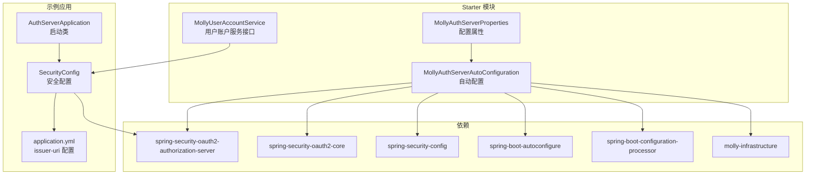
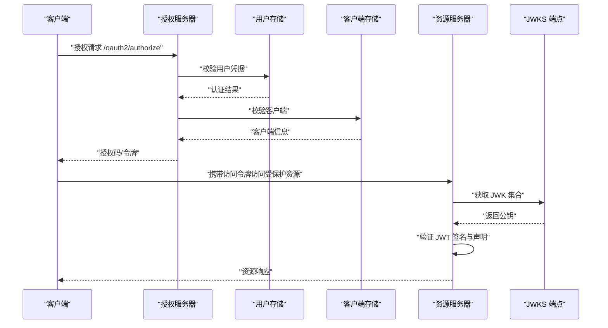
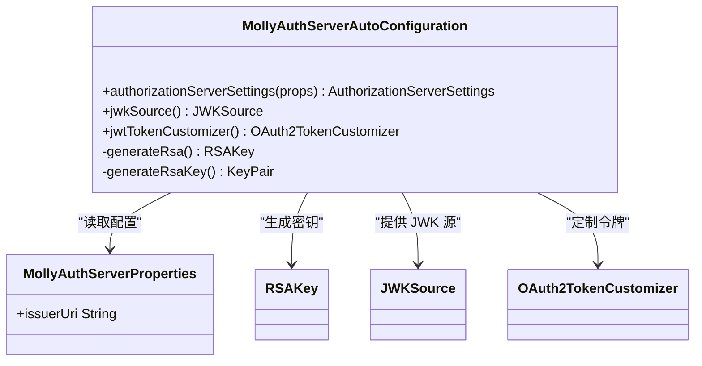
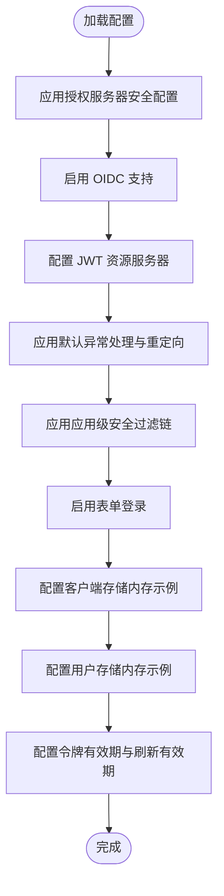
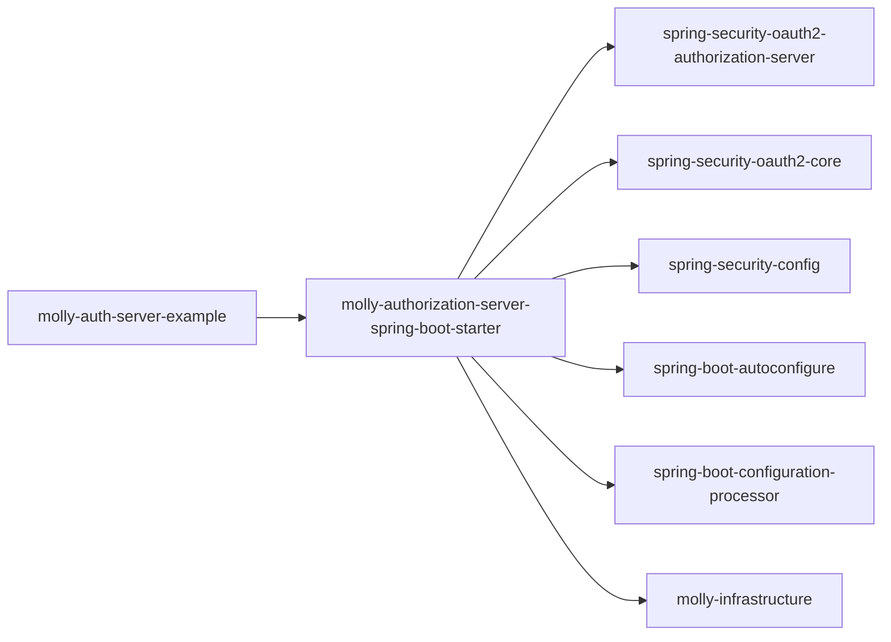
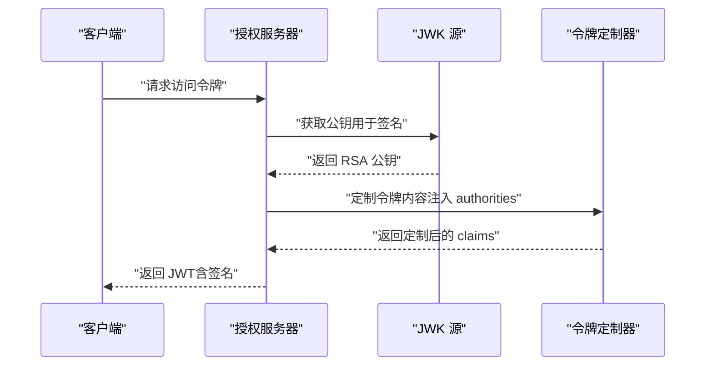

# JWT 令牌安全机制

<cite>
**本文引用的文件**
- [AuthServerApplication.java](file://molly-auth-server-example/src/main/java/cn/molly/example/auth/AuthServerApplication.java)
- [SecurityConfig.java](file://molly-auth-server-example/src/main/java/cn/molly/example/auth/config/SecurityConfig.java)
- [application.yml](file://molly-auth-server-example/src/main/resources/application.yml)
- [MollyAuthServerAutoConfiguration.java](file://molly-authorization-server-spring-boot-starter/src/main/java/cn/molly/security/auth/config/MollyAuthServerAutoConfiguration.java)
- [MollyAuthServerProperties.java](file://molly-authorization-server-spring-boot-starter/src/main/java/cn/molly/security/auth/properties/MollyAuthServerProperties.java)
- [MollyUserAccountService.java](file://molly-authorization-server-spring-boot-starter/src/main/java/cn/molly/security/auth/service/MollyUserAccountService.java)
- [pom.xml](file://molly-authorization-server-spring-boot-starter/pom.xml)
- [pom.xml](file://molly-auth-server-example/pom.xml)
- [pom.xml](file://pom.xml)
</cite>

## 目录
1. [简介](#简介)
2. [项目结构](#项目结构)
3. [核心组件](#核心组件)
4. [架构总览](#架构总览)
5. [详细组件分析](#详细组件分析)
6. [依赖分析](#依赖分析)
7. [性能考量](#性能考量)
8. [故障排查指南](#故障排查指南)
9. [结论](#结论)
10. [附录](#附录)

## 简介
本文件围绕 JWT 令牌安全机制展开，结合仓库中的 Spring Authorization Server 示例与自定义 Starter，系统阐述 JWT 的生成、签名与验证流程，RSA 签名算法与密钥管理策略，令牌声明构建（标准与自定义），过期与刷新机制，撤销策略，配置最佳实践（密钥轮换、令牌存储与传输安全），以及防止泄露与重放攻击的防护措施。同时提供面向安全工程师的审计与监控方案及常见问题诊断修复路径。

## 项目结构
该项目采用多模块结构，核心由以下模块组成：
- molly-auth-server-example：示例认证服务器，演示如何启用授权服务器、配置安全过滤链、注册客户端与用户、设置令牌有效期与刷新有效期。
- molly-authorization-server-spring-boot-starter：自定义 Spring Boot Starter，提供授权服务器自动配置、JWK 源、令牌定制器等核心能力。
- molly-infrastructure：基础设施模块（在本仓库中为空模块，便于扩展）。

图表来源
- [AuthServerApplication.java:15-21](file://molly-auth-server-example/src/main/java/cn/molly/example/auth/AuthServerApplication.java#L15-L21)
- [SecurityConfig.java:42-100](file://molly-auth-server-example/src/main/java/cn/molly/example/auth/config/SecurityConfig.java#L42-L100)
- [application.yml:1-12](file://molly-auth-server-example/src/main/resources/application.yml#L1-L12)
- [MollyAuthServerAutoConfiguration.java:51-73](file://molly-authorization-server-spring-boot-starter/src/main/java/cn/molly/security/auth/config/MollyAuthServerAutoConfiguration.java#L51-L73)
- [MollyAuthServerProperties.java:14-24](file://molly-authorization-server-spring-boot-starter/src/main/java/cn/molly/security/auth/properties/MollyAuthServerProperties.java#L14-L24)
- [MollyUserAccountService.java:20-21](file://molly-authorization-server-spring-boot-starter/src/main/java/cn/molly/security/auth/service/MollyUserAccountService.java#L20-L21)

章节来源
- [pom.xml:11-15](file://pom.xml#L11-L15)
- [molly-auth-server-example/pom.xml:16-30](file://molly-auth-server-example/pom.xml#L16-L30)
- [molly-authorization-server-spring-boot-starter/pom.xml:16-48](file://molly-authorization-server-spring-boot-starter/pom.xml#L16-L48)

## 核心组件
- 授权服务器自动配置：提供签发者地址、JWK 源（默认内存 RSA 密钥）、令牌定制器（向 Access Token 注入权限声明）。
- 安全配置：启用授权服务器默认安全、OIDC 支持、JWT 资源服务器、表单登录、客户端与用户存储、令牌有效期与刷新有效期。
- 配置属性：issuer-uri，用于 OIDC 合规的签发者标识。
- 用户账户服务接口：统一用户账户服务抽象，便于扩展多种认证方式。

章节来源
- [MollyAuthServerAutoConfiguration.java:67-120](file://molly-authorization-server-spring-boot-starter/src/main/java/cn/molly/security/auth/config/MollyAuthServerAutoConfiguration.java#L67-L120)
- [SecurityConfig.java:59-100](file://molly-auth-server-example/src/main/java/cn/molly/example/auth/config/SecurityConfig.java#L59-L100)
- [MollyAuthServerProperties.java:16-23](file://molly-authorization-server-spring-boot-starter/src/main/java/cn/molly/security/auth/properties/MollyAuthServerProperties.java#L16-L23)
- [MollyUserAccountService.java:20-21](file://molly-authorization-server-spring-boot-starter/src/main/java/cn/molly/security/auth/service/MollyUserAccountService.java#L20-L21)

## 架构总览
下图展示从客户端发起授权请求到资源服务器验证 JWT 的整体流程，以及关键组件之间的交互关系。

图表来源
- [SecurityConfig.java:62-76](file://molly-auth-server-example/src/main/java/cn/molly/example/auth/config/SecurityConfig.java#L62-L76)
- [MollyAuthServerAutoConfiguration.java:86-92](file://molly-authorization-server-spring-boot-starter/src/main/java/cn/molly/security/auth/config/MollyAuthServerAutoConfiguration.java#L86-L92)

## 详细组件分析

### 授权服务器自动配置（JWT 生成与签名）
- 签发者地址：从配置属性读取 issuer-uri，构建 AuthorizationServerSettings，确保 OIDC 合规性。
- JWK 源：默认在内存中生成 2048 位 RSA 密钥对，封装为 JWK 并暴露给授权服务器用于签名 JWT；生产环境建议替换为安全存储（如密钥库、数据库或 HSM）。
- 令牌定制器：向 Access Token 注入 authorities 声明，便于资源服务器进行细粒度权限控制。

图表来源
- [MollyAuthServerAutoConfiguration.java:67-120](file://molly-authorization-server-spring-boot-starter/src/main/java/cn/molly/security/auth/config/MollyAuthServerAutoConfiguration.java#L67-L120)
- [MollyAuthServerProperties.java:16-23](file://molly-authorization-server-spring-boot-starter/src/main/java/cn/molly/security/auth/properties/MollyAuthServerProperties.java#L16-L23)

章节来源
- [MollyAuthServerAutoConfiguration.java:67-120](file://molly-authorization-server-spring-boot-starter/src/main/java/cn/molly/security/auth/config/MollyAuthServerAutoConfiguration.java#L67-L120)

### 安全配置（过滤链、客户端与用户存储、令牌有效期）
- 授权服务器过滤链：启用 OAuth2 Authorization Server 默认安全、OIDC 支持、未认证重定向至登录页、JWT 资源服务器。
- 应用级过滤链：表单登录，所有请求均需认证。
- 客户端存储：内存实现（示例），生产环境建议使用数据库实现。
- 用户存储：内存实现（示例），生产环境建议使用数据库。
- 令牌设置：Access Token 有效期与 Refresh Token 有效期分别配置。

图表来源
- [SecurityConfig.java:59-100](file://molly-auth-server-example/src/main/java/cn/molly/example/auth/config/SecurityConfig.java#L59-L100)
- [SecurityConfig.java:122-145](file://molly-auth-server-example/src/main/java/cn/molly/example/auth/config/SecurityConfig.java#L122-L145)
- [SecurityConfig.java:155-163](file://molly-auth-server-example/src/main/java/cn/molly/example/auth/config/SecurityConfig.java#L155-L163)

章节来源
- [SecurityConfig.java:59-100](file://molly-auth-server-example/src/main/java/cn/molly/example/auth/config/SecurityConfig.java#L59-L100)
- [SecurityConfig.java:122-145](file://molly-auth-server-example/src/main/java/cn/molly/example/auth/config/SecurityConfig.java#L122-L145)
- [SecurityConfig.java:155-163](file://molly-auth-server-example/src/main/java/cn/molly/example/auth/config/SecurityConfig.java#L155-L163)

### 配置属性（issuer-uri）
- 通过配置前缀 molly.security.auth 读取 issuer-uri，用于 OIDC 合规的签发者标识，确保客户端能正确验证令牌来源。

章节来源
- [MollyAuthServerProperties.java:16-23](file://molly-authorization-server-spring-boot-starter/src/main/java/cn/molly/security/auth/properties/MollyAuthServerProperties.java#L16-L23)
- [application.yml:6-11](file://molly-auth-server-example/src/main/resources/application.yml#L6-L11)

### 用户账户服务接口
- 统一用户账户服务抽象，便于未来扩展手机号、社交账号等多种认证方式。

章节来源
- [MollyUserAccountService.java:20-21](file://molly-authorization-server-spring-boot-starter/src/main/java/cn/molly/security/auth/service/MollyUserAccountService.java#L20-L21)

## 依赖分析
- 示例应用依赖 Starter，Starter 依赖 Spring Authorization Server 核心库与 Spring Security 配置能力。
- Starter 内部依赖基础设施模块，便于扩展。

图表来源
- [molly-auth-server-example/pom.xml:25-29](file://molly-auth-server-example/pom.xml#L25-L29)
- [molly-authorization-server-spring-boot-starter/pom.xml:18-48](file://molly-authorization-server-spring-boot-starter/pom.xml#L18-L48)

章节来源
- [molly-auth-server-example/pom.xml:16-30](file://molly-auth-server-example/pom.xml#L16-L30)
- [molly-authorization-server-spring-boot-starter/pom.xml:16-48](file://molly-authorization-server-spring-boot-starter/pom.xml#L16-L48)

## 性能考量
- 密钥生成与选择：默认内存 RSA 密钥生成仅在启动时执行，对运行时性能影响有限；生产环境建议使用持久化安全存储以避免频繁重建。
- 令牌定制器：仅对 access_token 生效，避免对 refresh_token 增加不必要的负载。
- 过期时间：Access Token 有效期短、Refresh Token 有效期长，平衡安全性与用户体验。
- 资源服务器验证：JWKS 端点缓存与本地公钥缓存可减少网络往返，提升验证性能。

## 故障排查指南
- 令牌签发者不匹配
  - 现象：客户端无法验证令牌来源。
  - 排查：确认 issuer-uri 与客户端配置一致，且 AuthorizationServerSettings 已正确应用。
  - 参考：[MollyAuthServerAutoConfiguration.java:67-73](file://molly-authorization-server-spring-boot-starter/src/main/java/cn/molly/security/auth/config/MollyAuthServerAutoConfiguration.java#L67-L73)，[application.yml:6-11](file://molly-auth-server-example/src/main/resources/application.yml#L6-L11)
- 令牌签名验证失败
  - 现象：资源服务器无法验证 JWT 签名。
  - 排查：确认 JWK 源已提供且 JWKS 端点可达；检查密钥是否被替换或轮换。
  - 参考：[MollyAuthServerAutoConfiguration.java:86-92](file://molly-authorization-server-spring-boot-starter/src/main/java/cn/molly/security/auth/config/MollyAuthServerAutoConfiguration.java#L86-L92)
- 令牌权限缺失
  - 现象：资源服务器缺少权限信息导致拒绝访问。
  - 排查：确认 jwtTokenCustomizer 是否生效，且仅对 access_token 注入 authorities。
  - 参考：[MollyAuthServerAutoConfiguration.java:105-120](file://molly-authorization-server-spring-boot-starter/src/main/java/cn/molly/security/auth/config/MollyAuthServerAutoConfiguration.java#L105-L120)
- 令牌过期或刷新失败
  - 现象：Access Token 失效或刷新失败。
  - 排查：核对 TokenSettings 中的 accessTokenTimeToLive 与 refreshTokenTimeToLive；确认客户端具备 REFRESH_TOKEN 授权类型。
  - 参考：[SecurityConfig.java:138-141](file://molly-auth-server-example/src/main/java/cn/molly/example/auth/config/SecurityConfig.java#L138-L141)
- 客户端或用户存储问题
  - 现象：授权失败或用户无法登录。
  - 排查：确认客户端存储与用户存储实现正确，生产环境建议替换为数据库实现。
  - 参考：[SecurityConfig.java:122-145](file://molly-auth-server-example/src/main/java/cn/molly/example/auth/config/SecurityConfig.java#L122-L145)，[SecurityConfig.java:155-163](file://molly-auth-server-example/src/main/java/cn/molly/example/auth/config/SecurityConfig.java#L155-L163)

## 结论
本项目通过 Spring Authorization Server 与自定义 Starter，提供了完整的 JWT 令牌生成、签名与验证基础能力。默认实现便于快速上手，但在生产环境中需重点加强密钥管理（使用安全存储与轮换）、完善令牌生命周期管理（过期与刷新）、强化资源服务器验证与审计监控，并实施防泄露与重放攻击的防护策略。建议结合实际业务场景持续优化令牌声明、存储与传输安全，确保整体安全体系的完整性与可运维性。

## 附录

### JWT 生成与签名流程（代码级）

图表来源
- [MollyAuthServerAutoConfiguration.java:86-92](file://molly-authorization-server-spring-boot-starter/src/main/java/cn/molly/security/auth/config/MollyAuthServerAutoConfiguration.java#L86-L92)
- [MollyAuthServerAutoConfiguration.java:105-120](file://molly-authorization-server-spring-boot-starter/src/main/java/cn/molly/security/auth/config/MollyAuthServerAutoConfiguration.java#L105-L120)

### 令牌声明构建（标准与自定义）
- 标准声明：由授权服务器与 OIDC 规范决定（如 iss、sub、aud、exp、iat、jti 等）。
- 自定义声明：示例中向 access_token 注入 authorities，便于资源服务器进行细粒度权限控制。
- 建议：仅注入必要声明，避免敏感信息泄露；对敏感声明进行最小化原则。

章节来源
- [MollyAuthServerAutoConfiguration.java:105-120](file://molly-authorization-server-spring-boot-starter/src/main/java/cn/molly/security/auth/config/MollyAuthServerAutoConfiguration.java#L105-L120)

### 令牌过期、刷新与撤销策略
- 过期时间：Access Token 短期有效，Refresh Token 较长有效期，降低泄露风险。
- 刷新机制：客户端使用 refresh_token 获取新的 access_token。
- 撤销策略：建议实现黑名单或 jti 唯一标识管理，结合密钥轮换与短期令牌缩短影响面。

章节来源
- [SecurityConfig.java:138-141](file://molly-auth-server-example/src/main/java/cn/molly/example/auth/config/SecurityConfig.java#L138-L141)

### 配置最佳实践
- 密钥轮换：定期更换 RSA 密钥对，旧密钥保留一段时间用于验证历史令牌，随后移除。
- 令牌存储：Access Token 存储在内存或短生命周期缓存；Refresh Token 存储在安全的持久化介质。
- 传输安全：强制 HTTPS，严格 HSTS 策略，避免明文传输。
- 配置管理：集中化配置管理，最小权限原则，定期审计配置变更。

### 防止泄露与重放攻击
- 令牌绑定：绑定设备指纹、IP 地址、User-Agent 等上下文信息，验证时进行一致性检查。
- IP 绑定：限制令牌仅在特定 IP 或网段内使用。
- jti 唯一标识：记录已使用 jti，防止重放。
- 最小权限：基于 scopes 与 authorities 的最小授权原则。

### 安全审计与监控
- 审计日志：记录令牌签发、刷新、撤销、验证失败事件。
- 监控指标：令牌发放速率、验证成功率、密钥轮换状态、异常峰值。
- 告警规则：异常登录、频繁刷新、验证失败率上升、密钥即将到期等。