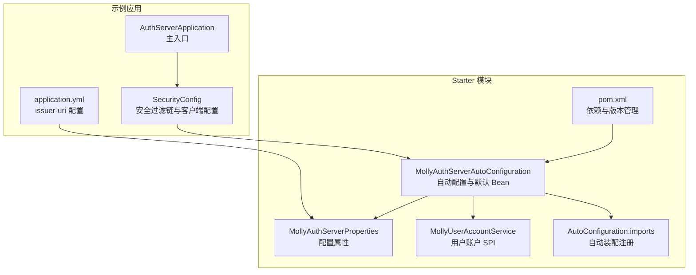
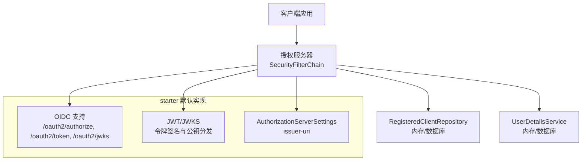
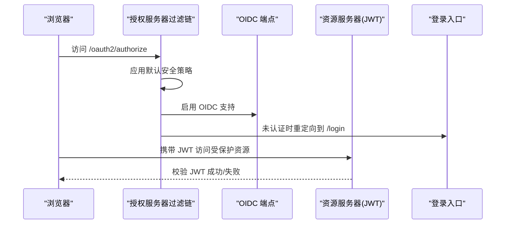
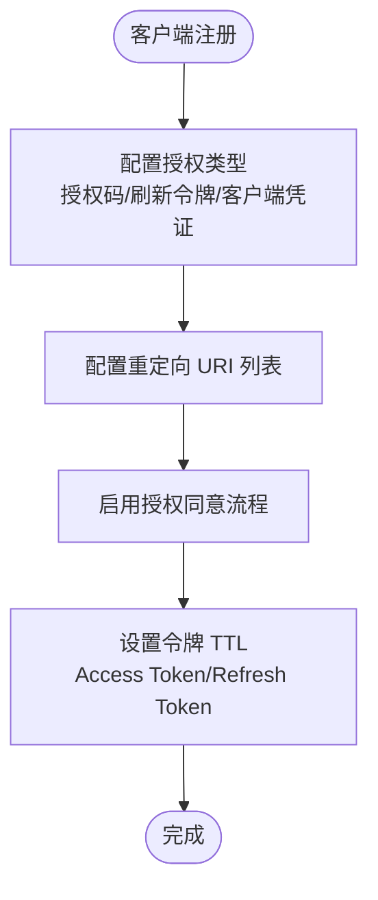
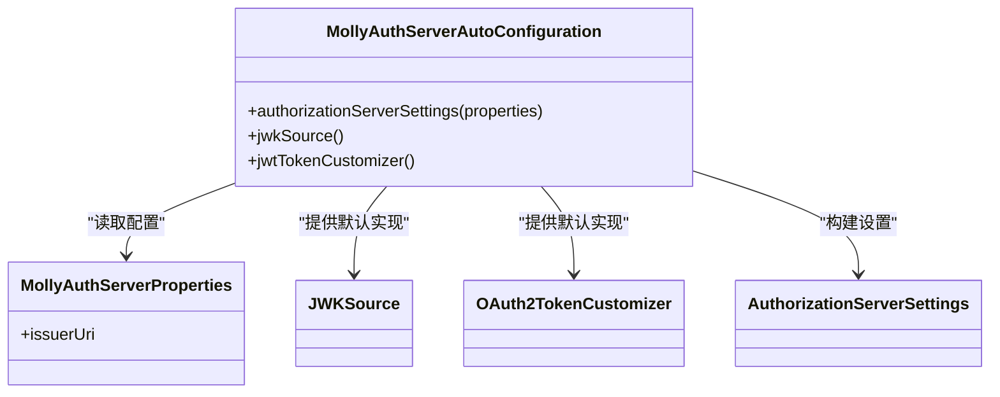
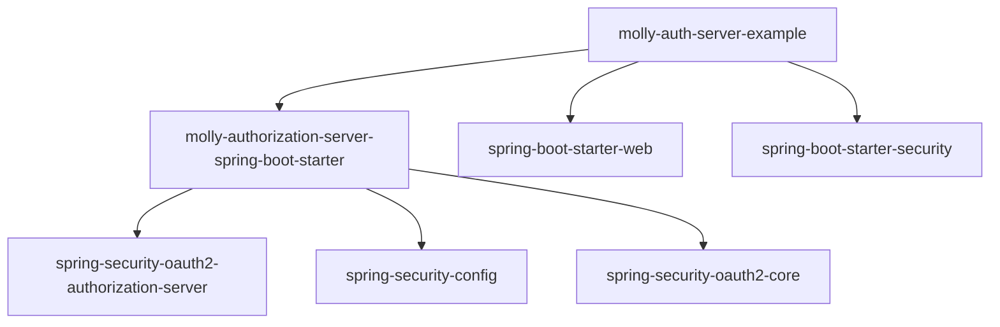

# OAuth2 授权流程安全

<cite>
**本文引用的文件列表**
- [AuthServerApplication.java](file://molly-auth-server-example/src/main/java/cn/molly/example/auth/AuthServerApplication.java)
- [SecurityConfig.java](file://molly-auth-server-example/src/main/java/cn/molly/example/auth/config/SecurityConfig.java)
- [application.yml](file://molly-auth-server-example/src/main/resources/application.yml)
- [MollyAuthServerAutoConfiguration.java](file://molly-authorization-server-spring-boot-starter/src/main/java/cn/molly/security/auth/config/MollyAuthServerAutoConfiguration.java)
- [MollyAuthServerProperties.java](file://molly-authorization-server-spring-boot-starter/src/main/java/cn/molly/security/auth/properties/MollyAuthServerProperties.java)
- [MollyUserAccountService.java](file://molly-authorization-server-spring-boot-starter/src/main/java/cn/molly/security/auth/service/MollyUserAccountService.java)
- [org.springframework.boot.autoconfigure.AutoConfiguration.imports](file://molly-authorization-server-spring-boot-starter/src/main/resources/META-INF/spring/org.springframework.boot.autoconfigure.AutoConfiguration.imports)
- [pom.xml](file://molly-authorization-server-spring-boot-starter/pom.xml)
- [README.md](file://README.md)
- [AGENTS.md](file://AGENTS.md)
</cite>

## 目录
1. [简介](#简介)
2. [项目结构](#项目结构)
3. [核心组件](#核心组件)
4. [架构总览](#架构总览)
5. [详细组件分析](#详细组件分析)
6. [依赖分析](#依赖分析)
7. [性能考量](#性能考量)
8. [故障排查指南](#故障排查指南)
9. [结论](#结论)
10. [附录](#附录)

## 简介
本文件围绕 OAuth2 授权码流程的安全实现展开，结合仓库中的 Spring Authorization Server 配置与自动配置，系统性阐述授权请求验证、重定向 URI 校验、状态参数保护、客户端认证、令牌颁发与传输安全、授权同意流程与 CSRF 防护、以及 OIDC 身份验证的签名校验与声明验证等关键安全机制。文档同时给出面向开发者的最佳实践与常见漏洞防护策略，帮助在生产环境中安全落地 OAuth2/OIDC 授权服务器。

## 项目结构
该项目采用多模块设计，核心由“starter”和“示例应用”组成：
- molly-authorization-server-spring-boot-starter：提供 OAuth2.1/OIDC 授权服务器的自动配置与默认安全组件（JWK、令牌定制、授权服务器设置等），并通过 SPI 约束使用者提供客户端存储与用户认证服务。
- molly-auth-server-example：示例应用，展示如何在实际项目中集成 starter 并完成最小可用的安全配置。

图表来源
- [AuthServerApplication.java:15-21](file://molly-auth-server-example/src/main/java/cn/molly/example/auth/AuthServerApplication.java#L15-L21)
- [SecurityConfig.java:42-164](file://molly-auth-server-example/src/main/java/cn/molly/example/auth/config/SecurityConfig.java#L42-L164)
- [application.yml:1-12](file://molly-auth-server-example/src/main/resources/application.yml#L1-L12)
- [MollyAuthServerAutoConfiguration.java:51-161](file://molly-authorization-server-spring-boot-starter/src/main/java/cn/molly/security/auth/config/MollyAuthServerAutoConfiguration.java#L51-L161)
- [MollyAuthServerProperties.java:14-24](file://molly-authorization-server-spring-boot-starter/src/main/java/cn/molly/security/auth/properties/MollyAuthServerProperties.java#L14-L24)
- [MollyUserAccountService.java:1-22](file://molly-authorization-server-spring-boot-starter/src/main/java/cn/molly/security/auth/service/MollyUserAccountService.java#L1-L22)
- [org.springframework.boot.autoconfigure.AutoConfiguration.imports:1-2](file://molly-authorization-server-spring-boot-starter/src/main/resources/META-INF/spring/org.springframework.boot.autoconfigure.AutoConfiguration.imports#L1-L2)
- [pom.xml:16-49](file://molly-authorization-server-spring-boot-starter/pom.xml#L16-L49)

章节来源
- [README.md:15-33](file://README.md#L15-L33)
- [AuthServerApplication.java:15-21](file://molly-auth-server-example/src/main/java/cn/molly/example/auth/AuthServerApplication.java#L15-L21)
- [SecurityConfig.java:42-164](file://molly-auth-server-example/src/main/java/cn/molly/example/auth/config/SecurityConfig.java#L42-L164)
- [application.yml:1-12](file://molly-auth-server-example/src/main/resources/application.yml#L1-L12)
- [MollyAuthServerAutoConfiguration.java:51-161](file://molly-authorization-server-spring-boot-starter/src/main/java/cn/molly/security/auth/config/MollyAuthServerAutoConfiguration.java#L51-L161)
- [MollyAuthServerProperties.java:14-24](file://molly-authorization-server-spring-boot-starter/src/main/java/cn/molly/security/auth/properties/MollyAuthServerProperties.java#L14-L24)
- [MollyUserAccountService.java:1-22](file://molly-authorization-server-spring-boot-starter/src/main/java/cn/molly/security/auth/service/MollyUserAccountService.java#L1-L22)
- [org.springframework.boot.autoconfigure.AutoConfiguration.imports:1-2](file://molly-authorization-server-spring-boot-starter/src/main/resources/META-INF/spring/org.springframework.boot.autoconfigure.AutoConfiguration.imports#L1-L2)
- [pom.xml:16-49](file://molly-authorization-server-spring-boot-starter/pom.xml#L16-L49)

## 核心组件
- 授权服务器安全过滤链：负责处理 OAuth2/OIDC 协议端点（如授权端点、令牌端点、发现端点、JWKS 端点），并启用 OIDC 支持与登录入口重定向。
- 客户端存储与令牌设置：示例中使用内存客户端存储，配置授权码、刷新令牌、客户端凭证等授权类型，以及访问令牌与刷新令牌的生命周期。
- 用户认证服务：示例中使用内存用户详情服务，生产环境应替换为数据库实现。
- 自动配置与默认 Bean：starter 提供授权服务器设置、JWK 源、令牌定制器等默认实现，且均支持通过同名 Bean 覆盖。
- 配置属性：通过 application.yml 提供 issuer-uri，满足 OIDC 规范要求。

章节来源
- [SecurityConfig.java:59-100](file://molly-auth-server-example/src/main/java/cn/molly/example/auth/config/SecurityConfig.java#L59-L100)
- [SecurityConfig.java:122-145](file://molly-auth-server-example/src/main/java/cn/molly/example/auth/config/SecurityConfig.java#L122-L145)
- [SecurityConfig.java:155-163](file://molly-auth-server-example/src/main/java/cn/molly/example/auth/config/SecurityConfig.java#L155-L163)
- [MollyAuthServerAutoConfiguration.java:67-92](file://molly-authorization-server-spring-boot-starter/src/main/java/cn/molly/security/auth/config/MollyAuthServerAutoConfiguration.java#L67-L92)
- [MollyAuthServerAutoConfiguration.java:105-120](file://molly-authorization-server-spring-boot-starter/src/main/java/cn/molly/security/auth/config/MollyAuthServerAutoConfiguration.java#L105-L120)
- [application.yml:6-12](file://molly-auth-server-example/src/main/resources/application.yml#L6-L12)

## 架构总览
下图展示了授权服务器在示例应用中的整体安全架构：示例应用通过 SecurityConfig 注入授权服务器过滤链与客户端配置；starter 通过自动配置提供授权服务器设置、JWK 源与令牌定制器；配置属性通过 application.yml 注入 issuer-uri。

图表来源
- [SecurityConfig.java:59-100](file://molly-auth-server-example/src/main/java/cn/molly/example/auth/config/SecurityConfig.java#L59-L100)
- [MollyAuthServerAutoConfiguration.java:67-92](file://molly-authorization-server-spring-boot-starter/src/main/java/cn/molly/security/auth/config/MollyAuthServerAutoConfiguration.java#L67-L92)
- [MollyAuthServerAutoConfiguration.java:105-120](file://molly-authorization-server-spring-boot-starter/src/main/java/cn/molly/security/auth/config/MollyAuthServerAutoConfiguration.java#L105-L120)
- [application.yml:6-12](file://molly-auth-server-example/src/main/resources/application.yml#L6-L12)

## 详细组件分析

### 授权服务器安全过滤链与 OIDC 支持
- 授权服务器过滤链优先级高于应用级过滤链，确保协议端点受默认安全策略保护，并启用 OIDC 支持。
- 未认证用户访问协议端点时，按 HTML 请求类型重定向至登录页。
- 资源服务器配置使用 JWT，默认启用 JWT 校验。

图表来源
- [SecurityConfig.java:59-77](file://molly-auth-server-example/src/main/java/cn/molly/example/auth/config/SecurityConfig.java#L59-L77)
- [SecurityConfig.java:72-74](file://molly-auth-server-example/src/main/java/cn/molly/example/auth/config/SecurityConfig.java#L72-L74)

章节来源
- [SecurityConfig.java:59-100](file://molly-auth-server-example/src/main/java/cn/molly/example/auth/config/SecurityConfig.java#L59-L100)

### 客户端存储与令牌设置（授权码/刷新令牌/客户端凭证）
- 客户端存储使用内存实现，示例中配置了授权码、刷新令牌、客户端凭证三种授权类型，以及多个重定向 URI。
- 启用了授权同意流程（requireAuthorizationConsent=true），确保用户在授权前确认范围。
- 访问令牌与刷新令牌分别设置了生命周期，便于控制令牌有效期与刷新窗口。

图表来源
- [SecurityConfig.java:122-145](file://molly-auth-server-example/src/main/java/cn/molly/example/auth/config/SecurityConfig.java#L122-L145)

章节来源
- [SecurityConfig.java:122-145](file://molly-auth-server-example/src/main/java/cn/molly/example/auth/config/SecurityConfig.java#L122-L145)

### 用户认证服务与密码编码
- 示例使用内存用户详情服务与 BCrypt 密码编码器，生产环境应替换为数据库实现。
- starter 提供了用户账户 SPI 接口，便于扩展多种认证方式（如手机号、社交登录）。

章节来源
- [SecurityConfig.java:155-163](file://molly-auth-server-example/src/main/java/cn/molly/example/auth/config/SecurityConfig.java#L155-L163)
- [MollyUserAccountService.java:1-22](file://molly-authorization-server-spring-boot-starter/src/main/java/cn/molly/security/auth/service/MollyUserAccountService.java#L1-L22)

### 自动配置与默认 Bean（JWK、令牌定制、授权服务器设置）
- 授权服务器设置：从配置属性读取 issuer-uri，构建 AuthorizationServerSettings。
- JWK 源：默认在内存中生成 RSA 密钥对（2048 位），提供 JWKS 端点；生产环境应覆盖为安全密钥源。
- 令牌定制：默认将用户权限注入 Access Token 的 authorities 声明，便于资源服务器进行细粒度授权。

图表来源
- [MollyAuthServerAutoConfiguration.java:67-120](file://molly-authorization-server-spring-boot-starter/src/main/java/cn/molly/security/auth/config/MollyAuthServerAutoConfiguration.java#L67-L120)
- [MollyAuthServerProperties.java:14-24](file://molly-authorization-server-spring-boot-starter/src/main/java/cn/molly/security/auth/properties/MollyAuthServerProperties.java#L14-L24)

章节来源
- [MollyAuthServerAutoConfiguration.java:67-120](file://molly-authorization-server-spring-boot-starter/src/main/java/cn/molly/security/auth/config/MollyAuthServerAutoConfiguration.java#L67-L120)
- [MollyAuthServerProperties.java:14-24](file://molly-authorization-server-spring-boot-starter/src/main/java/cn/molly/security/auth/properties/MollyAuthServerProperties.java#L14-L24)

### 配置属性与自动装配
- application.yml 中配置 issuer-uri，满足 OIDC 规范要求。
- starter 通过 AutoConfiguration.imports 注册自动配置类，使默认 Bean 生效。

章节来源
- [application.yml:6-12](file://molly-auth-server-example/src/main/resources/application.yml#L6-L12)
- [org.springframework.boot.autoconfigure.AutoConfiguration.imports:1-2](file://molly-authorization-server-spring-boot-starter/src/main/resources/META-INF/spring/org.springframework.boot.autoconfigure.AutoConfiguration.imports#L1-L2)

## 依赖分析
- starter 依赖 Spring Authorization Server 与 Spring Security 核心模块，提供 OAuth2/OIDC 协议实现与自动配置能力。
- 示例应用依赖 starter 与 Spring Security Web，通过 SecurityConfig 注入授权服务器过滤链与客户端配置。

图表来源
- [pom.xml:16-49](file://molly-authorization-server-spring-boot-starter/pom.xml#L16-L49)
- [README.md:93-109](file://README.md#L93-L109)

章节来源
- [pom.xml:16-49](file://molly-authorization-server-spring-boot-starter/pom.xml#L16-L49)
- [README.md:93-109](file://README.md#L93-L109)

## 性能考量
- 内存客户端存储与用户详情服务仅适用于开发与测试场景，生产环境应迁移到数据库实现以提升并发与持久化能力。
- 默认 JWK 源在内存中生成密钥对，适合开发；生产环境应使用安全密钥源（如密钥库、数据库或 HSM）以降低密钥泄露风险。
- 合理设置令牌 TTL，平衡安全性与用户体验；短 TTL 需配合刷新令牌使用，避免频繁重新授权。

## 故障排查指南
- OIDC 发现端点与 JWKS 端点不可用：检查授权服务器过滤链是否正确应用默认安全策略并启用 OIDC 支持。
- 登录重定向异常：确认未认证用户访问协议端点时的 HTML 请求类型匹配，确保登录入口路径正确。
- 令牌签发失败：核对 issuer-uri 配置与客户端重定向 URI 是否一致，确保 JWK 源可用且密钥有效。
- 授权同意流程未触发：确认客户端设置中 requireAuthorizationConsent=true 已启用。

章节来源
- [SecurityConfig.java:59-77](file://molly-auth-server-example/src/main/java/cn/molly/example/auth/config/SecurityConfig.java#L59-L77)
- [application.yml:6-12](file://molly-auth-server-example/src/main/resources/application.yml#L6-L12)

## 结论
本项目通过 Spring Authorization Server 与 starter 的自动配置，为 OAuth2/OIDC 授权服务器提供了开箱即用的安全基线：协议端点受保护、OIDC 支持、默认 JWK 与令牌定制、以及可覆盖的默认 Bean。示例应用展示了最小可用配置，生产部署需重点强化客户端存储与用户认证的持久化实现、密钥安全管理与令牌生命周期策略，并严格遵循 OIDC 规范与安全最佳实践。

## 附录

### OAuth2 授权码流程安全要点（结合仓库实现）
- 授权请求验证：示例应用通过授权服务器过滤链应用默认安全策略，确保授权端点受控。
- 重定向 URI 校验：客户端注册时配置了多个重定向 URI，授权服务器将校验回调 URI 与注册项一致。
- 状态参数保护：示例中未显式配置状态参数，建议在授权端点请求中强制携带并校验 state，防止 CSRF。
- 客户端认证：示例使用客户端密钥基本认证方式，生产环境应确保密钥安全存储与传输。
- 令牌颁发安全：Access Token 与 Refresh Token 分别设置 TTL；默认令牌定制器将权限注入 Access Token，便于资源服务器授权。
- OIDC 身份验证：通过授权服务器设置 issuer-uri，启用 OIDC 支持；JWKS 端点提供公钥，客户端可验证 ID 令牌签名与声明。

章节来源
- [SecurityConfig.java:59-100](file://molly-auth-server-example/src/main/java/cn/molly/example/auth/config/SecurityConfig.java#L59-L100)
- [SecurityConfig.java:122-145](file://molly-auth-server-example/src/main/java/cn/molly/example/auth/config/SecurityConfig.java#L122-L145)
- [MollyAuthServerAutoConfiguration.java:67-120](file://molly-authorization-server-spring-boot-starter/src/main/java/cn/molly/security/auth/config/MollyAuthServerAutoConfiguration.java#L67-L120)
- [application.yml:6-12](file://molly-auth-server-example/src/main/resources/application.yml#L6-L12)

### 开发者最佳实践与常见漏洞防护
- 强制使用 HTTPS 与安全传输，防止中间人攻击与令牌泄露。
- 严格校验重定向 URI，禁止通配符或空值；仅允许白名单内的 URI。
- 强制使用 state 参数并进行严格校验，防范 CSRF 攻击。
- 令牌最小权限原则：仅授予必要作用域与权限；定期轮换密钥与令牌。
- 安全存储密钥与机密：生产环境使用安全密钥源（如 HSM、KMS），避免硬编码。
- 审计与监控：记录授权与令牌发放事件，及时发现异常行为。
- 定期更新依赖与密钥轮换：保持 Spring Authorization Server 与 JDK 版本最新，定期轮换密钥与令牌。