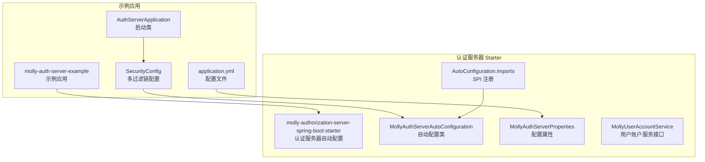
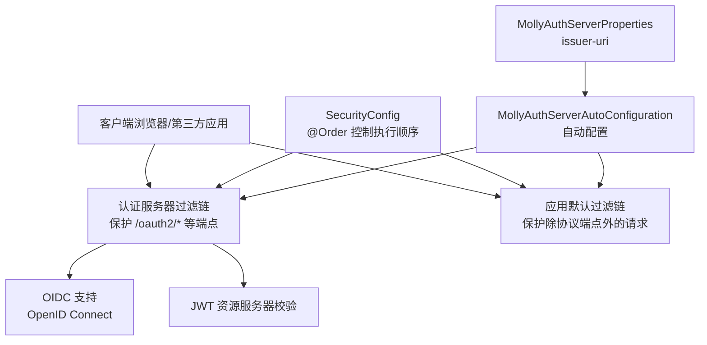
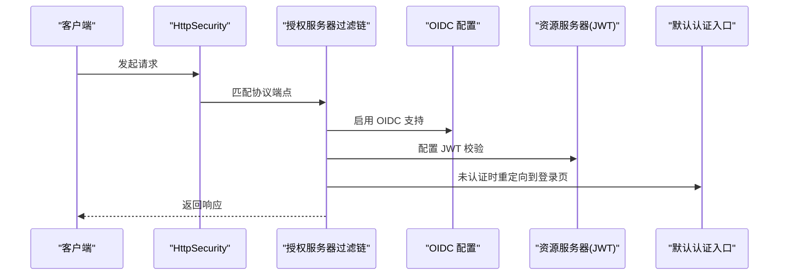
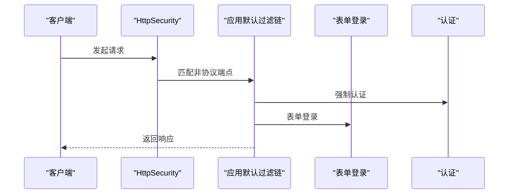
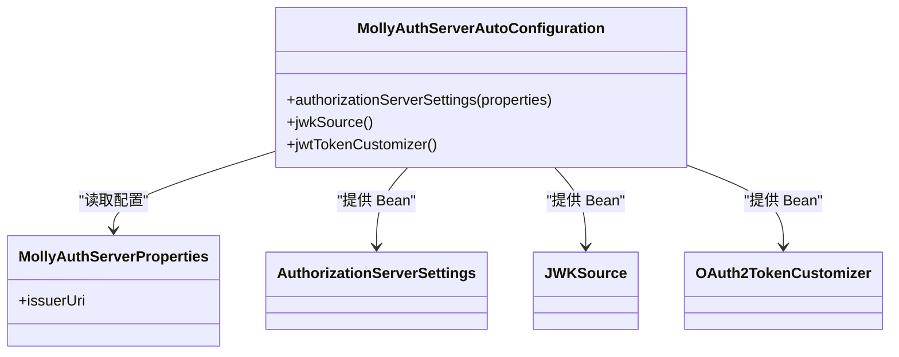
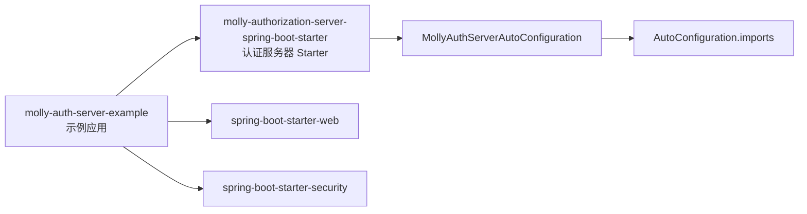

# 多过滤链安全配置

<cite>
**本文引用的文件**
- [SecurityConfig.java](file://molly-auth-server-example/src/main/java/cn/molly/example/auth/config/SecurityConfig.java)
- [AuthServerApplication.java](file://molly-auth-server-example/src/main/java/cn/molly/example/auth/AuthServerApplication.java)
- [application.yml](file://molly-auth-server-example/src/main/resources/application.yml)
- [MollyAuthServerAutoConfiguration.java](file://molly-authorization-server-spring-boot-starter/src/main/java/cn/molly/security/auth/config/MollyAuthServerAutoConfiguration.java)
- [MollyAuthServerProperties.java](file://molly-authorization-server-spring-boot-starter/src/main/java/cn/molly/security/auth/properties/MollyAuthServerProperties.java)
- [MollyUserAccountService.java](file://molly-authorization-server-spring-boot-starter/src/main/java/cn/molly/security/auth/service/MollyUserAccountService.java)
- [org.springframework.boot.autoconfigure.AutoConfiguration.imports](file://molly-authorization-server-spring-boot-starter/src/main/resources/META-INF/spring/org.springframework.boot.autoconfigure.AutoConfiguration.imports)
- [pom.xml](file://molly-auth-server-example/pom.xml)
- [pom.xml](file://pom.xml)
</cite>

## 目录
1. [简介](#简介)
2. [项目结构](#项目结构)
3. [核心组件](#核心组件)
4. [架构总览](#架构总览)
5. [详细组件分析](#详细组件分析)
6. [依赖分析](#依赖分析)
7. [性能考虑](#性能考虑)
8. [故障排查指南](#故障排查指南)
9. [结论](#结论)
10. [附录](#附录)

## 简介
本文件面向架构师与高级开发者，系统阐述在单一 Spring Boot 应用中同时实现“认证服务器”与“普通 Web 应用”的多过滤链安全配置方案。重点包括：
- 授权服务器过滤链与应用过滤链的分离策略
- 基于 @Order 的执行顺序控制
- 授权服务器端点的安全保护（OAuth2/OIDC 协议端点）与 OIDC 支持
- 应用层过滤链的表单登录、请求认证与权限控制
- 过滤链优先级配置原则与最佳实践
- 同一应用内同时满足认证服务器与 Web 应用安全需求的方法
- 冲突排查与性能优化建议

## 项目结构
该项目采用多模块结构，核心由以下模块组成：
- molly-auth-server-example：示例应用，展示如何在单体应用中集成认证服务器与 Web 应用的安全配置
- molly-authorization-server-spring-boot-starter：Spring Boot Starter，提供认证服务器的自动配置与默认组件
- molly-infrastructure：基础设施模块（当前为空，预留扩展）

图表来源
- [AuthServerApplication.java:1-22](file://molly-auth-server-example/src/main/java/cn/molly/example/auth/AuthServerApplication.java#L1-L22)
- [SecurityConfig.java:1-165](file://molly-auth-server-example/src/main/java/cn/molly/example/auth/config/SecurityConfig.java#L1-L165)
- [application.yml:1-12](file://molly-auth-server-example/src/main/resources/application.yml#L1-L12)
- [MollyAuthServerAutoConfiguration.java:1-161](file://molly-authorization-server-spring-boot-starter/src/main/java/cn/molly/security/auth/config/MollyAuthServerAutoConfiguration.java#L1-L161)
- [MollyAuthServerProperties.java:1-25](file://molly-authorization-server-spring-boot-starter/src/main/java/cn/molly/security/auth/properties/MollyAuthServerProperties.java#L1-L25)
- [MollyUserAccountService.java:1-22](file://molly-authorization-server-spring-boot-starter/src/main/java/cn/molly/security/auth/service/MollyUserAccountService.java#L1-L22)
- [org.springframework.boot.autoconfigure.AutoConfiguration.imports:1-2](file://molly-authorization-server-spring-boot-starter/src/main/resources/META-INF/spring/org.springframework.boot.autoconfigure.AutoConfiguration.imports#L1-L2)

章节来源
- [pom.xml:11-14](file://pom.xml#L11-L14)
- [molly-auth-server-example/pom.xml:16-29](file://molly-auth-server-example/pom.xml#L16-L29)
- [molly-authorization-server-spring-boot-starter/src/main/resources/META-INF/spring/org.springframework.boot.autoconfigure.AutoConfiguration.imports:1-2](file://molly-authorization-server-spring-boot-starter/src/main/resources/META-INF/spring/org.springframework.boot.autoconfigure.AutoConfiguration.imports#L1-L2)

## 核心组件
- 授权服务器过滤链（高优先级）：保护 OAuth2/OIDC 协议端点，启用 OIDC 支持，默认认证入口指向登录页，资源服务器使用 JWT 校验
- 应用默认过滤链（低优先级）：保护除协议端点外的全部请求，强制认证，表单登录
- 认证服务器自动配置：提供 AuthorizationServerSettings、JWKSource、OAuth2TokenCustomizer 等默认 Bean，并允许被用户自定义覆盖
- 配置属性：issuer-uri 用于 OIDC 合规的签发者标识
- 用户账户服务接口：统一抽象用户账户服务，便于扩展多种认证方式

章节来源
- [SecurityConfig.java:59-100](file://molly-auth-server-example/src/main/java/cn/molly/example/auth/config/SecurityConfig.java#L59-L100)
- [MollyAuthServerAutoConfiguration.java:67-120](file://molly-authorization-server-spring-boot-starter/src/main/java/cn/molly/security/auth/config/MollyAuthServerAutoConfiguration.java#L67-L120)
- [MollyAuthServerProperties.java:16-24](file://molly-authorization-server-spring-boot-starter/src/main/java/cn/molly/security/auth/properties/MollyAuthServerProperties.java#L16-L24)
- [MollyUserAccountService.java:20-21](file://molly-authorization-server-spring-boot-starter/src/main/java/cn/molly/security/auth/service/MollyUserAccountService.java#L20-L21)

## 架构总览
下图展示了示例应用如何在同一进程中同时承载认证服务器与 Web 应用的安全策略，以及 Starter 如何通过自动配置注入默认组件。

图表来源
- [SecurityConfig.java:59-100](file://molly-auth-server-example/src/main/java/cn/molly/example/auth/config/SecurityConfig.java#L59-L100)
- [MollyAuthServerAutoConfiguration.java:67-120](file://molly-authorization-server-spring-boot-starter/src/main/java/cn/molly/security/auth/config/MollyAuthServerAutoConfiguration.java#L67-L120)
- [MollyAuthServerProperties.java:16-24](file://molly-authorization-server-spring-boot-starter/src/main/java/cn/molly/security/auth/properties/MollyAuthServerProperties.java#L16-L24)

## 详细组件分析

### 授权服务器过滤链（高优先级）
- 作用域：保护 OAuth2/OIDC 协议端点（如授权、令牌、JWKS 等），启用 OIDC 支持
- 认证入口：针对 HTML 请求，默认认证入口指向登录页
- 资源服务器：启用 JWT 资源服务器校验
- 顺序控制：通过 @Order(1) 确保优先执行

图表来源
- [SecurityConfig.java:59-77](file://molly-auth-server-example/src/main/java/cn/molly/example/auth/config/SecurityConfig.java#L59-L77)

章节来源
- [SecurityConfig.java:46-77](file://molly-auth-server-example/src/main/java/cn/molly/example/auth/config/SecurityConfig.java#L46-L77)

### 应用默认过滤链（低优先级）
- 作用域：保护除协议端点外的全部请求
- 行为：所有请求均需认证；错误路径放行；表单登录
- 顺序控制：通过 @Order(2) 在授权服务器过滤链之后执行

图表来源
- [SecurityConfig.java:89-100](file://molly-auth-server-example/src/main/java/cn/molly/example/auth/config/SecurityConfig.java#L89-L100)

章节来源
- [SecurityConfig.java:79-100](file://molly-auth-server-example/src/main/java/cn/molly/example/auth/config/SecurityConfig.java#L79-L100)

### 认证服务器自动配置与默认组件
- AuthorizationServerSettings：从配置属性读取 issuer-uri，作为 OIDC 合规的签发者标识
- JWKSource：默认在内存中生成 RSA 密钥对并暴露为 JWK 源，便于快速上手
- OAuth2TokenCustomizer：为 Access Token 添加 authorities 声明，便于下游资源服务器进行细粒度权限控制
- 可覆盖性：通过 @ConditionalOnMissingBean，允许用户自定义上述 Bean

图表来源
- [MollyAuthServerAutoConfiguration.java:67-120](file://molly-authorization-server-spring-boot-starter/src/main/java/cn/molly/security/auth/config/MollyAuthServerAutoConfiguration.java#L67-L120)
- [MollyAuthServerProperties.java:16-24](file://molly-authorization-server-spring-boot-starter/src/main/java/cn/molly/security/auth/properties/MollyAuthServerProperties.java#L16-L24)

章节来源
- [MollyAuthServerAutoConfiguration.java:51-120](file://molly-authorization-server-spring-boot-starter/src/main/java/cn/molly/security/auth/config/MollyAuthServerAutoConfiguration.java#L51-L120)
- [MollyAuthServerProperties.java:14-24](file://molly-authorization-server-spring-boot-starter/src/main/java/cn/molly/security/auth/properties/MollyAuthServerProperties.java#L14-L24)

### 配置属性与应用配置
- application.yml 中配置 issuer-uri，确保与当前服务地址一致，满足 OIDC 标准要求
- 示例应用通过 @EnableWebSecurity 与 @Configuration 启用 Web 安全，并在 SecurityConfig 中定义两个过滤链

章节来源
- [application.yml:6-11](file://molly-auth-server-example/src/main/resources/application.yml#L6-L11)
- [AuthServerApplication.java:15-21](file://molly-auth-server-example/src/main/java/cn/molly/example/auth/AuthServerApplication.java#L15-L21)
- [SecurityConfig.java:42-44](file://molly-auth-server-example/src/main/java/cn/molly/example/auth/config/SecurityConfig.java#L42-L44)

## 依赖分析
- 示例应用依赖 Spring Boot Starter Web、Spring Security 与 molly-authorization-server-spring-boot-starter
- Starter 通过 AutoConfiguration.imports 注册自动配置类，使 Spring Boot 在运行时加载 MollyAuthServerAutoConfiguration
- Starter 与示例应用共享父 POM 的版本管理与插件配置

图表来源
- [molly-auth-server-example/pom.xml:16-29](file://molly-auth-server-example/pom.xml#L16-L29)
- [org.springframework.boot.autoconfigure.AutoConfiguration.imports:1-2](file://molly-authorization-server-spring-boot-starter/src/main/resources/META-INF/spring/org.springframework.boot.autoconfigure.AutoConfiguration.imports#L1-L2)

章节来源
- [molly-auth-server-example/pom.xml:16-29](file://molly-auth-server-example/pom.xml#L16-L29)
- [pom.xml:26-41](file://pom.xml#L26-L41)

## 性能考虑
- 过滤链顺序与匹配效率：高优先级的授权服务器过滤链应尽量精确匹配协议端点前缀，避免与应用过滤链产生不必要的重叠匹配
- OIDC/JWKS：在生产环境建议使用持久化密钥源与缓存 JWKS，减少密钥生成与网络请求开销
- Token 声明最小化：仅在 Access Token 中添加必要的 authorities 声明，降低令牌体积与序列化成本
- 登录与认证：表单登录应结合 CSRF 保护与会话管理，避免重复认证与跨站风险
- 资源服务器：JWT 校验应启用本地缓存与过期时间检查，减少远程校验频率

## 故障排查指南
- 协议端点无法访问或跳转到登录页
  - 检查授权服务器过滤链是否正确匹配协议端点前缀
  - 确认 @Order(1) 是否在应用过滤链之前生效
  - 核对 application.yml 中 issuer-uri 是否与客户端配置一致
- 表单登录失败或循环跳转
  - 检查应用过滤链是否对登录页与错误路径放行
  - 确认表单登录配置与默认认证入口设置
- OIDC 不可用或令牌无效
  - 校验 AuthorizationServerSettings 的 issuer-uri
  - 确认 JWKSource 是否返回有效密钥
  - 检查 OAuth2TokenCustomizer 是否正确注入 authorities 声明
- 冲突排查步骤
  - 逐条确认每个过滤链的匹配规则与顺序
  - 使用日志定位具体匹配到的过滤链
  - 临时禁用某过滤链以隔离问题范围

章节来源
- [SecurityConfig.java:59-100](file://molly-auth-server-example/src/main/java/cn/molly/example/auth/config/SecurityConfig.java#L59-L100)
- [application.yml:6-11](file://molly-auth-server-example/src/main/resources/application.yml#L6-L11)
- [MollyAuthServerAutoConfiguration.java:67-120](file://molly-authorization-server-spring-boot-starter/src/main/java/cn/molly/security/auth/config/MollyAuthServerAutoConfiguration.java#L67-L120)

## 结论
通过在单体应用中分离“授权服务器过滤链”和“应用默认过滤链”，并利用 @Order 精确控制执行顺序，可以同时满足认证服务器与普通 Web 应用的安全需求。配合认证服务器 Starter 的自动配置与可覆盖能力，能够在保证 OIDC 合规的同时，快速搭建生产可用的认证体系。建议在生产环境中替换内存实现为持久化存储与安全密钥源，并持续优化过滤链匹配与令牌声明，以获得更高的安全性与性能表现。

## 附录

### 过滤链优先级配置原则与最佳实践
- 明确划分：协议端点与业务端点严格分离，避免交叉匹配
- 顺序固定：授权服务器过滤链 @Order(1)，应用过滤链 @Order(2)，保持稳定
- 最小暴露：仅对必要端点放行，其余请求强制认证
- 可覆盖性：通过 @ConditionalOnMissingBean 提供默认实现，允许用户自定义
- OIDC 合规：issuer-uri 必须与客户端一致，确保令牌可验证

### 同一应用内同时支持认证服务器与 Web 应用的实施要点
- 在 SecurityConfig 中定义两个独立的 SecurityFilterChain Bean
- 使用 Spring Authorization Server 的默认安全配置，启用 OIDC 支持
- 为资源服务器配置 JWT 校验，确保令牌有效性
- 为应用层提供表单登录与统一认证入口
- 通过 Starter 注入默认组件，按需覆盖