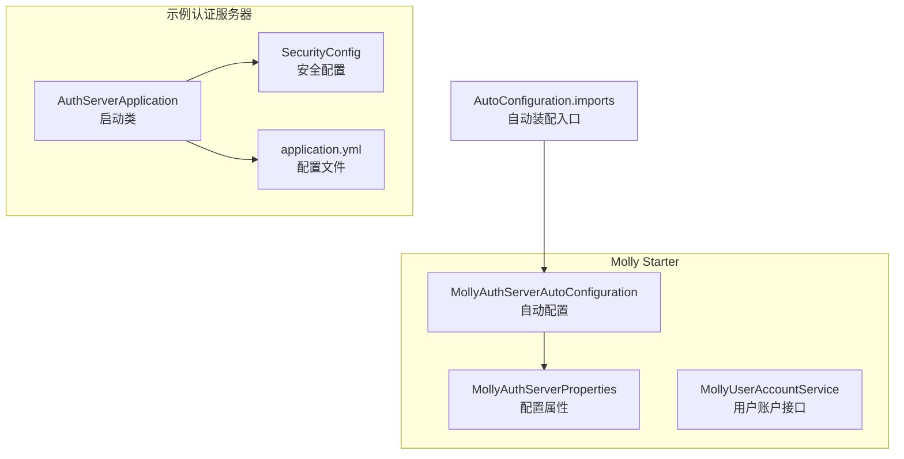
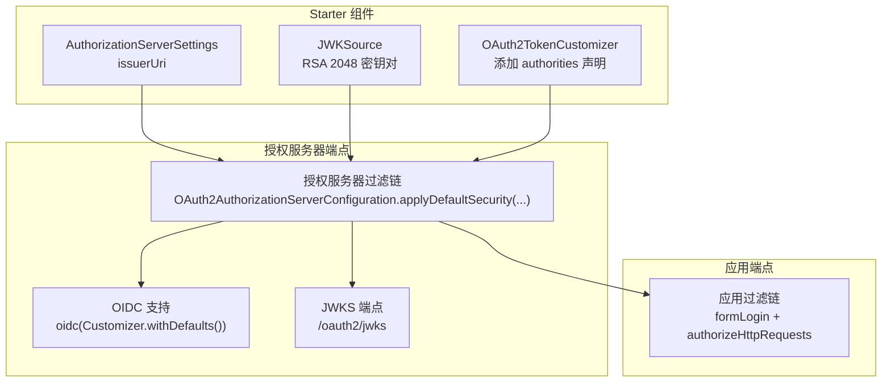
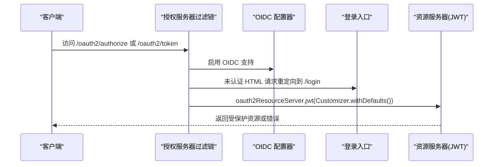
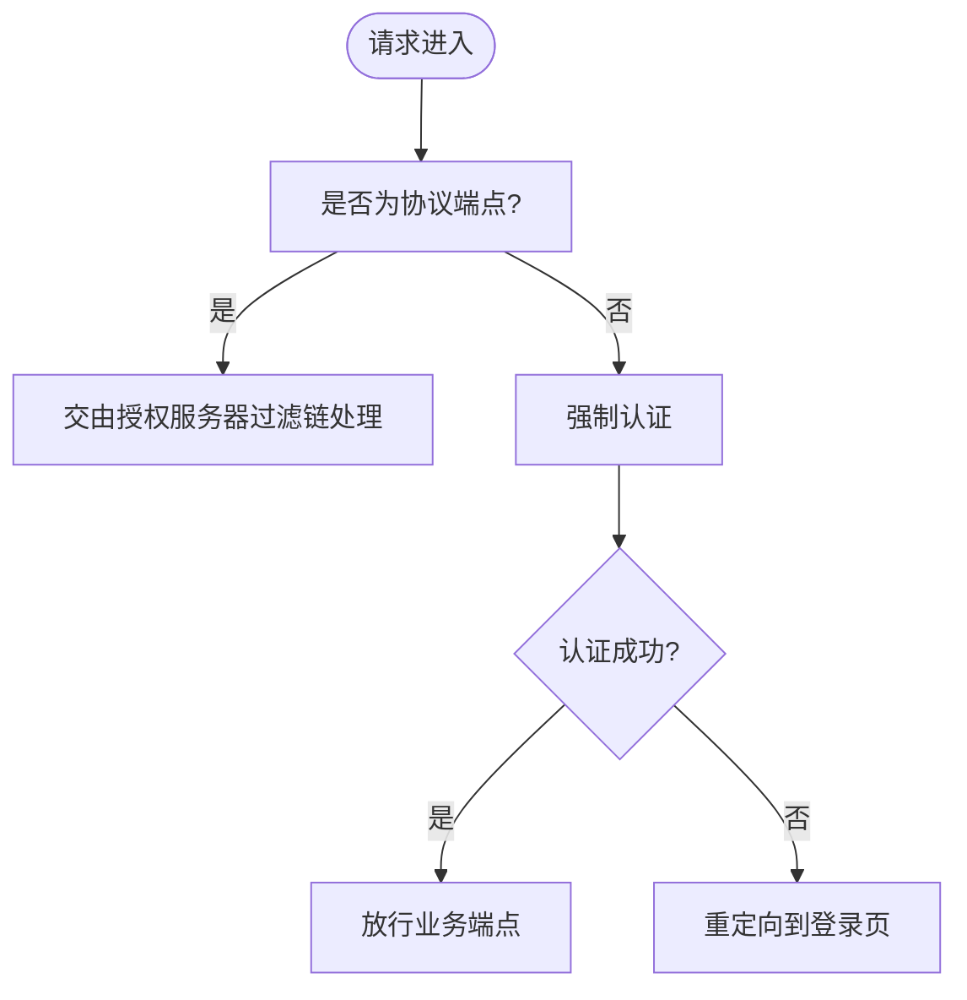
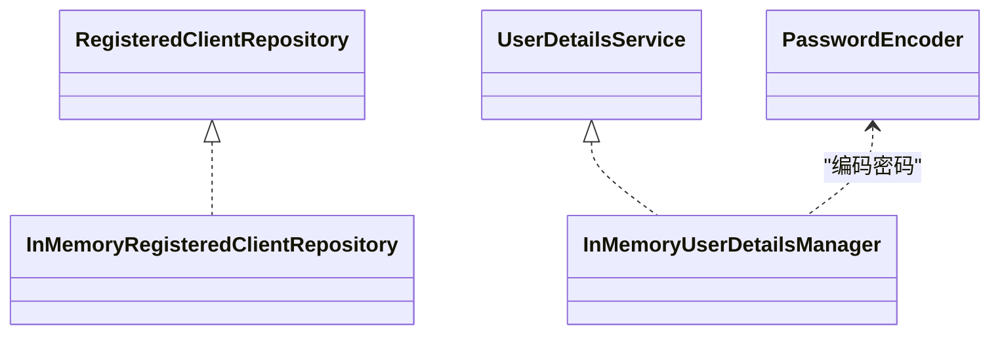
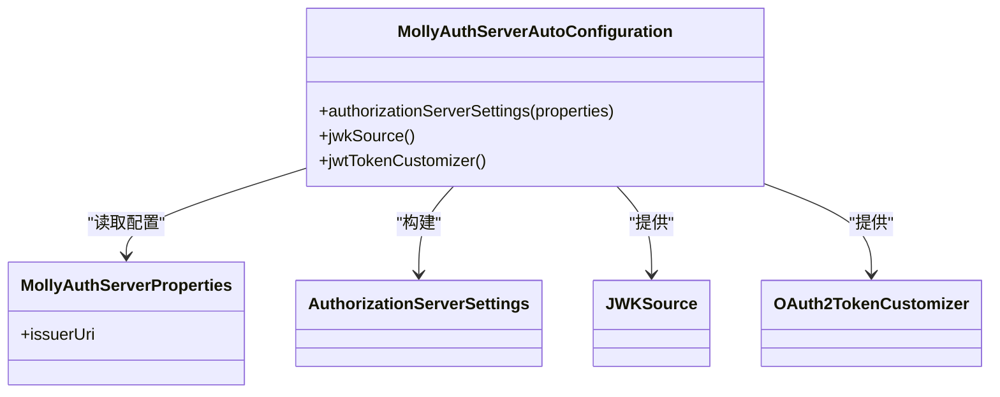
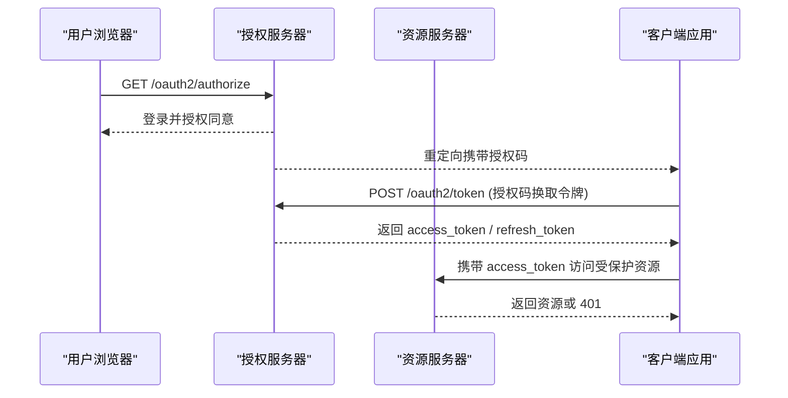
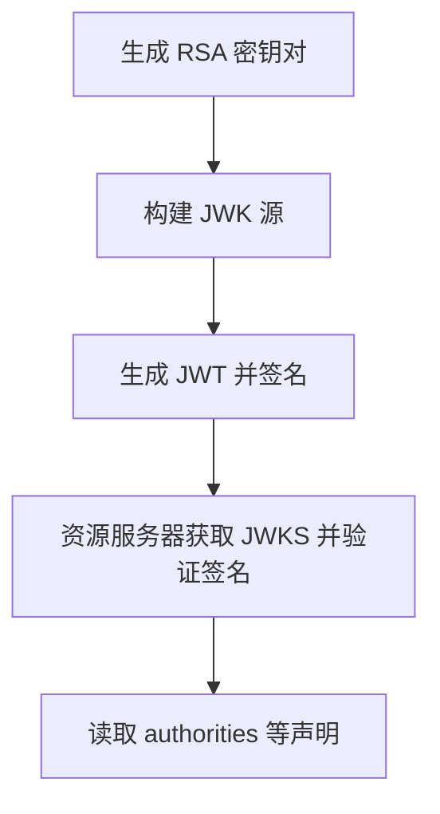
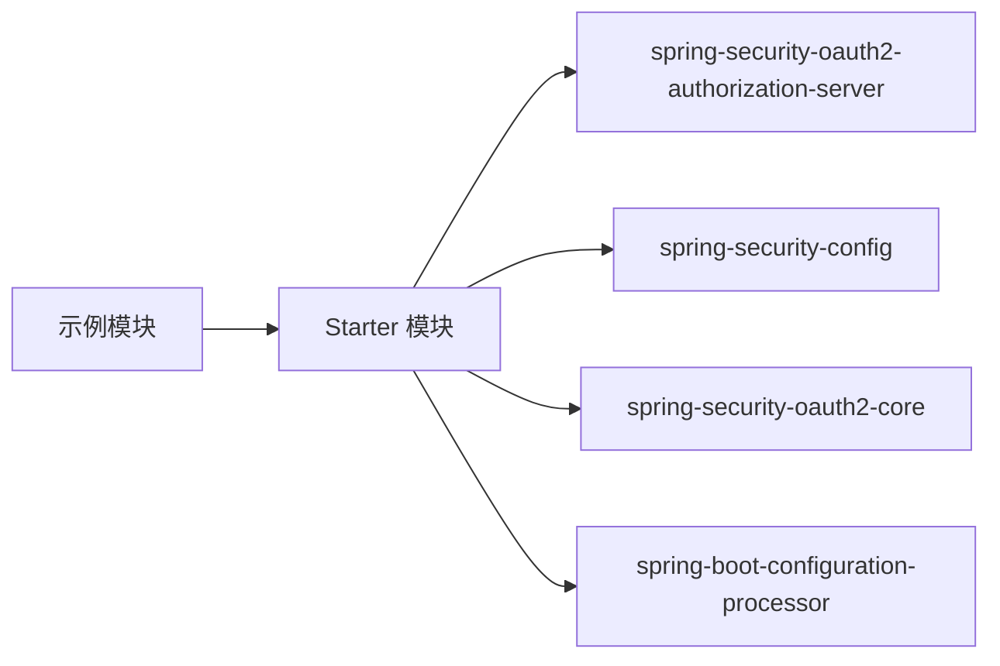

# 安全架构设计

<cite>
**本文引用的文件**
- [SecurityConfig.java](file://molly-auth-server-example/src/main/java/cn/molly/example/auth/config/SecurityConfig.java)
- [AuthServerApplication.java](file://molly-auth-server-example/src/main/java/cn/molly/example/auth/AuthServerApplication.java)
- [application.yml](file://molly-auth-server-example/src/main/resources/application.yml)
- [MollyAuthServerAutoConfiguration.java](file://molly-authorization-server-spring-boot-starter/src/main/java/cn/molly/security/auth/config/MollyAuthServerAutoConfiguration.java)
- [MollyAuthServerProperties.java](file://molly-authorization-server-spring-boot-starter/src/main/java/cn/molly/security/auth/properties/MollyAuthServerProperties.java)
- [MollyUserAccountService.java](file://molly-authorization-server-spring-boot-starter/src/main/java/cn/molly/security/auth/service/MollyUserAccountService.java)
- [org.springframework.boot.autoconfigure.AutoConfiguration.imports](file://molly-authorization-server-spring-boot-starter/src/main/resources/META-INF/spring/org.springframework.boot.autoconfigure.AutoConfiguration.imports)
- [pom.xml](file://molly-auth-server-example/pom.xml)
- [pom.xml](file://molly-authorization-server-spring-boot-starter/pom.xml)
- [pom.xml](file://pom.xml)
</cite>

## 更新摘要
**变更内容**
- 更新了OAuth2客户端配置，包括客户端ID/密钥优化和重定向URI修正
- 新增授权同意要求配置，提升授权安全性
- 优化令牌生命周期配置，设置合理的访问令牌和刷新令牌有效期
- 增强了安全配置的最佳实践指导

## 目录
1. [简介](#简介)
2. [项目结构](#项目结构)
3. [核心组件](#核心组件)
4. [架构总览](#架构总览)
5. [详细组件分析](#详细组件分析)
6. [依赖关系分析](#依赖关系分析)
7. [性能考量](#性能考量)
8. [故障排查指南](#故障排查指南)
9. [结论](#结论)
10. [附录](#附录)

## 简介
本文件面向安全工程师与高级开发者，系统性解析 Molly 框架的 OAuth2 授权服务器安全架构，重点涵盖：
- 授权码流程、令牌颁发与验证机制
- 多过滤链的安全配置策略（分离授权服务器端点与应用端点）
- Spring Security 在认证服务器中的作用与配置要点
- JWT 令牌的生成、签名与验证细节
- 安全最佳实践（CSRF、CORS、安全头）
- 与 Spring Authorization Server 的集成考虑
- 常见攻击的防护与漏洞治理建议

## 项目结构
Molly 采用多模块组织，核心由"示例认证服务器"和"Spring Boot Starter 自动配置"两部分组成：
- 示例认证服务器模块：演示如何在实际应用中启用授权服务器、配置安全过滤链、注册客户端与用户。
- Starter 模块：提供自动装配能力，包括授权服务器元数据、JWK 密钥源、令牌定制器等默认 Bean，便于快速集成。

**图表来源**
- [AuthServerApplication.java:16-21](file://molly-auth-server-example/src/main/java/cn/molly/example/auth/AuthServerApplication.java#L16-L21)
- [SecurityConfig.java:42-165](file://molly-auth-server-example/src/main/java/cn/molly/example/auth/config/SecurityConfig.java#L42-L165)
- [application.yml:1-12](file://molly-auth-server-example/src/main/resources/application.yml#L1-L12)
- [MollyAuthServerAutoConfiguration.java:51-161](file://molly-authorization-server-spring-boot-starter/src/main/java/cn/molly/security/auth/config/MollyAuthServerAutoConfiguration.java#L51-L161)
- [MollyAuthServerProperties.java:14-25](file://molly-authorization-server-spring-boot-starter/src/main/java/cn/molly/security/auth/properties/MollyAuthServerProperties.java#L14-L25)
- [MollyUserAccountService.java:1-22](file://molly-authorization-server-spring-boot-starter/src/main/java/cn/molly/security/auth/service/MollyUserAccountService.java#L1-L22)
- [org.springframework.boot.autoconfigure.AutoConfiguration.imports:1-2](file://molly-authorization-server-spring-boot-starter/src/main/resources/META-INF/spring/org.springframework.boot.autoconfigure.AutoConfiguration.imports#L1-L2)

**章节来源**
- [pom.xml:11-15](file://pom.xml#L11-L15)
- [molly-auth-server-example/pom.xml:16-30](file://molly-auth-server-example/pom.xml#L16-L30)
- [molly-authorization-server-spring-boot-starter/pom.xml:16-49](file://molly-authorization-server-spring-boot-starter/pom.xml#L16-L49)

## 核心组件
- 授权服务器安全过滤链：负责 OAuth2/OIDC 协议端点（如授权端点、令牌端点、JWKS 端点）的安全控制，默认启用 OIDC 支持，并将 HTML 请求重定向至登录页。
- 应用级安全过滤链：处理非协议端点的业务请求，统一强制认证，提供表单登录。
- 客户端存储：示例中使用内存实现，包含授权码、刷新令牌、客户端凭证等多种授权类型，以及 OIDC Scope 与自定义 Scope。**新增**：启用了授权同意要求，确保用户明确授权。
- 用户详情服务：示例中使用内存实现，生产环境建议接入持久化存储。
- 密码编码器：BCrypt 编码器，确保用户密码安全存储。
- 自动配置：提供授权服务器元数据、JWK 密钥源、令牌定制器等默认 Bean，支持覆盖。

**章节来源**
- [SecurityConfig.java:46-100](file://molly-auth-server-example/src/main/java/cn/molly/example/auth/config/SecurityConfig.java#L46-L100)
- [SecurityConfig.java:110-165](file://molly-auth-server-example/src/main/java/cn/molly/example/auth/config/SecurityConfig.java#L110-L165)
- [MollyAuthServerAutoConfiguration.java:67-120](file://molly-authorization-server-spring-boot-starter/src/main/java/cn/molly/security/auth/config/MollyAuthServerAutoConfiguration.java#L67-L120)

## 架构总览
下图展示了授权服务器与应用端点的分离式安全配置，以及 Starter 自动装配的关键组件。

**图表来源**
- [SecurityConfig.java:59-77](file://molly-auth-server-example/src/main/java/cn/molly/example/auth/config/SecurityConfig.java#L59-L77)
- [SecurityConfig.java:89-100](file://molly-auth-server-example/src/main/java/cn/molly/example/auth/config/SecurityConfig.java#L89-L100)
- [MollyAuthServerAutoConfiguration.java:67-120](file://molly-authorization-server-spring-boot-starter/src/main/java/cn/molly/security/auth/config/MollyAuthServerAutoConfiguration.java#L67-L120)
- [application.yml:9-11](file://molly-auth-server-example/src/main/resources/application.yml#L9-L11)

## 详细组件分析

### 授权服务器安全过滤链
- 职责：处理 OAuth2/OIDC 协议端点，应用默认安全策略，启用 OIDC，HTML 请求重定向至登录页，开启资源服务器 JWT 验证。
- 关键点：
  - 使用注解顺序保证优先级高于应用过滤链。
  - 通过配置器启用 OIDC。
  - 为 HTML 请求设置默认认证入口。
  - 资源服务器启用 JWT 验证。

**图表来源**
- [SecurityConfig.java:59-77](file://molly-auth-server-example/src/main/java/cn/molly/example/auth/config/SecurityConfig.java#L59-L77)

**章节来源**
- [SecurityConfig.java:46-77](file://molly-auth-server-example/src/main/java/cn/molly/example/auth/config/SecurityConfig.java#L46-L77)

### 应用级安全过滤链
- 职责：处理除协议端点外的所有请求，强制认证，提供表单登录。
- 关键点：
  - 仅放行特定路径（如错误页），其余全部认证。
  - 表单登录默认配置。

**图表来源**
- [SecurityConfig.java:89-100](file://molly-auth-server-example/src/main/java/cn/molly/example/auth/config/SecurityConfig.java#L89-L100)

**章节来源**
- [SecurityConfig.java:79-100](file://molly-auth-server-example/src/main/java/cn/molly/example/auth/config/SecurityConfig.java#L79-L100)

### 客户端存储与用户详情服务
- 客户端存储：示例使用内存实现，包含授权码、刷新令牌、客户端凭证等多种授权类型，以及 OIDC Scope 与自定义 Scope。**更新**：客户端ID优化为"test-client"，密钥为"secret"，添加了两个重定向URI，启用了授权同意要求。
- 用户详情服务：示例使用内存用户，生产环境建议接入数据库或外部身份源。
- 密码编码器：BCrypt 编码器，确保密码安全。

**图表来源**
- [SecurityConfig.java:122-145](file://molly-auth-server-example/src/main/java/cn/molly/example/auth/config/SecurityConfig.java#L122-L145)
- [SecurityConfig.java:155-163](file://molly-auth-server-example/src/main/java/cn/molly/example/auth/config/SecurityConfig.java#L155-L163)
- [SecurityConfig.java:110-113](file://molly-auth-server-example/src/main/java/cn/molly/example/auth/config/SecurityConfig.java#L110-L113)

**章节来源**
- [SecurityConfig.java:110-165](file://molly-auth-server-example/src/main/java/cn/molly/example/auth/config/SecurityConfig.java#L110-L165)

### Starter 自动配置与 JWT 管理
- 授权服务器元数据：从配置属性读取 issuer URI，构建 AuthorizationServerSettings。
- JWK 密钥源：默认在内存生成 RSA 2048 密钥对，作为 JWK 源；生产环境建议提供自定义 JWKSource。
- 令牌定制器：为 Access Token 添加 authorities 声明，便于资源服务器进行细粒度权限控制。

**图表来源**
- [MollyAuthServerAutoConfiguration.java:67-120](file://molly-authorization-server-spring-boot-starter/src/main/java/cn/molly/security/auth/config/MollyAuthServerAutoConfiguration.java#L67-L120)
- [MollyAuthServerProperties.java:14-25](file://molly-authorization-server-spring-boot-starter/src/main/java/cn/molly/security/auth/properties/MollyAuthServerProperties.java#L14-L25)

**章节来源**
- [MollyAuthServerAutoConfiguration.java:51-161](file://molly-authorization-server-spring-boot-starter/src/main/java/cn/molly/security/auth/config/MollyAuthServerAutoConfiguration.java#L51-L161)
- [MollyAuthServerProperties.java:14-25](file://molly-authorization-server-spring-boot-starter/src/main/java/cn/molly/security/auth/properties/MollyAuthServerProperties.java#L14-L25)

### OAuth2 授权码流程与令牌发放
- 授权码流程要点：
  - 客户端引导用户至授权端点，携带响应类型、客户端 ID、重定向 URI、作用域等参数。
  - 用户登录并通过授权服务器确认授权同意（若配置为需要授权同意）。
  - 授权服务器返回授权码到重定向 URI。
  - 客户端使用授权码向令牌端点申请访问令牌与刷新令牌。
  - 令牌端点校验客户端身份与授权码有效性，发放令牌。
- 令牌类型与生命周期：
  - 访问令牌：示例中配置为 30 分钟有效期。
  - 刷新令牌：示例中配置为 7 天有效期。
- OIDC 支持：示例启用了 OIDC，因此可发放 ID Token 以满足 OpenID Connect 场景。

**图表来源**
- [SecurityConfig.java:122-145](file://molly-auth-server-example/src/main/java/cn/molly/example/auth/config/SecurityConfig.java#L122-L145)
- [MollyAuthServerAutoConfiguration.java:67-73](file://molly-authorization-server-spring-boot-starter/src/main/java/cn/molly/security/auth/config/MollyAuthServerAutoConfiguration.java#L67-L73)

**章节来源**
- [SecurityConfig.java:122-145](file://molly-auth-server-example/src/main/java/cn/molly/example/auth/config/SecurityConfig.java#L122-L145)
- [application.yml:9-11](file://molly-auth-server-example/src/main/resources/application.yml#L9-L11)

### JWT 生成、签名与验证机制
- 生成与签名：
  - 使用 RSA 2048 密钥对生成 JWK，作为签名密钥源。
  - 令牌定制器在 Access Token 中注入 authorities 声明，便于下游资源服务器鉴权。
- 验证：
  - 资源服务器通过授权服务器 JWKS 端点获取公钥，验证 JWT 签名与声明。
  - OIDC 配置器启用资源服务器 JWT 验证，确保令牌符合规范。

**图表来源**
- [MollyAuthServerAutoConfiguration.java:86-120](file://molly-authorization-server-spring-boot-starter/src/main/java/cn/molly/security/auth/config/MollyAuthServerAutoConfiguration.java#L86-L120)
- [SecurityConfig.java:72-74](file://molly-auth-server-example/src/main/java/cn/molly/example/auth/config/SecurityConfig.java#L72-L74)

**章节来源**
- [MollyAuthServerAutoConfiguration.java:75-120](file://molly-authorization-server-spring-boot-starter/src/main/java/cn/molly/security/auth/config/MollyAuthServerAutoConfiguration.java#L75-L120)
- [SecurityConfig.java:72-74](file://molly-auth-server-example/src/main/java/cn/molly/example/auth/config/SecurityConfig.java#L72-L74)

## 依赖关系分析
- Maven 模块依赖：
  - 示例模块依赖 Starter 模块与 Spring Boot Web/Security。
  - Starter 模块依赖 Spring Authorization Server、Spring Security 核心与配置处理器。
- 自动装配入口：
  - Starter 通过 AutoConfiguration.imports 指定自动配置类，实现零样板代码集成。

**图表来源**
- [molly-auth-server-example/pom.xml:16-30](file://molly-auth-server-example/pom.xml#L16-L30)
- [molly-authorization-server-spring-boot-starter/pom.xml:16-49](file://molly-authorization-server-spring-boot-starter/pom.xml#L16-L49)
- [org.springframework.boot.autoconfigure.AutoConfiguration.imports:1-2](file://molly-authorization-server-spring-boot-starter/src/main/resources/META-INF/spring/org.springframework.boot.autoconfigure.AutoConfiguration.imports#L1-L2)

**章节来源**
- [pom.xml:11-15](file://pom.xml#L11-L15)
- [molly-auth-server-example/pom.xml:16-30](file://molly-auth-server-example/pom.xml#L16-L30)
- [molly-authorization-server-spring-boot-starter/pom.xml:16-49](file://molly-authorization-server-spring-boot-starter/pom.xml#L16-L49)

## 性能考量
- 密钥生成成本：默认在内存生成 RSA 密钥对，适合开发环境；生产环境建议使用持久化密钥源（如密钥库、HSM），避免每次启动重新生成。
- 令牌生命周期：合理设置访问令牌与刷新令牌有效期，平衡安全性与用户体验。
- 客户端存储：内存实现适用于测试；生产环境使用数据库实现，降低内存占用并提升可用性。
- 过滤链顺序：确保授权服务器过滤链优先级高于应用过滤链，避免协议端点被错误拦截。

## 故障排查指南
- 无法访问授权端点：
  - 检查授权服务器过滤链是否正确启用默认安全策略与 OIDC 支持。
  - 确认 HTML 请求的认证入口已配置。
- 令牌无效或验证失败：
  - 确认资源服务器已启用 JWT 验证。
  - 检查 issuer URI 与客户端配置是否一致。
  - 核对 JWKS 端点可达且返回正确的公钥集。
- 客户端凭证不生效：
  - 确认客户端存储已正确注入，授权类型与作用域配置正确。
  - 检查密码编码器是否与客户端密钥一致。
- 生产密钥问题：
  - 若使用默认内存密钥，请尽快替换为安全的密钥源。

## 结论
Molly 框架通过清晰的多过滤链分离与 Starter 自动配置，提供了开箱即用的 OAuth2/OIDC 授权服务器能力。其核心优势在于：
- 明确区分协议端点与应用端点的安全策略，降低耦合风险。
- 提供默认的授权服务器元数据、JWK 密钥源与令牌定制器，便于快速落地。
- 通过配置属性与条件 Bean，支持灵活覆盖与扩展。

在生产环境中，建议优先完成密钥源替换、客户端与用户存储持久化、以及严格的令牌生命周期与审计策略配置。

## 附录

### 安全最佳实践清单
- CSRF 保护：启用默认 CSRF（Spring Security 默认对状态变更操作启用），并结合同站策略与安全 Cookie 属性。
- CORS 配置：仅允许受信来源，最小暴露范围，避免通配符。
- 安全头设置：强制 HTTPS、X-Frame-Options、X-Content-Type-Options、Referrer-Policy、Content-Security-Policy 等。
- 令牌安全：短生命周期访问令牌、刷新令牌、禁用隐式授权、严格重定向 URI 校验。
- 日志与审计：记录关键事件（登录、授权、令牌发放/撤销），避免泄露敏感信息。
- 传输安全：TLS 1.2+，禁用弱密码套件，定期轮换证书与密钥。

### 常见攻击与防护
- 授权码劫持：严格校验回调 URI、一次性授权码、短生命周期。
- 令牌泄露：最小权限原则、短生命周期、及时撤销。
- CSRF：启用 CSRF 保护、SameSite Cookie、Token 校验。
- XSS：内容安全策略、输出编码、HttpOnly Cookie。
- 重放攻击：令牌一次性使用、时间戳校验、必要时加入随机数。

### OAuth2 配置优化要点
- **客户端ID/密钥管理**：使用强随机的客户端ID和复杂密钥，定期轮换。
- **重定向URI验证**：严格白名单机制，防止开放重定向攻击。
- **授权同意流程**：启用授权同意要求，确保用户明确授权。
- **令牌生命周期**：根据业务需求设置合理的令牌有效期，平衡安全与体验。
- **作用域最小化**：仅授予必要的作用域权限，遵循最小权限原则。
- **客户端凭证保护**：使用安全的客户端凭证存储和传输机制。
- **监控与审计**：建立完整的OAuth2操作日志和异常监控体系。