# 客户端认证与授权

<cite>
**本文档引用的文件**
- [AuthServerApplication.java](file://molly-auth-server-example/src/main/java/cn/molly/example/auth/AuthServerApplication.java)
- [SecurityConfig.java](file://molly-auth-server-example/src/main/java/cn/molly/example/auth/config/SecurityConfig.java)
- [application.yml](file://molly-auth-server-example/src/main/resources/application.yml)
- [MollyAuthServerAutoConfiguration.java](file://molly-authorization-server-spring-boot-starter/src/main/java/cn/molly/security/auth/config/MollyAuthServerAutoConfiguration.java)
- [MollyAuthServerProperties.java](file://molly-authorization-server-spring-boot-starter/src/main/java/cn/molly/security/auth/properties/MollyAuthServerProperties.java)
- [MollyUserAccountService.java](file://molly-authorization-server-spring-boot-starter/src/main/java/cn/molly/security/auth/service/MollyUserAccountService.java)
- [org.springframework.boot.autoconfigure.AutoConfiguration.imports](file://molly-authorization-server-spring-boot-starter/src/main/resources/META-INF/spring/org.springframework.boot.autoconfigure.AutoConfiguration.imports)
- [README.md](file://README.md)
- [AGENTS.md](file://AGENTS.md)
</cite>

## 目录
1. [简介](#简介)
2. [项目结构](#项目结构)
3. [核心组件](#核心组件)
4. [架构概览](#架构概览)
5. [详细组件分析](#详细组件分析)
6. [客户端认证机制](#客户端认证机制)
7. [授权授予类型](#授权授予类型)
8. [客户端存储与管理](#客户端存储与管理)
9. [令牌安全与生命周期](#令牌安全与生命周期)
10. [安全配置最佳实践](#安全配置最佳实践)
11. [防滥用与范围控制](#防滥用与范围控制)
12. [安全审计与监控](#安全审计与监控)
13. [客户端集成指南](#客户端集成指南)
14. [故障排除指南](#故障排除指南)
15. [结论](#结论)

## 简介

Molly项目是一个基于Spring Boot构建的分布式Web系统脚手架，专注于权限与认证领域，提供开箱即用的安全基础设施。该项目的核心是Spring Authorization Server（OAuth 2.1 / OIDC 1.0）的实现，为开发者提供了完整的客户端认证与授权解决方案。

本项目采用模块化设计，包含认证服务器Starter和示例应用两个主要部分。认证服务器Starter提供了自动配置功能，而示例应用展示了如何在实际项目中集成和使用这些功能。

## 项目结构

Molly项目采用清晰的模块化架构，主要包含以下组件：

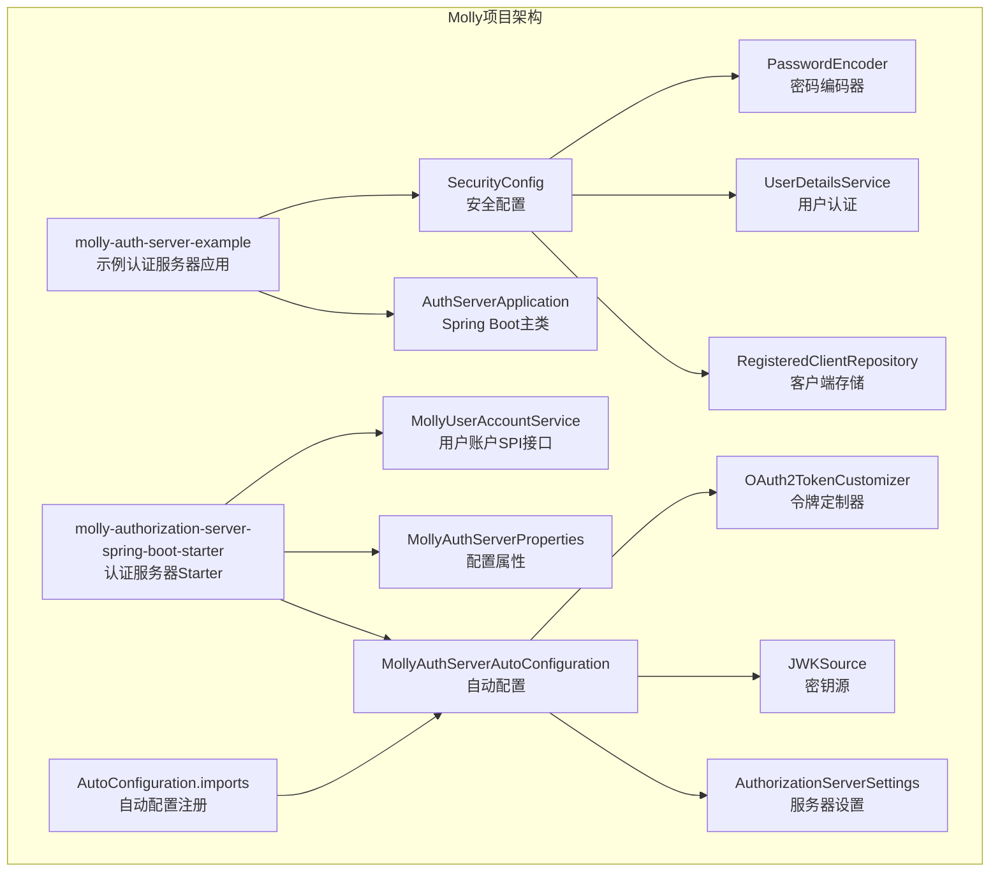

**图表来源**
- [AuthServerApplication.java:15-21](file://molly-auth-server-example/src/main/java/cn/molly/example/auth/AuthServerApplication.java#L15-L21)
- [SecurityConfig.java:42-164](file://molly-auth-server-example/src/main/java/cn/molly/example/auth/config/SecurityConfig.java#L42-L164)
- [MollyAuthServerAutoConfiguration.java:51-161](file://molly-authorization-server-spring-boot-starter/src/main/java/cn/molly/security/auth/config/MollyAuthServerAutoConfiguration.java#L51-L161)

**章节来源**
- [README.md:15-33](file://README.md#L15-L33)
- [AGENTS.md:15-33](file://AGENTS.md#L15-L33)

## 核心组件

### 认证服务器Starter组件

认证服务器Starter是项目的核心模块，提供了以下关键组件：

1. **MollyAuthServerAutoConfiguration**: 核心自动配置类，负责提供默认的Bean定义
2. **MollyAuthServerProperties**: 配置属性类，支持issuer-uri配置
3. **MollyUserAccountService**: 用户账户SPI接口，扩展自UserDetailsService

### 示例应用组件

示例应用展示了如何在实际项目中使用这些组件：

1. **AuthServerApplication**: Spring Boot主应用程序类
2. **SecurityConfig**: 安全配置类，包含客户端存储、用户认证和安全过滤链配置

**章节来源**
- [MollyAuthServerAutoConfiguration.java:28-50](file://molly-authorization-server-spring-boot-starter/src/main/java/cn/molly/security/auth/config/MollyAuthServerAutoConfiguration.java#L28-L50)
- [MollyAuthServerProperties.java:6-25](file://molly-authorization-server-spring-boot-starter/src/main/java/cn/molly/security/auth/properties/MollyAuthServerProperties.java#L6-L25)
- [MollyUserAccountService.java:5-22](file://molly-authorization-server-spring-boot-starter/src/main/java/cn/molly/security/auth/service/MollyUserAccountService.java#L5-L22)

## 架构概览

Molly项目的整体架构基于Spring Security和Spring Authorization Server，实现了完整的OAuth 2.1和OIDC 1.0标准：

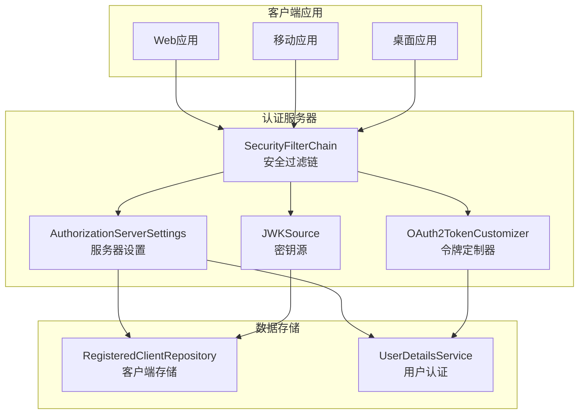

**图表来源**
- [MollyAuthServerAutoConfiguration.java:67-120](file://molly-authorization-server-spring-boot-starter/src/main/java/cn/molly/security/auth/config/MollyAuthServerAutoConfiguration.java#L67-L120)
- [SecurityConfig.java:59-100](file://molly-auth-server-example/src/main/java/cn/molly/example/auth/config/SecurityConfig.java#L59-L100)

## 详细组件分析

### 自动配置组件分析

MollyAuthServerAutoConfiguration类是整个认证服务器的核心，提供了三个关键的默认Bean：

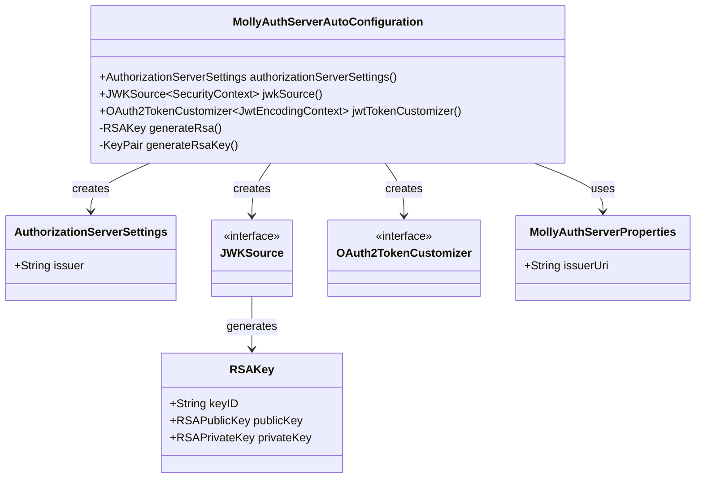

**图表来源**
- [MollyAuthServerAutoConfiguration.java:67-138](file://molly-authorization-server-spring-boot-starter/src/main/java/cn/molly/security/auth/config/MollyAuthServerAutoConfiguration.java#L67-L138)
- [MollyAuthServerProperties.java:16-23](file://molly-authorization-server-spring-boot-starter/src/main/java/cn/molly/security/auth/properties/MollyAuthServerProperties.java#L16-L23)

**章节来源**
- [MollyAuthServerAutoConfiguration.java:51-161](file://molly-authorization-server-spring-boot-starter/src/main/java/cn/molly/security/auth/config/MollyAuthServerAutoConfiguration.java#L51-L161)

### 安全配置组件分析

示例应用中的SecurityConfig类展示了如何配置客户端存储、用户认证和安全过滤链：

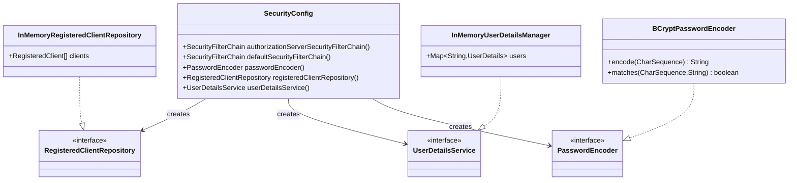

**图表来源**
- [SecurityConfig.java:115-163](file://molly-auth-server-example/src/main/java/cn/molly/example/auth/config/SecurityConfig.java#L115-L163)

**章节来源**
- [SecurityConfig.java:42-164](file://molly-auth-server-example/src/main/java/cn/molly/example/auth/config/SecurityConfig.java#L42-L164)

## 客户端认证机制

### 客户端密码验证

项目支持多种客户端认证方法，其中最常用的是客户端密码验证：

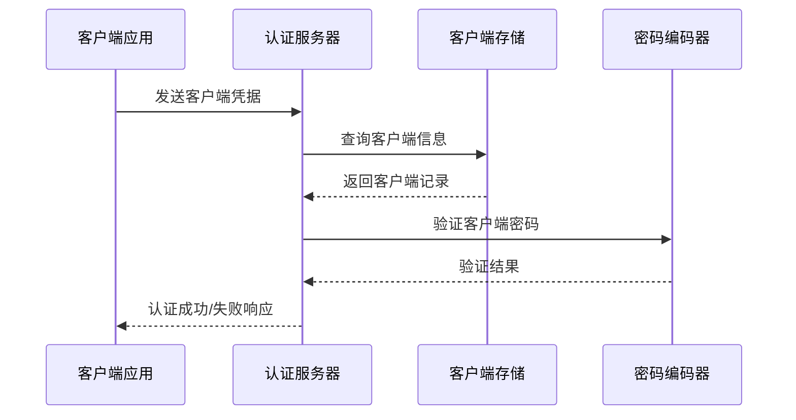

**图表来源**
- [SecurityConfig.java:123-145](file://molly-auth-server-example/src/main/java/cn/molly/example/auth/config/SecurityConfig.java#L123-L145)

### 密钥交换机制

项目使用JWK（JSON Web Key）进行密钥交换和令牌签名：

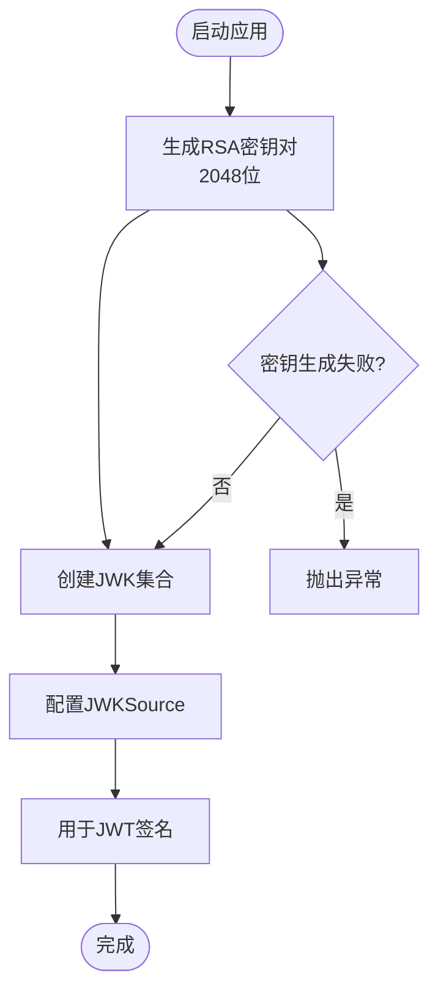

**图表来源**
- [MollyAuthServerAutoConfiguration.java:86-92](file://molly-authorization-server-spring-boot-starter/src/main/java/cn/molly/security/auth/config/MollyAuthServerAutoConfiguration.java#L86-L92)
- [MollyAuthServerAutoConfiguration.java:130-138](file://molly-authorization-server-spring-boot-starter/src/main/java/cn/molly/security/auth/config/MollyAuthServerAutoConfiguration.java#L130-L138)

### 证书认证支持

项目支持通过配置属性设置issuer-uri，这为OIDC证书认证提供了基础支持：

**章节来源**
- [MollyAuthServerProperties.java:18-23](file://molly-authorization-server-spring-boot-starter/src/main/java/cn/molly/security/auth/properties/MollyAuthServerProperties.java#L18-L23)
- [application.yml:9-11](file://molly-auth-server-example/src/main/resources/application.yml#L9-L11)

## 授权授予类型

### 授权码模式

项目支持标准的OAuth 2.1授权码模式，这是最常用的用户导向授权方式：

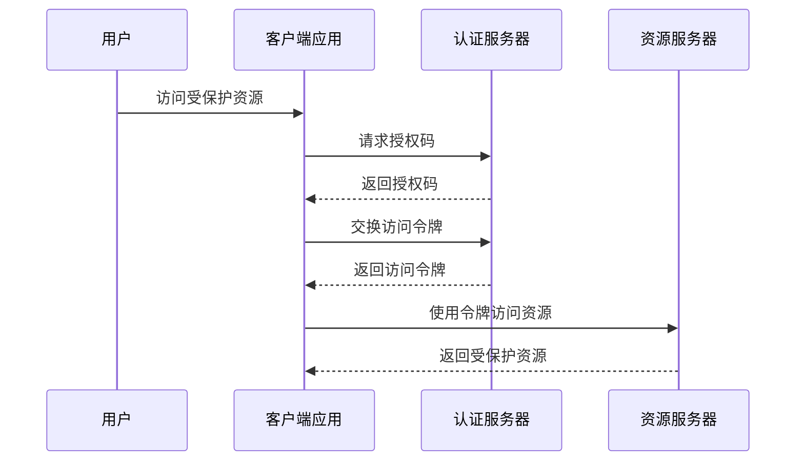

**图表来源**
- [SecurityConfig.java:128-130](file://molly-auth-server-example/src/main/java/cn/molly/example/auth/config/SecurityConfig.java#L128-L130)

### 客户端凭证模式

支持客户端凭证模式，适用于机器到机器的授权场景：

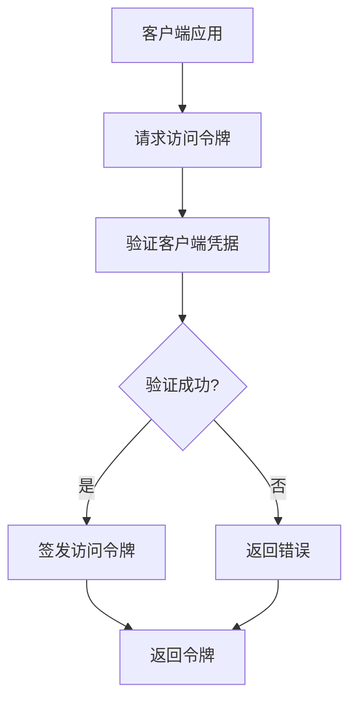

**图表来源**
- [SecurityConfig.java:130-131](file://molly-auth-server-example/src/main/java/cn/molly/example/auth/config/SecurityConfig.java#L130-L131)

### 刷新令牌

支持刷新令牌机制，确保长期访问权限：

**章节来源**
- [SecurityConfig.java:129-141](file://molly-auth-server-example/src/main/java/cn/molly/example/auth/config/SecurityConfig.java#L129-L141)

## 客户端存储与管理

### 内存实现

示例应用使用InMemoryRegisteredClientRepository作为客户端存储的内存实现：

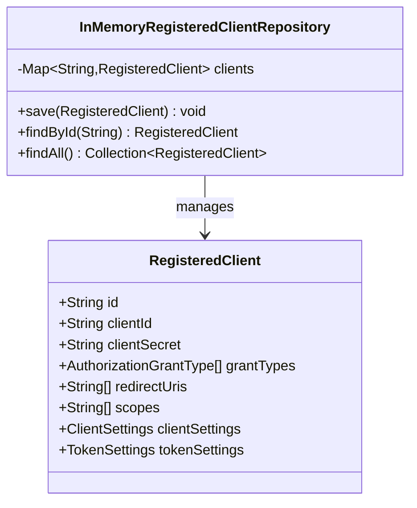

**图表来源**
- [SecurityConfig.java:124-144](file://molly-auth-server-example/src/main/java/cn/molly/example/auth/config/SecurityConfig.java#L124-L144)

### 数据库实现差异

项目明确区分了内存实现和数据库实现的安全差异：

| 特性 | 内存实现 | 数据库实现 |
|------|----------|------------|
| 性能 | 高（无I/O） | 低（需要数据库I/O） |
| 持久性 | 重启丢失 | 持久化存储 |
| 可扩展性 | 有限 | 无限扩展 |
| 安全性 | 低（易被攻击） | 高（加密存储） |
| 维护成本 | 低 | 高 |

**章节来源**
- [SecurityConfig.java:37-38](file://molly-auth-server-example/src/main/java/cn/molly/example/auth/config/SecurityConfig.java#L37-L38)

## 令牌安全与生命周期

### 令牌定制化

项目提供了OAuth2TokenCustomizer来定制访问令牌的内容：

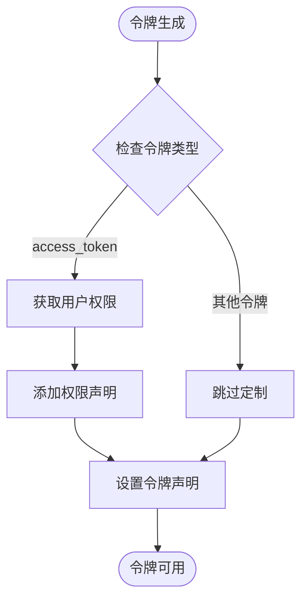

**图表来源**
- [MollyAuthServerAutoConfiguration.java:105-120](file://molly-authorization-server-spring-boot-starter/src/main/java/cn/molly/security/auth/config/MollyAuthServerAutoConfiguration.java#L105-L120)

### 生命周期管理

示例应用展示了令牌生命周期的配置：

**章节来源**
- [SecurityConfig.java:138-141](file://molly-auth-server-example/src/main/java/cn/molly/example/auth/config/SecurityConfig.java#L138-L141)

## 安全配置最佳实践

### 重定向URI验证

项目支持多域名重定向URI配置，但需要确保安全性：

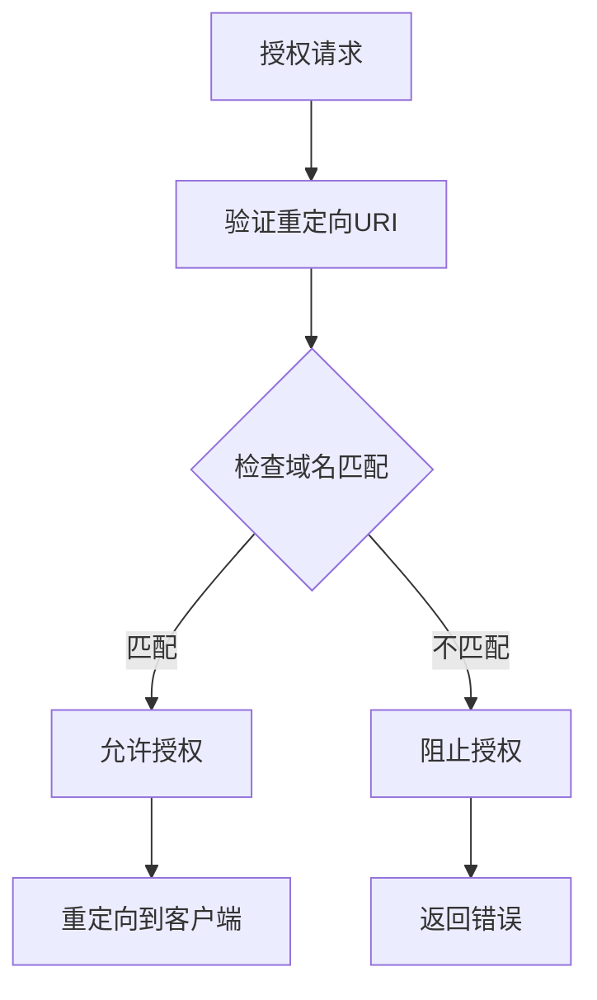

**图表来源**
- [SecurityConfig.java:131-132](file://molly-auth-server-example/src/main/java/cn/molly/example/auth/config/SecurityConfig.java#L131-L132)

### 作用域限制

项目支持细粒度的作用域控制：

**章节来源**
- [SecurityConfig.java:133-136](file://molly-auth-server-example/src/main/java/cn/molly/example/auth/config/SecurityConfig.java#L133-L136)

### 令牌生命周期管理

项目提供了灵活的令牌生命周期配置：

**章节来源**
- [SecurityConfig.java:138-141](file://molly-auth-server-example/src/main/java/cn/molly/example/auth/config/SecurityConfig.java#L138-L141)

## 防滥用与范围控制

### 授权范围扩大防护

项目通过以下机制防止授权范围扩大：

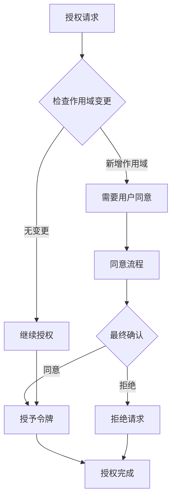

**图表来源**
- [SecurityConfig.java:137](file://molly-auth-server-example/src/main/java/cn/molly/example/auth/config/SecurityConfig.java#L137)

### 客户端滥用防护

项目通过多种机制防止客户端滥用：

**章节来源**
- [SecurityConfig.java:127-130](file://molly-auth-server-example/src/main/java/cn/molly/example/auth/config/SecurityConfig.java#L127-L130)

## 安全审计与监控

### 审计日志

项目支持通过Spring Security的审计功能记录重要事件：

### 监控指标

项目可以集成Spring Boot Actuator来监控认证服务器状态：

**章节来源**
- [MollyAuthServerAutoConfiguration.java:67-73](file://molly-authorization-server-spring-boot-starter/src/main/java/cn/molly/security/auth/config/MollyAuthServerAutoConfiguration.java#L67-L73)

## 客户端集成指南

### 开发环境集成

开发者可以按照以下步骤集成认证服务器：

1. 添加依赖到项目中
2. 配置application.yml文件
3. 提供必要的Bean定义
4. 测试认证流程

### 生产环境部署

生产环境需要特别注意以下安全配置：

1. 使用数据库替代内存存储
2. 配置生产级JWK密钥源
3. 实施严格的访问控制
4. 配置监控和告警

**章节来源**
- [README.md:91-190](file://README.md#L91-L190)

## 故障排除指南

### 常见问题及解决方案

1. **客户端认证失败**: 检查客户端凭据是否正确配置
2. **令牌验证失败**: 确认JWK密钥配置正确
3. **授权码无效**: 验证重定向URI配置
4. **权限不足**: 检查作用域配置和用户权限

### 调试技巧

项目提供了详细的日志输出和错误信息，有助于问题诊断：

**章节来源**
- [MollyAuthServerAutoConfiguration.java:154-156](file://molly-authorization-server-spring-boot-starter/src/main/java/cn/molly/security/auth/config/MollyAuthServerAutoConfiguration.java#L154-L156)

## 结论

Molly项目为开发者提供了一个完整且安全的OAuth 2.1和OIDC 1.0认证服务器解决方案。通过模块化的架构设计和自动配置功能，开发者可以快速搭建安全可靠的认证系统。

项目的主要优势包括：

1. **安全性**: 提供了完整的客户端认证、令牌管理和授权控制机制
2. **灵活性**: 支持多种客户端存储和用户认证实现
3. **可扩展性**: 基于Spring Boot的自动配置模式，易于定制和扩展
4. **合规性**: 完全符合OAuth 2.1和OIDC 1.0标准

开发者在使用本项目时，应该重点关注生产环境的安全配置，特别是客户端存储、密钥管理和访问控制等方面，以确保系统的整体安全性。