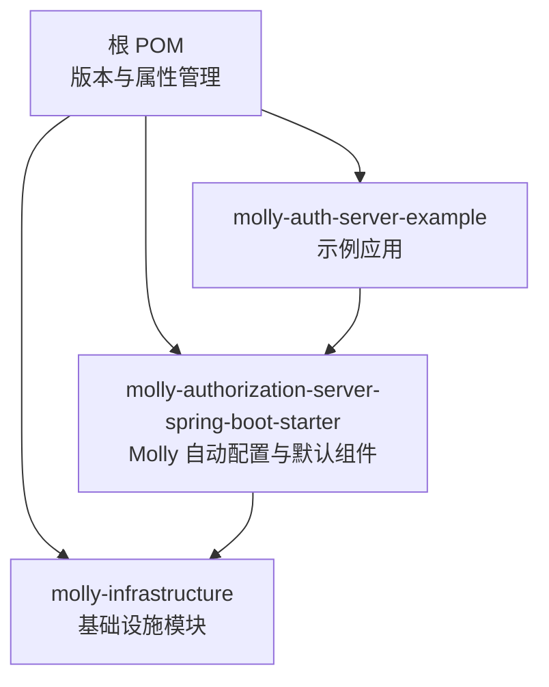
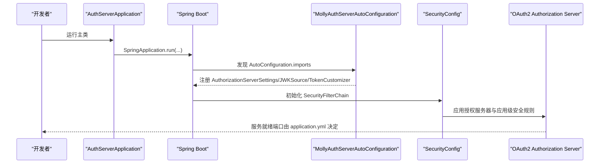
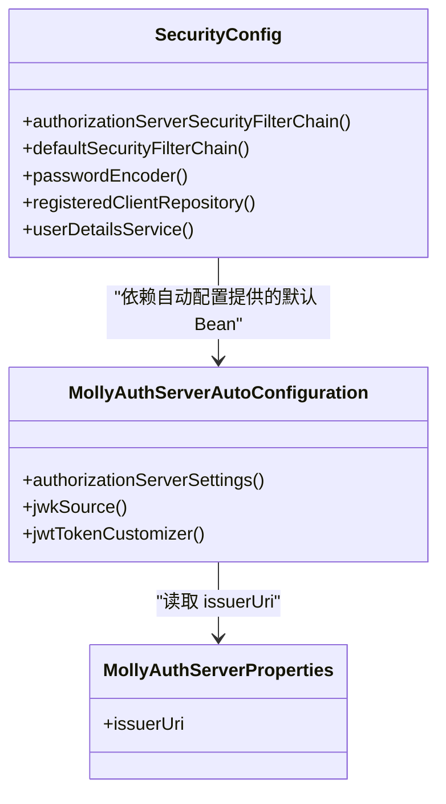
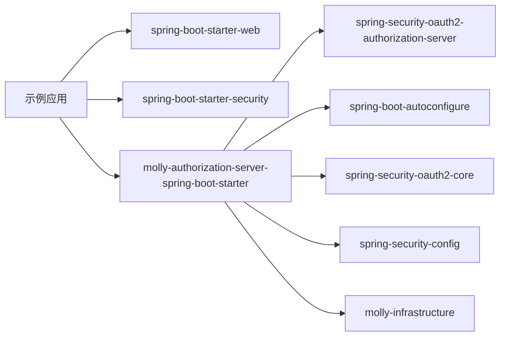

# 快速开始

<cite>
**本文引用的文件列表**
- [README.md](file://README.md)
- [pom.xml](file://pom.xml)
- [molly-auth-server-example/pom.xml](file://molly-auth-server-example/pom.xml)
- [molly-auth-server-example/src/main/resources/application.yml](file://molly-auth-server-example/src/main/resources/application.yml)
- [molly-auth-server-example/src/main/java/cn/molly/example/auth/AuthServerApplication.java](file://molly-auth-server-example/src/main/java/cn/molly/example/auth/AuthServerApplication.java)
- [molly-auth-server-example/src/main/java/cn/molly/example/auth/config/SecurityConfig.java](file://molly-auth-server-example/src/main/java/cn/molly/example/auth/config/SecurityConfig.java)
- [molly-authorization-server-spring-boot-starter/pom.xml](file://molly-authorization-server-spring-boot-starter/pom.xml)
- [molly-authorization-server-spring-boot-starter/src/main/java/cn/molly/security/auth/config/MollyAuthServerAutoConfiguration.java](file://molly-authorization-server-spring-boot-starter/src/main/java/cn/molly/security/auth/config/MollyAuthServerAutoConfiguration.java)
- [molly-authorization-server-spring-boot-starter/src/main/java/cn/molly/security/auth/properties/MollyAuthServerProperties.java](file://molly-authorization-server-spring-boot-starter/src/main/java/cn/molly/security/auth/properties/MollyAuthServerProperties.java)
- [molly-authorization-server-spring-boot-starter/src/main/resources/META-INF/spring/org.springframework.boot.autoconfigure.AutoConfiguration.imports](file://molly-authorization-server-spring-boot-starter/src/main/resources/META-INF/spring/org.springframework.boot.autoconfigure.AutoConfiguration.imports)
</cite>

## 目录
1. [简介](#简介)
2. [项目结构](#项目结构)
3. [核心组件](#核心组件)
4. [架构总览](#架构总览)
5. [详细组件分析](#详细组件分析)
6. [依赖关系分析](#依赖关系分析)
7. [性能与安全考虑](#性能与安全考虑)
8. [故障排查指南](#故障排查指南)
9. [结论](#结论)
10. [附录：最小可行配置清单](#附录最小可行配置清单)

## 简介
本指南面向初学者，帮助你在最短时间内完成 Molly 认证服务器的安装、配置与首次运行。你将学会：
- 如何在 Spring Boot 项目中引入 Molly 的 Spring Boot Starter
- 如何配置 application.yml 以满足 OIDC 规范
- 如何编写一个最小可用的启动类与安全配置
- 如何验证环境是否正确并成功启动认证服务器
- 常见初始化错误与解决方案（如 issuer-uri 配置问题、端口冲突等）

## 项目结构
该项目采用多模块 Maven 结构，核心模块包括：
- molly-authorization-server-spring-boot-starter：Molly 的 Spring Boot 自动配置与默认组件
- molly-auth-server-example：示例应用，演示如何在实际项目中集成 Molly
- molly-infrastructure：基础设施模块（示例中作为 Starter 的依赖）

图表来源
- [pom.xml:11-15](file://pom.xml#L11-L15)
- [molly-auth-server-example/pom.xml:16-29](file://molly-auth-server-example/pom.xml#L16-L29)
- [molly-authorization-server-spring-boot-starter/pom.xml:16-48](file://molly-authorization-server-spring-boot-starter/pom.xml#L16-L48)

章节来源
- [pom.xml:11-15](file://pom.xml#L11-L15)
- [molly-auth-server-example/pom.xml:16-29](file://molly-auth-server-example/pom.xml#L16-L29)
- [molly-authorization-server-spring-boot-starter/pom.xml:16-48](file://molly-authorization-server-spring-boot-starter/pom.xml#L16-L48)

## 核心组件
- MollyAuthServerAutoConfiguration：自动配置类，负责注册授权服务器的核心设置、JWK 密钥源与令牌定制器等默认 Bean；同时暴露 MollyAuthServerProperties 供外部配置。
- MollyAuthServerProperties：承载 molly.security.auth 前缀下的配置项，目前包含 issuerUri。
- 示例应用 SecurityConfig：提供授权服务器与应用级的安全过滤链、内存中的客户端与用户存储、密码编码器等。

章节来源
- [molly-authorization-server-spring-boot-starter/src/main/java/cn/molly/security/auth/config/MollyAuthServerAutoConfiguration.java:28-50](file://molly-authorization-server-spring-boot-starter/src/main/java/cn/molly/security/auth/config/MollyAuthServerAutoConfiguration.java#L28-L50)
- [molly-authorization-server-spring-boot-starter/src/main/java/cn/molly/security/auth/properties/MollyAuthServerProperties.java:14-24](file://molly-authorization-server-spring-boot-starter/src/main/java/cn/molly/security/auth/properties/MollyAuthServerProperties.java#L14-L24)
- [molly-auth-server-example/src/main/java/cn/molly/example/auth/config/SecurityConfig.java:33-44](file://molly-auth-server-example/src/main/java/cn/molly/example/auth/config/SecurityConfig.java#L33-L44)

## 架构总览
下图展示了示例应用启动时的关键交互流程：Spring Boot 启动 -> 自动发现 AutoConfiguration -> 加载 Molly 的默认 Bean -> 应用自定义安全配置 -> 启动授权服务器端点。

图表来源
- [molly-auth-server-example/src/main/java/cn/molly/example/auth/AuthServerApplication.java:15-21](file://molly-auth-server-example/src/main/java/cn/molly/example/auth/AuthServerApplication.java#L15-L21)
- [molly-authorization-server-spring-boot-starter/src/main/resources/META-INF/spring/org.springframework.boot.autoconfigure.AutoConfiguration.imports:1-2](file://molly-authorization-server-spring-boot-starter/src/main/resources/META-INF/spring/org.springframework.boot.autoconfigure.AutoConfiguration.imports#L1-L2)
- [molly-auth-server-example/src/main/java/cn/molly/example/auth/config/SecurityConfig.java:59-100](file://molly-auth-server-example/src/main/java/cn/molly/example/auth/config/SecurityConfig.java#L59-L100)

## 详细组件分析

### 安装与依赖配置（Maven）
- 在你的 Spring Boot 项目中引入 Molly 的 Spring Boot Starter 依赖，即可获得授权服务器的自动配置与默认组件。
- 示例应用的依赖已包含 Web、Security 与 Molly Starter，可直接参考其依赖配置。

章节来源
- [molly-auth-server-example/pom.xml:16-29](file://molly-auth-server-example/pom.xml#L16-L29)
- [molly-authorization-server-spring-boot-starter/pom.xml:16-48](file://molly-authorization-server-spring-boot-starter/pom.xml#L16-L48)

### 基本配置（application.yml）
- server.port：指定服务监听端口（示例使用 9000）。
- molly.security.auth.issuer-uri：必须与当前服务地址一致，这是 OIDC 规范要求，客户端将据此验证令牌来源。

章节来源
- [molly-auth-server-example/src/main/resources/application.yml:1-12](file://molly-auth-server-example/src/main/resources/application.yml#L1-L12)

### 启动类设置
- 使用标准的 Spring Boot 启动类注解，确保自动配置生效。

章节来源
- [molly-auth-server-example/src/main/java/cn/molly/example/auth/AuthServerApplication.java:15-21](file://molly-auth-server-example/src/main/java/cn/molly/example/auth/AuthServerApplication.java#L15-L21)

### 安全配置（最小可用）
示例应用提供了最小可用的安全配置，包含：
- 授权服务器专用过滤链：启用 OAuth2/OIDC 默认安全策略，并配置 OIDC 支持与登录入口。
- 应用级过滤链：表单登录与请求认证。
- 密码编码器：BCrypt。
- 客户端存储：内存实现（生产环境请使用数据库实现）。
- 用户详情服务：内存实现（生产环境请使用数据库实现）。

图表来源
- [molly-auth-server-example/src/main/java/cn/molly/example/auth/config/SecurityConfig.java:59-163](file://molly-auth-server-example/src/main/java/cn/molly/example/auth/config/SecurityConfig.java#L59-L163)
- [molly-authorization-server-spring-boot-starter/src/main/java/cn/molly/security/auth/config/MollyAuthServerAutoConfiguration.java:67-120](file://molly-authorization-server-spring-boot-starter/src/main/java/cn/molly/security/auth/config/MollyAuthServerAutoConfiguration.java#L67-L120)
- [molly-authorization-server-spring-boot-starter/src/main/java/cn/molly/security/auth/properties/MollyAuthServerProperties.java:14-24](file://molly-authorization-server-spring-boot-starter/src/main/java/cn/molly/security/auth/properties/MollyAuthServerProperties.java#L14-L24)

章节来源
- [molly-auth-server-example/src/main/java/cn/molly/example/auth/config/SecurityConfig.java:33-163](file://molly-auth-server-example/src/main/java/cn/molly/example/auth/config/SecurityConfig.java#L33-L163)

### Hello World 级别验证
- 启动应用后，访问授权服务器的 OIDC 元数据端点（通常由授权服务器自动暴露），确认返回内容包含正确的 issuer 地址。
- 使用浏览器访问授权端点，若出现登录页且能成功登录，说明认证服务器已正常工作。

章节来源
- [molly-auth-server-example/src/main/resources/application.yml:1-12](file://molly-auth-server-example/src/main/resources/application.yml#L1-L12)
- [molly-auth-server-example/src/main/java/cn/molly/example/auth/config/SecurityConfig.java:59-100](file://molly-auth-server-example/src/main/java/cn/molly/example/auth/config/SecurityConfig.java#L59-L100)

## 依赖关系分析
- 示例应用依赖 Spring Boot Web、Security 与 Molly Starter。
- Molly Starter 依赖 Spring Authorization Server、Spring AutoConfigure、Spring OAuth2 Core、Spring Config，以及内部基础设施模块。

图表来源
- [molly-auth-server-example/pom.xml:16-29](file://molly-auth-server-example/pom.xml#L16-L29)
- [molly-authorization-server-spring-boot-starter/pom.xml:16-48](file://molly-authorization-server-spring-boot-starter/pom.xml#L16-L48)

章节来源
- [molly-auth-server-example/pom.xml:16-29](file://molly-auth-server-example/pom.xml#L16-L29)
- [molly-authorization-server-spring-boot-starter/pom.xml:16-48](file://molly-authorization-server-spring-boot-starter/pom.xml#L16-L48)

## 性能与安全考虑
- 开发阶段使用内存存储的客户端与用户信息便于快速验证，生产环境务必迁移到数据库实现。
- 默认的 RSA 密钥在内存中生成，适合开发测试；生产环境请提供安全的密钥源（如密钥库、HSM 或云密钥管理服务）。
- 合理设置令牌有效期与刷新令牌有效期，避免过长导致风险过高，过短影响用户体验。

[本节为通用建议，不直接分析具体文件]

## 故障排查指南
- 启动失败或端点不可用
  - 检查 server.port 是否被占用，修改为未使用的端口。
  - 确认 application.yml 中的 molly.security.auth.issuer-uri 与实际访问地址一致。
- 无法访问授权端点或登录页
  - 确认已正确配置授权服务器与应用级安全过滤链。
  - 检查是否缺少必要的 Bean（如 RegisteredClientRepository、UserDetailsService）。
- 令牌校验失败
  - 确认 issuer-uri 与客户端配置一致。
  - 生产环境请提供稳定的 JWK 源，避免密钥轮换导致的校验失败。

章节来源
- [molly-auth-server-example/src/main/resources/application.yml:1-12](file://molly-auth-server-example/src/main/resources/application.yml#L1-L12)
- [molly-auth-server-example/src/main/java/cn/molly/example/auth/config/SecurityConfig.java:59-163](file://molly-auth-server-example/src/main/java/cn/molly/example/auth/config/SecurityConfig.java#L59-L163)
- [molly-authorization-server-spring-boot-starter/src/main/java/cn/molly/security/auth/config/MollyAuthServerAutoConfiguration.java:67-120](file://molly-authorization-server-spring-boot-starter/src/main/java/cn/molly/security/auth/config/MollyAuthServerAutoConfiguration.java#L67-L120)

## 结论
通过本指南，你已经完成了 Molly 认证服务器的最小化集成与验证。建议在本地验证无误后，逐步替换内存实现为持久化实现，并完善密钥与令牌策略，最终部署到生产环境。

[本节为总结性内容，不直接分析具体文件]

## 附录：最小可行配置清单
- Maven 依赖
  - Spring Boot Web
  - Spring Boot Security
  - Molly Authorization Server Spring Boot Starter
- application.yml
  - server.port：服务端口
  - molly.security.auth.issuer-uri：与服务地址一致的签发者 URI
- 启动类
  - 标准 Spring Boot 启动类注解
- 安全配置
  - 授权服务器专用过滤链
  - 应用级过滤链（表单登录）
  - 密码编码器 Bean
  - 内存客户端存储 Bean
  - 内存用户详情服务 Bean

章节来源
- [molly-auth-server-example/pom.xml:16-29](file://molly-auth-server-example/pom.xml#L16-L29)
- [molly-auth-server-example/src/main/resources/application.yml:1-12](file://molly-auth-server-example/src/main/resources/application.yml#L1-L12)
- [molly-auth-server-example/src/main/java/cn/molly/example/auth/AuthServerApplication.java:15-21](file://molly-auth-server-example/src/main/java/cn/molly/example/auth/AuthServerApplication.java#L15-L21)
- [molly-auth-server-example/src/main/java/cn/molly/example/auth/config/SecurityConfig.java:59-163](file://molly-auth-server-example/src/main/java/cn/molly/example/auth/config/SecurityConfig.java#L59-L163)