# 扩展点和自定义

<cite>
**本文档引用的文件**
- [MollyUserAccountService.java](file://molly-authorization-server-spring-boot-starter/src/main/java/cn/molly/security/auth/service/MollyUserAccountService.java)
- [MollyAuthServerAutoConfiguration.java](file://molly-authorization-server-spring-boot-starter/src/main/java/cn/molly/security/auth/config/MollyAuthServerAutoConfiguration.java)
- [MollyAuthServerProperties.java](file://molly-authorization-server-spring-boot-starter/src/main/java/cn/molly/security/auth/properties/MollyAuthServerProperties.java)
- [org.springframework.boot.autoconfigure.AutoConfiguration.imports](file://molly-authorization-server-spring-boot-starter/src/main/resources/META-INF/spring/org.springframework.boot.autoconfigure.AutoConfiguration.imports)
- [SecurityConfig.java](file://molly-auth-server-example/src/main/java/cn/molly/example/auth/config/SecurityConfig.java)
- [AuthServerApplication.java](file://molly-auth-server-example/src/main/java/cn/molly/example/auth/AuthServerApplication.java)
- [pom.xml](file://molly-auth-server-example/pom.xml)
</cite>

## 目录
1. [简介](#简介)
2. [项目结构](#项目结构)
3. [核心组件](#核心组件)
4. [架构概览](#架构概览)
5. [详细组件分析](#详细组件分析)
6. [依赖分析](#依赖分析)
7. [性能考虑](#性能考虑)
8. [故障排除指南](#故障排除指南)
9. [结论](#结论)
10. [附录](#附录)

## 简介

Molly 框架是一个基于 Spring Boot 的分布式 Web 系统脚手架项目，专注于提供认证授权服务器的完整解决方案。本文档深入解析 Molly 框架的扩展机制，特别是 SPI 接口系统的设计理念和实现方式，重点说明 MollyUserAccountService 接口的作用和扩展点。

框架采用 Spring Boot 自动配置机制，通过条件注解和 Bean 覆盖策略，为开发者提供了灵活的扩展能力。开发者可以轻松替换默认实现，集成自定义功能，满足不同场景下的需求。

## 项目结构

Molly 项目采用多模块架构设计，主要包含以下模块：

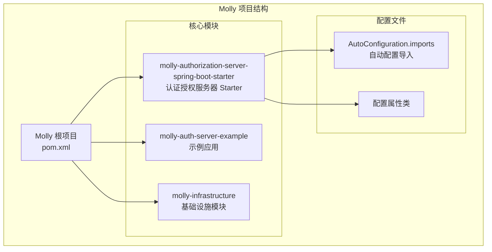

**图表来源**
- [pom.xml:11-15](file://pom.xml#L11-L15)
- [org.springframework.boot.autoconfigure.AutoConfiguration.imports:1](file://molly-authorization-server-spring-boot-starter/src/main/resources/META-INF/spring/org.springframework.boot.autoconfigure.AutoConfiguration.imports#L1)

**章节来源**
- [pom.xml:1-81](file://pom.xml#L1-L81)
- [README.md:1-3](file://README.md#L1-L3)

## 核心组件

### MollyUserAccountService 接口

MollyUserAccountService 是框架的核心扩展接口，继承自 Spring Security 的 UserDetailsService：

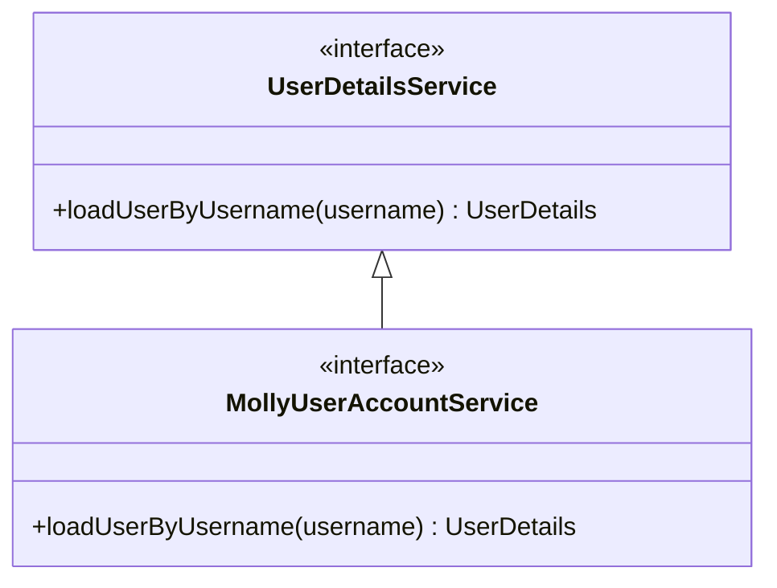

**图表来源**
- [MollyUserAccountService.java:20](file://molly-authorization-server-spring-boot-starter/src/main/java/cn/molly/security/auth/service/MollyUserAccountService.java#L20)

该接口的设计理念：
- **统一抽象层**：为 Molly 安全框架提供统一的用户账户服务接口
- **扩展性设计**：支持未来多种认证方式（用户名、手机号、社交媒体等）
- **数据源无关**：实现类可以从数据库、LDAP 等不同数据源加载用户信息

**章节来源**
- [MollyUserAccountService.java:1-22](file://molly-authorization-server-spring-boot-starter/src/main/java/cn/molly/security/auth/service/MollyUserAccountService.java#L1-L22)

### 自动配置核心类

MollyAuthServerAutoConfiguration 是框架的核心自动配置类，负责提供默认的 Bean 实现：

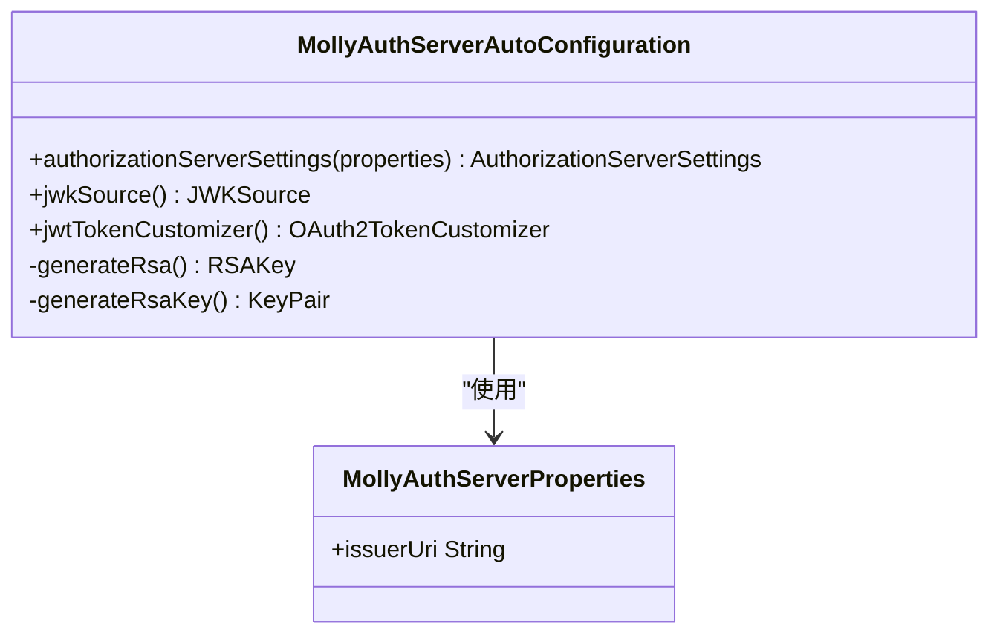

**图表来源**
- [MollyAuthServerAutoConfiguration.java:54](file://molly-authorization-server-spring-boot-starter/src/main/java/cn/molly/security/auth/config/MollyAuthServerAutoConfiguration.java#L54)
- [MollyAuthServerProperties.java:16](file://molly-authorization-server-spring-boot-starter/src/main/java/cn/molly/security/auth/properties/MollyAuthServerProperties.java#L16)

**章节来源**
- [MollyAuthServerAutoConfiguration.java:1-161](file://molly-authorization-server-spring-boot-starter/src/main/java/cn/molly/security/auth/config/MollyAuthServerAutoConfiguration.java#L1-L161)
- [MollyAuthServerProperties.java:1-25](file://molly-authorization-server-spring-boot-starter/src/main/java/cn/molly/security/auth/properties/MollyAuthServerProperties.java#L1-L25)

## 架构概览

Molly 框架采用分层架构设计，通过 Spring Boot 自动配置机制实现松耦合的扩展架构：

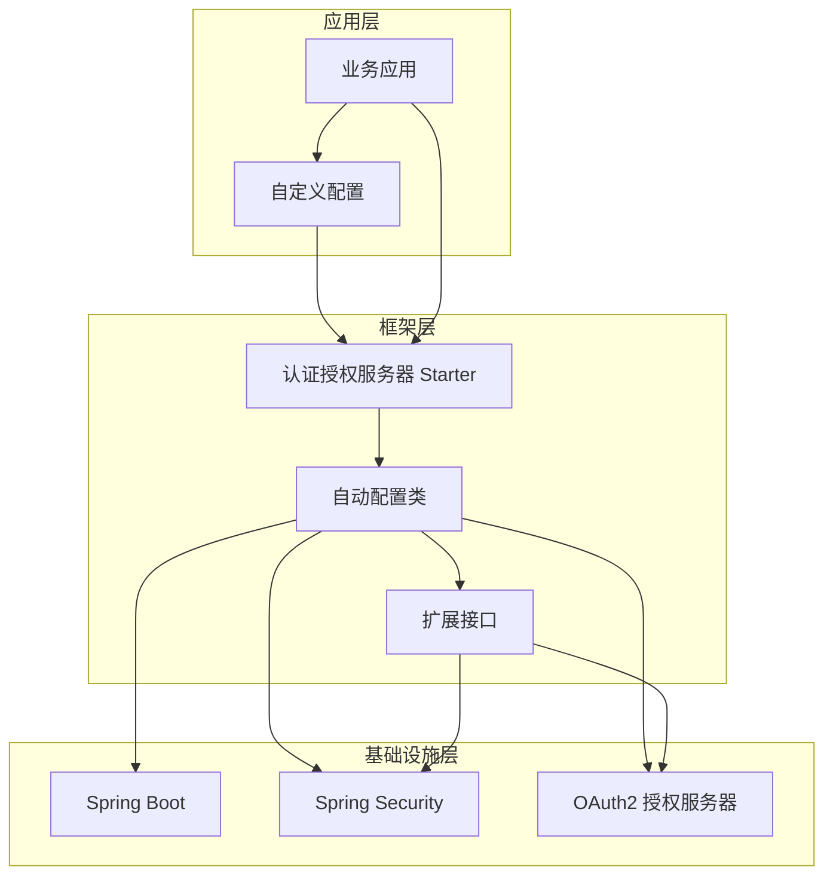

**图表来源**
- [MollyAuthServerAutoConfiguration.java:28-50](file://molly-authorization-server-spring-boot-starter/src/main/java/cn/molly/security/auth/config/MollyAuthServerAutoConfiguration.java#L28-L50)
- [org.springframework.boot.autoconfigure.AutoConfiguration.imports:1](file://molly-authorization-server-spring-boot-starter/src/main/resources/META-INF/spring/org.springframework.boot.autoconfigure.AutoConfiguration.imports#L1)

### Bean 覆盖机制

框架通过 `@ConditionalOnMissingBean` 注解实现智能的 Bean 覆盖机制：

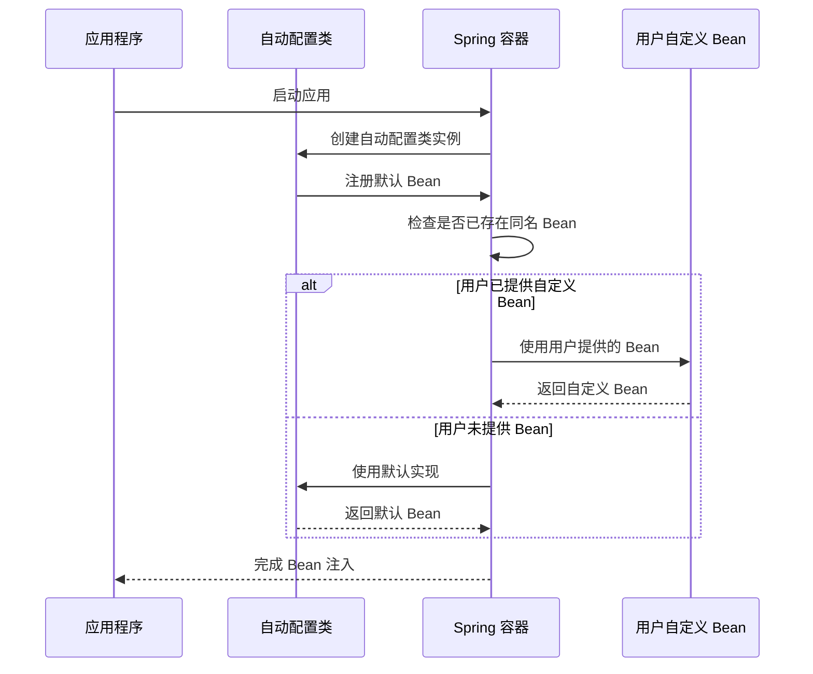

**图表来源**
- [MollyAuthServerAutoConfiguration.java:67-73](file://molly-authorization-server-spring-boot-starter/src/main/java/cn/molly/security/auth/config/MollyAuthServerAutoConfiguration.java#L67-L73)
- [MollyAuthServerAutoConfiguration.java:86-92](file://molly-authorization-server-spring-boot-starter/src/main/java/cn/molly/security/auth/config/MollyAuthServerAutoConfiguration.java#L86-L92)
- [MollyAuthServerAutoConfiguration.java:105-120](file://molly-authorization-server-spring-boot-starter/src/main/java/cn/molly/security/auth/config/MollyAuthServerAutoConfiguration.java#L105-L120)

**章节来源**
- [MollyAuthServerAutoConfiguration.java:67-120](file://molly-authorization-server-spring-boot-starter/src/main/java/cn/molly/security/auth/config/MollyAuthServerAutoConfiguration.java#L67-L120)

## 详细组件分析

### SPI 接口系统设计

Molly 框架的 SPI（Service Provider Interface）接口系统采用简洁而强大的设计理念：

#### 接口层次设计

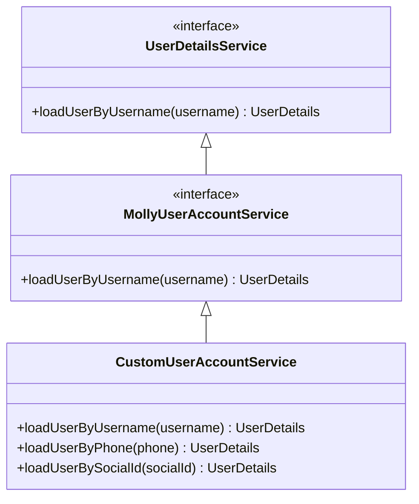

**图表来源**
- [MollyUserAccountService.java:20](file://molly-authorization-server-spring-boot-starter/src/main/java/cn/molly/security/auth/service/MollyUserAccountService.java#L20)

#### 设计原则

1. **最小接口原则**：仅定义必要的方法，避免过度设计
2. **向后兼容性**：继承现有 Spring Security 接口，确保兼容性
3. **扩展性**：为未来认证方式预留扩展点
4. **数据源无关**：支持多种用户数据存储方式

**章节来源**
- [MollyUserAccountService.java:5-19](file://molly-authorization-server-spring-boot-starter/src/main/java/cn/molly/security/auth/service/MollyUserAccountService.java#L5-L19)

### 自动配置覆盖机制

#### 条件注解详解

框架使用多种条件注解来控制 Bean 的创建和覆盖：

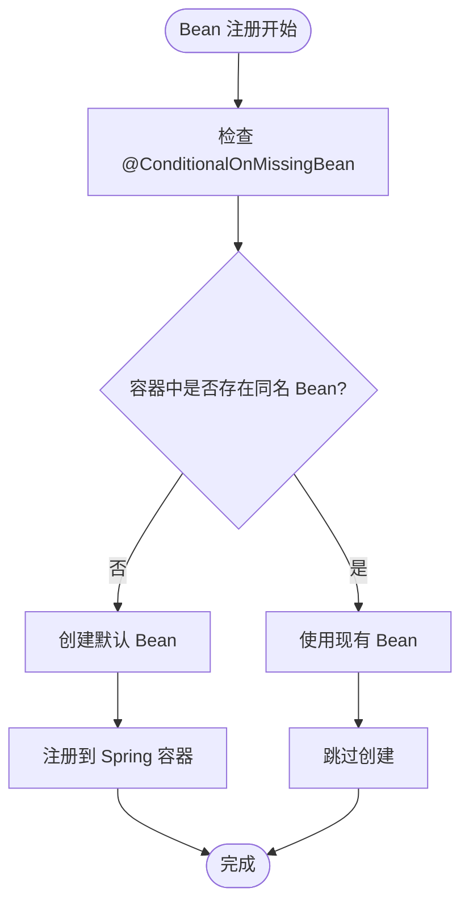

**图表来源**
- [MollyAuthServerAutoConfiguration.java:67-73](file://molly-authorization-server-spring-boot-starter/src/main/java/cn/molly/security/auth/config/MollyAuthServerAutoConfiguration.java#L67-L73)

#### Bean 覆盖策略

| Bean 类型 | 默认实现 | 覆盖方式 | 最佳实践 |
|-----------|----------|----------|----------|
| AuthorizationServerSettings | 从配置属性读取 issuerUri | 提供同名 Bean | 确保配置正确 |
| JWKSource | 内存中生成 RSA 密钥对 | 提供安全的密钥源 | 生产环境必须覆盖 |
| OAuth2TokenCustomizer | 添加 authorities 声明 | 提供自定义令牌定制 | 根据业务需求定制 |

**章节来源**
- [MollyAuthServerAutoConfiguration.java:67-120](file://molly-authorization-server-spring-boot-starter/src/main/java/cn/molly/security/auth/config/MollyAuthServerAutoConfiguration.java#L67-L120)

### 自定义用户服务实现

#### 实现要求和最佳实践

要实现自定义的用户服务，需要遵循以下要求：

1. **接口实现**：实现 `MollyUserAccountService` 接口
2. **线程安全**：确保实现类是线程安全的
3. **性能优化**：合理使用缓存机制
4. **错误处理**：提供完善的异常处理机制
5. **依赖注入**：正确使用 Spring 依赖注入

#### 生命周期管理

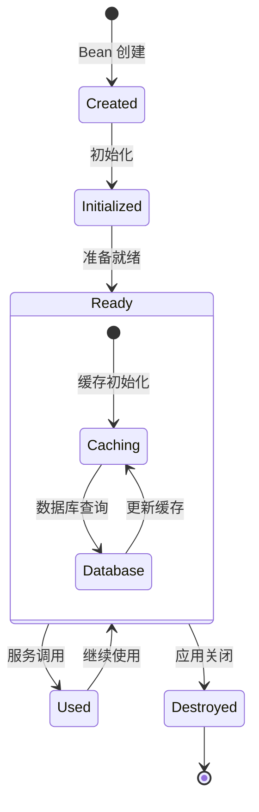

**图表来源**
- [MollyUserAccountService.java:13-14](file://molly-authorization-server-spring-boot-starter/src/main/java/cn/molly/security/auth/service/MollyUserAccountService.java#L13-L14)

**章节来源**
- [MollyUserAccountService.java:13-14](file://molly-authorization-server-spring-boot-starter/src/main/java/cn/molly/security/auth/service/MollyUserAccountService.java#L13-L14)

## 依赖分析

### Maven 依赖关系

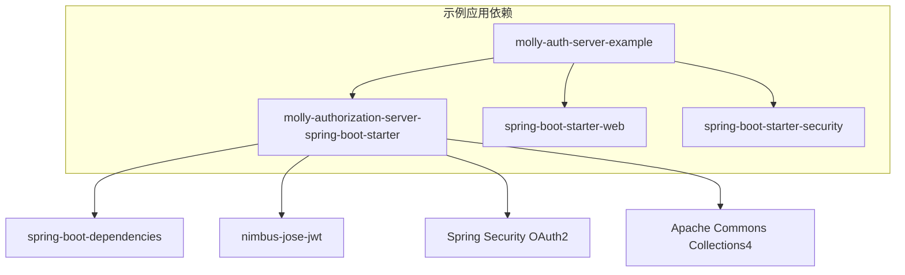

**图表来源**
- [pom.xml:16-30](file://molly-auth-server-example/pom.xml#L16-L30)

### Spring Boot 自动配置导入

框架通过 `META-INF/spring/org.springframework.boot.autoconfigure.AutoConfiguration.imports` 文件声明自动配置类：

**章节来源**
- [org.springframework.boot.autoconfigure.AutoConfiguration.imports:1](file://molly-authorization-server-spring-boot-starter/src/main/resources/META-INF/spring/org.springframework.boot.autoconfigure.AutoConfiguration.imports#L1)

## 性能考虑

### 缓存策略

为了提高用户服务的性能，建议实现以下缓存策略：

1. **用户信息缓存**：缓存用户基本信息，减少数据库查询
2. **权限信息缓存**：缓存用户权限信息，避免重复计算
3. **TTL 管理**：设置合理的缓存过期时间
4. **缓存失效**：实现用户信息更新时的缓存失效机制

### 线程安全

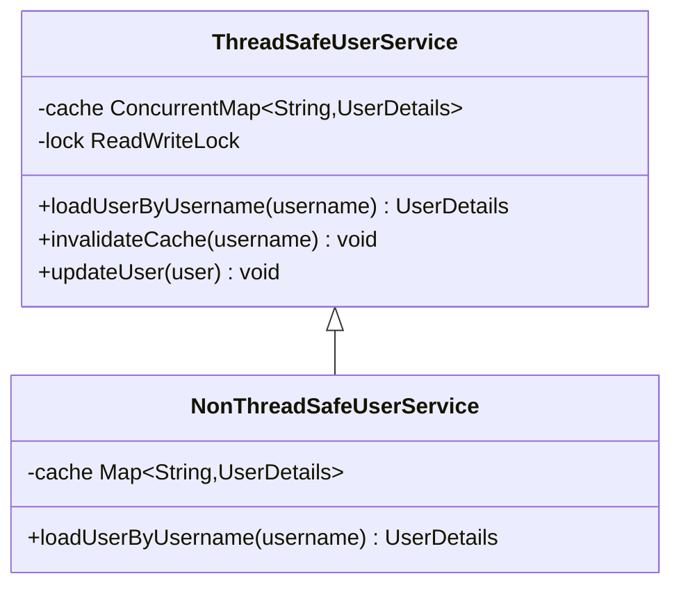

**图表来源**
- [MollyUserAccountService.java:20](file://molly-authorization-server-spring-boot-starter/src/main/java/cn/molly/security/auth/service/MollyUserAccountService.java#L20)

### 异步处理

对于高并发场景，可以考虑异步处理用户查询请求：

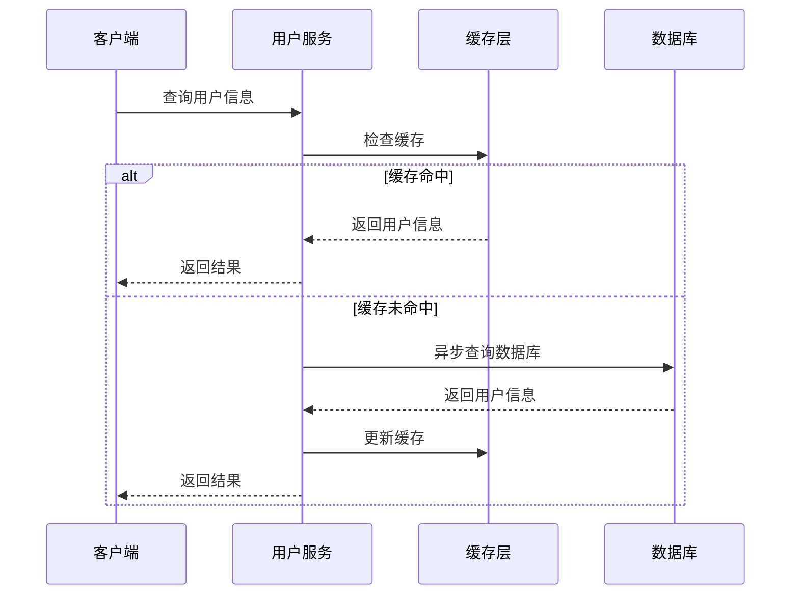

## 故障排除指南

### 常见问题及解决方案

#### 1. 用户服务 Bean 未被识别

**问题描述**：自定义的用户服务实现没有生效

**解决方案**：
- 确保实现类上有 `@Component` 或 `@Service` 注解
- 确保实现类正确实现了 `MollyUserAccountService` 接口
- 检查包扫描路径是否正确

#### 2. Bean 覆盖不生效

**问题描述**：提供的自定义 Bean 没有覆盖默认实现

**解决方案**：
- 确保自定义 Bean 的名称与默认 Bean 相同
- 检查 Bean 的作用域和生命周期
- 确认 Bean 的优先级设置

#### 3. 密钥安全问题

**问题描述**：生产环境使用默认密钥导致安全风险

**解决方案**：
- 提供自定义的 `JWKSource` Bean
- 使用安全的密钥存储方案（密钥库、硬件安全模块等）
- 定期轮换密钥

**章节来源**
- [MollyAuthServerAutoConfiguration.java:81-82](file://molly-authorization-server-spring-boot-starter/src/main/java/cn/molly/security/auth/config/MollyAuthServerAutoConfiguration.java#L81-L82)

## 结论

Molly 框架通过精心设计的 SPI 接口系统和智能的自动配置机制，为开发者提供了强大而灵活的扩展能力。MollyUserAccountService 接口作为核心扩展点，不仅保持了与 Spring Security 的兼容性，还为未来的认证方式扩展预留了空间。

框架的关键优势包括：

1. **简洁的接口设计**：最小化的接口定义，易于理解和实现
2. **智能的 Bean 覆盖**：通过条件注解实现无缝的自定义覆盖
3. **安全的默认实现**：提供安全的默认配置，同时允许完全自定义
4. **良好的性能特性**：支持缓存和异步处理等性能优化手段

对于框架扩展开发者，建议遵循本文档的最佳实践，在保证线程安全和性能的前提下，充分利用框架提供的扩展机制来满足特定的业务需求。

## 附录

### 插件化开发指南

#### 开发步骤

1. **创建扩展模块**：创建独立的 Maven 模块
2. **实现扩展接口**：实现相应的 SPI 接口
3. **配置依赖**：添加必要的依赖项
4. **测试验证**：编写单元测试和集成测试
5. **文档编写**：提供详细的使用文档

#### 最佳实践清单

- ✅ 遵循接口设计原则
- ✅ 实现线程安全
- ✅ 提供完善的错误处理
- ✅ 使用依赖注入
- ✅ 实现缓存机制
- ✅ 编写测试用例
- ✅ 提供配置选项
- ✅ 文档化扩展点

### 配置示例

#### 自定义用户服务配置

```java
@Configuration
public class CustomUserConfig {
    
    @Bean
    public MollyUserAccountService customUserAccountService() {
        return new CustomUserAccountServiceImpl();
    }
}
```

#### 自定义密钥配置

```java
@Bean
public JWKSource<SecurityContext> customJwkSource() {
    // 实现安全的密钥加载逻辑
    return new CustomJwkSource();
}
```