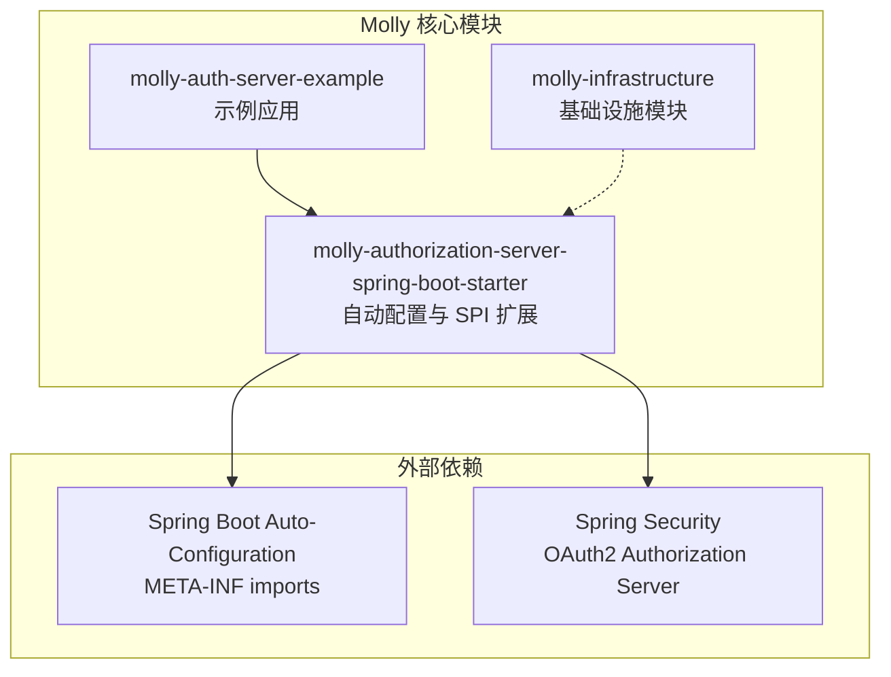
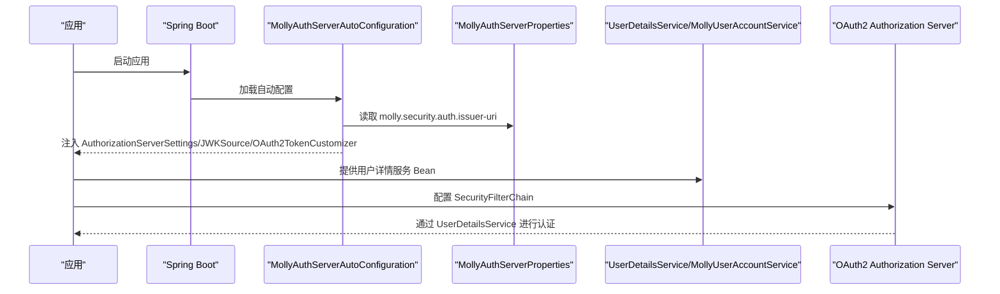
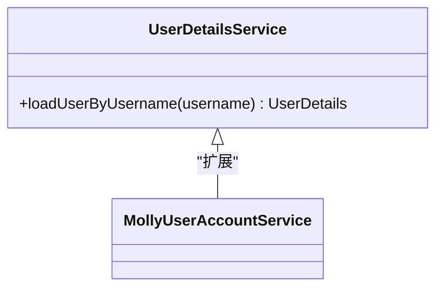
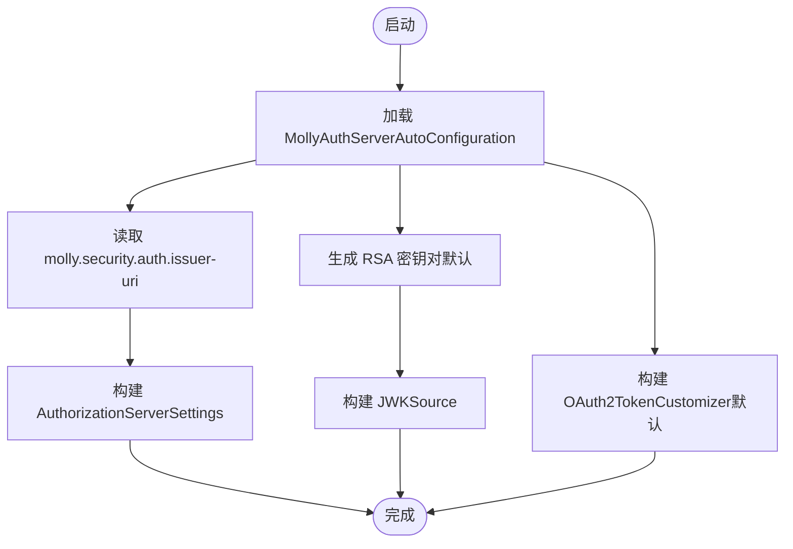
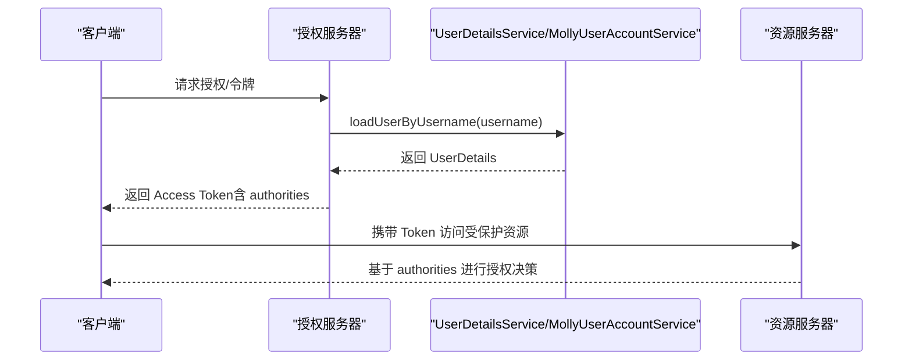
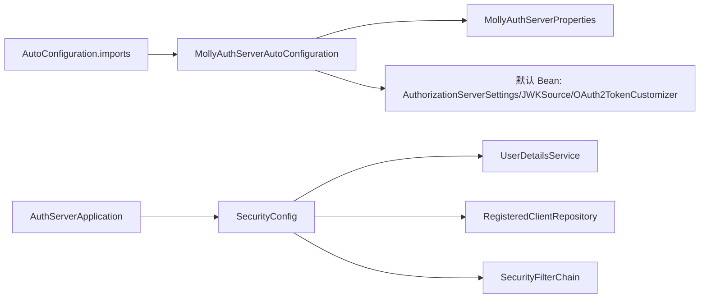

# SPI 扩展接口

<cite>
**本文引用的文件列表**
- [MollyUserAccountService.java](file://molly-authorization-server-spring-boot-starter/src/main/java/cn/molly/security/auth/service/MollyUserAccountService.java)
- [MollyAuthServerAutoConfiguration.java](file://molly-authorization-server-spring-boot-starter/src/main/java/cn/molly/security/auth/config/MollyAuthServerAutoConfiguration.java)
- [MollyAuthServerProperties.java](file://molly-authorization-server-spring-boot-starter/src/main/java/cn/molly/security/auth/properties/MollyAuthServerProperties.java)
- [AutoConfiguration.imports](file://molly-authorization-server-spring-boot-starter/src/main/resources/META-INF/spring/org.springframework.boot.autoconfigure.AutoConfiguration.imports)
- [SecurityConfig.java](file://molly-auth-server-example/src/main/java/cn/molly/example/auth/config/SecurityConfig.java)
- [AuthServerApplication.java](file://molly-auth-server-example/src/main/java/cn/molly/example/auth/AuthServerApplication.java)
- [application.yml](file://molly-auth-server-example/src/main/resources/application.yml)
- [pom.xml](file://pom.xml)
- [README.md](file://README.md)
</cite>

## 目录
1. [简介](#简介)
2. [项目结构](#项目结构)
3. [核心组件](#核心组件)
4. [架构总览](#架构总览)
5. [详细组件分析](#详细组件分析)
6. [依赖关系分析](#依赖关系分析)
7. [性能考量](#性能考量)
8. [故障排查指南](#故障排查指南)
9. [结论](#结论)
10. [附录](#附录)

## 简介
本技术文档围绕 Molly 框架的 SPI 扩展接口体系，重点解析 MollyUserAccountService 接口的设计理念、扩展机制与实现要求。文档将阐述该接口与 Spring Security 的集成方式，以及与 UserDetailsService 的关系；给出在不同场景下的实现思路与最佳实践；并总结扩展点的设计原则、接口版本兼容性与升级策略，帮助框架扩展开发者高效、安全地完成用户账户服务的定制化开发。

## 项目结构
Molly 采用多模块组织，其中与 SPI 扩展接口直接相关的关键模块如下：
- molly-authorization-server-spring-boot-starter：提供 OAuth2 授权服务器的自动配置与 SPI 扩展点，包含 MollyUserAccountService 接口、自动配置类与配置属性。
- molly-auth-server-example：示例应用，演示如何在实际项目中提供必要的 Bean（如 UserDetailsService、SecurityFilterChain）并接入 Molly 的自动配置。
- molly-infrastructure：基础工具与通用模型模块（当前未包含 SPI 接口实现）。

图表来源
- [AutoConfiguration.imports:1-2](file://molly-authorization-server-spring-boot-starter/src/main/resources/META-INF/spring/org.springframework.boot.autoconfigure.AutoConfiguration.imports#L1-L2)
- [MollyAuthServerAutoConfiguration.java:51-54](file://molly-authorization-server-spring-boot-starter/src/main/java/cn/molly/security/auth/config/MollyAuthServerAutoConfiguration.java#L51-L54)
- [SecurityConfig.java:42-44](file://molly-auth-server-example/src/main/java/cn/molly/example/auth/config/SecurityConfig.java#L42-L44)

章节来源
- [README.md:15-33](file://README.md#L15-L33)
- [pom.xml:11-15](file://pom.xml#L11-L15)

## 核心组件
- MollyUserAccountService：面向 Molly 安全框架的用户账户 SPI 扩展接口，扩展自 Spring Security 的 UserDetailsService，作为统一的用户数据加载入口，为未来支持手机号登录、社交登录等多认证方式预留。
- MollyAuthServerAutoConfiguration：Spring Boot 自动配置类，提供授权服务器核心设置、JWK 密钥源与令牌定制化等默认 Bean，并通过条件注解允许用户覆盖。
- MollyAuthServerProperties：配置属性类，前缀为 molly.security.auth，当前支持 issuer-uri。
- 示例应用 SecurityConfig：演示如何提供 UserDetailsService、RegisteredClientRepository、SecurityFilterChain 等必要 Bean。

章节来源
- [MollyUserAccountService.java:20-21](file://molly-authorization-server-spring-boot-starter/src/main/java/cn/molly/security/auth/service/MollyUserAccountService.java#L20-L21)
- [MollyAuthServerAutoConfiguration.java:51-54](file://molly-authorization-server-spring-boot-starter/src/main/java/cn/molly/security/auth/config/MollyAuthServerAutoConfiguration.java#L51-L54)
- [MollyAuthServerProperties.java:14-24](file://molly-authorization-server-spring-boot-starter/src/main/java/cn/molly/security/auth/properties/MollyAuthServerProperties.java#L14-L24)
- [SecurityConfig.java:42-44](file://molly-auth-server-example/src/main/java/cn/molly/example/auth/config/SecurityConfig.java#L42-L44)

## 架构总览
Molly 的 SPI 扩展接口体系以自动配置为核心，通过条件 Bean 注入实现“零侵入定制”。其关键交互如下：
- 应用引入 Molly Starter 后，Spring Boot 会自动注册 MollyAuthServerAutoConfiguration。
- 应用需提供 UserDetailsService（或实现 MollyUserAccountService）与 SecurityFilterChain 等 Bean。
- 自动配置提供 AuthorizationServerSettings、JWKSource、OAuth2TokenCustomizer 等默认 Bean，便于快速启动。
- 示例应用展示了如何在实际项目中组合这些组件。

图表来源
- [AutoConfiguration.imports:1-2](file://molly-authorization-server-spring-boot-starter/src/main/resources/META-INF/spring/org.springframework.boot.autoconfigure.AutoConfiguration.imports#L1-L2)
- [MollyAuthServerAutoConfiguration.java:51-73](file://molly-authorization-server-spring-boot-starter/src/main/java/cn/molly/security/auth/config/MollyAuthServerAutoConfiguration.java#L51-L73)
- [MollyAuthServerProperties.java:14-24](file://molly-authorization-server-spring-boot-starter/src/main/java/cn/molly/security/auth/properties/MollyAuthServerProperties.java#L14-L24)
- [SecurityConfig.java:59-77](file://molly-auth-server-example/src/main/java/cn/molly/example/auth/config/SecurityConfig.java#L59-L77)

## 详细组件分析

### MollyUserAccountService 接口设计与扩展机制
- 继承关系：MollyUserAccountService 扩展自 Spring Security 的 UserDetailsService，保持与 Spring Security 生态的无缝对接。
- 设计目标：作为 Molly 安全框架的统一用户账户服务入口，支持未来扩展多种认证方式（如手机号、社交账号等）。
- 实现要求：
  - 实现类需负责从底层数据源（数据库、LDAP 等）加载用户详情。
  - 返回的用户详情对象需包含用户名、密码、角色/权限等信息，以便 Spring Security 完成认证与授权。
  - 若需要与 Molly 的自动配置协同工作，建议在应用中提供该 Bean，以便自动配置按需生效。

图表来源
- [MollyUserAccountService.java:20-21](file://molly-authorization-server-spring-boot-starter/src/main/java/cn/molly/security/auth/service/MollyUserAccountService.java#L20-L21)

章节来源
- [MollyUserAccountService.java:5-21](file://molly-authorization-server-spring-boot-starter/src/main/java/cn/molly/security/auth/service/MollyUserAccountService.java#L5-L21)

### 自动配置与 SPI 扩展点
- AuthorizationServerSettings：从配置属性读取 issuer-uri，作为 OIDC 必填项，用于标识签发者地址。
- JWKSource：默认在内存中生成 RSA 密钥对，便于开发阶段快速启动；生产环境建议覆盖为从密钥库、数据库或 HSM 加载密钥。
- OAuth2TokenCustomizer：默认将用户权限注入到 Access Token 的 authorities 声明中，便于资源服务器进行细粒度权限控制；可被用户提供自定义实现覆盖。
- 条件注解：所有默认 Bean 均使用 @ConditionalOnMissingBean，确保用户可按需覆盖。

图表来源
- [MollyAuthServerAutoConfiguration.java:67-73](file://molly-authorization-server-spring-boot-starter/src/main/java/cn/molly/security/auth/config/MollyAuthServerAutoConfiguration.java#L67-L73)
- [MollyAuthServerAutoConfiguration.java:86-92](file://molly-authorization-server-spring-boot-starter/src/main/java/cn/molly/security/auth/config/MollyAuthServerAutoConfiguration.java#L86-L92)
- [MollyAuthServerAutoConfiguration.java:105-120](file://molly-authorization-server-spring-boot-starter/src/main/java/cn/molly/security/auth/config/MollyAuthServerAutoConfiguration.java#L105-L120)
- [MollyAuthServerProperties.java:14-24](file://molly-authorization-server-spring-boot-starter/src/main/java/cn/molly/security/auth/properties/MollyAuthServerProperties.java#L14-L24)

章节来源
- [MollyAuthServerAutoConfiguration.java:51-158](file://molly-authorization-server-spring-boot-starter/src/main/java/cn/molly/security/auth/config/MollyAuthServerAutoConfiguration.java#L51-L158)
- [MollyAuthServerProperties.java:14-24](file://molly-authorization-server-spring-boot-starter/src/main/java/cn/molly/security/auth/properties/MollyAuthServerProperties.java#L14-L24)

### 与 Spring Security 的集成与 UserDetailsService 关系
- Spring Authorization Server 在认证流程中依赖 UserDetailsService 提供用户详情。
- MollyUserAccountService 作为 UserDetailsService 的扩展接口，天然适配该流程。
- 示例应用通过 SecurityConfig 提供 UserDetailsService Bean，配合授权服务器过滤链完成认证。

图表来源
- [SecurityConfig.java:155-163](file://molly-auth-server-example/src/main/java/cn/molly/example/auth/config/SecurityConfig.java#L155-L163)
- [MollyAuthServerAutoConfiguration.java:105-120](file://molly-authorization-server-spring-boot-starter/src/main/java/cn/molly/security/auth/config/MollyAuthServerAutoConfiguration.java#L105-L120)

章节来源
- [SecurityConfig.java:42-164](file://molly-auth-server-example/src/main/java/cn/molly/example/auth/config/SecurityConfig.java#L42-L164)
- [MollyAuthServerAutoConfiguration.java:34-49](file://molly-authorization-server-spring-boot-starter/src/main/java/cn/molly/security/auth/config/MollyAuthServerAutoConfiguration.java#L34-L49)

### 如何实现自定义用户账户服务
- 基本步骤
  - 实现 MollyUserAccountService（或直接实现 UserDetailsService）。
  - 在应用配置类中提供该 Bean。
  - 提供 SecurityFilterChain，确保授权服务器端点与应用端点的安全策略正确配置。
  - 提供 RegisteredClientRepository（示例中使用内存实现，生产建议使用数据库实现）。
  - 提供 PasswordEncoder（示例中使用 BCrypt）。
- 场景示例
  - 开发环境：使用内存用户与内存客户端存储，便于快速验证。
  - 生产环境：使用数据库存储用户与客户端信息，覆盖默认 JWKSource 与 OAuth2TokenCustomizer，确保密钥与令牌内容满足安全要求。

章节来源
- [SecurityConfig.java:115-163](file://molly-auth-server-example/src/main/java/cn/molly/example/auth/config/SecurityConfig.java#L115-L163)
- [application.yml:5-12](file://molly-auth-server-example/src/main/resources/application.yml#L5-L12)

## 依赖关系分析
- 自动配置注册：通过 META-INF/spring 自动配置导入文件声明 MollyAuthServerAutoConfiguration。
- 版本与依赖管理：父 POM 统一管理 Spring Boot 版本与常用依赖，确保模块间一致性。
- 示例应用：演示如何在实际项目中提供必要的 Bean 并启动授权服务器。

图表来源
- [AutoConfiguration.imports:1-2](file://molly-authorization-server-spring-boot-starter/src/main/resources/META-INF/spring/org.springframework.boot.autoconfigure.AutoConfiguration.imports#L1-L2)
- [MollyAuthServerAutoConfiguration.java:51-120](file://molly-authorization-server-spring-boot-starter/src/main/java/cn/molly/security/auth/config/MollyAuthServerAutoConfiguration.java#L51-L120)
- [AuthServerApplication.java:15-21](file://molly-auth-server-example/src/main/java/cn/molly/example/auth/AuthServerApplication.java#L15-L21)
- [SecurityConfig.java:42-164](file://molly-auth-server-example/src/main/java/cn/molly/example/auth/config/SecurityConfig.java#L42-L164)

章节来源
- [pom.xml:26-41](file://pom.xml#L26-L41)
- [AutoConfiguration.imports:1-2](file://molly-authorization-server-spring-boot-starter/src/main/resources/META-INF/spring/org.springframework.boot.autoconfigure.AutoConfiguration.imports#L1-L2)

## 性能考量
- 密钥生成与缓存：默认在内存中生成 RSA 密钥对，适合开发阶段；生产环境建议将密钥源持久化并缓存，避免频繁生成导致的性能损耗。
- 令牌定制化：默认仅对 Access Token 注入 authorities，避免对 Refresh Token 等其他令牌类型造成不必要的开销。
- 数据加载优化：实现类应尽量减少数据库往返次数，结合索引与连接池优化用户详情加载性能。

## 故障排查指南
- 无法加载自动配置
  - 确认已引入 Molly Starter 且 Spring Boot 版本与依赖一致。
  - 检查 META-INF/spring 自动配置导入文件是否正确注册。
- 缺少必要 Bean
  - 确保提供 UserDetailsService（或实现 MollyUserAccountService）、SecurityFilterChain、RegisteredClientRepository 等 Bean。
- OIDC 签发者地址错误
  - 检查 application.yml 中 molly.security.auth.issuer-uri 是否与服务地址一致。
- 令牌缺少 authorities
  - 确认 OAuth2TokenCustomizer 是否被覆盖或默认实现是否生效。

章节来源
- [AutoConfiguration.imports:1-2](file://molly-authorization-server-spring-boot-starter/src/main/resources/META-INF/spring/org.springframework.boot.autoconfigure.AutoConfiguration.imports#L1-L2)
- [application.yml:5-12](file://molly-auth-server-example/src/main/resources/application.yml#L5-L12)
- [MollyAuthServerAutoConfiguration.java:105-120](file://molly-authorization-server-spring-boot-starter/src/main/java/cn/molly/security/auth/config/MollyAuthServerAutoConfiguration.java#L105-L120)
- [SecurityConfig.java:155-163](file://molly-auth-server-example/src/main/java/cn/molly/example/auth/config/SecurityConfig.java#L155-L163)

## 结论
Molly 的 SPI 扩展接口体系以自动配置为核心，通过条件 Bean 注入实现零侵入定制。MollyUserAccountService 作为 UserDetailsService 的扩展接口，为未来多认证方式预留了统一入口。结合示例应用的实现思路，开发者可在不同场景下快速完成用户账户服务的定制化开发，并遵循扩展点设计原则与升级策略，确保系统的可维护性与安全性。

## 附录
- 扩展点设计原则
  - 最小侵入：通过条件 Bean 注入实现覆盖，不改变默认行为。
  - 明确边界：SPI 接口仅定义用户数据加载职责，不处理存储细节。
  - 可演进：接口扩展不影响现有实现，新增认证方式通过实现类完成。
- 接口版本兼容性与升级策略
  - 保持接口稳定：避免破坏性变更；新增能力通过新方法或新接口提供。
  - 渐进式迁移：提供过渡期的兼容实现或迁移指南。
  - 文档与示例：持续完善 README 与示例应用，降低迁移成本。