# 对象存储启动器模块

<cite>
**本文档引用的文件**
- [MollyOssAutoConfiguration.java](file://molly-oss-spring-boot-starter/src/main/java/cn/molly/oss/config/MollyOssAutoConfiguration.java)
- [MollyOssEndpointAutoConfiguration.java](file://molly-oss-spring-boot-starter/src/main/java/cn/molly/oss/config/MollyOssEndpointAutoConfiguration.java)
- [OssTemplate.java](file://molly-oss-spring-boot-starter/src/main/java/cn/molly/oss/core/OssTemplate.java)
- [OssObject.java](file://molly-oss-spring-boot-starter/src/main/java/cn/molly/oss/core/OssObject.java)
- [OssEndpointController.java](file://molly-oss-spring-boot-starter/src/main/java/cn/molly/oss/endpoint/OssEndpointController.java)
- [AliyunOssTemplate.java](file://molly-oss-spring-boot-starter/src/main/java/cn/molly/oss/support/aliyun/AliyunOssTemplate.java)
- [MinioOssTemplate.java](file://molly-oss-spring-boot-starter/src/main/java/cn/molly/oss/support/minio/MinioOssTemplate.java)
- [MollyOssProperties.java](file://molly-oss-spring-boot-starter/src/main/java/cn/molly/oss/properties/MollyOssProperties.java)
- [FileUtil.java](file://molly-oss-spring-boot-starter/src/main/java/cn/molly/oss/util/FileUtil.java)
- [OssException.java](file://molly-oss-spring-boot-starter/src/main/java/cn/molly/oss/core/OssException.java)
- [UploadProgress.java](file://molly-oss-spring-boot-starter/src/main/java/cn/molly/oss/core/UploadProgress.java)
- [UploadProgressListener.java](file://molly-oss-spring-boot-starter/src/main/java/cn/molly/oss/core/UploadProgressListener.java)
- [org.springframework.boot.autoconfigure.AutoConfiguration.imports](file://molly-oss-spring-boot-starter/src/main/resources/META-INF/spring/org.springframework.boot.autoconfigure.AutoConfiguration.imports)
- [pom.xml](file://pom.xml)
</cite>

## 更新摘要
**所做更改**
- 新增了molly-oss-spring-boot-starter模块的完整文档说明
- 详细介绍了自动配置系统的工作原理和条件装配机制
- 完善了OssTemplate接口的设计理念和核心方法说明
- 新增了HTTP端点控制器的RESTful API接口文档
- 补充了阿里云OSS和MinIO的具体实现细节
- 增加了配置属性和工具类的详细说明
- 更新了架构图和组件关系图

## 目录
1. [简介](#简介)
2. [项目结构](#项目结构)
3. [核心组件](#核心组件)
4. [架构概览](#架构概览)
5. [详细组件分析](#详细组件分析)
6. [依赖关系分析](#依赖关系分析)
7. [性能考虑](#性能考虑)
8. [故障排除指南](#故障排除指南)
9. [结论](#结论)

## 简介

对象存储启动器模块是一个基于Spring Boot的现代化对象存储解决方案，提供了统一的API接口来支持多种对象存储服务提供商。该模块的核心目标是简化对象存储的集成和使用，通过自动配置机制为开发者提供开箱即用的对象存储能力。

本模块支持两种主流的对象存储服务：
- **阿里云OSS**：企业级对象存储服务，提供强大的图片处理能力和CDN加速
- **MinIO**：开源的S3兼容对象存储，适合自建私有云存储

模块提供了完整的文件管理功能，包括上传、下载、删除、缩略图生成、去重上传等高级特性。

## 项目结构

该项目采用多模块的Maven结构设计，主要包含以下模块：

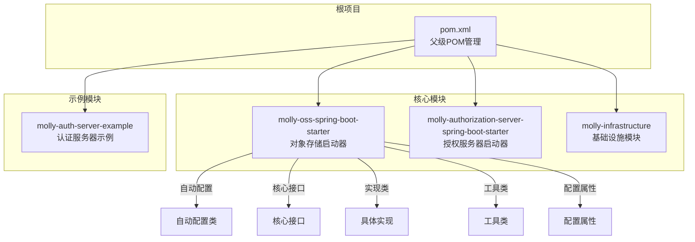

**图表来源**
- [pom.xml:11-16](file://pom.xml#L11-L16)
- [org.springframework.boot.autoconfigure.AutoConfiguration.imports:1-3](file://molly-oss-spring-boot-starter/src/main/resources/META-INF/spring/org.springframework.boot.autoconfigure.AutoConfiguration.imports#L1-L3)

**章节来源**
- [pom.xml:1-94](file://pom.xml#L1-L94)

## 核心组件

### 自动配置系统

对象存储启动器采用了Spring Boot的自动配置机制，通过条件注解实现智能的组件装配：

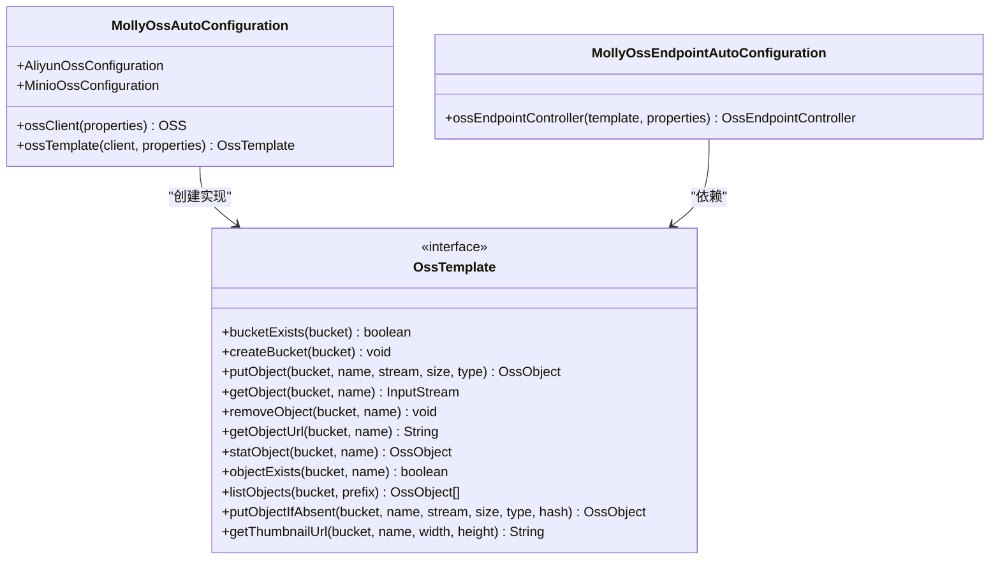

**图表来源**
- [MollyOssAutoConfiguration.java:34-131](file://molly-oss-spring-boot-starter/src/main/java/cn/molly/oss/config/MollyOssAutoConfiguration.java#L34-L131)
- [MollyOssEndpointAutoConfiguration.java:26-45](file://molly-oss-spring-boot-starter/src/main/java/cn/molly/oss/config/MollyOssEndpointAutoConfiguration.java#L26-L45)
- [OssTemplate.java:16-164](file://molly-oss-spring-boot-starter/src/main/java/cn/molly/oss/core/OssTemplate.java#L16-L164)

### 数据模型设计

模块定义了统一的数据模型来封装对象存储的各种信息：

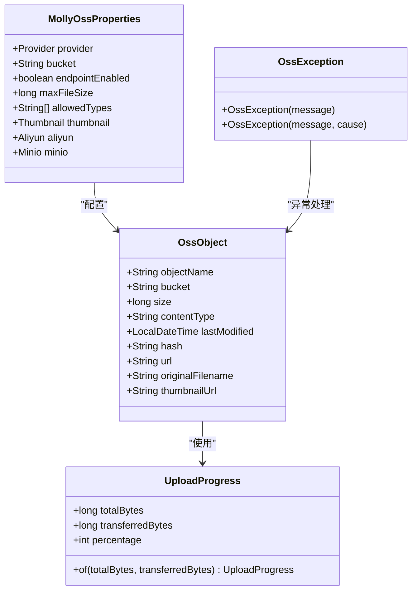

**图表来源**
- [OssObject.java:23-72](file://molly-oss-spring-boot-starter/src/main/java/cn/molly/oss/core/OssObject.java#L23-L72)
- [UploadProgress.java:19-48](file://molly-oss-spring-boot-starter/src/main/java/cn/molly/oss/core/UploadProgress.java#L19-L48)
- [MollyOssProperties.java:19-142](file://molly-oss-spring-boot-starter/src/main/java/cn/molly/oss/properties/MollyOssProperties.java#L19-L142)
- [OssException.java:12-22](file://molly-oss-spring-boot-starter/src/main/java/cn/molly/oss/core/OssException.java#L12-L22)

**章节来源**
- [MollyOssAutoConfiguration.java:1-131](file://molly-oss-spring-boot-starter/src/main/java/cn/molly/oss/config/MollyOssAutoConfiguration.java#L1-L131)
- [OssTemplate.java:1-164](file://molly-oss-spring-boot-starter/src/main/java/cn/molly/oss/core/OssTemplate.java#L1-L164)

## 架构概览

对象存储启动器采用了分层架构设计，确保了良好的可扩展性和可维护性：

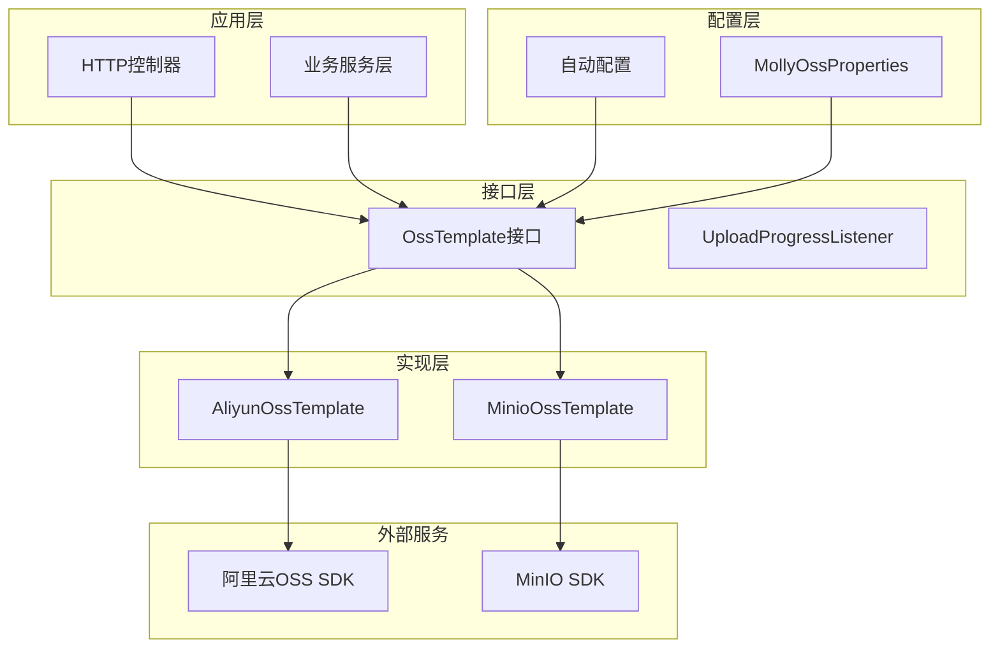

**图表来源**
- [MollyOssAutoConfiguration.java:34-131](file://molly-oss-spring-boot-starter/src/main/java/cn/molly/oss/config/MollyOssAutoConfiguration.java#L34-L131)
- [OssEndpointController.java:37-319](file://molly-oss-spring-boot-starter/src/main/java/cn/molly/oss/endpoint/OssEndpointController.java#L37-L319)
- [AliyunOssTemplate.java:29-272](file://molly-oss-spring-boot-starter/src/main/java/cn/molly/oss/support/aliyun/AliyunOssTemplate.java#L29-L272)
- [MinioOssTemplate.java:35-312](file://molly-oss-spring-boot-starter/src/main/java/cn/molly/oss/support/minio/MinioOssTemplate.java#L35-L312)

### 配置驱动的多实现支持

模块通过配置属性实现了对不同存储服务的无缝切换：

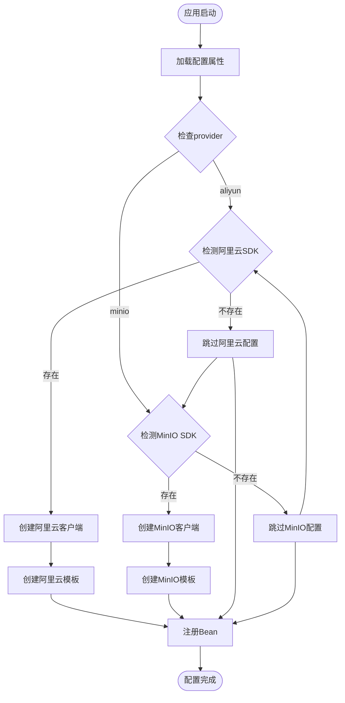

**图表来源**
- [MollyOssAutoConfiguration.java:45-129](file://molly-oss-spring-boot-starter/src/main/java/cn/molly/oss/config/MollyOssAutoConfiguration.java#L45-L129)

**章节来源**
- [MollyOssAutoConfiguration.java:21-33](file://molly-oss-spring-boot-starter/src/main/java/cn/molly/oss/config/MollyOssAutoConfiguration.java#L21-L33)

## 详细组件分析

### HTTP端点控制器

HTTP端点控制器提供了RESTful接口来操作对象存储：

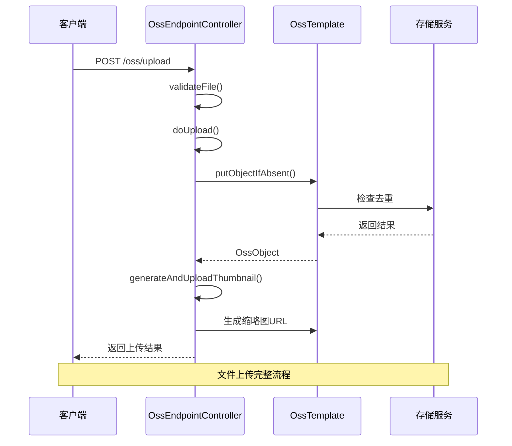

**图表来源**
- [OssEndpointController.java:66-257](file://molly-oss-spring-boot-starter/src/main/java/cn/molly/oss/endpoint/OssEndpointController.java#L66-L257)
- [OssTemplate.java:146-147](file://molly-oss-spring-boot-starter/src/main/java/cn/molly/oss/core/OssTemplate.java#L146-L147)

#### 核心接口方法详解

| 方法名 | 功能描述 | 参数说明 | 返回值 |
|--------|----------|----------|--------|
| `bucketExists` | 检查存储桶是否存在 | `bucket`: 存储桶名称 | `boolean`: 存在返回true |
| `createBucket` | 创建存储桶 | `bucket`: 存储桶名称 | `void` |
| `putObject` | 上传对象 | `bucket, objectName, inputStream, size, contentType` | `OssObject`: 对象元信息 |
| `getObject` | 下载对象 | `bucket, objectName`: 对象名称 | `InputStream`: 文件输入流 |
| `removeObject` | 删除对象 | `bucket, objectName`: 对象名称 | `void` |
| `getObjectUrl` | 获取对象访问URL | `bucket, objectName`: 对象名称 | `String`: 访问URL |
| `statObject` | 获取对象元信息 | `bucket, objectName`: 对象名称 | `OssObject`: 对象元信息 |
| `objectExists` | 判断对象是否存在 | `bucket, objectName`: 对象名称 | `boolean`: 存在返回true |
| `listObjects` | 列出指定前缀下的对象 | `bucket, prefix`: 对象名称前缀 | `List<OssObject>`: 对象元信息列表 |
| `putObjectIfAbsent` | 去重上传 | `bucket, objectName, inputStream, size, contentType, hash` | `OssObject`: 对象元信息 |
| `getThumbnailUrl` | 获取缩略图URL | `bucket, objectName, width, height`: 缩略图尺寸 | `String`: 缩略图URL |

**章节来源**
- [OssTemplate.java:16-164](file://molly-oss-spring-boot-starter/src/main/java/cn/molly/oss/core/OssTemplate.java#L16-L164)

### 阿里云OSS实现

阿里云OSS实现充分利用了阿里云的服务端图片处理能力：

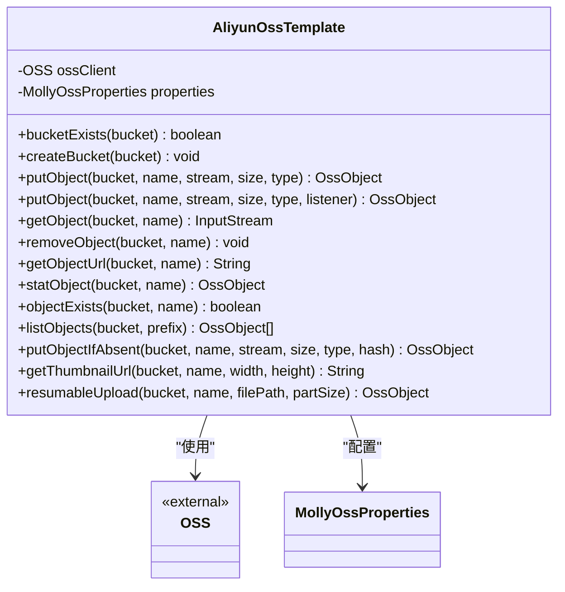

**图表来源**
- [AliyunOssTemplate.java:29-272](file://molly-oss-spring-boot-starter/src/main/java/cn/molly/oss/support/aliyun/AliyunOssTemplate.java#L29-L272)

#### 阿里云特有功能

阿里云OSS实现支持断点续传功能，适用于大文件上传场景：

| 功能 | 描述 | 使用场景 |
|------|------|----------|
| `resumableUpload` | 断点续传上传 | 大文件上传，网络不稳定 |
| 服务端图片处理 | 通过URL参数实现 | 需要动态缩放的场景 |
| V4签名算法 | 更安全的认证方式 | 生产环境推荐 |

**章节来源**
- [AliyunOssTemplate.java:248-271](file://molly-oss-spring-boot-starter/src/main/java/cn/molly/oss/support/aliyun/AliyunOssTemplate.java#L248-L271)

### MinIO实现

MinIO实现提供了完整的S3兼容对象存储功能：

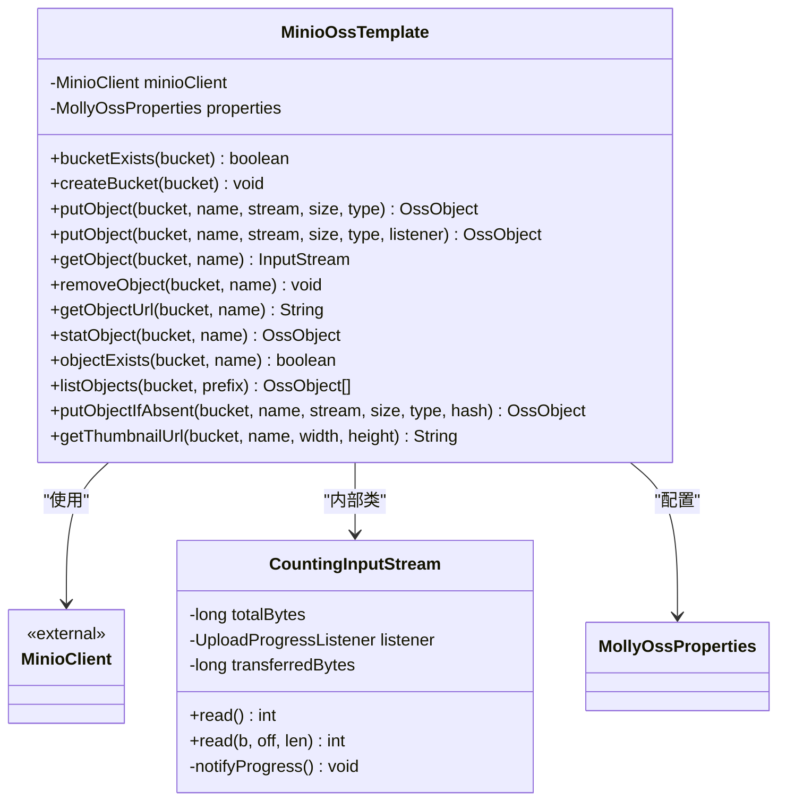

**图表来源**
- [MinioOssTemplate.java:35-312](file://molly-oss-spring-boot-starter/src/main/java/cn/molly/oss/support/minio/MinioOssTemplate.java#L35-L312)

#### MinIO特有功能

MinIO实现通过Java ImageIO在服务端生成缩略图：

| 功能 | 描述 | 实现方式 |
|------|------|----------|
| 服务端图片处理 | Java ImageIO生成缩略图 | 内置图像处理 |
| 自动分片上传 | 大于5MB自动启用 | SDK自动处理 |
| 用户元数据 | 支持自定义元数据 | `content-md5`键值对 |

**章节来源**
- [MinioOssTemplate.java:275-310](file://molly-oss-spring-boot-starter/src/main/java/cn/molly/oss/support/minio/MinioOssTemplate.java#L275-L310)

### 文件工具类

文件工具类提供了上传流程中的核心功能：

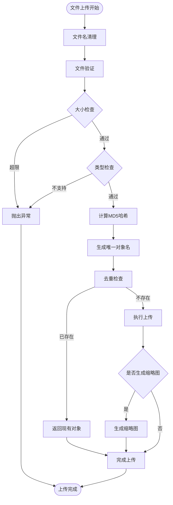

**图表来源**
- [OssEndpointController.java:220-257](file://molly-oss-spring-boot-starter/src/main/java/cn/molly/oss/endpoint/OssEndpointController.java#L220-L257)
- [FileUtil.java:49-77](file://molly-oss-spring-boot-starter/src/main/java/cn/molly/oss/util/FileUtil.java#L49-L77)

**章节来源**
- [FileUtil.java:19-233](file://molly-oss-spring-boot-starter/src/main/java/cn/molly/oss/util/FileUtil.java#L19-L233)

## 依赖关系分析

### Maven依赖管理

项目采用集中化的依赖管理策略，确保版本一致性：

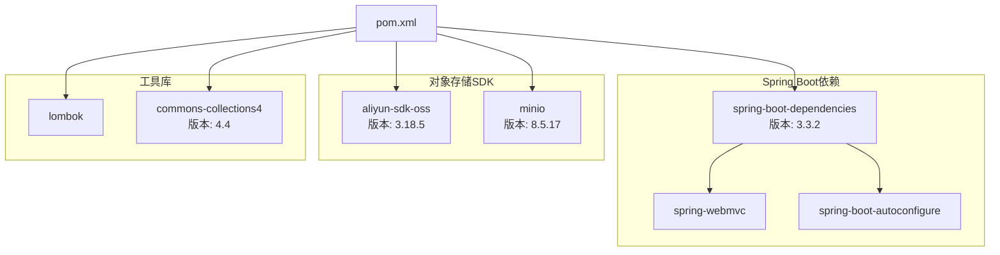

**图表来源**
- [pom.xml:29-54](file://pom.xml#L29-L54)

### 运行时依赖关系

模块的运行时依赖关系如下：

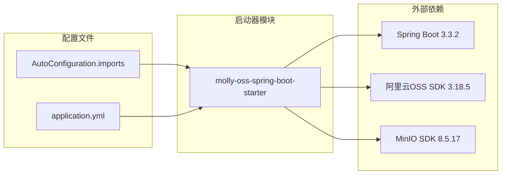

**图表来源**
- [org.springframework.boot.autoconfigure.AutoConfiguration.imports:1-3](file://molly-oss-spring-boot-starter/src/main/resources/META-INF/spring/org.springframework.boot.autoconfigure.AutoConfiguration.imports#L1-L3)

**章节来源**
- [pom.xml:18-27](file://pom.xml#L18-L27)

## 性能考虑

### 上传性能优化

模块在多个层面进行了性能优化：

1. **流式处理**：使用`StreamingResponseBody`实现流式下载，避免内存溢出
2. **进度回调**：支持实时上传进度反馈，提升用户体验
3. **去重上传**：基于MD5哈希的去重机制，避免重复传输
4. **分片上传**：阿里云OSS支持断点续传，MinIO自动分片处理

### 内存管理

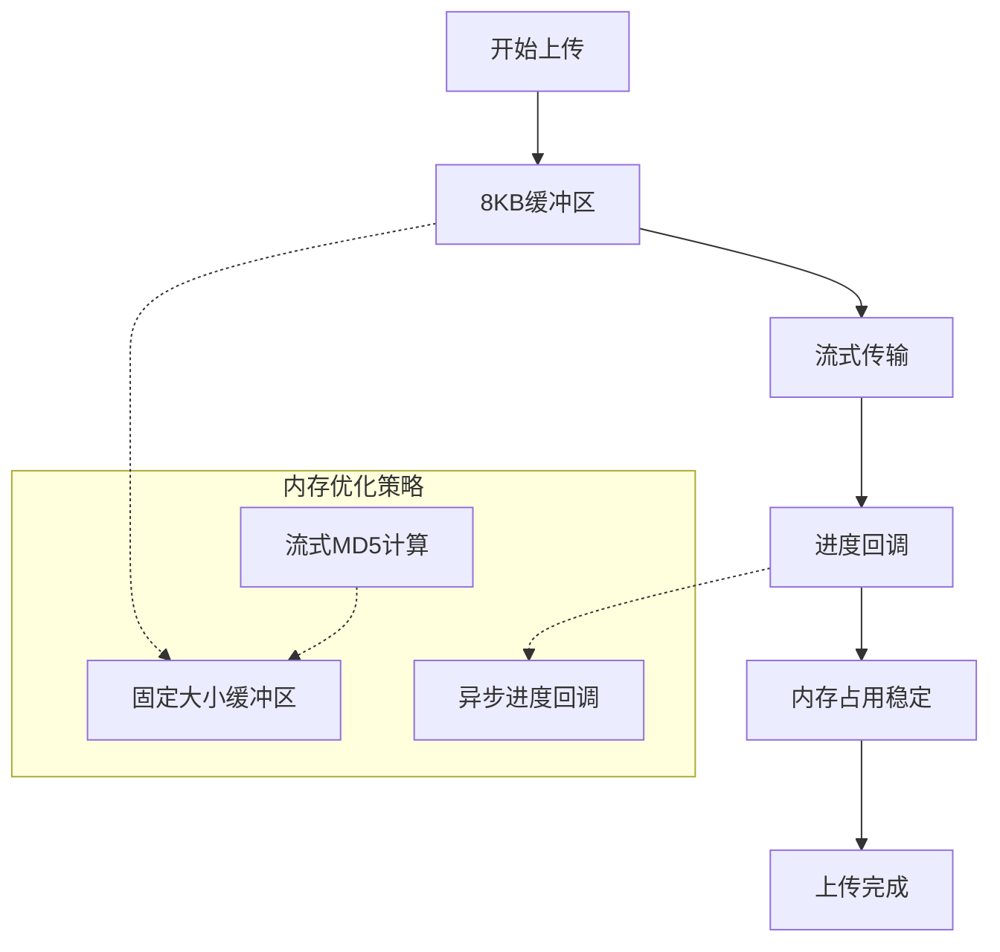

### 并发处理

- **阿里云SDK**：默认5个并发线程处理大文件上传
- **MinIO SDK**：自动分片上传，无需手动配置
- **Spring MVC**：支持异步处理和响应式编程

## 故障排除指南

### 常见问题及解决方案

| 问题类型 | 症状 | 可能原因 | 解决方案 |
|----------|------|----------|----------|
| 连接失败 | `OssException: 连接超时` | 网络配置错误 | 检查endpoint和网络连通性 |
| 权限错误 | `403 Forbidden` | 认证信息错误 | 验证AccessKey和SecretKey |
| 存储桶不存在 | `Bucket not found` | 桶名称错误 | 确认存储桶名称和区域设置 |
| 文件过大 | `413 Request Entity Too Large` | 超过最大文件限制 | 调整maxFileSize配置 |
| 类型不支持 | `Unsupported file type` | MIME类型不在白名单 | 添加允许的文件类型 |

### 异常处理机制

模块提供了统一的异常处理机制：

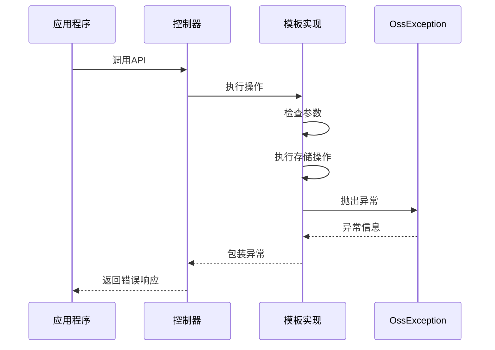

**图表来源**
- [OssException.java:12-22](file://molly-oss-spring-boot-starter/src/main/java/cn/molly/oss/core/OssException.java#L12-L22)

**章节来源**
- [OssEndpointController.java:70-80](file://molly-oss-spring-boot-starter/src/main/java/cn/molly/oss/endpoint/OssEndpointController.java#L70-L80)

### 日志监控

模块内置了完善的日志记录机制：

- **上传失败**：记录详细的错误信息和文件名
- **缩略图生成**：记录生成状态和警告信息
- **去重检查**：记录命中率和性能指标

## 结论

对象存储启动器模块是一个设计精良、功能完备的对象存储解决方案。其主要特点包括：

### 核心优势

1. **统一抽象**：通过`OssTemplate`接口提供统一的API，屏蔽底层差异
2. **智能配置**：基于条件注解的自动配置，支持零配置使用
3. **多实现支持**：同时支持阿里云OSS和MinIO两大主流对象存储
4. **性能优化**：流式处理、进度回调、去重上传等优化措施
5. **易于扩展**：清晰的架构设计，便于添加新的存储服务提供商

### 技术亮点

- **条件装配**：根据配置自动选择合适的存储实现
- **异常统一**：所有底层异常统一包装为`OssException`
- **配置灵活**：丰富的配置选项满足不同场景需求
- **工具完善**：提供完整的文件处理工具集

### 适用场景

该模块特别适合以下应用场景：
- 需要快速集成对象存储功能的Web应用
- 需要在阿里云和自建存储之间灵活切换的项目
- 对文件上传性能和用户体验有较高要求的应用
- 需要统一文件管理接口的企业级应用

通过合理配置和使用，对象存储启动器模块能够显著降低对象存储的集成成本，提升开发效率。