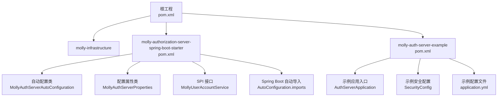
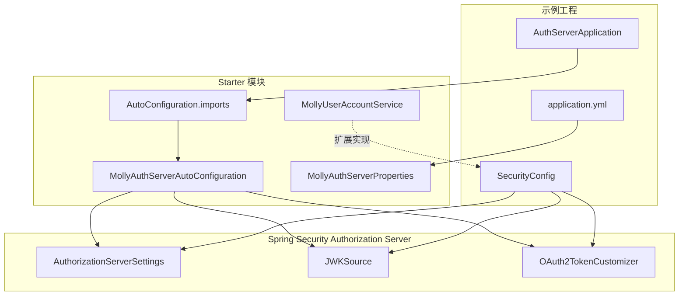
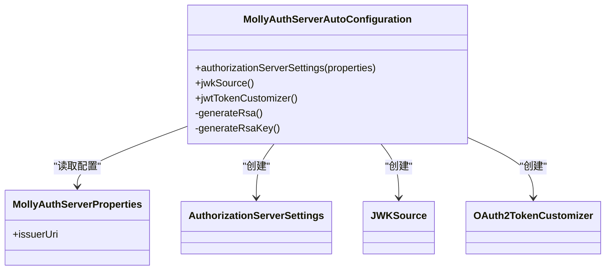
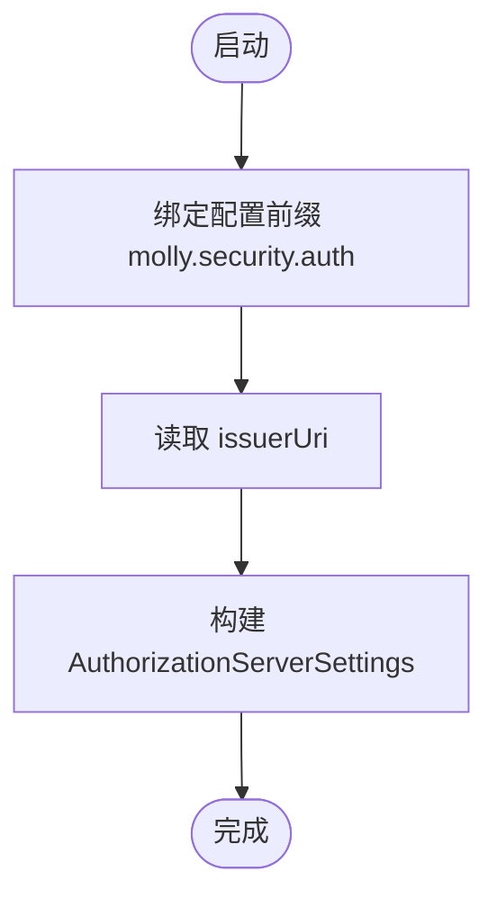
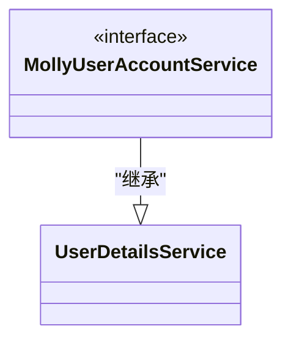
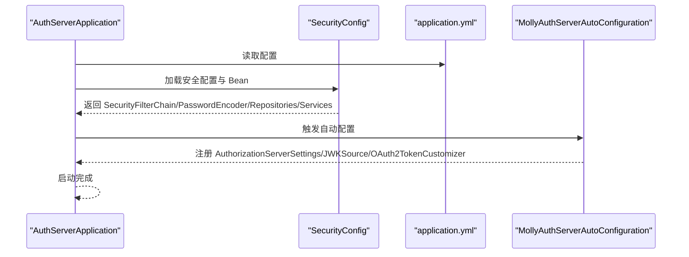
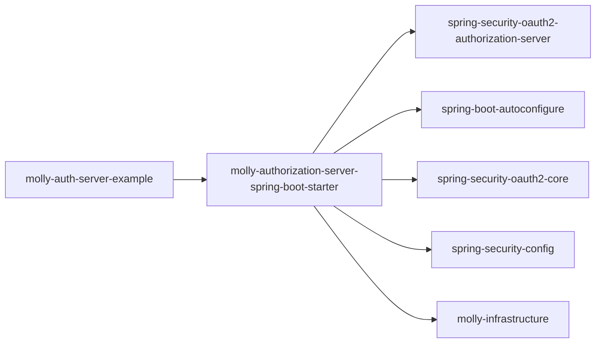

# 核心模块详解

<cite>
**本文引用的文件列表**
- [MollyAuthServerAutoConfiguration.java](file://molly-authorization-server-spring-boot-starter/src/main/java/cn/molly/security/auth/config/MollyAuthServerAutoConfiguration.java)
- [MollyAuthServerProperties.java](file://molly-authorization-server-spring-boot-starter/src/main/java/cn/molly/security/auth/properties/MollyAuthServerProperties.java)
- [MollyUserAccountService.java](file://molly-authorization-server-spring-boot-starter/src/main/java/cn/molly/security/auth/service/MollyUserAccountService.java)
- [AutoConfiguration.imports](file://molly-authorization-server-spring-boot-starter/src/main/resources/META-INF/spring/org.springframework.boot.autoconfigure.AutoConfiguration.imports)
- [SecurityConfig.java](file://molly-auth-server-example/src/main/java/cn/molly/example/auth/config/SecurityConfig.java)
- [AuthServerApplication.java](file://molly-auth-server-example/src/main/java/cn/molly/example/auth/AuthServerApplication.java)
- [application.yml](file://molly-auth-server-example/src/main/resources/application.yml)
- [pom.xml（starter）](file://molly-authorization-server-spring-boot-starter/pom.xml)
- [pom.xml（根工程）](file://pom.xml)
</cite>

## 目录
1. [简介](#简介)
2. [项目结构](#项目结构)
3. [核心组件](#核心组件)
4. [架构总览](#架构总览)
5. [详细组件分析](#详细组件分析)
6. [依赖关系分析](#依赖关系分析)
7. [性能考虑](#性能考虑)
8. [故障排查指南](#故障排查指南)
9. [结论](#结论)
10. [附录](#附录)

## 简介
本文件面向有经验的开发者，系统性解析 Molly 框架的“认证服务器 Spring Boot Starter”模块，重点涵盖：
- 自动配置原理与条件注解使用
- Bean 创建流程与覆盖策略
- 配置属性管理系统（MollyAuthServerProperties）
- SPI 接口体系（MollyUserAccountService）及其扩展机制
- 模块间依赖与交互模式
- 性能优化建议与最佳实践
- 结合示例工程的使用指导

## 项目结构
该项目采用多模块 Maven 结构，核心模块为认证服务器 Starter，示例工程演示如何集成与使用。根 POM 统一版本与依赖管理；Starter 模块提供自动配置与 SPI 接口；示例工程展示最小可用配置与运行方式。

图表来源
- [pom.xml（根工程）:11-14](file://pom.xml#L11-L14)
- [pom.xml（starter）:1-51](file://molly-authorization-server-spring-boot-starter/pom.xml#L1-L51)
- [AutoConfiguration.imports:1-2](file://molly-authorization-server-spring-boot-starter/src/main/resources/META-INF/spring/org.springframework.boot.autoconfigure.AutoConfiguration.imports#L1-L2)
- [MollyAuthServerAutoConfiguration.java:1-161](file://molly-authorization-server-spring-boot-starter/src/main/java/cn/molly/security/auth/config/MollyAuthServerAutoConfiguration.java#L1-L161)
- [MollyAuthServerProperties.java:1-25](file://molly-authorization-server-spring-boot-starter/src/main/java/cn/molly/security/auth/properties/MollyAuthServerProperties.java#L1-L25)
- [MollyUserAccountService.java:1-22](file://molly-authorization-server-spring-boot-starter/src/main/java/cn/molly/security/auth/service/MollyUserAccountService.java#L1-L22)
- [AuthServerApplication.java:1-22](file://molly-auth-server-example/src/main/java/cn/molly/example/auth/AuthServerApplication.java#L1-L22)
- [SecurityConfig.java:1-165](file://molly-auth-server-example/src/main/java/cn/molly/example/auth/config/SecurityConfig.java#L1-L165)
- [application.yml:1-12](file://molly-auth-server-example/src/main/resources/application.yml#L1-L12)

章节来源
- [pom.xml（根工程）:11-14](file://pom.xml#L11-L14)
- [pom.xml（starter）:1-51](file://molly-authorization-server-spring-boot-starter/pom.xml#L1-L51)

## 核心组件
- 自动配置类：MollyAuthServerAutoConfiguration 负责在 Spring Boot 启动时按需创建授权服务器所需的核心 Bean，并通过条件注解保证可覆盖性。
- 配置属性类：MollyAuthServerProperties 提供 issuer-uri 等配置项，绑定前缀为 molly.security.auth。
- SPI 接口：MollyUserAccountService 扩展 UserDetailsService，作为统一的用户账户服务入口，便于未来扩展多种认证方式。
- 示例工程：演示如何引入 Starter、提供必要的 Bean（客户端仓库、用户详情服务、安全过滤链），以及如何配置 issuer-uri。

章节来源
- [MollyAuthServerAutoConfiguration.java:28-50](file://molly-authorization-server-spring-boot-starter/src/main/java/cn/molly/security/auth/config/MollyAuthServerAutoConfiguration.java#L28-L50)
- [MollyAuthServerProperties.java:6-24](file://molly-authorization-server-spring-boot-starter/src/main/java/cn/molly/security/auth/properties/MollyAuthServerProperties.java#L6-L24)
- [MollyUserAccountService.java:5-21](file://molly-authorization-server-spring-boot-starter/src/main/java/cn/molly/security/auth/service/MollyUserAccountService.java#L5-L21)
- [application.yml:5-11](file://molly-auth-server-example/src/main/resources/application.yml#L5-L11)

## 架构总览
下图展示了 Starter 模块与 Spring Security Authorization Server 的集成关系，以及示例工程如何提供缺失的 Bean 以完成最小可用配置。

图表来源
- [AutoConfiguration.imports:1-2](file://molly-authorization-server-spring-boot-starter/src/main/resources/META-INF/spring/org.springframework.boot.autoconfigure.AutoConfiguration.imports#L1-L2)
- [MollyAuthServerAutoConfiguration.java:51-120](file://molly-authorization-server-spring-boot-starter/src/main/java/cn/molly/security/auth/config/MollyAuthServerAutoConfiguration.java#L51-L120)
- [MollyAuthServerProperties.java:14-24](file://molly-authorization-server-spring-boot-starter/src/main/java/cn/molly/security/auth/properties/MollyAuthServerProperties.java#L14-L24)
- [SecurityConfig.java:42-165](file://molly-auth-server-example/src/main/java/cn/molly/example/auth/config/SecurityConfig.java#L42-L165)
- [application.yml:5-11](file://molly-auth-server-example/src/main/resources/application.yml#L5-L11)

## 详细组件分析

### 自动配置类：MollyAuthServerAutoConfiguration
- 作用与职责
  - 启用配置属性绑定（EnableConfigurationProperties）
  - 基于条件注解按需创建授权服务器核心 Bean
  - 通过 @ConditionalOnMissingBean 提供可覆盖的默认实现
- 关键 Bean
  - AuthorizationServerSettings：从配置属性读取 issuer-uri，构建授权服务器元数据
  - JWKSource：默认在内存中生成 RSA 密钥对并封装为 JWK，用于 JWT 签名
  - OAuth2TokenCustomizer：为 access_token 添加 authorities 声明
- 条件注解与覆盖策略
  - @ConditionalOnClass 判断是否引入 Authorization Server 依赖
  - @ConditionalOnMissingBean 允许外部提供同名 Bean 覆盖默认实现
- 错误处理
  - 密钥生成失败时抛出非法状态异常，提示运行时问题

图表来源
- [MollyAuthServerAutoConfiguration.java:51-158](file://molly-authorization-server-spring-boot-starter/src/main/java/cn/molly/security/auth/config/MollyAuthServerAutoConfiguration.java#L51-L158)
- [MollyAuthServerProperties.java:14-24](file://molly-authorization-server-spring-boot-starter/src/main/java/cn/molly/security/auth/properties/MollyAuthServerProperties.java#L14-L24)

章节来源
- [MollyAuthServerAutoConfiguration.java:51-158](file://molly-authorization-server-spring-boot-starter/src/main/java/cn/molly/security/auth/config/MollyAuthServerAutoConfiguration.java#L51-L158)

### 配置属性管理：MollyAuthServerProperties
- 设计思路
  - 使用 @ConfigurationProperties 绑定前缀 molly.security.auth
  - 提供最小必要配置项，聚焦 OIDC 必填字段 issuer-uri
  - 通过 Lombok 自动生成 getter/setter，简化使用
- 可用配置项
  - issuerUri：授权服务器签发者 URI，必须与服务实际地址一致
- 与自动配置的协作
  - 自动配置类通过参数注入读取该属性，构建 AuthorizationServerSettings

图表来源
- [MollyAuthServerProperties.java:14-24](file://molly-authorization-server-spring-boot-starter/src/main/java/cn/molly/security/auth/properties/MollyAuthServerProperties.java#L14-L24)
- [MollyAuthServerAutoConfiguration.java:67-73](file://molly-authorization-server-spring-boot-starter/src/main/java/cn/molly/security/auth/config/MollyAuthServerAutoConfiguration.java#L67-L73)
- [application.yml:5-11](file://molly-auth-server-example/src/main/resources/application.yml#L5-L11)

章节来源
- [MollyAuthServerProperties.java:14-24](file://molly-authorization-server-spring-boot-starter/src/main/java/cn/molly/security/auth/properties/MollyAuthServerProperties.java#L14-L24)
- [application.yml:5-11](file://molly-auth-server-example/src/main/resources/application.yml#L5-L11)

### SPI 接口系统：MollyUserAccountService
- 角色定位
  - 扩展 Spring Security 的 UserDetailsService，作为 Molly 安全框架的统一用户账户服务入口
  - 为未来支持手机号、社交账号等多种认证方式预留扩展点
- 实现要求
  - 由使用者在示例工程中提供具体实现（例如基于数据库或 LDAP）
  - 与 Spring Security 的认证流程无缝对接
- 与示例工程的结合
  - 示例工程通过 SecurityConfig 提供 UserDetailsService 的实现，满足自动配置所需的 Bean

图表来源
- [MollyUserAccountService.java:20-21](file://molly-authorization-server-spring-boot-starter/src/main/java/cn/molly/security/auth/service/MollyUserAccountService.java#L20-L21)
- [SecurityConfig.java:155-163](file://molly-auth-server-example/src/main/java/cn/molly/example/auth/config/SecurityConfig.java#L155-L163)

章节来源
- [MollyUserAccountService.java:5-21](file://molly-authorization-server-spring-boot-starter/src/main/java/cn/molly/security/auth/service/MollyUserAccountService.java#L5-L21)
- [SecurityConfig.java:155-163](file://molly-auth-server-example/src/main/java/cn/molly/example/auth/config/SecurityConfig.java#L155-L163)

### 示例工程：最小可用配置与运行
- 应用入口
  - AuthServerApplication 作为 Spring Boot 启动类
- 安全配置
  - 提供两个 SecurityFilterChain：授权服务器端点安全链与应用默认安全链
  - 提供 PasswordEncoder、RegisteredClientRepository、UserDetailsService 等 Bean
- 配置文件
  - application.yml 设置 server.port 与 molly.security.auth.issuer-uri

图表来源
- [AuthServerApplication.java:15-21](file://molly-auth-server-example/src/main/java/cn/molly/example/auth/AuthServerApplication.java#L15-L21)
- [SecurityConfig.java:42-165](file://molly-auth-server-example/src/main/java/cn/molly/example/auth/config/SecurityConfig.java#L42-L165)
- [application.yml:1-12](file://molly-auth-server-example/src/main/resources/application.yml#L1-L12)
- [MollyAuthServerAutoConfiguration.java:51-120](file://molly-authorization-server-spring-boot-starter/src/main/java/cn/molly/security/auth/config/MollyAuthServerAutoConfiguration.java#L51-L120)

章节来源
- [AuthServerApplication.java:15-21](file://molly-auth-server-example/src/main/java/cn/molly/example/auth/AuthServerApplication.java#L15-L21)
- [SecurityConfig.java:42-165](file://molly-auth-server-example/src/main/java/cn/molly/example/auth/config/SecurityConfig.java#L42-L165)
- [application.yml:1-12](file://molly-auth-server-example/src/main/resources/application.yml#L1-L12)

## 依赖关系分析
- Starter 模块依赖
  - spring-security-oauth2-authorization-server：提供 OAuth2/OIDC 协议实现
  - spring-boot-autoconfigure：提供自动配置能力
  - spring-security-oauth2-core：提供令牌定制等能力
  - spring-security-config：提供安全配置支持
  - molly-infrastructure：内部基础设施模块
- 示例工程依赖
  - 通过引入 Starter 模块间接获得上述依赖
  - 自身提供最小的安全配置与 Bean

图表来源
- [pom.xml（starter）:16-48](file://molly-authorization-server-spring-boot-starter/pom.xml#L16-L48)
- [pom.xml（根工程）:26-41](file://pom.xml#L26-L41)

章节来源
- [pom.xml（starter）:16-48](file://molly-authorization-server-spring-boot-starter/pom.xml#L16-L48)
- [pom.xml（根工程）:26-41](file://pom.xml#L26-L41)

## 性能考虑
- 密钥管理
  - 默认内存生成 RSA 密钥对仅适用于开发环境；生产环境务必提供持久化、高可用的 JWKSource 实现（如密钥库、数据库或 HSM）
- 令牌定制
  - 自定义 claims 的计算应避免昂贵操作；如需复杂业务信息，建议缓存或延迟加载
- 客户端与用户存储
  - 内存实现仅适合测试；生产环境应使用数据库实现（如 JDBC 客户端仓库与用户详情服务）
- 过滤链顺序
  - 示例工程已通过 @Order 控制过滤链优先级，确保授权服务器端点优先处理
- 版本与兼容性
  - 根 POM 统一管理 Spring 版本，确保各模块版本一致，减少潜在性能与兼容性问题

[本节为通用性能建议，不直接分析具体文件]

## 故障排查指南
- 启动失败：找不到 AuthorizationServerSettings 或 JWKSource
  - 检查是否正确引入 Starter 并提供必要的 Bean（客户端仓库、用户详情服务、安全过滤链）
  - 确认 application.yml 中 issuer-uri 配置正确且与服务地址一致
- 令牌缺少 authorities 声明
  - 确认当前认证主体具备权限；检查 jwtTokenCustomizer 是否被外部 Bean 覆盖
- 密钥生成异常
  - 默认密钥生成依赖 JDK RSA 实现；若出现异常，检查运行环境与权限
- 生产密钥未生效
  - 确认自定义 JWKSource Bean 的名称与类型与默认 Bean 一致，以便被条件注解覆盖

章节来源
- [MollyAuthServerAutoConfiguration.java:67-120](file://molly-authorization-server-spring-boot-starter/src/main/java/cn/molly/security/auth/config/MollyAuthServerAutoConfiguration.java#L67-L120)
- [application.yml:5-11](file://molly-auth-server-example/src/main/resources/application.yml#L5-L11)
- [SecurityConfig.java:42-165](file://molly-auth-server-example/src/main/java/cn/molly/example/auth/config/SecurityConfig.java#L42-L165)

## 结论
Molly 认证服务器 Starter 通过自动配置与条件注解实现了“开箱即用”的授权服务器能力，同时保持高度可覆盖性。配合简洁的配置属性与 SPI 接口，既满足初学者快速上手，又为高级用户提供灵活扩展空间。示例工程提供了最小可用配置模板，建议在生产环境替换内存实现并完善密钥与存储方案。

[本节为总结性内容，不直接分析具体文件]

## 附录

### 如何使用这些核心组件（步骤指引）
- 引入 Starter
  - 在示例工程中，通过模块依赖引入认证服务器 Starter
- 提供必要 Bean
  - 在示例工程中，SecurityConfig 展示了如何提供 PasswordEncoder、RegisteredClientRepository、UserDetailsService 等 Bean
- 配置 issuer-uri
  - 在 application.yml 中设置 molly.security.auth.issuer-uri，确保与服务地址一致
- 启动应用
  - 运行 AuthServerApplication，自动配置将按需注册 AuthorizationServerSettings、JWKSource、OAuth2TokenCustomizer 等 Bean

章节来源
- [pom.xml（starter）:16-48](file://molly-authorization-server-spring-boot-starter/pom.xml#L16-L48)
- [SecurityConfig.java:42-165](file://molly-auth-server-example/src/main/java/cn/molly/example/auth/config/SecurityConfig.java#L42-L165)
- [application.yml:5-11](file://molly-auth-server-example/src/main/resources/application.yml#L5-L11)
- [AuthServerApplication.java:15-21](file://molly-auth-server-example/src/main/java/cn/molly/example/auth/AuthServerApplication.java#L15-L21)