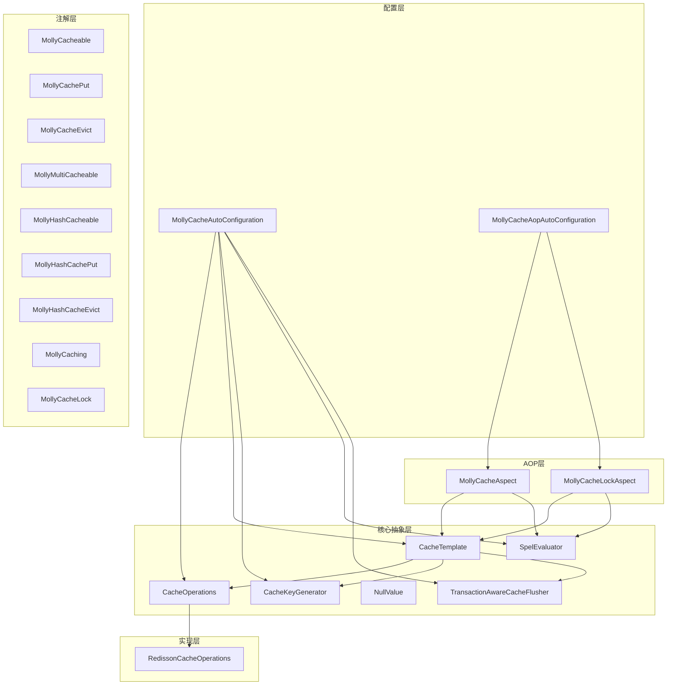
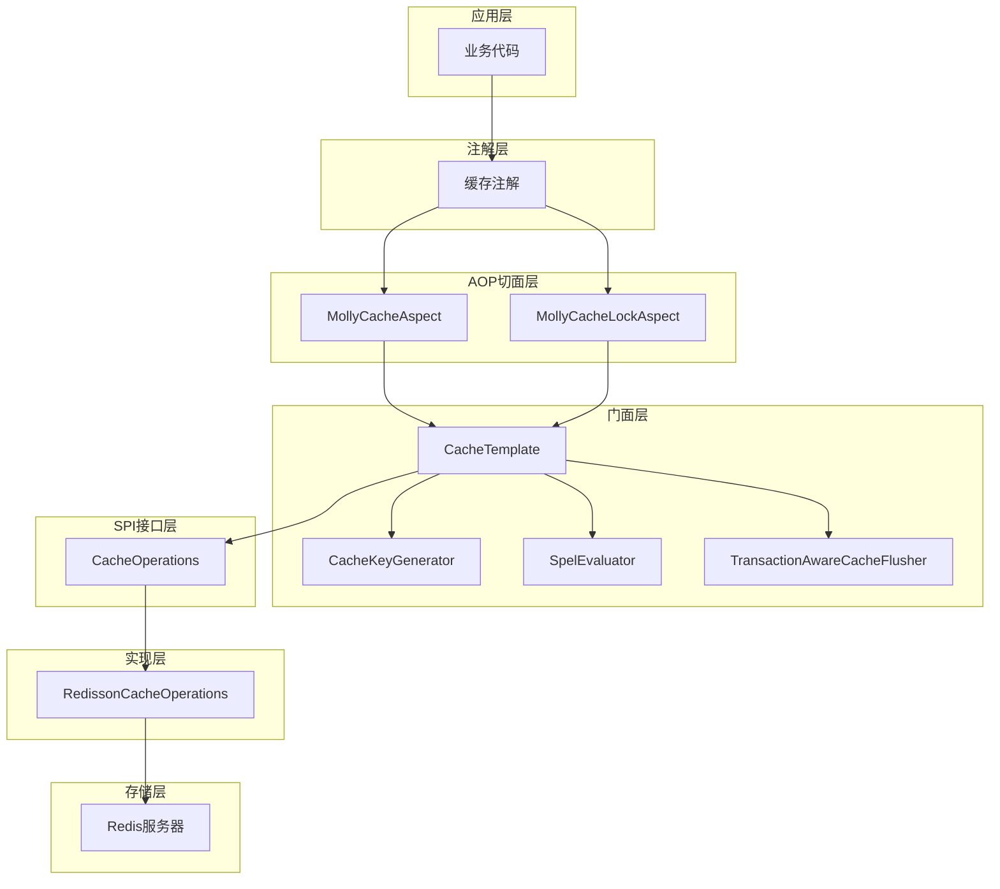
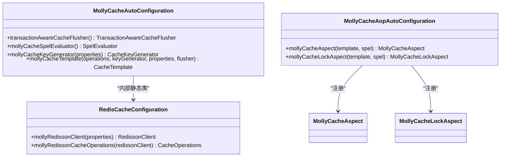
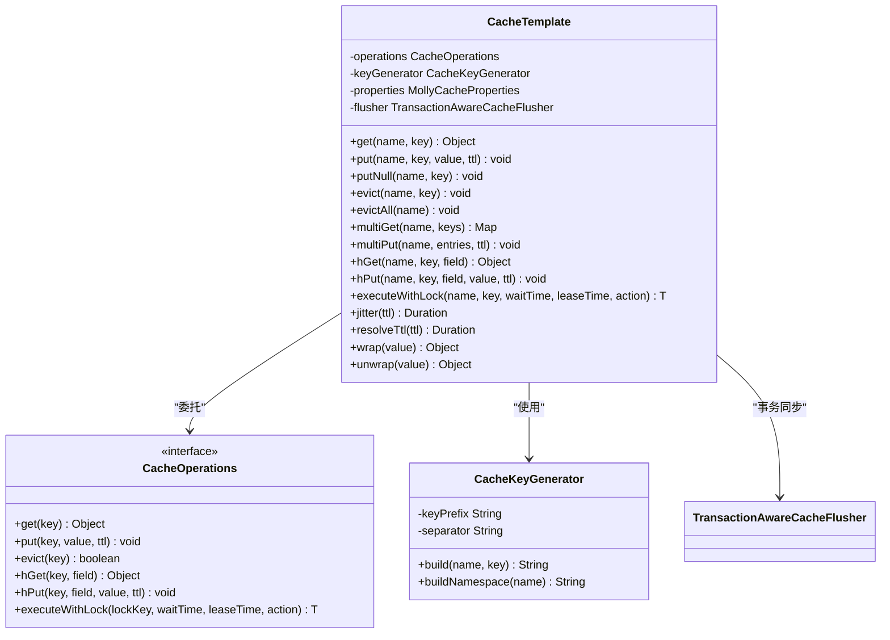
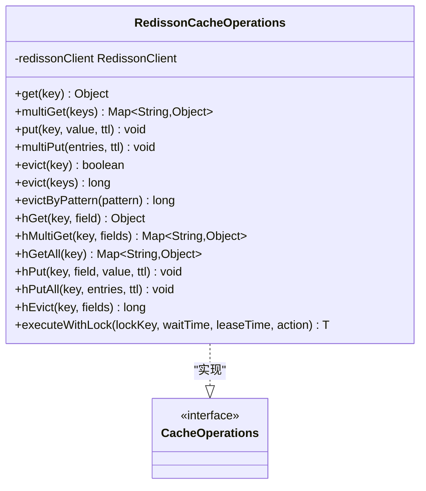
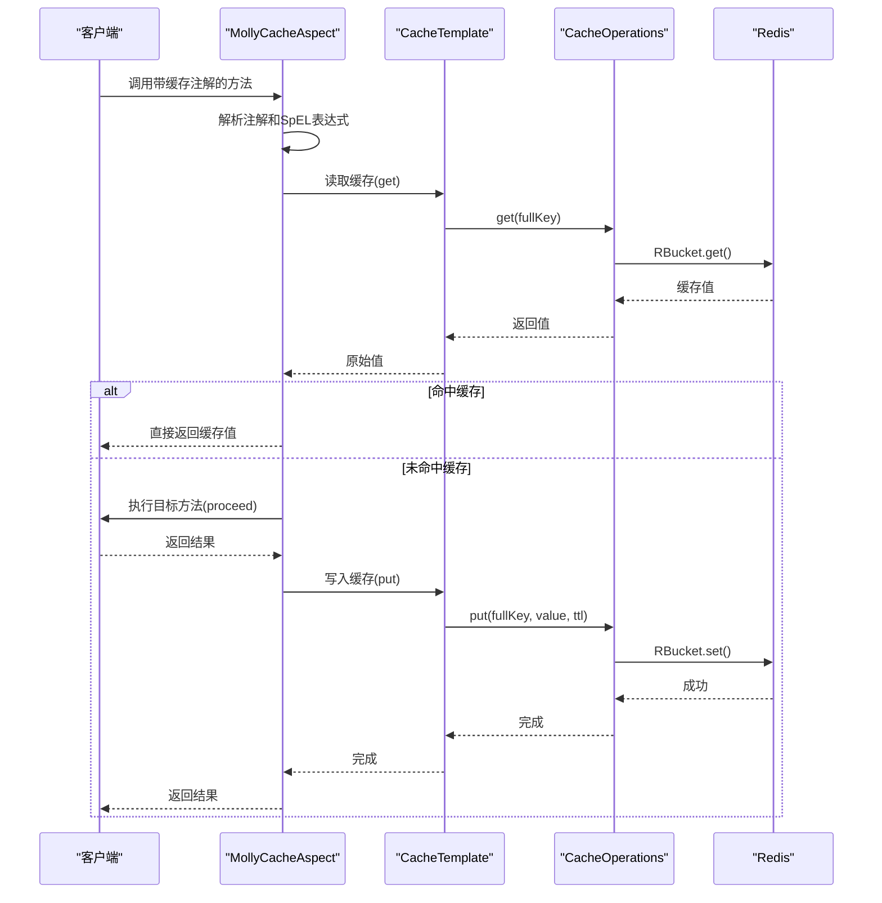
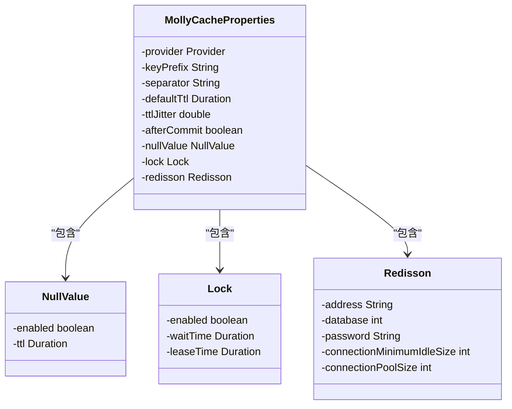
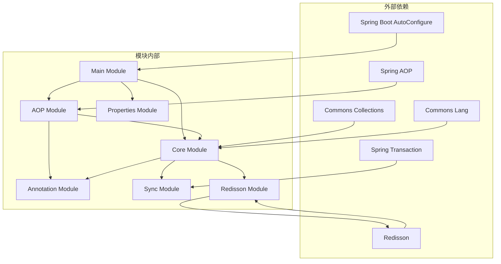

# 缓存启动器模块

<cite>
**本文档引用的文件**
- [MollyCacheAutoConfiguration.java](file://molly-cache-spring-boot-starter/src/main/java/cn/molly/cache/config/MollyCacheAutoConfiguration.java)
- [MollyCacheAopAutoConfiguration.java](file://molly-cache-spring-boot-starter/src/main/java/cn/molly/cache/config/MollyCacheAopAutoConfiguration.java)
- [MollyCacheProperties.java](file://molly-cache-spring-boot-starter/src/main/java/cn/molly/cache/properties/MollyCacheProperties.java)
- [CacheOperations.java](file://molly-cache-spring-boot-starter/src/main/java/cn/molly/cache/core/CacheOperations.java)
- [CacheTemplate.java](file://molly-cache-spring-boot-starter/src/main/java/cn/molly/cache/core/CacheTemplate.java)
- [RedissonCacheOperations.java](file://molly-cache-spring-boot-starter/src/main/java/cn/molly/cache/support/redis/RedissonCacheOperations.java)
- [MollyCacheAspect.java](file://molly-cache-spring-boot-starter/src/main/java/cn/molly/cache/aop/MollyCacheAspect.java)
- [MollyCacheLockAspect.java](file://molly-cache-spring-boot-starter/src/main/java/cn/molly/cache/aop/MollyCacheLockAspect.java)
- [CacheKeyGenerator.java](file://molly-cache-spring-boot-starter/src/main/java/cn/molly/cache/core/CacheKeyGenerator.java)
- [NullValue.java](file://molly-cache-spring-boot-starter/src/main/java/cn/molly/cache/core/NullValue.java)
- [SpelEvaluator.java](file://molly-cache-spring-boot-starter/src/main/java/cn/molly/cache/core/SpelEvaluator.java)
- [TransactionAwareCacheFlusher.java](file://molly-cache-spring-boot-starter/src/main/java/cn/molly/cache/sync/TransactionAwareCacheFlusher.java)
- [MollyCacheable.java](file://molly-cache-spring-boot-starter/src/main/java/cn/molly/cache/annotation/MollyCacheable.java)
- [pom.xml](file://molly-cache-spring-boot-starter/pom.xml)
- [README.md](file://README.md)
</cite>

## 目录
1. [简介](#简介)
2. [项目结构](#项目结构)
3. [核心组件](#核心组件)
4. [架构总览](#架构总览)
5. [详细组件分析](#详细组件分析)
6. [依赖关系分析](#依赖关系分析)
7. [性能考虑](#性能考虑)
8. [故障排除指南](#故障排除指南)
9. [结论](#结论)

## 简介
缓存启动器模块是 Molly 分布式 Web 系统脚手架中的核心缓存基础设施，基于 Spring Boot 自动配置机制，提供声明式缓存能力与高性能 Redis 缓存实现。该模块默认采用 Redisson 客户端，支持单 key、多 key、Hash 结构以及分布式锁等丰富场景，具备防穿透、防击穿、防雪崩等生产级防护特性，并与 Spring 事务深度集成。

## 项目结构
缓存启动器模块采用清晰的分层组织，按照功能域划分为配置、注解、AOP 切面、核心抽象、属性配置、Redisson 实现和事务同步等子包：

**图表来源**
- [MollyCacheAutoConfiguration.java:1-131](file://molly-cache-spring-boot-starter/src/main/java/cn/molly/cache/config/MollyCacheAutoConfiguration.java#L1-L131)
- [MollyCacheAopAutoConfiguration.java:1-56](file://molly-cache-spring-boot-starter/src/main/java/cn/molly/cache/config/MollyCacheAopAutoConfiguration.java#L1-L56)

**章节来源**
- [README.md:38-47](file://README.md#L38-L47)

## 核心组件
缓存启动器模块的核心组件包括自动配置类、SPI 接口、门面模板、Redisson 实现、注解体系、AOP 切面和事务同步器等。这些组件协同工作，提供完整的缓存解决方案。

**章节来源**
- [MollyCacheAutoConfiguration.java:32-131](file://molly-cache-spring-boot-starter/src/main/java/cn/molly/cache/config/MollyCacheAutoConfiguration.java#L32-L131)
- [MollyCacheAopAutoConfiguration.java:24-56](file://molly-cache-spring-boot-starter/src/main/java/cn/molly/cache/config/MollyCacheAopAutoConfiguration.java#L24-L56)

## 架构总览
缓存启动器模块采用"自动配置 + SPI + AOP + Redisson"的架构设计，实现了高度可扩展和生产友好的缓存系统：

**图表来源**
- [MollyCacheAspect.java:1-514](file://molly-cache-spring-boot-starter/src/main/java/cn/molly/cache/aop/MollyCacheAspect.java#L1-L514)
- [CacheTemplate.java:1-419](file://molly-cache-spring-boot-starter/src/main/java/cn/molly/cache/core/CacheTemplate.java#L1-L419)
- [RedissonCacheOperations.java:1-215](file://molly-cache-spring-boot-starter/src/main/java/cn/molly/cache/support/redis/RedissonCacheOperations.java#L1-L215)

## 详细组件分析

### 自动配置组件
自动配置组件负责在应用启动时自动注册缓存相关的 Bean，采用条件注解确保灵活性和可覆盖性。

**图表来源**
- [MollyCacheAutoConfiguration.java:32-131](file://molly-cache-spring-boot-starter/src/main/java/cn/molly/cache/config/MollyCacheAutoConfiguration.java#L32-L131)
- [MollyCacheAopAutoConfiguration.java:24-56](file://molly-cache-spring-boot-starter/src/main/java/cn/molly/cache/config/MollyCacheAopAutoConfiguration.java#L24-L56)

**章节来源**
- [MollyCacheAutoConfiguration.java:32-131](file://molly-cache-spring-boot-starter/src/main/java/cn/molly/cache/config/MollyCacheAutoConfiguration.java#L32-L131)
- [MollyCacheAopAutoConfiguration.java:24-56](file://molly-cache-spring-boot-starter/src/main/java/cn/molly/cache/config/MollyCacheAopAutoConfiguration.java#L24-L56)

### 缓存门面组件
CacheTemplate 作为缓存操作的门面，提供简洁易用的 API，同时负责 TTL 抖动、空值占位透传和事务后置失效等横切逻辑。

**图表来源**
- [CacheTemplate.java:30-419](file://molly-cache-spring-boot-starter/src/main/java/cn/molly/cache/core/CacheTemplate.java#L30-L419)
- [CacheOperations.java:19-146](file://molly-cache-spring-boot-starter/src/main/java/cn/molly/cache/core/CacheOperations.java#L19-L146)
- [CacheKeyGenerator.java:18-62](file://molly-cache-spring-boot-starter/src/main/java/cn/molly/cache/core/CacheKeyGenerator.java#L18-L62)

**章节来源**
- [CacheTemplate.java:30-419](file://molly-cache-spring-boot-starter/src/main/java/cn/molly/cache/core/CacheTemplate.java#L30-L419)
- [CacheOperations.java:19-146](file://molly-cache-spring-boot-starter/src/main/java/cn/molly/cache/core/CacheOperations.java#L19-L146)
- [CacheKeyGenerator.java:18-62](file://molly-cache-spring-boot-starter/src/main/java/cn/molly/cache/core/CacheKeyGenerator.java#L18-L62)

### Redisson 实现组件
RedissonCacheOperations 提供了高性能的 Redis 缓存实现，利用 Redisson 的 RBucket、RMap、RBatch 和 RLock 能力。

**图表来源**
- [RedissonCacheOperations.java:31-215](file://molly-cache-spring-boot-starter/src/main/java/cn/molly/cache/support/redis/RedissonCacheOperations.java#L31-L215)

**章节来源**
- [RedissonCacheOperations.java:31-215](file://molly-cache-spring-boot-starter/src/main/java/cn/molly/cache/support/redis/RedissonCacheOperations.java#L31-L215)

### AOP 切面组件
MollyCacheAspect 和 MollyCacheLockAspect 提供了强大的注解驱动缓存能力，支持复杂的缓存场景和分布式锁。

**图表来源**
- [MollyCacheAspect.java:67-111](file://molly-cache-spring-boot-starter/src/main/java/cn/molly/cache/aop/MollyCacheAspect.java#L67-L111)
- [CacheTemplate.java:67-81](file://molly-cache-spring-boot-starter/src/main/java/cn/molly/cache/core/CacheTemplate.java#L67-L81)
- [RedissonCacheOperations.java:44-82](file://molly-cache-spring-boot-starter/src/main/java/cn/molly/cache/support/redis/RedissonCacheOperations.java#L44-L82)

**章节来源**
- [MollyCacheAspect.java:1-514](file://molly-cache-spring-boot-starter/src/main/java/cn/molly/cache/aop/MollyCacheAspect.java#L1-L514)
- [MollyCacheLockAspect.java:1-90](file://molly-cache-spring-boot-starter/src/main/java/cn/molly/cache/aop/MollyCacheLockAspect.java#L1-L90)

### 配置属性组件
MollyCacheProperties 提供了丰富的配置选项，支持全局 TTL、防穿透、防击穿、Redisson 连接等配置。

**图表来源**
- [MollyCacheProperties.java:24-154](file://molly-cache-spring-boot-starter/src/main/java/cn/molly/cache/properties/MollyCacheProperties.java#L24-L154)

**章节来源**
- [MollyCacheProperties.java:24-154](file://molly-cache-spring-boot-starter/src/main/java/cn/molly/cache/properties/MollyCacheProperties.java#L24-L154)

## 依赖关系分析
缓存启动器模块的依赖关系体现了清晰的层次化设计，各模块职责明确，耦合度低。

**图表来源**
- [pom.xml:16-50](file://molly-cache-spring-boot-starter/pom.xml#L16-L50)

**章节来源**
- [pom.xml:16-50](file://molly-cache-spring-boot-starter/pom.xml#L16-L50)

## 性能考虑
缓存启动器模块在设计时充分考虑了性能优化，主要体现在以下几个方面：

1. **批量操作优化**：使用 Redisson 的 RBatch 实现批量操作的原子性和高效性
2. **TTL 抖动**：通过随机抖动分散缓存过期时间，避免雪崩效应
3. **空值占位**：对 null 值进行占位缓存，防止缓存穿透
4. **分布式锁**：使用 Redisson 的 RLock 实现高效的分布式互斥锁
5. **SpEL 缓存**：对表达式求值结果进行缓存，减少重复计算

## 故障排除指南
缓存启动器模块提供了完善的错误处理机制和诊断信息：

1. **配置验证**：自动配置类使用条件注解确保配置正确性
2. **异常处理**：统一的 CacheException 异常处理机制
3. **日志记录**：详细的日志输出便于问题定位
4. **回退机制**：在 Redisson 客户端不可用时的优雅降级

**章节来源**
- [MollyCacheAutoConfiguration.java:94-129](file://molly-cache-spring-boot-starter/src/main/java/cn/molly/cache/config/MollyCacheAutoConfiguration.java#L94-L129)
- [RedissonCacheOperations.java:172-191](file://molly-cache-spring-boot-starter/src/main/java/cn/molly/cache/support/redis/RedissonCacheOperations.java#L172-L191)

## 结论
缓存启动器模块通过精心设计的架构和丰富的功能特性，为 Spring Boot 应用提供了强大而灵活的缓存解决方案。其基于注解的声明式缓存、高性能的 Redis 实现、完善的生产级防护和与 Spring 事务的深度集成，使得开发者能够以最少的代码实现复杂的缓存需求。模块的可扩展性设计允许用户轻松替换底层存储实现或自定义配置，满足不同场景的需求。