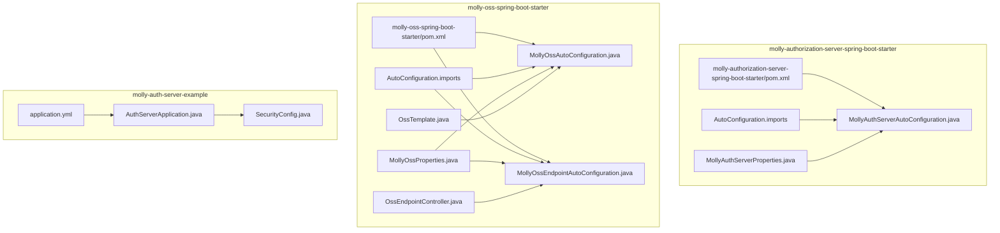
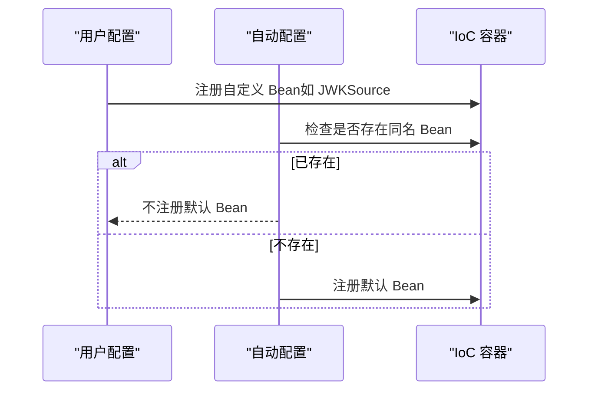
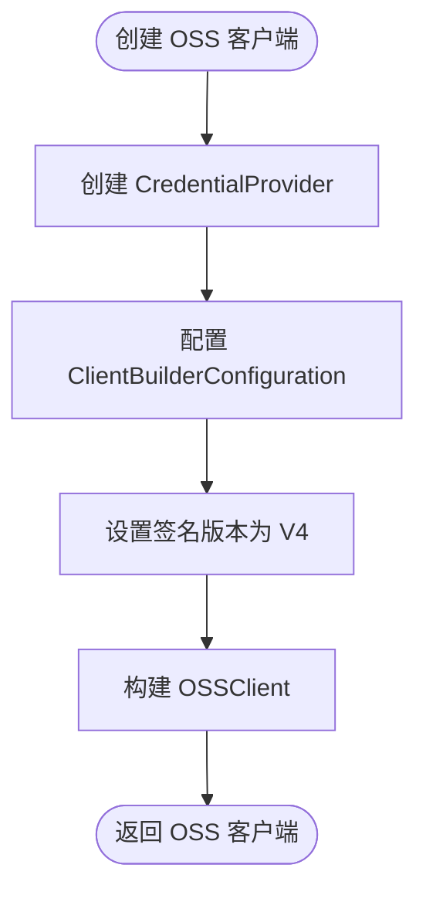
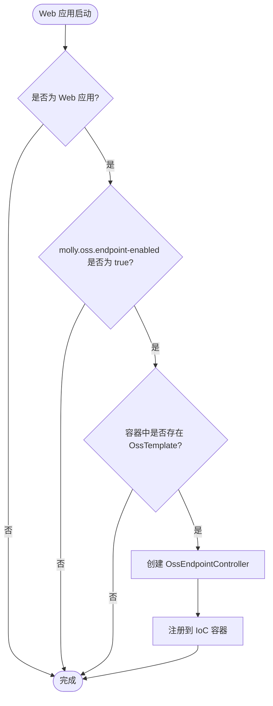
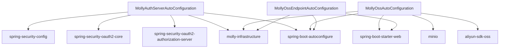

# 自动配置系统

<cite>
**本文引用的文件**
- [MollyAuthServerAutoConfiguration.java](file://molly-authorization-server-spring-boot-starter/src/main/java/cn/molly/security/auth/config/MollyAuthServerAutoConfiguration.java)
- [MollyAuthServerProperties.java](file://molly-authorization-server-spring-boot-starter/src/main/java/cn/molly/security/auth/properties/MollyAuthServerProperties.java)
- [org.springframework.boot.autoconfigure.AutoConfiguration.imports](file://molly-authorization-server-spring-boot-starter/src/main/resources/META-INF/spring/org.springframework.boot.autoconfigure.AutoConfiguration.imports)
- [molly-authorization-server-spring-boot-starter/pom.xml](file://molly-authorization-server-spring-boot-starter/pom.xml)
- [MollyOssAutoConfiguration.java](file://molly-oss-spring-boot-starter/src/main/java/cn/molly/oss/config/MollyOssAutoConfiguration.java)
- [MollyOssEndpointAutoConfiguration.java](file://molly-oss-spring-boot-starter/src/main/java/cn/molly/oss/config/MollyOssEndpointAutoConfiguration.java)
- [MollyOssProperties.java](file://molly-oss-spring-boot-starter/src/main/java/cn/molly/oss/properties/MollyOssProperties.java)
- [OssEndpointController.java](file://molly-oss-spring-boot-starter/src/main/java/cn/molly/oss/endpoint/OssEndpointController.java)
- [OssTemplate.java](file://molly-oss-spring-boot-starter/src/main/java/cn/molly/oss/core/OssTemplate.java)
- [org.springframework.boot.autoconfigure.AutoConfiguration.imports](file://molly-oss-spring-boot-starter/src/main/resources/META-INF/spring/org.springframework.boot.autoconfigure.AutoConfiguration.imports)
- [molly-oss-spring-boot-starter/pom.xml](file://molly-oss-spring-boot-starter/pom.xml)
- [application.yml](file://molly-auth-server-example/src/main/resources/application.yml)
- [AuthServerApplication.java](file://molly-auth-server-example/src/main/java/cn/molly/example/auth/AuthServerApplication.java)
- [SecurityConfig.java](file://molly-auth-server-example/src/main/java/cn/molly/example/auth/config/SecurityConfig.java)
</cite>

## 更新摘要
**变更内容**
- 新增对象存储启动器的自动配置系统分析
- 增加 MollyOssAutoConfiguration 和 MollyOssEndpointAutoConfiguration 的详细说明
- 添加对象存储配置属性和端点控制器的集成方式
- 扩展自动配置系统的应用场景和最佳实践

## 目录
1. [简介](#简介)
2. [项目结构](#项目结构)
3. [核心组件](#核心组件)
4. [架构总览](#架构总览)
5. [详细组件分析](#详细组件分析)
6. [对象存储自动配置系统](#对象存储自动配置系统)
7. [依赖分析](#依赖分析)
8. [性能考虑](#性能考虑)
9. [故障排查指南](#故障排查指南)
10. [结论](#结论)
11. [附录](#附录)

## 简介
本文件聚焦 Molly 框架的自动配置系统，围绕 MollyAuthServerAutoConfiguration 类展开，系统性解析其设计原理与实现机制，包括：
- @AutoConfiguration 注解的作用与生效路径
- 条件注解 @ConditionalOnClass、@ConditionalOnMissingBean 的使用策略
- 三大核心 Bean 的创建流程：AuthorizationServerSettings、JWKSource、OAuth2TokenCustomizer
- 自动配置优先级与 Bean 覆盖机制
- 如何通过自定义 Bean 扩展默认配置
- 性能优化建议与生产环境部署注意事项
- 面向 Spring Boot 开发者的最佳实践

**新增** 本版本还涵盖了对象存储启动器的自动配置系统，包括 MollyOssAutoConfiguration 和 MollyOssEndpointAutoConfiguration 的设计与实现。

## 项目结构
本仓库采用多模块组织，自动配置位于 molly-authorization-server-spring-boot-starter 模块，示例应用位于 molly-auth-server-example 模块。新增的对象存储启动器位于 molly-oss-spring-boot-starter 模块。关键文件如下：
- 认证服务器自动配置类：MollyAuthServerAutoConfiguration
- 认证服务器配置属性类：MollyAuthServerProperties
- 对象存储自动配置类：MollyOssAutoConfiguration
- 对象存储端点自动配置类：MollyOssEndpointAutoConfiguration
- 对象存储配置属性类：MollyOssProperties
- 对象存储端点控制器：OssEndpointController
- 对象存储模板接口：OssTemplate
- 自动配置导入清单：META-INF/spring/org.springframework.boot.autoconfigure.AutoConfiguration.imports
- 示例应用配置：application.yml
- 示例应用入口与安全配置：AuthServerApplication、SecurityConfig



**图表来源**
- [MollyAuthServerAutoConfiguration.java:1-161](file://molly-authorization-server-spring-boot-starter/src/main/java/cn/molly/security/auth/config/MollyAuthServerAutoConfiguration.java#L1-L161)
- [MollyOssAutoConfiguration.java:1-131](file://molly-oss-spring-boot-starter/src/main/java/cn/molly/oss/config/MollyOssAutoConfiguration.java#L1-L131)
- [MollyOssEndpointAutoConfiguration.java:1-45](file://molly-oss-spring-boot-starter/src/main/java/cn/molly/oss/config/MollyOssEndpointAutoConfiguration.java#L1-L45)
- [MollyOssProperties.java:1-142](file://molly-oss-spring-boot-starter/src/main/java/cn/molly/oss/properties/MollyOssProperties.java#L1-L142)
- [OssEndpointController.java:1-319](file://molly-oss-spring-boot-starter/src/main/java/cn/molly/oss/endpoint/OssEndpointController.java#L1-L319)
- [OssTemplate.java:1-164](file://molly-oss-spring-boot-starter/src/main/java/cn/molly/oss/core/OssTemplate.java#L1-L164)

## 核心组件
- 自动配置类：MollyAuthServerAutoConfiguration
  - 作用：为 Spring Boot 应用提供 Spring Authorization Server 的默认配置与核心 Bean
  - 关键特性：启用配置属性绑定、基于条件注解提供默认 Bean、允许用户覆盖
- 对象存储自动配置类：MollyOssAutoConfiguration
  - 作用：为 Spring Boot 应用提供对象存储服务的默认配置与核心 Bean
  - 关键特性：支持阿里云 OSS 和 MinIO 两种存储提供商、条件注解保护、Bean 覆盖机制
- 对象存储端点自动配置类：MollyOssEndpointAutoConfiguration
  - 作用：在 Web 应用环境中自动注册对象存储 HTTP 端点控制器
  - 关键特性：基于 Web 应用检测、端点开关控制、依赖 OssTemplate Bean
- 配置属性类：MollyAuthServerProperties
  - 作用：承载 molly.security.auth 前缀的配置项，当前包含 issuerUri
- 对象存储配置属性类：MollyOssProperties
  - 作用：承载 molly.oss 前缀的配置项，支持存储提供商切换、端点配置、文件上传限制等
- 自动配置导入清单：AutoConfiguration.imports
  - 作用：声明自动配置类，使 Spring Boot 在启动时发现并应用该配置

**章节来源**
- [MollyAuthServerAutoConfiguration.java:28-54](file://molly-authorization-server-spring-boot-starter/src/main/java/cn/molly/security/auth/config/MollyAuthServerAutoConfiguration.java#L28-L54)
- [MollyOssAutoConfiguration.java:21-33](file://molly-oss-spring-boot-starter/src/main/java/cn/molly/oss/config/MollyOssAutoConfiguration.java#L21-33)
- [MollyOssEndpointAutoConfiguration.java:13-25](file://molly-oss-spring-boot-starter/src/main/java/cn/molly/oss/config/MollyOssEndpointAutoConfiguration.java#L13-25)
- [MollyAuthServerProperties.java:14-24](file://molly-authorization-server-spring-boot-starter/src/main/java/cn/molly/security/auth/properties/MollyAuthServerProperties.java#L14-L24)
- [MollyOssProperties.java:8-16](file://molly-oss-spring-boot-starter/src/main/java/cn/molly/oss/properties/MollyOssProperties.java#L8-16)

## 架构总览
自动配置的装配路径与交互关系如下：

```mermaid
sequenceDiagram
participant SB as "Spring Boot"
participant AAC as "MollyAuthServerAutoConfiguration"
participant OAC as "MollyOssAutoConfiguration"
participant OEAC as "MollyOssEndpointAutoConfiguration"
participant CFG as "MollyAuthServerProperties/MollyOssProperties"
participant IOC as "IoC 容器"
participant AS as "AuthorizationServerSettings"
participant JWK as "JWKSource"
participant TC as "OAuth2TokenCustomizer"
participant OT as "OssTemplate"
participant OEC as "OssEndpointController"
SB->>AAC : 发现 AutoConfiguration.imports 并加载
SB->>OAC : 发现 AutoConfiguration.imports 并加载
OAC->>CFG : 绑定配置前缀 "molly.oss"
OAC->>IOC : 注册 Bean OssTemplate根据 provider 选择实现
OAC->>IOC : 注册 Bean OSS/MinioClient条件性注册
OEAC->>IOC : 注册 Bean OssEndpointControllerWeb 环境
AAC->>IOC : 注册 Bean AuthorizationServerSettings
AAC->>IOC : 注册 Bean JWKSource
AAC->>IOC : 注册 Bean OAuth2TokenCustomizer
Note over AAC,OAC,IOC : 所有 Bean 均受 @ConditionalOnMissingBean 保护，允许用户覆盖
```

**图表来源**
- [org.springframework.boot.autoconfigure.AutoConfiguration.imports:1-3](file://molly-oss-spring-boot-starter/src/main/resources/META-INF/spring/org.springframework.boot.autoconfigure.AutoConfiguration.imports#L1-L3)
- [MollyOssAutoConfiguration.java:34-131](file://molly-oss-spring-boot-starter/src/main/java/cn/molly/oss/config/MollyOssAutoConfiguration.java#L34-L131)
- [MollyOssEndpointAutoConfiguration.java:26-44](file://molly-oss-spring-boot-starter/src/main/java/cn/molly/oss/config/MollyOssEndpointAutoConfiguration.java#L26-L44)

## 详细组件分析

### @AutoConfiguration 与条件注解策略
- @AutoConfiguration：标记该类为自动配置类，Spring Boot 在启动时扫描并应用
- @ConditionalOnClass(OAuth2AuthorizationServerConfiguration.class)：仅当类路径存在 Spring Authorization Server 的核心配置类时才激活该自动配置，避免误触发
- @EnableConfigurationProperties(MollyAuthServerProperties.class)：启用配置属性绑定，将 application.yml 中的 molly.security.auth.* 映射到 MollyAuthServerProperties
- @ConditionalOnMissingBean：为每个默认 Bean 添加覆盖保护，若用户已提供同名 Bean，则优先使用用户定义的 Bean
- **新增** @ConditionalOnProperty：基于配置属性值激活特定配置组，如存储提供商选择

这些注解共同确保：
- 自动配置仅在满足前置条件时生效
- 默认 Bean 可被用户自定义 Bean 覆盖
- 配置属性与 Bean 生命周期解耦，便于扩展
- 多种存储提供商的灵活切换

**章节来源**
- [MollyAuthServerAutoConfiguration.java:51-54](file://molly-authorization-server-spring-boot-starter/src/main/java/cn/molly/security/auth/config/MollyAuthServerAutoConfiguration.java#L51-L54)
- [MollyOssAutoConfiguration.java:45-48](file://molly-oss-spring-boot-starter/src/main/java/cn/molly/oss/config/MollyOssAutoConfiguration.java#L45-L48)
- [MollyOssEndpointAutoConfiguration.java:27-29](file://molly-oss-spring-boot-starter/src/main/java/cn/molly/oss/config/MollyOssEndpointAutoConfiguration.java#L27-L29)

### AuthorizationServerSettings Bean
- 职责：定义授权服务器元数据，如 issuer URI
- 创建逻辑：从 MollyAuthServerProperties 读取 issuerUri，构建 AuthorizationServerSettings
- 覆盖策略：受 @ConditionalOnMissingBean 保护，用户可在自身配置中提供同名 Bean 覆盖默认值
- OIDC 合规性：issuer URI 必须与实际服务地址一致，否则客户端无法验证令牌来源


**图表来源**
- [MollyAuthServerAutoConfiguration.java:67-73](file://molly-authorization-server-spring-boot-starter/src/main/java/cn/molly/security/auth/config/MollyAuthServerAutoConfiguration.java#L67-L73)

**章节来源**
- [MollyAuthServerAutoConfiguration.java:67-73](file://molly-authorization-server-spring-boot-starter/src/main/java/cn/molly/security/auth/config/MollyAuthServerAutoConfiguration.java#L67-L73)
- [application.yml:6-11](file://molly-auth-server-example/src/main/resources/application.yml#L6-L11)

### JWKSource Bean（密钥生成机制）
- 职责：为 JWT 签名提供 JWK（JSON Web Key）来源
- 默认实现：在内存中动态生成 2048 位 RSA 密钥对，封装为 JWK 并返回选择器
- 安全性与生产建议：
  - 开发阶段开箱即用，无需额外配置
  - 生产环境强烈建议用户提供自定义 JWKSource Bean，从密钥库、数据库或 HSM 加载密钥
- 错误处理：密钥生成异常将包装为非法状态异常，提示配置或运行环境问题


**图表来源**
- [MollyAuthServerAutoConfiguration.java:86-92](file://molly-authorization-server-spring-boot-starter/src/main/java/cn/molly/security/auth/config/MollyAuthServerAutoConfiguration.java#L86-L92)
- [MollyAuthServerAutoConfiguration.java:130-158](file://molly-authorization-server-spring-boot-starter/src/main/java/cn/molly/security/auth/config/MollyAuthServerAutoConfiguration.java#L130-L158)

**章节来源**
- [MollyAuthServerAutoConfiguration.java:86-92](file://molly-authorization-server-spring-boot-starter/src/main/java/cn/molly/security/auth/config/MollyAuthServerAutoConfiguration.java#L86-L92)
- [MollyAuthServerAutoConfiguration.java:130-158](file://molly-authorization-server-spring-boot-starter/src/main/java/cn/molly/security/auth/config/MollyAuthServerAutoConfiguration.java#L130-L158)

### OAuth2TokenCustomizer Bean（令牌定制）
- 职责：在生成 Access Token 时注入自定义声明
- 默认实现：提取当前认证用户的权限集合，注入到名为 authorities 的声明中
- 扩展方式：用户可提供自定义 OAuth2TokenCustomizer Bean，实现更丰富的令牌内容（如用户 ID、部门信息等）


**图表来源**
- [MollyAuthServerAutoConfiguration.java:105-120](file://molly-authorization-server-spring-boot-starter/src/main/java/cn/molly/security/auth/config/MollyAuthServerAutoConfiguration.java#L105-L120)

**章节来源**
- [MollyAuthServerAutoConfiguration.java:105-120](file://molly-authorization-server-spring-boot-starter/src/main/java/cn/molly/security/auth/config/MollyAuthServerAutoConfiguration.java#L105-L120)

### Bean 覆盖与优先级规则
- 优先级顺序（从高到低）：
  1) 用户自定义 Bean（同名 Bean 明确覆盖）
  2) 自动配置提供的默认 Bean（受 @ConditionalOnMissingBean 保护）
- 触发条件：
  - 当容器中不存在同名 Bean 时，自动配置才会注册默认 Bean
  - 若用户已提供，自动配置不会重复注册，从而实现"用户优先"的覆盖机制



**图表来源**
- [MollyAuthServerAutoConfiguration.java:67-120](file://molly-authorization-server-spring-boot-starter/src/main/java/cn/molly/security/auth/config/MollyAuthServerAutoConfiguration.java#L67-L120)

**章节来源**
- [MollyAuthServerAutoConfiguration.java:67-120](file://molly-authorization-server-spring-boot-starter/src/main/java/cn/molly/security/auth/config/MollyAuthServerAutoConfiguration.java#L67-L120)

### 自定义 Bean 扩展示例（路径指引）
- 覆盖 AuthorizationServerSettings：在用户配置类中定义同名 Bean，提供自定义 issuer URI 或其他设置
  - 参考路径：[MollyAuthServerAutoConfiguration.java:67-73](file://molly-authorization-server-spring-boot-starter/src/main/java/cn/molly/security/auth/config/MollyAuthServerAutoConfiguration.java#L67-L73)
- 覆盖 JWKSource：提供自定义 JWKSource Bean，从密钥库或 HSM 加载密钥
  - 参考路径：[MollyAuthServerAutoConfiguration.java:86-92](file://molly-authorization-server-spring-boot-starter/src/main/java/cn/molly/security/auth/config/MollyAuthServerAutoConfiguration.java#L86-L92)
- 覆盖 OAuth2TokenCustomizer：提供自定义令牌定制逻辑，扩展声明内容
  - 参考路径：[MollyAuthServerAutoConfiguration.java:105-120](file://molly-authorization-server-spring-boot-starter/src/main/java/cn/molly/security/auth/config/MollyAuthServerAutoConfiguration.java#L105-L120)

**章节来源**
- [MollyAuthServerAutoConfiguration.java:67-120](file://molly-authorization-server-spring-boot-starter/src/main/java/cn/molly/security/auth/config/MollyAuthServerAutoConfiguration.java#L67-L120)

## 对象存储自动配置系统

### MollyOssAutoConfiguration 设计原理
MollyOssAutoConfiguration 是对象存储启动器的核心自动配置类，提供了灵活的存储提供商切换机制：

- **多提供商支持**：同时支持阿里云 OSS 和 MinIO 两种存储服务
- **条件激活机制**：基于 @ConditionalOnClass 和 @ConditionalOnProperty 注解实现智能激活
- **Bean 覆盖保护**：所有默认 Bean 均受 @ConditionalOnMissingBean 保护
- **配置驱动**：通过 molly.oss.provider 属性选择存储提供商


**图表来源**
- [MollyOssAutoConfiguration.java:34-131](file://molly-oss-spring-boot-starter/src/main/java/cn/molly/oss/config/MollyOssAutoConfiguration.java#L34-L131)

### 阿里云 OSS 配置组
阿里云 OSS 配置组提供了完整的阿里云存储服务集成：

- **客户端配置**：使用 V4 签名算法，通过 AccessKey 进行认证
- **连接配置**：支持自定义 Endpoint 地址和客户端配置
- **模板实现**：提供 AliyunOssTemplate 实现类
- **条件注解**：仅在类路径存在 OSS SDK 且 provider 为 aliyun 时激活



**图表来源**
- [MollyOssAutoConfiguration.java:58-73](file://molly-oss-spring-boot-starter/src/main/java/cn/molly/oss/config/MollyOssAutoConfiguration.java#L58-L73)

**章节来源**
- [MollyOssAutoConfiguration.java:45-87](file://molly-oss-spring-boot-starter/src/main/java/cn/molly/oss/config/MollyOssAutoConfiguration.java#L45-L87)

### MinIO 配置组
MinIO 配置组提供了 MinIO 对象存储服务的完整支持：

- **客户端配置**：使用 MinioClient.builder() 创建客户端
- **认证机制**：通过 AccessKey 和 SecretKey 进行认证
- **模板实现**：提供 MinioOssTemplate 实现类
- **条件注解**：仅在类路径存在 MinIO SDK 且 provider 为 minio 时激活

**章节来源**
- [MollyOssAutoConfiguration.java:96-129](file://molly-oss-spring-boot-starter/src/main/java/cn/molly/oss/config/MollyOssAutoConfiguration.java#L96-L129)

### MollyOssEndpointAutoConfiguration 端点配置
MollyOssEndpointAutoConfiguration 提供了对象存储的 HTTP 端点自动配置：

- **Web 环境检测**：仅在 Web 应用环境中激活
- **端点开关控制**：通过 molly.oss.endpoint-enabled 属性控制端点启用
- **依赖注入**：依赖 OssTemplate Bean 进行端点控制器创建
- **顺序控制**：使用 @AutoConfiguration(after = MollyOssAutoConfiguration.class) 确保正确的 Bean 创建顺序



**图表来源**
- [MollyOssEndpointAutoConfiguration.java:26-44](file://molly-oss-spring-boot-starter/src/main/java/cn/molly/oss/config/MollyOssEndpointAutoConfiguration.java#L26-L44)

**章节来源**
- [MollyOssEndpointAutoConfiguration.java:26-44](file://molly-oss-spring-boot-starter/src/main/java/cn/molly/oss/config/MollyOssEndpointAutoConfiguration.java#L26-L44)

### MollyOssProperties 配置属性
MollyOssProperties 提供了全面的对象存储配置支持：

- **存储提供商选择**：支持 aliyun 和 minio 两种提供商
- **默认存储桶**：配置默认存储桶名称
- **端点控制**：启用/禁用内置 HTTP 端点
- **文件上传限制**：最大文件大小、允许的文件类型白名单
- **缩略图配置**：缩略图生成的启用、宽高设置
- **提供商专属配置**：阿里云 OSS 和 MinIO 的独立配置项

**章节来源**
- [MollyOssProperties.java:17-142](file://molly-oss-spring-boot-starter/src/main/java/cn/molly/oss/properties/MollyOssProperties.java#L17-142)

### OssEndpointController 端点控制器
OssEndpointController 提供了完整的对象存储 HTTP 接口：

- **RESTful 接口**：提供上传、下载、缩略图、存在性检查、删除等接口
- **文件校验**：支持文件类型白名单和大小限制校验
- **去重上传**：基于 MD5 哈希的秒传功能
- **缩略图生成**：对图片文件自动生成缩略图
- **流式下载**：使用 StreamingResponseBody 实现大文件流式下载

**章节来源**
- [OssEndpointController.java:26-319](file://molly-oss-spring-boot-starter/src/main/java/cn/molly/oss/endpoint/OssEndpointController.java#L26-L319)

### OssTemplate 统一接口
OssTemplate 定义了对象存储的核心操作契约：

- **桶操作**：存储桶存在性检查、创建等
- **对象操作**：上传、下载、删除、元信息查询等
- **高级功能**：去重上传、缩略图 URL 获取等
- **跨提供商抽象**：为不同存储服务提供统一的操作接口

**章节来源**
- [OssTemplate.java:6-164](file://molly-oss-spring-boot-starter/src/main/java/cn/molly/oss/core/OssTemplate.java#L6-L164)

### Bean 覆盖与集成方式
对象存储自动配置同样遵循 Bean 覆盖机制：

- **用户自定义 Bean 优先**：用户提供的 OssTemplate、OSS、MinioClient 等 Bean 会覆盖默认实现
- **条件注解保护**：所有默认 Bean 均受 @ConditionalOnMissingBean 保护
- **集成方式**：用户可通过实现 OssTemplate 接口或提供自定义客户端 Bean 来扩展功能

**章节来源**
- [MollyOssAutoConfiguration.java:58-86](file://molly-oss-spring-boot-starter/src/main/java/cn/molly/oss/config/MollyOssAutoConfiguration.java#L58-L86)
- [MollyOssAutoConfiguration.java:107-128](file://molly-oss-spring-boot-starter/src/main/java/cn/molly/oss/config/MollyOssAutoConfiguration.java#L107-L128)

## 依赖分析
- 自动配置模块依赖
  - spring-security-oauth2-authorization-server：提供授权服务器核心能力
  - spring-boot-autoconfigure：提供 @AutoConfiguration、@ConditionalOnClass 等自动配置能力
  - spring-security-oauth2-core：提供令牌定制等核心能力
  - spring-security-config：提供安全配置支持
  - **新增** spring-boot-starter-web：提供 Web 应用支持，用于对象存储端点
  - **新增** com.aliyun.oss:aliyun-sdk-oss：阿里云 OSS SDK（可选依赖）
  - **新增** io.minio:minio：MinIO SDK（可选依赖）
  - molly-infrastructure：项目内部基础设施模块
- 版本与依赖管理
  - 顶层 pom.xml 管理 spring-boot-dependencies，统一版本
  - molly-authorization-server-spring-boot-starter/pom.xml 引入上述依赖
  - **新增** molly-oss-spring-boot-starter/pom.xml 引入 Web 和存储 SDK 依赖



**图表来源**
- [molly-authorization-server-spring-boot-starter/pom.xml:16-48](file://molly-authorization-server-spring-boot-starter/pom.xml#L16-L48)
- [molly-oss-spring-boot-starter/pom.xml:16-52](file://molly-oss-spring-boot-starter/pom.xml#L16-L52)
- [pom.xml:26-41](file://pom.xml#L26-L41)

**章节来源**
- [molly-authorization-server-spring-boot-starter/pom.xml:16-48](file://molly-authorization-server-spring-boot-starter/pom.xml#L16-L48)
- [molly-oss-spring-boot-starter/pom.xml:16-52](file://molly-oss-spring-boot-starter/pom.xml#L16-L52)
- [pom.xml:26-41](file://pom.xml#L26-L41)

## 性能考虑
- 密钥生成成本
  - 默认 JWKSource 在内存中生成 RSA 密钥对，适合开发环境；生产环境建议使用持久化密钥源，避免每次启动重新生成密钥
- 令牌定制开销
  - 默认的 OAuth2TokenCustomizer 仅在 access_token 时注入权限集合，复杂定制逻辑可能增加编码时间，建议按需扩展
- Bean 覆盖与初始化顺序
  - 用户自定义 Bean 会优先注册，减少自动配置的无谓工作量，提升启动效率
- 配置属性绑定
  - 通过 @EnableConfigurationProperties 绑定配置，避免在运行时频繁解析配置，提高稳定性
- **新增** 对象存储性能优化
  - **客户端复用**：推荐复用 OSS 和 Minio 客户端实例，避免频繁创建销毁
  - **连接池配置**：合理配置 SDK 连接池参数，平衡资源使用和性能
  - **异步上传**：对于大文件上传，建议使用异步方式避免阻塞主线程
  - **缓存策略**：对缩略图和常用对象建立适当的缓存策略
  - **网络优化**：根据存储提供商特点优化网络参数和超时设置

## 故障排查指南
- 无法加载自动配置
  - 检查 AutoConfiguration.imports 是否正确声明自动配置类
  - 确认类路径存在 OAuth2AuthorizationServerConfiguration
  - **新增** 检查对象存储 SDK 依赖是否正确引入
  - 参考：[org.springframework.boot.autoconfigure.AutoConfiguration.imports:1-3](file://molly-oss-spring-boot-starter/src/main/resources/META-INF/spring/org.springframework.boot.autoconfigure.AutoConfiguration.imports#L1-L3)
- issuer URI 不合规
  - 确保 application.yml 中的 issuer-uri 与服务实际地址一致
  - 参考：[application.yml:6-11](file://molly-auth-server-example/src/main/resources/application.yml#L6-L11)
- 密钥生成失败
  - 检查运行环境的加密算法支持与权限
  - 参考：[MollyAuthServerAutoConfiguration.java:148-158](file://molly-authorization-server-spring-boot-starter/src/main/java/cn/molly/security/auth/config/MollyAuthServerAutoConfiguration.java#L148-L158)
- 令牌缺少权限声明
  - 确认当前认证用户具备权限集合，且 OAuth2TokenCustomizer 未被用户自定义 Bean 覆盖
  - 参考：[MollyAuthServerAutoConfiguration.java:105-120](file://molly-authorization-server-spring-boot-starter/src/main/java/cn/molly/security/auth/config/MollyAuthServerAutoConfiguration.java#L105-L120)
- **新增** 对象存储配置问题
  - **提供商选择错误**：检查 molly.oss.provider 配置是否正确
  - **SDK 依赖缺失**：确认已引入对应的存储 SDK 依赖
  - **认证失败**：检查 AccessKey、SecretKey、Endpoint 等配置是否正确
  - **端点不可用**：确认 molly.oss.endpoint-enabled 为 true 且 Web 环境
  - **文件上传失败**：检查文件大小限制、类型白名单、存储桶权限等配置

**章节来源**
- [org.springframework.boot.autoconfigure.AutoConfiguration.imports:1-3](file://molly-oss-spring-boot-starter/src/main/resources/META-INF/spring/org.springframework.boot.autoconfigure.AutoConfiguration.imports#L1-L3)
- [application.yml:6-11](file://molly-auth-server-example/src/main/resources/application.yml#L6-L11)
- [MollyAuthServerAutoConfiguration.java:148-158](file://molly-authorization-server-spring-boot-starter/src/main/java/cn/molly/security/auth/config/MollyAuthServerAutoConfiguration.java#L148-L158)
- [MollyAuthServerAutoConfiguration.java:105-120](file://molly-authorization-server-spring-boot-starter/src/main/java/cn/molly/security/auth/config/MollyAuthServerAutoConfiguration.java#L105-L120)

## 结论
MollyAuthServerAutoConfiguration 通过合理的条件注解与 Bean 覆盖机制，为 Spring Authorization Server 提供了开箱即用的默认配置，同时保持高度可扩展性。开发者只需引入 starter 并提供必要的客户端与用户服务 Bean，即可快速搭建 OAuth2/OIDC 授权服务器。

**新增** 对象存储启动器进一步扩展了 Molly 框架的应用场景，提供了灵活的存储解决方案。通过条件注解和 Bean 覆盖机制，系统支持多种存储提供商的无缝切换，同时保持了良好的性能和可维护性。

生产环境建议：
- 明确配置 issuer URI
- 使用安全的密钥源替代内存生成
- 按需扩展令牌定制逻辑
- 在启动前完成密钥与配置的预热
- **新增** 合理配置对象存储客户端，优化上传和下载性能
- **新增** 根据业务需求选择合适的存储提供商和端点配置

## 附录
- 示例应用要点
  - 示例应用入口与安全配置展示了如何集成授权服务器与用户服务
  - 参考：[AuthServerApplication.java:15-21](file://molly-auth-server-example/src/main/java/cn/molly/example/auth/AuthServerApplication.java#L15-L21)，[SecurityConfig.java:42-164](file://molly-auth-server-example/src/main/java/cn/molly/example/auth/config/SecurityConfig.java#L42-L164)
- **新增** 对象存储配置示例
  - 阿里云 OSS 配置示例：provider=aliyun，配置 endpoint、accessKeyId、accessKeySecret
  - MinIO 配置示例：provider=minio，配置 endpoint、accessKey、secretKey
  - 端点控制示例：endpointEnabled=true/false 控制 HTTP 端点启用

**章节来源**
- [AuthServerApplication.java:15-21](file://molly-auth-server-example/src/main/java/cn/molly/example/auth/AuthServerApplication.java#L15-L21)
- [SecurityConfig.java:42-164](file://molly-auth-server-example/src/main/java/cn/molly/example/auth/config/SecurityConfig.java#L42-L164)