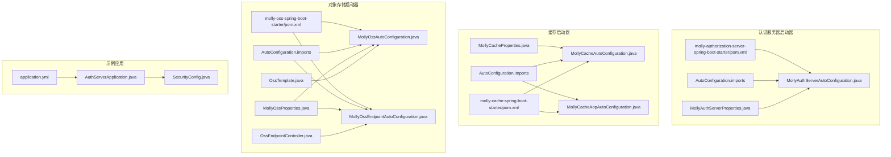
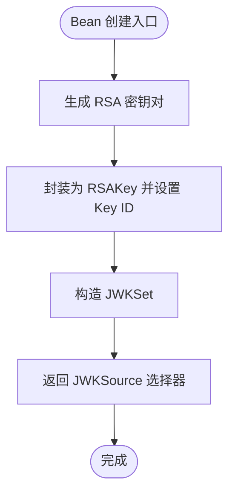
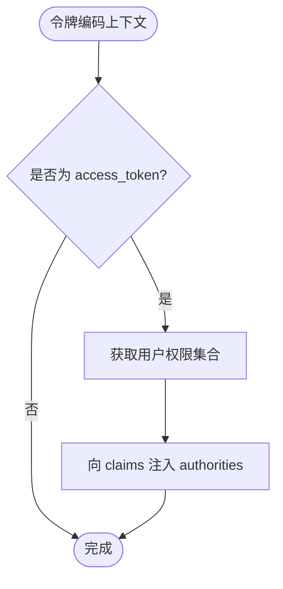
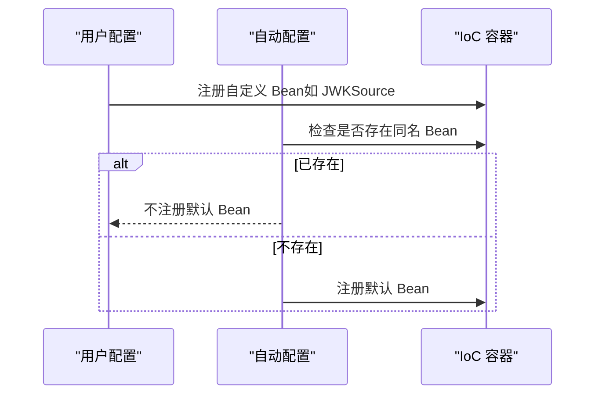
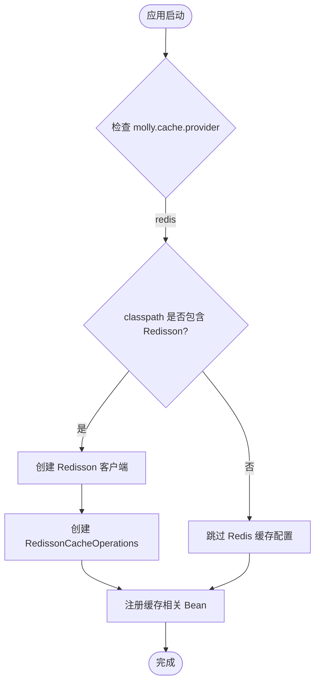
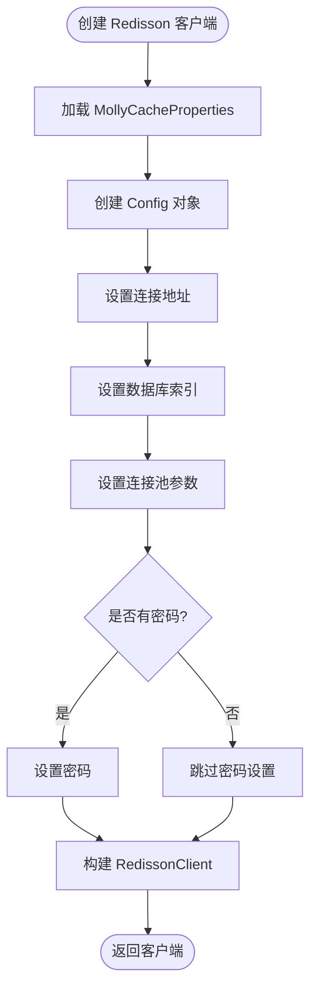
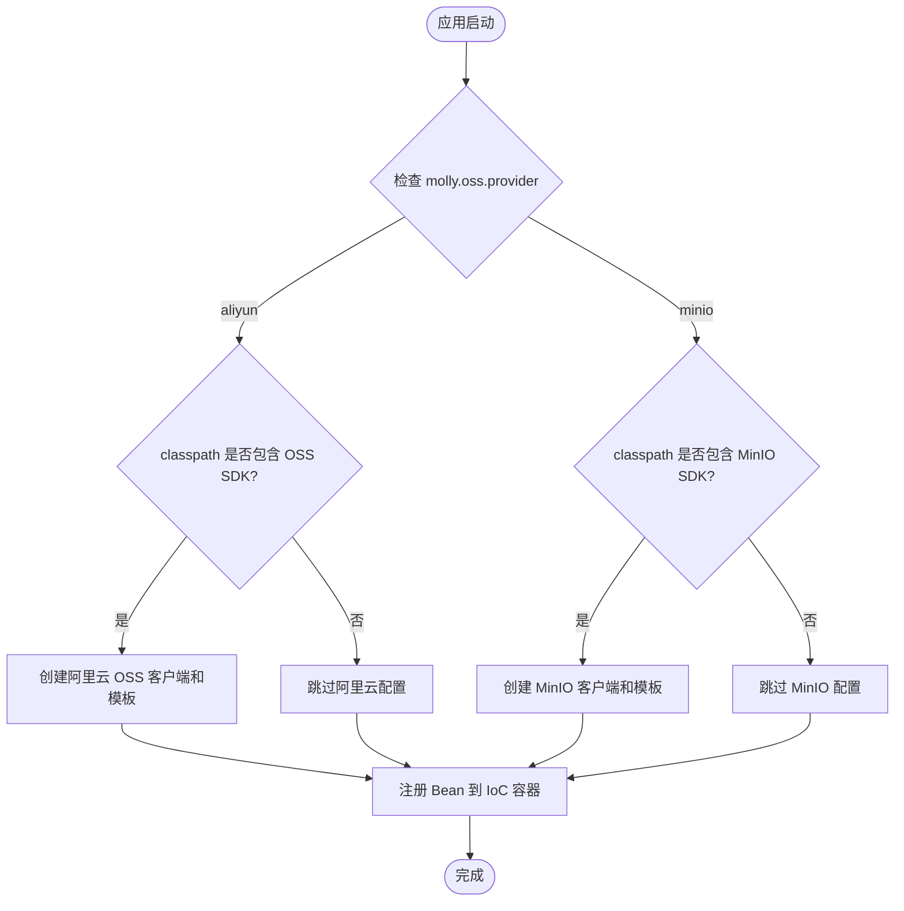

# 自动配置系统

<cite>
**本文引用的文件**
- [MollyAuthServerAutoConfiguration.java](file://molly-authorization-server-spring-boot-starter/src/main/java/cn/molly/security/auth/config/MollyAuthServerAutoConfiguration.java)
- [MollyAuthServerProperties.java](file://molly-authorization-server-spring-boot-starter/src/main/java/cn/molly/security/auth/properties/MollyAuthServerProperties.java)
- [org.springframework.boot.autoconfigure.AutoConfiguration.imports](file://molly-authorization-server-spring-boot-starter/src/main/resources/META-INF/spring/org.springframework.boot.autoconfigure.AutoConfiguration.imports)
- [molly-authorization-server-spring-boot-starter/pom.xml](file://molly-authorization-server-spring-boot-starter/pom.xml)
- [MollyOssAutoConfiguration.java](file://molly-oss-spring-boot-starter/src/main/java/cn/molly/oss/config/MollyOssAutoConfiguration.java)
- [MollyOssEndpointAutoConfiguration.java](file://molly-oss-spring-boot-starter/src/main/java/cn/molly/oss/config/MollyOssEndpointAutoConfiguration.java)
- [MollyOssProperties.java](file://molly-oss-spring-boot-starter/src/main/java/cn/molly/oss/properties/MollyOssProperties.java)
- [OssEndpointController.java](file://molly-oss-spring-boot-starter/src/main/java/cn/molly/oss/endpoint/OssEndpointController.java)
- [OssTemplate.java](file://molly-oss-spring-boot-starter/src/main/java/cn/molly/oss/core/OssTemplate.java)
- [org.springframework.boot.autoconfigure.AutoConfiguration.imports](file://molly-oss-spring-boot-starter/src/main/resources/META-INF/spring/org.springframework.boot.autoconfigure.AutoConfiguration.imports)
- [molly-oss-spring-boot-starter/pom.xml](file://molly-oss-spring-boot-starter/pom.xml)
- [MollyCacheAutoConfiguration.java](file://molly-cache-spring-boot-starter/src/main/java/cn/molly/cache/config/MollyCacheAutoConfiguration.java)
- [MollyCacheAopAutoConfiguration.java](file://molly-cache-spring-boot-starter/src/main/java/cn/molly/cache/config/MollyCacheAopAutoConfiguration.java)
- [MollyCacheProperties.java](file://molly-cache-spring-boot-starter/src/main/java/cn/molly/cache/properties/MollyCacheProperties.java)
- [org.springframework.boot.autoconfigure.AutoConfiguration.imports](file://molly-cache-spring-boot-starter/src/main/resources/META-INF/spring/org.springframework.boot.autoconfigure.AutoConfiguration.imports)
- [molly-cache-spring-boot-starter/pom.xml](file://molly-cache-spring-boot-starter/pom.xml)
- [application.yml](file://molly-auth-server-example/src/main/resources/application.yml)
- [AuthServerApplication.java](file://molly-auth-server-example/src/main/java/cn/molly/example/auth/AuthServerApplication.java)
- [SecurityConfig.java](file://molly-auth-server-example/src/main/java/cn/molly/example/auth/config/SecurityConfig.java)
</cite>

## 更新摘要
**变更内容**
- 新增缓存启动器的自动配置系统分析
- 扩展自动配置系统的应用场景，涵盖缓存、对象存储等多个领域
- 增强 Bean 覆盖机制和条件注解策略的说明
- 添加缓存模块的完整配置属性和实现细节
- 更新依赖分析，包含缓存和对象存储模块

## 目录
1. [简介](#简介)
2. [项目结构](#项目结构)
3. [核心组件](#核心组件)
4. [架构总览](#架构总览)
5. [详细组件分析](#详细组件分析)
6. [缓存自动配置系统](#缓存自动配置系统)
7. [对象存储自动配置系统](#对象存储自动配置系统)
8. [依赖分析](#依赖分析)
9. [性能考虑](#性能考虑)
10. [故障排查指南](#故障排查指南)
11. [结论](#结论)
12. [附录](#附录)

## 简介
本文件聚焦 Molly 框架的自动配置系统，围绕多个 Spring Boot 启动器展开，系统性解析其设计原理与实现机制，包括：
- @AutoConfiguration 注解的作用与生效路径
- 条件注解 @ConditionalOnClass、@ConditionalOnMissingBean、@ConditionalOnProperty 的使用策略
- 三大核心 Bean 的创建流程：AuthorizationServerSettings、JWKSource、OAuth2TokenCustomizer
- 自动配置优先级与 Bean 覆盖机制
- 如何通过自定义 Bean 扩展默认配置
- 缓存启动器的完整配置体系
- 对象存储启动器的多提供商支持
- 性能优化建议与生产环境部署注意事项
- 面向 Spring Boot 开发者的最佳实践

**新增** 本版本还涵盖了缓存启动器和对象存储启动器的自动配置系统，扩展了 Molly 框架的应用场景和技术栈。

## 项目结构
本仓库采用多模块组织，包含认证服务器、缓存和对象存储三个主要启动器模块。关键文件如下：
- 认证服务器自动配置类：MollyAuthServerAutoConfiguration
- 认证服务器配置属性类：MollyAuthServerProperties
- 缓存自动配置类：MollyCacheAutoConfiguration
- 缓存 AOP 自动配置类：MollyCacheAopAutoConfiguration
- 缓存配置属性类：MollyCacheProperties
- 对象存储自动配置类：MollyOssAutoConfiguration
- 对象存储端点自动配置类：MollyOssEndpointAutoConfiguration
- 对象存储配置属性类：MollyOssProperties
- 对象存储端点控制器：OssEndpointController
- 对象存储模板接口：OssTemplate
- 自动配置导入清单：META-INF/spring/org.springframework.boot.autoconfigure.AutoConfiguration.imports
- 示例应用配置：application.yml
- 示例应用入口与安全配置：AuthServerApplication、SecurityConfig



**图表来源**
- [MollyAuthServerAutoConfiguration.java:1-161](file://molly-authorization-server-spring-boot-starter/src/main/java/cn/molly/security/auth/config/MollyAuthServerAutoConfiguration.java#L1-L161)
- [MollyCacheAutoConfiguration.java:1-131](file://molly-cache-spring-boot-starter/src/main/java/cn/molly/cache/config/MollyCacheAutoConfiguration.java#L1-L131)
- [MollyCacheAopAutoConfiguration.java:1-56](file://molly-cache-spring-boot-starter/src/main/java/cn/molly/cache/config/MollyCacheAopAutoConfiguration.java#L1-L56)
- [MollyOssAutoConfiguration.java:1-131](file://molly-oss-spring-boot-starter/src/main/java/cn/molly/oss/config/MollyOssAutoConfiguration.java#L1-L131)
- [MollyOssEndpointAutoConfiguration.java:1-45](file://molly-oss-spring-boot-starter/src/main/java/cn/molly/oss/config/MollyOssEndpointAutoConfiguration.java#L1-L45)

## 核心组件
- 自动配置类：MollyAuthServerAutoConfiguration
  - 作用：为 Spring Boot 应用提供 Spring Authorization Server 的默认配置与核心 Bean
  - 关键特性：启用配置属性绑定、基于条件注解提供默认 Bean、允许用户覆盖
- 缓存自动配置类：MollyCacheAutoConfiguration
  - 作用：为 Spring Boot 应用提供基于 Redisson 的缓存服务默认配置
  - 关键特性：支持 Redis 缓存实现、条件注解保护、Bean 覆盖机制、事务后置失效
- 缓存 AOP 自动配置类：MollyCacheAopAutoConfiguration
  - 作用：为缓存注解提供 AOP 切面支持，包括主缓存切面和分布式锁切面
  - 关键特性：基于 AspectJ 的动态代理、顺序控制、条件激活
- 对象存储自动配置类：MollyOssAutoConfiguration
  - 作用：为 Spring Boot 应用提供对象存储服务的默认配置与核心 Bean
  - 关键特性：支持阿里云 OSS 和 MinIO 两种存储提供商、条件注解保护、Bean 覆盖机制
- 对象存储端点自动配置类：MollyOssEndpointAutoConfiguration
  - 作用：在 Web 应用环境中自动注册对象存储 HTTP 端点控制器
  - 关键特性：基于 Web 应用检测、端点开关控制、依赖 OssTemplate Bean
- 配置属性类：MollyAuthServerProperties
  - 作用：承载 molly.security.auth 前缀的配置项，当前包含 issuerUri
- 缓存配置属性类：MollyCacheProperties
  - 作用：承载 molly.cache 前缀的配置项，支持缓存提供商切换、Redisson 连接配置、分布式锁等
- 对象存储配置属性类：MollyOssProperties
  - 作用：承载 molly.oss 前缀的配置项，支持存储提供商切换、端点配置、文件上传限制等
- 自动配置导入清单：AutoConfiguration.imports
  - 作用：声明自动配置类，使 Spring Boot 在启动时发现并应用该配置

**章节来源**
- [MollyAuthServerAutoConfiguration.java:28-54](file://molly-authorization-server-spring-boot-starter/src/main/java/cn/molly/security/auth/config/MollyAuthServerAutoConfiguration.java#L28-L54)
- [MollyCacheAutoConfiguration.java:22-33](file://molly-cache-spring-boot-starter/src/main/java/cn/molly/cache/config/MollyCacheAutoConfiguration.java#L22-L33)
- [MollyCacheAopAutoConfiguration.java:15-28](file://molly-cache-spring-boot-starter/src/main/java/cn/molly/cache/config/MollyCacheAopAutoConfiguration.java#L15-L28)
- [MollyOssAutoConfiguration.java:21-36](file://molly-oss-spring-boot-starter/src/main/java/cn/molly/oss/config/MollyOssAutoConfiguration.java#L21-L36)
- [MollyOssEndpointAutoConfiguration.java:13-26](file://molly-oss-spring-boot-starter/src/main/java/cn/molly/oss/config/MollyOssEndpointAutoConfiguration.java#L13-L26)
- [MollyAuthServerProperties.java:14-24](file://molly-authorization-server-spring-boot-starter/src/main/java/cn/molly/security/auth/properties/MollyAuthServerProperties.java#L14-L24)
- [MollyCacheProperties.java:8-26](file://molly-cache-spring-boot-starter/src/main/java/cn/molly/cache/properties/MollyCacheProperties.java#L8-L26)
- [MollyOssProperties.java:8-19](file://molly-oss-spring-boot-starter/src/main/java/cn/molly/oss/properties/MollyOssProperties.java#L8-L19)

## 架构总览
自动配置的装配路径与交互关系如下：

```mermaid
sequenceDiagram
participant SB as "Spring Boot"
participant AAC as "MollyAuthServerAutoConfiguration"
participant CAC as "MollyCacheAutoConfiguration"
participant CAAC as "MollyCacheAopAutoConfiguration"
participant OAC as "MollyOssAutoConfiguration"
participant OEAC as "MollyOssEndpointAutoConfiguration"
participant CFG as "配置属性类"
participant IOC as "IoC 容器"
participant AS as "AuthorizationServerSettings"
participant JWK as "JWKSource"
participant TC as "OAuth2TokenCustomizer"
participant CT as "CacheTemplate"
participant CA as "MollyCacheAspect"
participant CLA as "MollyCacheLockAspect"
participant OT as "OssTemplate"
participant OEC as "OssEndpointController"
SB->>AAC : 发现 AutoConfiguration.imports 并加载
SB->>CAC : 发现 AutoConfiguration.imports 并加载
SB->>CAAC : 发现 AutoConfiguration.imports 并加载
SB->>OAC : 发现 AutoConfiguration.imports 并加载
SB->>OEAC : 发现 AutoConfiguration.imports 并加载
CAC->>CFG : 绑定配置前缀 "molly.cache"
OAC->>CFG : 绑定配置前缀 "molly.oss"
CAC->>IOC : 注册 Bean CacheTemplate、CacheKeyGenerator 等
CAAC->>IOC : 注册 Bean MollyCacheAspect、MollyCacheLockAspect
OAC->>IOC : 注册 Bean OssTemplate 根据 provider 选择实现
OAC->>IOC : 注册 Bean OSS/MinioClient 条件性注册
OEAC->>IOC : 注册 Bean OssEndpointController Web 环境
AAC->>IOC : 注册 Bean AuthorizationServerSettings
AAC->>IOC : 注册 Bean JWKSource
AAC->>IOC : 注册 Bean OAuth2TokenCustomizer
Note over AAC,CAC,OAC,IOC : 所有 Bean 均受 @ConditionalOnMissingBean 保护，允许用户覆盖
```

**图表来源**
- [org.springframework.boot.autoconfigure.AutoConfiguration.imports:1-3](file://molly-oss-spring-boot-starter/src/main/resources/META-INF/spring/org.springframework.boot.autoconfigure.AutoConfiguration.imports#L1-L3)
- [MollyCacheAutoConfiguration.java:34-131](file://molly-cache-spring-boot-starter/src/main/java/cn/molly/cache/config/MollyCacheAutoConfiguration.java#L34-L131)
- [MollyCacheAopAutoConfiguration.java:24-56](file://molly-cache-spring-boot-starter/src/main/java/cn/molly/cache/config/MollyCacheAopAutoConfiguration.java#L24-L56)
- [MollyOssAutoConfiguration.java:34-131](file://molly-oss-spring-boot-starter/src/main/java/cn/molly/oss/config/MollyOssAutoConfiguration.java#L34-L131)
- [MollyOssEndpointAutoConfiguration.java:26-44](file://molly-oss-spring-boot-starter/src/main/java/cn/molly/oss/config/MollyOssEndpointAutoConfiguration.java#L26-L44)

## 详细组件分析

### @AutoConfiguration 与条件注解策略
- @AutoConfiguration：标记该类为自动配置类，Spring Boot 在启动时扫描并应用
- @ConditionalOnClass：仅当类路径存在指定类时才激活配置，避免误触发
- @ConditionalOnMissingBean：为每个默认 Bean 添加覆盖保护，若用户已提供同名 Bean，则优先使用用户定义的 Bean
- @ConditionalOnProperty：基于配置属性值激活特定配置组，如存储提供商选择
- @EnableConfigurationProperties：启用配置属性绑定，将 application.yml 中的配置映射到属性类
- @AutoConfigureAfter：控制自动配置的执行顺序，确保依赖关系正确

这些注解共同确保：
- 自动配置仅在满足前置条件时生效
- 默认 Bean 可被用户自定义 Bean 覆盖
- 配置属性与 Bean 生命周期解耦，便于扩展
- 多种存储提供商的灵活切换
- AOP 切面的正确顺序加载

**章节来源**
- [MollyAuthServerAutoConfiguration.java:51-54](file://molly-authorization-server-spring-boot-starter/src/main/java/cn/molly/security/auth/config/MollyAuthServerAutoConfiguration.java#L51-L54)
- [MollyCacheAutoConfiguration.java:14-18](file://molly-cache-spring-boot-starter/src/main/java/cn/molly/cache/config/MollyCacheAutoConfiguration.java#L14-L18)
- [MollyCacheAopAutoConfiguration.java:8-13](file://molly-cache-spring-boot-starter/src/main/java/cn/molly/cache/config/MollyCacheAopAutoConfiguration.java#L8-L13)
- [MollyOssAutoConfiguration.java:45-48](file://molly-oss-spring-boot-starter/src/main/java/cn/molly/oss/config/MollyOssAutoConfiguration.java#L45-L48)
- [MollyOssEndpointAutoConfiguration.java:27-29](file://molly-oss-spring-boot-starter/src/main/java/cn/molly/oss/config/MollyOssEndpointAutoConfiguration.java#L27-L29)

### AuthorizationServerSettings Bean
- 职责：定义授权服务器元数据，如 issuer URI
- 创建逻辑：从 MollyAuthServerProperties 读取 issuerUri，构建 AuthorizationServerSettings
- 覆盖策略：受 @ConditionalOnMissingBean 保护，用户可在自身配置中提供同名 Bean 覆盖默认值
- OIDC 合规性：issuer URI 必须与实际服务地址一致，否则客户端无法验证令牌来源


**图表来源**
- [MollyAuthServerAutoConfiguration.java:67-73](file://molly-authorization-server-spring-boot-starter/src/main/java/cn/molly/security/auth/config/MollyAuthServerAutoConfiguration.java#L67-L73)

**章节来源**
- [MollyAuthServerAutoConfiguration.java:67-73](file://molly-authorization-server-spring-boot-starter/src/main/java/cn/molly/security/auth/config/MollyAuthServerAutoConfiguration.java#L67-L73)
- [application.yml:6-11](file://molly-auth-server-example/src/main/resources/application.yml#L6-L11)

### JWKSource Bean（密钥生成机制）
- 职责：为 JWT 签名提供 JWK（JSON Web Key）来源
- 默认实现：在内存中动态生成 2048 位 RSA 密钥对，封装为 JWK 并返回选择器
- 安全性与生产建议：
  - 开发阶段开箱即用，无需额外配置
  - 生产环境强烈建议用户提供自定义 JWKSource Bean，从密钥库、数据库或 HSM 加载密钥
- 错误处理：密钥生成异常将包装为非法状态异常，提示配置或运行环境问题



**图表来源**
- [MollyAuthServerAutoConfiguration.java:86-92](file://molly-authorization-server-spring-boot-starter/src/main/java/cn/molly/security/auth/config/MollyAuthServerAutoConfiguration.java#L86-L92)
- [MollyAuthServerAutoConfiguration.java:130-158](file://molly-authorization-server-spring-boot-starter/src/main/java/cn/molly/security/auth/config/MollyAuthServerAutoConfiguration.java#L130-L158)

**章节来源**
- [MollyAuthServerAutoConfiguration.java:86-92](file://molly-authorization-server-spring-boot-starter/src/main/java/cn/molly/security/auth/config/MollyAuthServerAutoConfiguration.java#L86-L92)
- [MollyAuthServerAutoConfiguration.java:130-158](file://molly-authorization-server-spring-boot-starter/src/main/java/cn/molly/security/auth/config/MollyAuthServerAutoConfiguration.java#L130-L158)

### OAuth2TokenCustomizer Bean（令牌定制）
- 职责：在生成 Access Token 时注入自定义声明
- 默认实现：提取当前认证用户的权限集合，注入到名为 authorities 的声明中
- 扩展方式：用户可提供自定义 OAuth2TokenCustomizer Bean，实现更丰富的令牌内容（如用户 ID、部门信息等）



**图表来源**
- [MollyAuthServerAutoConfiguration.java:105-120](file://molly-authorization-server-spring-boot-starter/src/main/java/cn/molly/security/auth/config/MollyAuthServerAutoConfiguration.java#L105-L120)

**章节来源**
- [MollyAuthServerAutoConfiguration.java:105-120](file://molly-authorization-server-spring-boot-starter/src/main/java/cn/molly/security/auth/config/MollyAuthServerAutoConfiguration.java#L105-L120)

### Bean 覆盖与优先级规则
- 优先级顺序（从高到低）：
  1) 用户自定义 Bean（同名 Bean 明确覆盖）
  2) 自动配置提供的默认 Bean（受 @ConditionalOnMissingBean 保护）
- 触发条件：
  - 当容器中不存在同名 Bean 时，自动配置才会注册默认 Bean
  - 若用户已提供，自动配置不会重复注册，从而实现"用户优先"的覆盖机制



**图表来源**
- [MollyAuthServerAutoConfiguration.java:67-120](file://molly-authorization-server-spring-boot-starter/src/main/java/cn/molly/security/auth/config/MollyAuthServerAutoConfiguration.java#L67-L120)

**章节来源**
- [MollyAuthServerAutoConfiguration.java:67-120](file://molly-authorization-server-spring-boot-starter/src/main/java/cn/molly/security/auth/config/MollyAuthServerAutoConfiguration.java#L67-L120)

### 自定义 Bean 扩展示例（路径指引）
- 覆盖 AuthorizationServerSettings：在用户配置类中定义同名 Bean，提供自定义 issuer URI 或其他设置
  - 参考路径：[MollyAuthServerAutoConfiguration.java:67-73](file://molly-authorization-server-spring-boot-starter/src/main/java/cn/molly/security/auth/config/MollyAuthServerAutoConfiguration.java#L67-L73)
- 覆盖 JWKSource：提供自定义 JWKSource Bean，从密钥库或 HSM 加载密钥
  - 参考路径：[MollyAuthServerAutoConfiguration.java:86-92](file://molly-authorization-server-spring-boot-starter/src/main/java/cn/molly/security/auth/config/MollyAuthServerAutoConfiguration.java#L86-L92)
- 覆盖 OAuth2TokenCustomizer：提供自定义令牌定制逻辑，扩展声明内容
  - 参考路径：[MollyAuthServerAutoConfiguration.java:105-120](file://molly-authorization-server-spring-boot-starter/src/main/java/cn/molly/security/auth/config/MollyAuthServerAutoConfiguration.java#L105-L120)

**章节来源**
- [MollyAuthServerAutoConfiguration.java:67-120](file://molly-authorization-server-spring-boot-starter/src/main/java/cn/molly/security/auth/config/MollyAuthServerAutoConfiguration.java#L67-L120)

## 缓存自动配置系统

### MollyCacheAutoConfiguration 设计原理
MollyCacheAutoConfiguration 是缓存启动器的核心自动配置类，提供了完整的缓存服务配置：

- **Redis 缓存实现**：默认基于 Redisson 提供 Redis 缓存支持
- **条件激活机制**：基于 @ConditionalOnClass 和 @ConditionalOnProperty 注解实现智能激活
- **Bean 覆盖保护**：所有默认 Bean 均受 @ConditionalOnMissingBean 保护
- **配置驱动**：通过 molly.cache.provider 属性选择缓存提供商
- **事务支持**：提供事务感知的缓存刷新器，支持 afterCommit 语义



**图表来源**
- [MollyCacheAutoConfiguration.java:88-129](file://molly-cache-spring-boot-starter/src/main/java/cn/molly/cache/config/MollyCacheAutoConfiguration.java#L88-L129)

### 缓存核心组件
缓存自动配置提供了完整的缓存组件体系：

- **TransactionAwareCacheFlusher**：事务感知的缓存刷新器，支持 afterCommit 语义
- **SpelEvaluator**：SpEL 表达式求值器，用于缓存注解的表达式计算
- **CacheKeyGenerator**：缓存键生成器，基于配置属性生成标准化的缓存键
- **CacheTemplate**：缓存门面，提供统一的缓存操作接口
- **RedissonCacheOperations**：Redisson 实现的缓存操作 SPI

**章节来源**
- [MollyCacheAutoConfiguration.java:41-86](file://molly-cache-spring-boot-starter/src/main/java/cn/molly/cache/config/MollyCacheAutoConfiguration.java#L41-L86)

### Redisson 客户端配置
Redisson 客户端配置提供了灵活的 Redis 连接选项：

- **单机模式**：支持基本的 Redis 单机连接配置
- **连接参数**：支持地址、数据库索引、密码、连接池大小等配置
- **条件注解**：仅在类路径存在 Redisson 且 provider 为 redis 时激活
- **Bean 覆盖**：用户可提供自定义 RedissonClient Bean



**图表来源**
- [MollyCacheAutoConfiguration.java:102-116](file://molly-cache-spring-boot-starter/src/main/java/cn/molly/cache/config/MollyCacheAutoConfiguration.java#L102-L116)

**章节来源**
- [MollyCacheAutoConfiguration.java:102-116](file://molly-cache-spring-boot-starter/src/main/java/cn/molly/cache/config/MollyCacheAutoConfiguration.java#L102-L116)

### MollyCacheProperties 配置属性
MollyCacheProperties 提供了全面的缓存配置支持：

- **缓存提供商**：当前支持 REDIS 提供商
- **命名空间配置**：支持 keyPrefix、separator 等命名空间配置
- **TTL 配置**：支持默认 TTL、抖动系数等 TTL 管理
- **空值缓存**：支持防穿透的空值占位缓存
- **分布式锁**：支持防击穿的分布式锁配置
- **Redisson 连接**：支持 Redisson 客户端的连接参数配置

**章节来源**
- [MollyCacheProperties.java:24-154](file://molly-cache-spring-boot-starter/src/main/java/cn/molly/cache/properties/MollyCacheProperties.java#L24-L154)

### Bean 覆盖与集成方式
缓存自动配置同样遵循 Bean 覆盖机制：

- **用户自定义 Bean 优先**：用户提供的 CacheOperations、RedissonClient 等 Bean 会覆盖默认实现
- **条件注解保护**：所有默认 Bean 均受 @ConditionalOnMissingBean 保护
- **集成方式**：用户可通过实现 CacheOperations 接口或提供自定义 RedissonClient Bean 来扩展功能

**章节来源**
- [MollyCacheAutoConfiguration.java:102-116](file://molly-cache-spring-boot-starter/src/main/java/cn/molly/cache/config/MollyCacheAutoConfiguration.java#L102-L116)
- [MollyCacheAutoConfiguration.java:124-128](file://molly-cache-spring-boot-starter/src/main/java/cn/molly/cache/config/MollyCacheAutoConfiguration.java#L124-L128)

## 对象存储自动配置系统

### MollyOssAutoConfiguration 设计原理
MollyOssAutoConfiguration 是对象存储启动器的核心自动配置类，提供了灵活的存储提供商切换机制：

- **多提供商支持**：同时支持阿里云 OSS 和 MinIO 两种存储服务
- **条件激活机制**：基于 @ConditionalOnClass 和 @ConditionalOnProperty 注解实现智能激活
- **Bean 覆盖保护**：所有默认 Bean 均受 @ConditionalOnMissingBean 保护
- **配置驱动**：通过 molly.oss.provider 属性选择存储提供商



**图表来源**
- [MollyOssAutoConfiguration.java:34-131](file://molly-oss-spring-boot-starter/src/main/java/cn/molly/oss/config/MollyOssAutoConfiguration.java#L34-L131)

### 阿里云 OSS 配置组
阿里云 OSS 配置组提供了完整的阿里云存储服务集成：

- **客户端配置**：使用 V4 签名算法，通过 AccessKey 进行认证
- **连接配置**：支持自定义 Endpoint 地址和客户端配置
- **模板实现**：提供 AliyunOssTemplate 实现类
- **条件注解**：仅在类路径存在 OSS SDK 且 provider 为 aliyun 时激活


**图表来源**
- [MollyOssAutoConfiguration.java:58-73](file://molly-oss-spring-boot-starter/src/main/java/cn/molly/oss/config/MollyOssAutoConfiguration.java#L58-73)

**章节来源**
- [MollyOssAutoConfiguration.java:45-87](file://molly-oss-spring-boot-starter/src/main/java/cn/molly/oss/config/MollyOssAutoConfiguration.java#L45-L87)

### MinIO 配置组
MinIO 配置组提供了 MinIO 对象存储服务的完整支持：

- **客户端配置**：使用 MinioClient.builder() 创建客户端
- **认证机制**：通过 AccessKey 和 SecretKey 进行认证
- **模板实现**：提供 MinioOssTemplate 实现类
- **条件注解**：仅在类路径存在 MinIO SDK 且 provider 为 minio 时激活

**章节来源**
- [MollyOssAutoConfiguration.java:96-129](file://molly-oss-spring-boot-starter/src/main/java/cn/molly/oss/config/MollyOssAutoConfiguration.java#L96-L129)

### MollyOssEndpointAutoConfiguration 端点配置
MollyOssEndpointAutoConfiguration 提供了对象存储的 HTTP 端点自动配置：

- **Web 环境检测**：仅在 Web 应用环境中激活
- **端点开关控制**：通过 molly.oss.endpoint-enabled 属性控制端点启用
- **依赖注入**：依赖 OssTemplate Bean 进行端点控制器创建
- **顺序控制**：使用 @AutoConfiguration(after = MollyOssAutoConfiguration.class) 确保正确的 Bean 创建顺序


**图表来源**
- [MollyOssEndpointAutoConfiguration.java:26-44](file://molly-oss-spring-boot-starter/src/main/java/cn/molly/oss/config/MollyOssEndpointAutoConfiguration.java#L26-L44)

**章节来源**
- [MollyOssEndpointAutoConfiguration.java:26-44](file://molly-oss-spring-boot-starter/src/main/java/cn/molly/oss/config/MollyOssEndpointAutoConfiguration.java#L26-L44)

### MollyOssProperties 配置属性
MollyOssProperties 提供了全面的对象存储配置支持：

- **存储提供商选择**：支持 aliyun 和 minio 两种提供商
- **默认存储桶**：配置默认存储桶名称
- **端点控制**：启用/禁用内置 HTTP 端点
- **文件上传限制**：最大文件大小、允许的文件类型白名单
- **缩略图配置**：缩略图生成的启用、宽高设置
- **提供商专属配置**：阿里云 OSS 和 MinIO 的独立配置项

**章节来源**
- [MollyOssProperties.java:17-142](file://molly-oss-spring-boot-starter/src/main/java/cn/molly/oss/properties/MollyOssProperties.java#L17-142)

### OssEndpointController 端点控制器
OssEndpointController 提供了完整的对象存储 HTTP 接口：

- **RESTful 接口**：提供上传、下载、缩略图、存在性检查、删除等接口
- **文件校验**：支持文件类型白名单和大小限制校验
- **去重上传**：基于 MD5 哈希的秒传功能
- **缩略图生成**：对图片文件自动生成缩略图
- **流式下载**：使用 StreamingResponseBody 实现大文件流式下载

**章节来源**
- [OssEndpointController.java:26-319](file://molly-oss-spring-boot-starter/src/main/java/cn/molly/oss/endpoint/OssEndpointController.java#L26-L319)

### OssTemplate 统一接口
OssTemplate 定义了对象存储的核心操作契约：

- **桶操作**：存储桶存在性检查、创建等
- **对象操作**：上传、下载、删除、元信息查询等
- **高级功能**：去重上传、缩略图 URL 获取等
- **跨提供商抽象**：为不同存储服务提供统一的操作接口

**章节来源**
- [OssTemplate.java:6-164](file://molly-oss-spring-boot-starter/src/main/java/cn/molly/oss/core/OssTemplate.java#L6-L164)

### Bean 覆盖与集成方式
对象存储自动配置同样遵循 Bean 覆盖机制：

- **用户自定义 Bean 优先**：用户提供的 OssTemplate、OSS、MinioClient 等 Bean 会覆盖默认实现
- **条件注解保护**：所有默认 Bean 均受 @ConditionalOnMissingBean 保护
- **集成方式**：用户可通过实现 OssTemplate 接口或提供自定义客户端 Bean 来扩展功能

**章节来源**
- [MollyOssAutoConfiguration.java:58-86](file://molly-oss-spring-boot-starter/src/main/java/cn/molly/oss/config/MollyOssAutoConfiguration.java#L58-L86)
- [MollyOssAutoConfiguration.java:107-128](file://molly-oss-spring-boot-starter/src/main/java/cn/molly/oss/config/MollyOssAutoConfiguration.java#L107-L128)

## 依赖分析
- 自动配置模块依赖
  - spring-security-oauth2-authorization-server：提供授权服务器核心能力
  - spring-boot-autoconfigure：提供 @AutoConfiguration、@ConditionalOnClass 等自动配置能力
  - spring-security-oauth2-core：提供令牌定制等核心能力
  - spring-security-config：提供安全配置支持
  - **新增** spring-boot-starter-web：提供 Web 应用支持，用于对象存储端点
  - **新增** spring-boot-starter-aop：提供 AOP 支持，用于缓存切面
  - **新增** spring-boot-configuration-processor：提供配置属性 IDE 支持
  - **新增** spring-tx：提供事务支持，用于缓存事务后置失效
  - **新增** org.redisson:redisson：Redisson 客户端（可选依赖）
  - **新增** com.aliyun.oss:aliyun-sdk-oss：阿里云 OSS SDK（可选依赖）
  - **新增** io.minio:minio：MinIO SDK（可选依赖）
  - molly-infrastructure：项目内部基础设施模块
- 版本与依赖管理
  - 顶层 pom.xml 管理 spring-boot-dependencies，统一版本
  - 各模块 pom.xml 引入上述依赖
  - 缓存和对象存储模块均采用可选依赖策略，避免强制依赖

```mermaid
graph TB
AAC["MollyAuthServerAutoConfiguration"]
CAC["MollyCacheAutoConfiguration"]
CAAC["MollyCacheAopAutoConfiguration"]
OAC["MollyOssAutoConfiguration"]
OEAC["MollyOssEndpointAutoConfiguration"]
SAS["spring-security-oauth2-authorization-server"]
SBA["spring-boot-autoconfigure"]
SAC["spring-security-oauth2-core"]
SSC["spring-security-config"]
SW["spring-boot-starter-web"]
SAOP["spring-boot-starter-aop"]
SCP["spring-boot-configuration-processor"]
STX["spring-tx"]
RDS["redisson"]
AOS["aliyun-sdk-oss"]
MINIO["minio"]
MI["molly-infrastructure"]
AAC --> SAS
AAC --> SBA
AAC --> SAC
AAC --> SSC
AAC --> MI
CAC --> SBA
CAC --> SAOP
CAC --> STX
CAC --> RDS
CAC --> MI
CAAC --> SBA
CAAC --> SAOP
CAAC --> MI
OAC --> SBA
OAC --> SW
OAC --> AOS
OAC --> MINIO
OAC --> MI
OEAC --> SBA
OEAC --> SW
OEAC --> MI
```



**图表来源**
- [molly-authorization-server-spring-boot-starter/pom.xml:16-48](file://molly-authorization-server-spring-boot-starter/pom.xml#L16-L48)
- [molly-cache-spring-boot-starter/pom.xml:16-53](file://molly-cache-spring-boot-starter/pom.xml#L16-L53)
- [molly-oss-spring-boot-starter/pom.xml:16-55](file://molly-oss-spring-boot-starter/pom.xml#L16-L55)
- [pom.xml:26-41](file://pom.xml#L26-L41)

**章节来源**
- [molly-authorization-server-spring-boot-starter/pom.xml:16-48](file://molly-authorization-server-spring-boot-starter/pom.xml#L16-L48)
- [molly-cache-spring-boot-starter/pom.xml:16-53](file://molly-cache-spring-boot-starter/pom.xml#L16-L53)
- [molly-oss-spring-boot-starter/pom.xml:16-55](file://molly-oss-spring-boot-starter/pom.xml#L16-L55)
- [pom.xml:26-41](file://pom.xml#L26-L41)

## 性能考虑
- 密钥生成成本
  - 默认 JWKSource 在内存中生成 RSA 密钥对，适合开发环境；生产环境建议使用持久化密钥源，避免每次启动重新生成密钥
- 令牌定制开销
  - 默认的 OAuth2TokenCustomizer 仅在 access_token 时注入权限集合，复杂定制逻辑可能增加编码时间，建议按需扩展
- Bean 覆盖与初始化顺序
  - 用户自定义 Bean 会优先注册，减少自动配置的无谓工作量，提升启动效率
- 配置属性绑定
  - 通过 @EnableConfigurationProperties 绑定配置，避免在运行时频繁解析配置，提高稳定性
- **新增** 缓存性能优化
  - **Redisson 连接池**：合理配置连接池大小和空闲连接数，平衡资源使用和性能
  - **TTL 抖动**：利用 TTL 抖动机制防止缓存雪崩，提高系统稳定性
  - **空值缓存**：启用空值占位缓存防止缓存穿透，但要注意空值 TTL 的设置
  - **分布式锁**：合理设置锁的等待时间和租期，避免死锁和资源浪费
  - **事务后置失效**：利用 afterCommit 语义减少事务期间的缓存操作开销
- **新增** 对象存储性能优化
  - **客户端复用**：推荐复用 OSS 和 Minio 客户端实例，避免频繁创建销毁
  - **连接池配置**：合理配置 SDK 连接池参数，平衡资源使用和性能
  - **异步上传**：对于大文件上传，建议使用异步方式避免阻塞主线程
  - **缓存策略**：对缩略图和常用对象建立适当的缓存策略
  - **网络优化**：根据存储提供商特点优化网络参数和超时设置

## 故障排查指南
- 无法加载自动配置
  - 检查 AutoConfiguration.imports 是否正确声明自动配置类
  - 确认类路径存在所需的依赖类
  - **新增** 检查各模块的可选依赖是否正确引入
  - 参考：[org.springframework.boot.autoconfigure.AutoConfiguration.imports:1-3](file://molly-oss-spring-boot-starter/src/main/resources/META-INF/spring/org.springframework.boot.autoconfigure.AutoConfiguration.imports#L1-L3)
- issuer URI 不合规
  - 确保 application.yml 中的 issuer-uri 与服务实际地址一致
  - 参考：[application.yml:6-11](file://molly-auth-server-example/src/main/resources/application.yml#L6-L11)
- 密钥生成失败
  - 检查运行环境的加密算法支持与权限
  - 参考：[MollyAuthServerAutoConfiguration.java:148-158](file://molly-authorization-server-spring-boot-starter/src/main/java/cn/molly/security/auth/config/MollyAuthServerAutoConfiguration.java#L148-L158)
- 令牌缺少权限声明
  - 确认当前认证用户具备权限集合，且 OAuth2TokenCustomizer 未被用户自定义 Bean 覆盖
  - 参考：[MollyAuthServerAutoConfiguration.java:105-120](file://molly-authorization-server-spring-boot-starter/src/main/java/cn/molly/security/auth/config/MollyAuthServerAutoConfiguration.java#L105-L120)
- **新增** 缓存配置问题
  - **Redisson 客户端连接失败**：检查 Redis 地址、端口、密码等配置
  - **缓存注解不生效**：确认已启用 @EnableAspectJAutoProxy，并检查切面是否正确注册
  - **分布式锁获取失败**：检查锁的等待时间和租期设置，确认 Redis 连接正常
  - **事务后置失效异常**：确认事务管理器配置正确，检查 afterCommit 配置
- **新增** 对象存储配置问题
  - **提供商选择错误**：检查 molly.oss.provider 配置是否正确
  - **SDK 依赖缺失**：确认已引入对应的存储 SDK 依赖
  - **认证失败**：检查 AccessKey、SecretKey、Endpoint 等配置是否正确
  - **端点不可用**：确认 molly.oss.endpoint-enabled 为 true 且 Web 环境
  - **文件上传失败**：检查文件大小限制、类型白名单、存储桶权限等配置

**章节来源**
- [org.springframework.boot.autoconfigure.AutoConfiguration.imports:1-3](file://molly-oss-spring-boot-starter/src/main/resources/META-INF/spring/org.springframework.boot.autoconfigure.AutoConfiguration.imports#L1-L3)
- [application.yml:6-11](file://molly-auth-server-example/src/main/resources/application.yml#L6-L11)
- [MollyAuthServerAutoConfiguration.java:148-158](file://molly-authorization-server-spring-boot-starter/src/main/java/cn/molly/security/auth/config/MollyAuthServerAutoConfiguration.java#L148-L158)
- [MollyAuthServerAutoConfiguration.java:105-120](file://molly-authorization-server-spring-boot-starter/src/main/java/cn/molly/security/auth/config/MollyAuthServerAutoConfiguration.java#L105-L120)

## 结论
Molly 框架通过多个启动器模块提供了完整的自动配置解决方案，包括：

**认证服务器启动器**：通过合理的条件注解与 Bean 覆盖机制，为 Spring Authorization Server 提供了开箱即用的默认配置，同时保持高度可扩展性。

**缓存启动器**：提供了基于 Redisson 的完整缓存解决方案，包括配置属性、AOP 切面支持、分布式锁、事务后置失效等功能，满足企业级缓存需求。

**对象存储启动器**：进一步扩展了 Molly 框架的应用场景，提供了灵活的存储解决方案，支持多种存储提供商的无缝切换。

所有启动器均遵循相同的自动配置模式，通过条件注解和 Bean 覆盖机制，既保证了开箱即用的便利性，又提供了充分的扩展空间。生产环境建议：

- 明确配置 issuer URI
- 使用安全的密钥源替代内存生成
- 按需扩展令牌定制逻辑
- 在启动前完成密钥与配置的预热
- **新增** 合理配置缓存客户端，优化缓存性能
- **新增** 根据业务需求选择合适的缓存和存储提供商
- **新增** 合理配置对象存储客户端，优化上传和下载性能
- **新增** 建立完善的监控和告警机制

## 附录
- 示例应用要点
  - 示例应用入口与安全配置展示了如何集成授权服务器与用户服务
  - 参考：[AuthServerApplication.java:15-21](file://molly-auth-server-example/src/main/java/cn/molly/example/auth/AuthServerApplication.java#L15-L21)，[SecurityConfig.java:42-164](file://molly-auth-server-example/src/main/java/cn/molly/example/auth/config/SecurityConfig.java#L42-L164)
- **新增** 缓存配置示例
  - Redis 缓存配置示例：provider=redis，配置 Redis 地址、数据库索引、连接池参数
  - TTL 配置示例：defaultTtl、ttlJitter、afterCommit 等参数设置
  - 分布式锁配置示例：lock.enabled、waitTime、leaseTime 等参数设置
  - 空值缓存配置示例：nullValue.enabled、nullValue.ttl 等参数设置
- **新增** 对象存储配置示例
  - 阿里云 OSS 配置示例：provider=aliyun，配置 endpoint、accessKeyId、accessKeySecret
  - MinIO 配置示例：provider=minio，配置 endpoint、accessKey、secretKey
  - 端点控制示例：endpointEnabled=true/false 控制 HTTP 端点启用

**章节来源**
- [AuthServerApplication.java:15-21](file://molly-auth-server-example/src/main/java/cn/molly/example/auth/AuthServerApplication.java#L15-L21)
- [SecurityConfig.java:42-164](file://molly-auth-server-example/src/main/java/cn/molly/example/auth/config/SecurityConfig.java#L42-L164)