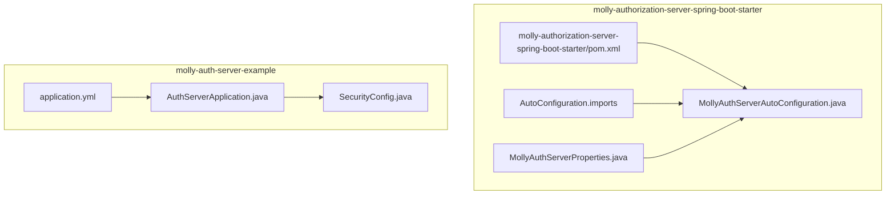
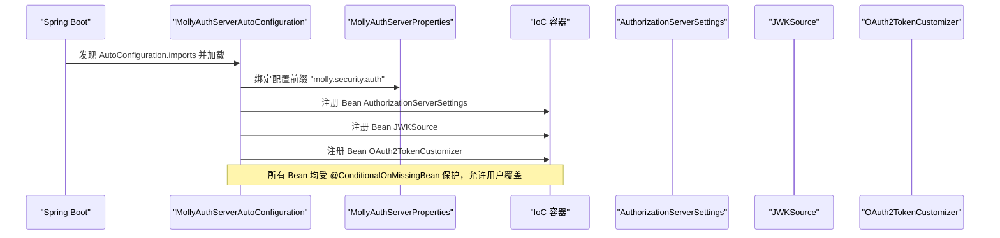
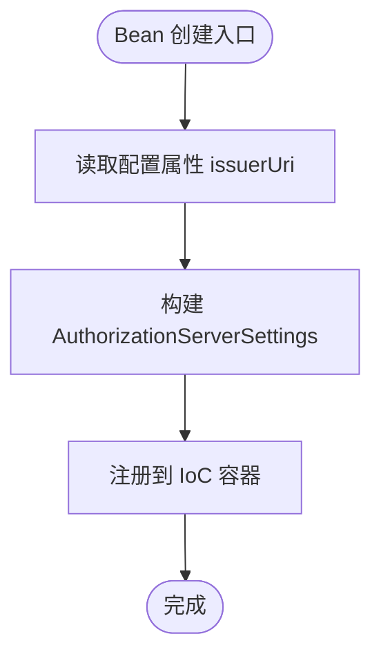
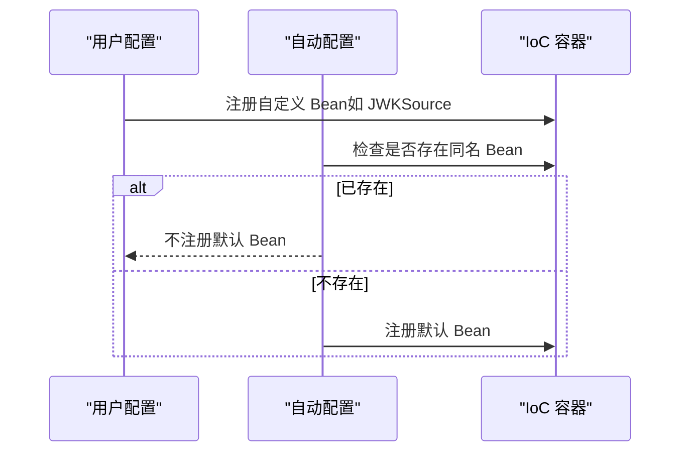
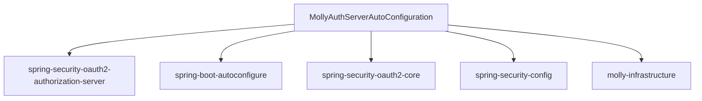

# 自动配置系统

<cite>
**本文引用的文件**
- [MollyAuthServerAutoConfiguration.java](file://molly-authorization-server-spring-boot-starter/src/main/java/cn/molly/security/auth/config/MollyAuthServerAutoConfiguration.java)
- [MollyAuthServerProperties.java](file://molly-authorization-server-spring-boot-starter/src/main/java/cn/molly/security/auth/properties/MollyAuthServerProperties.java)
- [org.springframework.boot.autoconfigure.AutoConfiguration.imports](file://molly-authorization-server-spring-boot-starter/src/main/resources/META-INF/spring/org.springframework.boot.autoconfigure.AutoConfiguration.imports)
- [molly-authorization-server-spring-boot-starter/pom.xml](file://molly-authorization-server-spring-boot-starter/pom.xml)
- [pom.xml](file://pom.xml)
- [application.yml](file://molly-auth-server-example/src/main/resources/application.yml)
- [AuthServerApplication.java](file://molly-auth-server-example/src/main/java/cn/molly/example/auth/AuthServerApplication.java)
- [SecurityConfig.java](file://molly-auth-server-example/src/main/java/cn/molly/example/auth/config/SecurityConfig.java)
</cite>

## 目录
1. [简介](#简介)
2. [项目结构](#项目结构)
3. [核心组件](#核心组件)
4. [架构总览](#架构总览)
5. [详细组件分析](#详细组件分析)
6. [依赖分析](#依赖分析)
7. [性能考虑](#性能考虑)
8. [故障排查指南](#故障排查指南)
9. [结论](#结论)
10. [附录](#附录)

## 简介
本文件聚焦 Molly 框架的自动配置系统，围绕 MollyAuthServerAutoConfiguration 类展开，系统性解析其设计原理与实现机制，包括：
- @AutoConfiguration 注解的作用与生效路径
- 条件注解 @ConditionalOnClass、@ConditionalOnMissingBean 的使用策略
- 三大核心 Bean 的创建流程：AuthorizationServerSettings、JWKSource、OAuth2TokenCustomizer
- 自动配置优先级与 Bean 覆盖机制
- 如何通过自定义 Bean 扩展默认配置
- 性能优化建议与生产环境部署注意事项
- 面向 Spring Boot 开发者的最佳实践

## 项目结构
本仓库采用多模块组织，自动配置位于 molly-authorization-server-spring-boot-starter 模块，示例应用位于 molly-auth-server-example 模块。关键文件如下：
- 自动配置类：MollyAuthServerAutoConfiguration
- 配置属性类：MollyAuthServerProperties
- 自动配置导入清单：META-INF/spring/org.springframework.boot.autoconfigure.AutoConfiguration.imports
- 示例应用配置：application.yml
- 示例应用入口与安全配置：AuthServerApplication、SecurityConfig

**图表来源**
- [MollyAuthServerAutoConfiguration.java:1-161](file://molly-authorization-server-spring-boot-starter/src/main/java/cn/molly/security/auth/config/MollyAuthServerAutoConfiguration.java#L1-L161)
- [MollyAuthServerProperties.java:1-25](file://molly-authorization-server-spring-boot-starter/src/main/java/cn/molly/security/auth/properties/MollyAuthServerProperties.java#L1-L25)
- [org.springframework.boot.autoconfigure.AutoConfiguration.imports:1-2](file://molly-authorization-server-spring-boot-starter/src/main/resources/META-INF/spring/org.springframework.boot.autoconfigure.AutoConfiguration.imports#L1-L2)
- [molly-authorization-server-spring-boot-starter/pom.xml:1-51](file://molly-authorization-server-spring-boot-starter/pom.xml#L1-L51)
- [AuthServerApplication.java:1-22](file://molly-auth-server-example/src/main/java/cn/molly/example/auth/AuthServerApplication.java#L1-L22)
- [SecurityConfig.java:1-165](file://molly-auth-server-example/src/main/java/cn/molly/example/auth/config/SecurityConfig.java#L1-L165)
- [application.yml:1-12](file://molly-auth-server-example/src/main/resources/application.yml#L1-L12)

**章节来源**
- [MollyAuthServerAutoConfiguration.java:1-161](file://molly-authorization-server-spring-boot-starter/src/main/java/cn/molly/security/auth/config/MollyAuthServerAutoConfiguration.java#L1-L161)
- [org.springframework.boot.autoconfigure.AutoConfiguration.imports:1-2](file://molly-authorization-server-spring-boot-starter/src/main/resources/META-INF/spring/org.springframework.boot.autoconfigure.AutoConfiguration.imports#L1-L2)
- [molly-authorization-server-spring-boot-starter/pom.xml:1-51](file://molly-authorization-server-spring-boot-starter/pom.xml#L1-L51)
- [AuthServerApplication.java:1-22](file://molly-auth-server-example/src/main/java/cn/molly/example/auth/AuthServerApplication.java#L1-L22)
- [SecurityConfig.java:1-165](file://molly-auth-server-example/src/main/java/cn/molly/example/auth/config/SecurityConfig.java#L1-L165)
- [application.yml:1-12](file://molly-auth-server-example/src/main/resources/application.yml#L1-L12)

## 核心组件
- 自动配置类：MollyAuthServerAutoConfiguration
  - 作用：为 Spring Boot 应用提供 Spring Authorization Server 的默认配置与核心 Bean
  - 关键特性：启用配置属性绑定、基于条件注解提供默认 Bean、允许用户覆盖
- 配置属性类：MollyAuthServerProperties
  - 作用：承载 molly.security.auth 前缀的配置项，当前包含 issuerUri
- 自动配置导入清单：AutoConfiguration.imports
  - 作用：声明自动配置类，使 Spring Boot 在启动时发现并应用该配置

**章节来源**
- [MollyAuthServerAutoConfiguration.java:28-54](file://molly-authorization-server-spring-boot-starter/src/main/java/cn/molly/security/auth/config/MollyAuthServerAutoConfiguration.java#L28-L54)
- [MollyAuthServerProperties.java:14-24](file://molly-authorization-server-spring-boot-starter/src/main/java/cn/molly/security/auth/properties/MollyAuthServerProperties.java#L14-L24)
- [org.springframework.boot.autoconfigure.AutoConfiguration.imports:1-2](file://molly-authorization-server-spring-boot-starter/src/main/resources/META-INF/spring/org.springframework.boot.autoconfigure.AutoConfiguration.imports#L1-L2)

## 架构总览
自动配置的装配路径与交互关系如下：

**图表来源**
- [org.springframework.boot.autoconfigure.AutoConfiguration.imports:1-2](file://molly-authorization-server-spring-boot-starter/src/main/resources/META-INF/spring/org.springframework.boot.autoconfigure.AutoConfiguration.imports#L1-L2)
- [MollyAuthServerAutoConfiguration.java:51-120](file://molly-authorization-server-spring-boot-starter/src/main/java/cn/molly/security/auth/config/MollyAuthServerAutoConfiguration.java#L51-L120)
- [MollyAuthServerProperties.java:14-24](file://molly-authorization-server-spring-boot-starter/src/main/java/cn/molly/security/auth/properties/MollyAuthServerProperties.java#L14-L24)

## 详细组件分析

### @AutoConfiguration 与条件注解策略
- @AutoConfiguration：标记该类为自动配置类，Spring Boot 在启动时扫描并应用
- @ConditionalOnClass(OAuth2AuthorizationServerConfiguration.class)：仅当类路径存在 Spring Authorization Server 的核心配置类时才激活该自动配置，避免误触发
- @EnableConfigurationProperties(MollyAuthServerProperties.class)：启用配置属性绑定，将 application.yml 中的 molly.security.auth.* 映射到 MollyAuthServerProperties
- @ConditionalOnMissingBean：为每个默认 Bean 添加覆盖保护，若用户已提供同名 Bean，则优先使用用户定义的 Bean

这些注解共同确保：
- 自动配置仅在满足前置条件时生效
- 默认 Bean 可被用户自定义 Bean 覆盖
- 配置属性与 Bean 生命周期解耦，便于扩展

**章节来源**
- [MollyAuthServerAutoConfiguration.java:51-54](file://molly-authorization-server-spring-boot-starter/src/main/java/cn/molly/security/auth/config/MollyAuthServerAutoConfiguration.java#L51-L54)
- [MollyAuthServerProperties.java:14-24](file://molly-authorization-server-spring-boot-starter/src/main/java/cn/molly/security/auth/properties/MollyAuthServerProperties.java#L14-L24)

### AuthorizationServerSettings Bean
- 职责：定义授权服务器元数据，如 issuer URI
- 创建逻辑：从 MollyAuthServerProperties 读取 issuerUri，构建 AuthorizationServerSettings
- 覆盖策略：受 @ConditionalOnMissingBean 保护，用户可在自身配置中提供同名 Bean 覆盖默认值
- OIDC 合规性：issuer URI 必须与实际服务地址一致，否则客户端无法验证令牌来源

**图表来源**
- [MollyAuthServerAutoConfiguration.java:67-73](file://molly-authorization-server-spring-boot-starter/src/main/java/cn/molly/security/auth/config/MollyAuthServerAutoConfiguration.java#L67-L73)
- [MollyAuthServerProperties.java:18-23](file://molly-authorization-server-spring-boot-starter/src/main/java/cn/molly/security/auth/properties/MollyAuthServerProperties.java#L18-L23)

**章节来源**
- [MollyAuthServerAutoConfiguration.java:67-73](file://molly-authorization-server-spring-boot-starter/src/main/java/cn/molly/security/auth/config/MollyAuthServerAutoConfiguration.java#L67-L73)
- [application.yml:6-11](file://molly-auth-server-example/src/main/resources/application.yml#L6-L11)

### JWKSource Bean（密钥生成机制）
- 职责：为 JWT 签名提供 JWK（JSON Web Key）来源
- 默认实现：在内存中动态生成 2048 位 RSA 密钥对，封装为 JWK 并返回选择器
- 安全性与生产建议：
  - 开发阶段开箱即用，无需额外配置
  - 生产环境强烈建议用户提供自定义 JWKSource Bean，从密钥库、数据库或 HSM 加载密钥
- 错误处理：密钥生成异常将包装为非法状态异常，提示配置或运行环境问题

**图表来源**
- [MollyAuthServerAutoConfiguration.java:86-92](file://molly-authorization-server-spring-boot-starter/src/main/java/cn/molly/security/auth/config/MollyAuthServerAutoConfiguration.java#L86-L92)
- [MollyAuthServerAutoConfiguration.java:130-158](file://molly-authorization-server-spring-boot-starter/src/main/java/cn/molly/security/auth/config/MollyAuthServerAutoConfiguration.java#L130-L158)

**章节来源**
- [MollyAuthServerAutoConfiguration.java:86-92](file://molly-authorization-server-spring-boot-starter/src/main/java/cn/molly/security/auth/config/MollyAuthServerAutoConfiguration.java#L86-L92)
- [MollyAuthServerAutoConfiguration.java:130-158](file://molly-authorization-server-spring-boot-starter/src/main/java/cn/molly/security/auth/config/MollyAuthServerAutoConfiguration.java#L130-L158)

### OAuth2TokenCustomizer Bean（令牌定制）
- 职责：在生成 Access Token 时注入自定义声明
- 默认实现：提取当前认证用户的权限集合，注入到名为 authorities 的声明中
- 扩展方式：用户可提供自定义 OAuth2TokenCustomizer Bean，实现更丰富的令牌内容（如用户 ID、部门信息等）

**图表来源**
- [MollyAuthServerAutoConfiguration.java:105-120](file://molly-authorization-server-spring-boot-starter/src/main/java/cn/molly/security/auth/config/MollyAuthServerAutoConfiguration.java#L105-L120)

**章节来源**
- [MollyAuthServerAutoConfiguration.java:105-120](file://molly-authorization-server-spring-boot-starter/src/main/java/cn/molly/security/auth/config/MollyAuthServerAutoConfiguration.java#L105-L120)

### Bean 覆盖与优先级规则
- 优先级顺序（从高到低）：
  1) 用户自定义 Bean（同名 Bean 明确覆盖）
  2) 自动配置提供的默认 Bean（受 @ConditionalOnMissingBean 保护）
- 触发条件：
  - 当容器中不存在同名 Bean 时，自动配置才会注册默认 Bean
  - 若用户已提供，自动配置不会重复注册，从而实现“用户优先”的覆盖机制

**图表来源**
- [MollyAuthServerAutoConfiguration.java:67-120](file://molly-authorization-server-spring-boot-starter/src/main/java/cn/molly/security/auth/config/MollyAuthServerAutoConfiguration.java#L67-L120)

**章节来源**
- [MollyAuthServerAutoConfiguration.java:67-120](file://molly-authorization-server-spring-boot-starter/src/main/java/cn/molly/security/auth/config/MollyAuthServerAutoConfiguration.java#L67-L120)

### 自定义 Bean 扩展示例（路径指引）
- 覆盖 AuthorizationServerSettings：在用户配置类中定义同名 Bean，提供自定义 issuer URI 或其他设置
  - 参考路径：[MollyAuthServerAutoConfiguration.java:67-73](file://molly-authorization-server-spring-boot-starter/src/main/java/cn/molly/security/auth/config/MollyAuthServerAutoConfiguration.java#L67-L73)
- 覆盖 JWKSource：提供自定义 JWKSource Bean，从密钥库或 HSM 加载密钥
  - 参考路径：[MollyAuthServerAutoConfiguration.java:86-92](file://molly-authorization-server-spring-boot-starter/src/main/java/cn/molly/security/auth/config/MollyAuthServerAutoConfiguration.java#L86-L92)
- 覆盖 OAuth2TokenCustomizer：提供自定义令牌定制逻辑，扩展声明内容
  - 参考路径：[MollyAuthServerAutoConfiguration.java:105-120](file://molly-authorization-server-spring-boot-starter/src/main/java/cn/molly/security/auth/config/MollyAuthServerAutoConfiguration.java#L105-L120)

**章节来源**
- [MollyAuthServerAutoConfiguration.java:67-120](file://molly-authorization-server-spring-boot-starter/src/main/java/cn/molly/security/auth/config/MollyAuthServerAutoConfiguration.java#L67-L120)

## 依赖分析
- 自动配置模块依赖
  - spring-security-oauth2-authorization-server：提供授权服务器核心能力
  - spring-boot-autoconfigure：提供 @AutoConfiguration、@ConditionalOnClass 等自动配置能力
  - spring-security-oauth2-core：提供令牌定制等核心能力
  - spring-security-config：提供安全配置支持
  - molly-infrastructure：项目内部基础设施模块
- 版本与依赖管理
  - 顶层 pom.xml 管理 spring-boot-dependencies，统一版本
  - molly-authorization-server-spring-boot-starter/pom.xml 引入上述依赖

**图表来源**
- [molly-authorization-server-spring-boot-starter/pom.xml:16-48](file://molly-authorization-server-spring-boot-starter/pom.xml#L16-L48)
- [pom.xml:26-41](file://pom.xml#L26-L41)

**章节来源**
- [molly-authorization-server-spring-boot-starter/pom.xml:16-48](file://molly-authorization-server-spring-boot-starter/pom.xml#L16-L48)
- [pom.xml:26-41](file://pom.xml#L26-L41)

## 性能考虑
- 密钥生成成本
  - 默认 JWKSource 在内存中生成 RSA 密钥对，适合开发环境；生产环境建议使用持久化密钥源，避免每次启动重新生成密钥
- 令牌定制开销
  - 默认的 OAuth2TokenCustomizer 仅在 access_token 时注入权限集合，复杂定制逻辑可能增加编码时间，建议按需扩展
- Bean 覆盖与初始化顺序
  - 用户自定义 Bean 会优先注册，减少自动配置的无谓工作量，提升启动效率
- 配置属性绑定
  - 通过 @EnableConfigurationProperties 绑定配置，避免在运行时频繁解析配置，提高稳定性

[本节为通用性能建议，不直接分析具体文件]

## 故障排查指南
- 无法加载自动配置
  - 检查 AutoConfiguration.imports 是否正确声明自动配置类
  - 确认类路径存在 OAuth2AuthorizationServerConfiguration
  - 参考：[org.springframework.boot.autoconfigure.AutoConfiguration.imports:1-2](file://molly-authorization-server-spring-boot-starter/src/main/resources/META-INF/spring/org.springframework.boot.autoconfigure.AutoConfiguration.imports#L1-L2)
- issuer URI 不合规
  - 确保 application.yml 中的 issuer-uri 与服务实际地址一致
  - 参考：[application.yml:6-11](file://molly-auth-server-example/src/main/resources/application.yml#L6-L11)
- 密钥生成失败
  - 检查运行环境的加密算法支持与权限
  - 参考：[MollyAuthServerAutoConfiguration.java:148-158](file://molly-authorization-server-spring-boot-starter/src/main/java/cn/molly/security/auth/config/MollyAuthServerAutoConfiguration.java#L148-L158)
- 令牌缺少权限声明
  - 确认当前认证用户具备权限集合，且 OAuth2TokenCustomizer 未被用户自定义 Bean 覆盖
  - 参考：[MollyAuthServerAutoConfiguration.java:105-120](file://molly-authorization-server-spring-boot-starter/src/main/java/cn/molly/security/auth/config/MollyAuthServerAutoConfiguration.java#L105-L120)

**章节来源**
- [org.springframework.boot.autoconfigure.AutoConfiguration.imports:1-2](file://molly-authorization-server-spring-boot-starter/src/main/resources/META-INF/spring/org.springframework.boot.autoconfigure.AutoConfiguration.imports#L1-L2)
- [application.yml:6-11](file://molly-auth-server-example/src/main/resources/application.yml#L6-L11)
- [MollyAuthServerAutoConfiguration.java:148-158](file://molly-authorization-server-spring-boot-starter/src/main/java/cn/molly/security/auth/config/MollyAuthServerAutoConfiguration.java#L148-L158)
- [MollyAuthServerAutoConfiguration.java:105-120](file://molly-authorization-server-spring-boot-starter/src/main/java/cn/molly/security/auth/config/MollyAuthServerAutoConfiguration.java#L105-L120)

## 结论
MollyAuthServerAutoConfiguration 通过合理的条件注解与 Bean 覆盖机制，为 Spring Authorization Server 提供了开箱即用的默认配置，同时保持高度可扩展性。开发者只需引入 starter 并提供必要的客户端与用户服务 Bean，即可快速搭建 OAuth2/OIDC 授权服务器。生产环境建议：
- 明确配置 issuer URI
- 使用安全的密钥源替代内存生成
- 按需扩展令牌定制逻辑
- 在启动前完成密钥与配置的预热

[本节为总结性内容，不直接分析具体文件]

## 附录
- 示例应用要点
  - 示例应用入口与安全配置展示了如何集成授权服务器与用户服务
  - 参考：[AuthServerApplication.java:15-21](file://molly-auth-server-example/src/main/java/cn/molly/example/auth/AuthServerApplication.java#L15-L21)，[SecurityConfig.java:42-164](file://molly-auth-server-example/src/main/java/cn/molly/example/auth/config/SecurityConfig.java#L42-L164)

**章节来源**
- [AuthServerApplication.java:15-21](file://molly-auth-server-example/src/main/java/cn/molly/example/auth/AuthServerApplication.java#L15-L21)
- [SecurityConfig.java:42-164](file://molly-auth-server-example/src/main/java/cn/molly/example/auth/config/SecurityConfig.java#L42-L164)