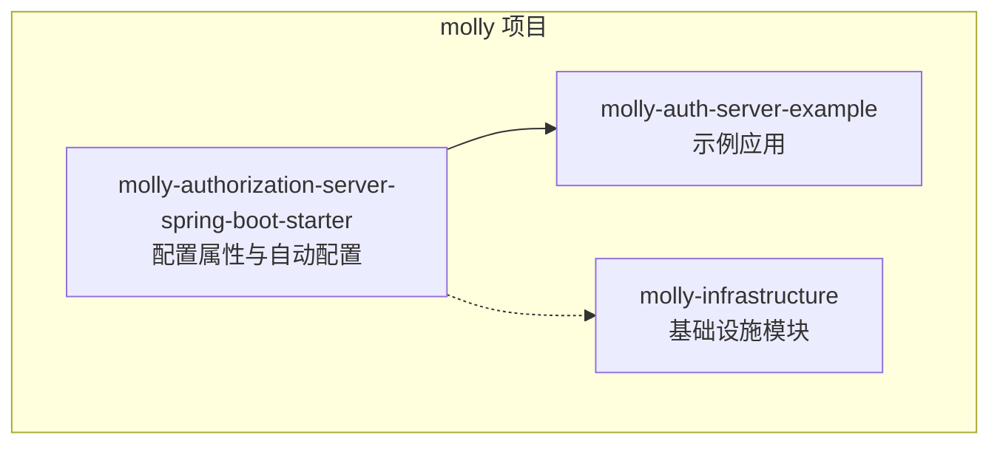
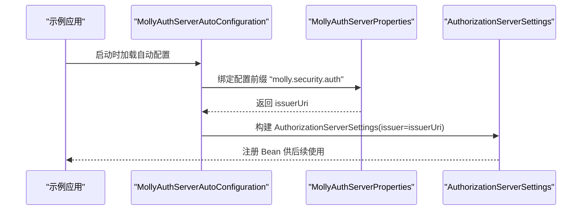
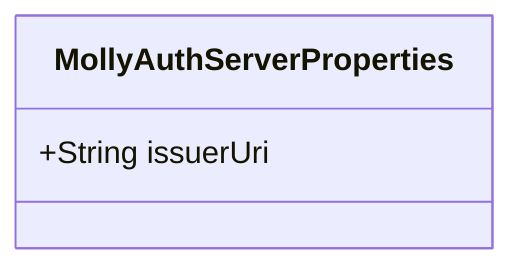
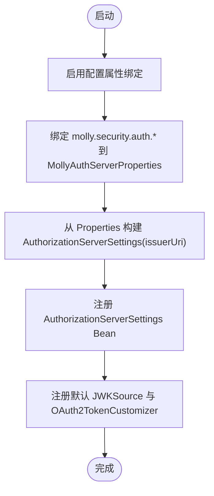
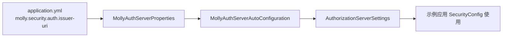
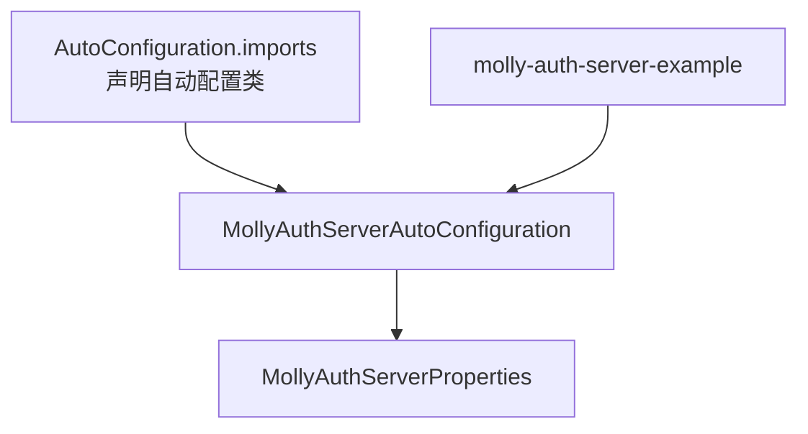

# 配置属性管理

<cite>
**本文档引用的文件**
- [MollyAuthServerProperties.java](file://molly-authorization-server-spring-boot-starter/src/main/java/cn/molly/security/auth/properties/MollyAuthServerProperties.java)
- [MollyAuthServerAutoConfiguration.java](file://molly-authorization-server-spring-boot-starter/src/main/java/cn/molly/security/auth/config/MollyAuthServerAutoConfiguration.java)
- [application.yml](file://molly-auth-server-example/src/main/resources/application.yml)
- [SecurityConfig.java](file://molly-auth-server-example/src/main/java/cn/molly/example/auth/config/SecurityConfig.java)
- [AuthServerApplication.java](file://molly-auth-server-example/src/main/java/cn/molly/example/auth/AuthServerApplication.java)
- [org.springframework.boot.autoconfigure.AutoConfiguration.imports](file://molly-authorization-server-spring-boot-starter/src/main/resources/META-INF/spring/org.springframework.boot.autoconfigure.AutoConfiguration.imports)
- [pom.xml](file://pom.xml)
</cite>

## 目录
1. [简介](#简介)
2. [项目结构](#项目结构)
3. [核心组件](#核心组件)
4. [架构总览](#架构总览)
5. [详细组件分析](#详细组件分析)
6. [依赖分析](#依赖分析)
7. [性能考虑](#性能考虑)
8. [故障排除指南](#故障排除指南)
9. [结论](#结论)
10. [附录](#附录)

## 简介
本文件聚焦于 Molly 框架的配置属性管理系统，围绕 MollyAuthServerProperties 类及其自动配置机制展开，系统性阐述：
- @ConfigurationProperties 注解的使用方式与配置绑定原理
- 类型安全的配置管理与默认值处理
- 配置验证机制与错误处理策略
- 配置优先级、环境变量覆盖与配置文件格式
- 开发与生产环境的配置示例与最佳实践
- 常见问题排查与优化建议

## 项目结构
本仓库采用多模块结构，配置属性管理位于 Spring Boot Starter 模块中，示例应用演示了如何在实际项目中使用该配置。

**图表来源**
- [pom.xml:11-14](file://pom.xml#L11-L14)

**章节来源**
- [pom.xml:11-14](file://pom.xml#L11-L14)

## 核心组件
- MollyAuthServerProperties：定义配置前缀下的属性模型，当前仅包含 issuer-uri 字段，用于 OIDC 规范中的签发者标识。
- MollyAuthServerAutoConfiguration：启用配置属性绑定，提供默认的 AuthorizationServerSettings Bean，并注入 issuer-uri 到授权服务器设置中；同时提供默认的 JWKSource 与 OAuth2TokenCustomizer Bean。

**章节来源**
- [MollyAuthServerProperties.java:14-24](file://molly-authorization-server-spring-boot-starter/src/main/java/cn/molly/security/auth/properties/MollyAuthServerProperties.java#L14-L24)
- [MollyAuthServerAutoConfiguration.java:51-54](file://molly-authorization-server-spring-boot-starter/src/main/java/cn/molly/security/auth/config/MollyAuthServerAutoConfiguration.java#L51-L54)

## 架构总览
Molly 的配置属性管理遵循 Spring Boot 的配置绑定与条件化 Bean 注入模式。核心流程如下：
- 通过 @EnableConfigurationProperties 启用配置属性绑定
- @ConfigurationProperties(prefix = "molly.security.auth") 将外部配置映射到 MollyAuthServerProperties
- 自动配置类根据属性值创建 AuthorizationServerSettings Bean
- 示例应用通过 application.yml 提供 issuer-uri，确保 OIDC 合规

**图表来源**
- [MollyAuthServerAutoConfiguration.java:51-73](file://molly-authorization-server-spring-boot-starter/src/main/java/cn/molly/security/auth/config/MollyAuthServerAutoConfiguration.java#L51-L73)
- [MollyAuthServerProperties.java:14-24](file://molly-authorization-server-spring-boot-starter/src/main/java/cn/molly/security/auth/properties/MollyAuthServerProperties.java#L14-L24)

## 详细组件分析

### MollyAuthServerProperties 设计与实现
- 类型与注解
  - 使用 Lombok 的 @Data 自动生成 getter/setter/toString 等方法，简化属性访问。
  - 使用 @ConfigurationProperties(prefix = "molly.security.auth") 将外部配置绑定到该类。
- 属性定义
  - issuerUri：OIDC 规范要求的签发者 URI，必须与授权服务器的实际对外地址一致，否则客户端无法正确验证令牌来源。
- 设计要点
  - 单一职责：仅承载 molly.security.auth 前缀下的配置项，保持配置域清晰。
  - 明确注释：对 OIDC 合规性与示例值进行说明，便于使用者正确配置。

**图表来源**
- [MollyAuthServerProperties.java:14-24](file://molly-authorization-server-spring-boot-starter/src/main/java/cn/molly/security/auth/properties/MollyAuthServerProperties.java#L14-L24)

**章节来源**
- [MollyAuthServerProperties.java:14-24](file://molly-authorization-server-spring-boot-starter/src/main/java/cn/molly/security/auth/properties/MollyAuthServerProperties.java#L14-L24)

### MollyAuthServerAutoConfiguration 绑定与默认 Bean
- 启用配置属性
  - @EnableConfigurationProperties(MollyAuthServerProperties.class) 启用绑定，使外部配置生效。
- AuthorizationServerSettings Bean
  - 从 MollyAuthServerProperties 读取 issuerUri，构建 AuthorizationServerSettings。
  - 使用 @ConditionalOnMissingBean，允许用户自定义同名 Bean 覆盖默认行为。
- JWKSource Bean
  - 默认在内存中生成 RSA 密钥对并封装为 JWKSource，便于快速启动。
  - 生产环境建议用户提供自定义 JWKSource Bean，从安全存储加载密钥。
- OAuth2TokenCustomizer Bean
  - 默认将用户权限集合注入 access_token 的 "authorities" 声明，便于下游资源服务器鉴权。
  - 用户可提供自定义实现以扩展令牌内容。

**图表来源**
- [MollyAuthServerAutoConfiguration.java:51-120](file://molly-authorization-server-spring-boot-starter/src/main/java/cn/molly/security/auth/config/MollyAuthServerAutoConfiguration.java#L51-L120)

**章节来源**
- [MollyAuthServerAutoConfiguration.java:51-120](file://molly-authorization-server-spring-boot-starter/src/main/java/cn/molly/security/auth/config/MollyAuthServerAutoConfiguration.java#L51-L120)

### 示例应用中的配置与使用
- application.yml
  - server.port：示例应用监听端口
  - molly.security.auth.issuer-uri：必须与应用对外地址一致，确保 OIDC 客户端验证通过
- AuthServerApplication
  - 标准 Spring Boot 启动入口
- SecurityConfig
  - 定义授权服务器与应用层的安全过滤链，配合自动配置的 AuthorizationServerSettings 使用

**图表来源**
- [application.yml:5-11](file://molly-auth-server-example/src/main/resources/application.yml#L5-L11)
- [MollyAuthServerAutoConfiguration.java:67-73](file://molly-authorization-server-spring-boot-starter/src/main/java/cn/molly/security/auth/config/MollyAuthServerAutoConfiguration.java#L67-L73)

**章节来源**
- [application.yml:5-11](file://molly-auth-server-example/src/main/resources/application.yml#L5-L11)
- [AuthServerApplication.java:15-21](file://molly-auth-server-example/src/main/java/cn/molly/example/auth/AuthServerApplication.java#L15-L21)
- [SecurityConfig.java:42-100](file://molly-auth-server-example/src/main/java/cn/molly/example/auth/config/SecurityConfig.java#L42-L100)

## 依赖分析
- 自动配置导入
  - META-INF/spring/org.springframework.boot.autoconfigure.AutoConfiguration.imports 指定自动配置类，确保 Spring Boot 启动时加载。
- 模块依赖
  - molly-auth-server-example 依赖 molly-authorization-server-spring-boot-starter，从而获得配置属性与默认 Bean。
- 版本与依赖管理
  - 顶层 pom.xml 管理 Spring Boot 版本与依赖范围，保证各模块版本一致性。

**图表来源**
- [org.springframework.boot.autoconfigure.AutoConfiguration.imports:1-1](file://molly-authorization-server-spring-boot-starter/src/main/resources/META-INF/spring/org.springframework.boot.autoconfigure.AutoConfiguration.imports#L1-L1)

**章节来源**
- [org.springframework.boot.autoconfigure.AutoConfiguration.imports:1-1](file://molly-authorization-server-spring-boot-starter/src/main/resources/META-INF/spring/org.springframework.boot.autoconfigure.AutoConfiguration.imports#L1-L1)
- [pom.xml:26-41](file://pom.xml#L26-L41)

## 性能考虑
- 内存密钥生成
  - 默认 JWKSource 在内存中生成 RSA 密钥对，适合开发与测试，不适用于生产。
  - 生产建议：提供持久化密钥源（如密钥库、数据库或 HSM），避免频繁生成密钥带来的 CPU 开销与安全风险。
- Bean 覆盖策略
  - 使用 @ConditionalOnMissingBean 降低耦合，允许用户按需替换默认实现，提升灵活性与性能可控性。

[本节为通用指导，不涉及具体文件分析]

## 故障排除指南
- 问题：OIDC 客户端无法验证令牌
  - 现象：客户端校验失败，提示签发者不匹配
  - 原因：molly.security.auth.issuer-uri 与应用对外地址不一致
  - 处理：确保 issuer-uri 与授权服务器对外暴露的完整地址一致（含协议、主机、端口）
  - 参考：示例配置中的 issuer-uri 设置
- 问题：启动时报错找不到 AuthorizationServerSettings Bean
  - 现象：容器启动失败，缺少必要的授权服务器设置
  - 原因：未启用配置属性绑定或未提供 issuer-uri
  - 处理：确认已启用 @EnableConfigurationProperties 或通过自动配置导入；在 application.yml 中提供 issuer-uri
- 问题：生产环境密钥安全性不足
  - 现象：默认内存密钥生成不符合生产安全要求
  - 处理：提供自定义 JWKSource Bean，从安全存储加载密钥；同时确保密钥轮换与备份策略
- 问题：令牌缺少权限声明
  - 现象：下游资源服务器无法基于权限进行授权
  - 处理：确认 OAuth2TokenCustomizer Bean 是否被用户自定义覆盖；若未覆盖，默认实现会将用户权限注入 access_token 的 "authorities" 声明

**章节来源**
- [application.yml:5-11](file://molly-auth-server-example/src/main/resources/application.yml#L5-L11)
- [MollyAuthServerAutoConfiguration.java:67-120](file://molly-authorization-server-spring-boot-starter/src/main/java/cn/molly/security/auth/config/MollyAuthServerAutoConfiguration.java#L67-L120)

## 结论
Molly 的配置属性管理以简洁、类型安全为核心设计原则：
- 通过 @ConfigurationProperties 与 @EnableConfigurationProperties 实现配置绑定
- 以 @ConditionalOnMissingBean 提供默认 Bean，同时允许用户完全覆盖
- 重点保障 OIDC 合规性（issuer-uri），并为生产环境提供安全替代方案
- 示例应用展示了最小可行配置与安全实践，便于开发者快速落地

[本节为总结性内容，不涉及具体文件分析]

## 附录

### 配置选项与默认值
- 配置前缀：molly.security.auth
- 可用属性
  - issuer-uri：OIDC 必填签发者 URI，必须与授权服务器对外地址一致
- 默认值处理
  - 当前实现未提供默认值；若未配置，将在构建 AuthorizationServerSettings 时传入 null，导致启动失败或运行期异常
  - 建议：始终显式配置 issuer-uri

**章节来源**
- [MollyAuthServerProperties.java:18-23](file://molly-authorization-server-spring-boot-starter/src/main/java/cn/molly/security/auth/properties/MollyAuthServerProperties.java#L18-L23)
- [MollyAuthServerAutoConfiguration.java:67-73](file://molly-authorization-server-spring-boot-starter/src/main/java/cn/molly/security/auth/config/MollyAuthServerAutoConfiguration.java#L67-L73)

### 配置优先级与覆盖机制
- 配置文件优先级（Spring Boot 常见顺序）
  - 命令行参数 > 环境变量 > application-{profile}.yml > application.yml
- 环境变量覆盖
  - 可通过环境变量覆盖配置项，例如将 molly.security.auth.issuer-uri 映射为大写并以下划线分隔的环境变量名
- 配置文件格式
  - YAML：示例应用使用 application.yml，键路径与配置前缀对应

**章节来源**
- [application.yml:5-11](file://molly-auth-server-example/src/main/resources/application.yml#L5-L11)

### 开发与生产环境配置示例
- 开发环境
  - application.yml 中提供 issuer-uri，确保本地联调通过
  - 可继续使用默认 JWKSource 进行快速验证
- 生产环境
  - 必须提供安全的 JWKSource Bean，从密钥库或 HSM 加载密钥
  - 严格管理 issuer-uri，确保与网关/反向代理后的对外地址一致
  - 建议开启密钥轮换与审计日志

**章节来源**
- [application.yml:5-11](file://molly-auth-server-example/src/main/resources/application.yml#L5-L11)
- [MollyAuthServerAutoConfiguration.java:86-92](file://molly-authorization-server-spring-boot-starter/src/main/java/cn/molly/security/auth/config/MollyAuthServerAutoConfiguration.java#L86-L92)

### 最佳实践
- 显式配置 issuer-uri，避免运行期错误
- 生产环境禁用内存密钥，使用安全密钥源
- 通过自定义 Bean 覆盖默认实现，满足业务需求
- 在 CI/CD 中校验配置文件语法与关键键的存在性

[本节为通用指导，不涉及具体文件分析]