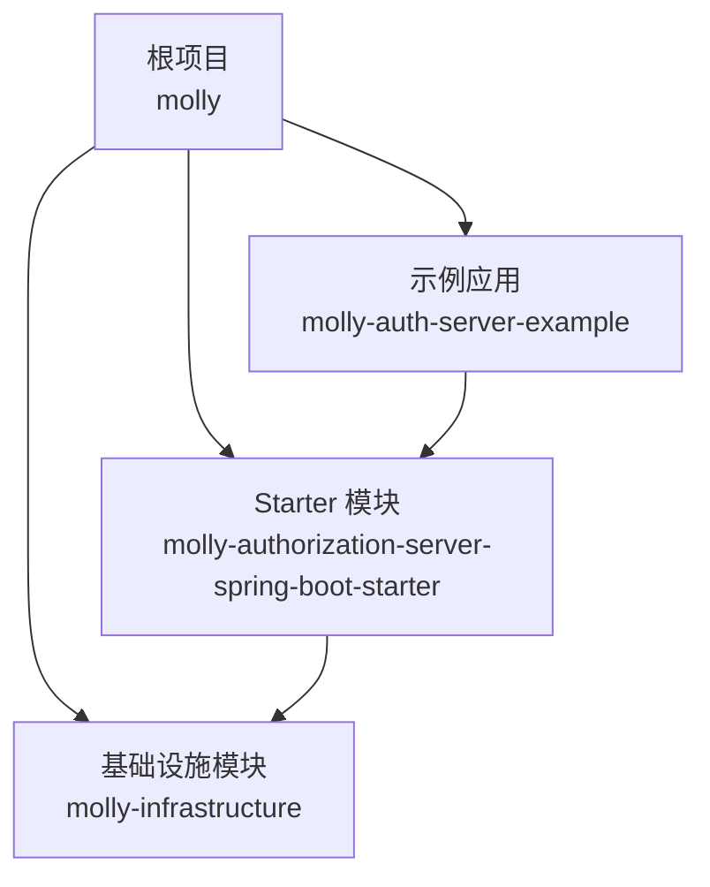
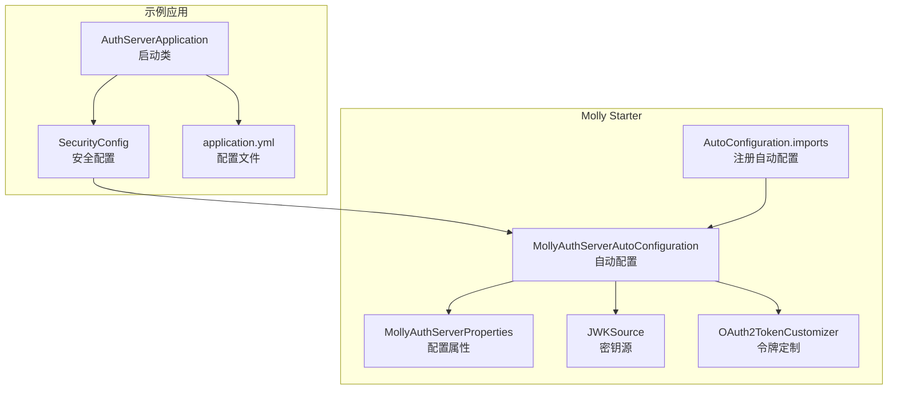
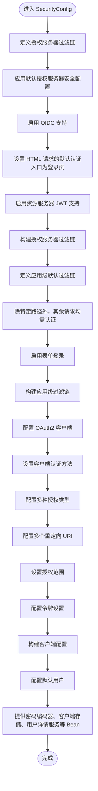
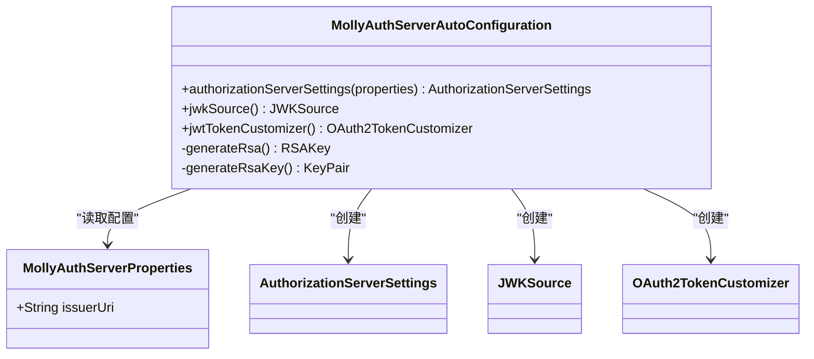
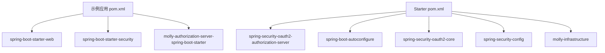

# 示例应用详解

<cite>
**本文档引用的文件**
- [AuthServerApplication.java](file://molly-auth-server-example/src/main/java/cn/molly/example/auth/AuthServerApplication.java)
- [SecurityConfig.java](file://molly-auth-server-example/src/main/java/cn/molly/example/auth/config/SecurityConfig.java)
- [application.yml](file://molly-auth-server-example/src/main/resources/application.yml)
- [MollyAuthServerAutoConfiguration.java](file://molly-authorization-server-spring-boot-starter/src/main/java/cn/molly/security/auth/config/MollyAuthServerAutoConfiguration.java)
- [MollyAuthServerProperties.java](file://molly-authorization-server-spring-boot-starter/src/main/java/cn/molly/security/auth/properties/MollyAuthServerProperties.java)
- [MollyUserAccountService.java](file://molly-authorization-server-spring-boot-starter/src/main/java/cn/molly/security/auth/service/MollyUserAccountService.java)
- [org.springframework.boot.autoconfigure.AutoConfiguration.imports](file://molly-authorization-server-spring-boot-starter/src/main/resources/META-INF/spring/org.springframework.boot.autoconfigure.AutoConfiguration.imports)
- [pom.xml（示例项目）](file://molly-auth-server-example/pom.xml)
- [pom.xml（starter）](file://molly-authorization-server-spring-boot-starter/pom.xml)
- [pom.xml（根项目）](file://pom.xml)
</cite>

## 目录
1. [简介](#简介)
2. [项目结构](#项目结构)
3. [核心组件](#核心组件)
4. [架构总览](#架构总览)
5. [详细组件分析](#详细组件分析)
6. [依赖分析](#依赖分析)
7. [性能考虑](#性能考虑)
8. [故障排查指南](#故障排查指南)
9. [结论](#结论)
10. [附录](#附录)

## 简介
本文件面向希望快速理解并集成 Molly 框架的开发者，系统讲解示例认证服务器应用的架构设计与实现要点。重点包括：
- 主启动类的配置与应用入口点说明
- SecurityConfig 中的安全配置实现，包括 OAuth2 授权服务器端点的安全设置、多过滤链的分离策略与表单登录配置
- application.yml 中关键配置项（尤其是 issuer-uri）的作用与设置原则
- 如何将 Molly 框架集成到实际项目中
- 安全配置最佳实践与常见问题的解决方案
- 调试与测试指南

## 项目结构
该项目采用多模块 Maven 结构，核心模块如下：
- molly-auth-server-example：示例认证服务器应用，演示如何使用 Molly starter 快速搭建授权服务器
- molly-authorization-server-spring-boot-starter：Spring Boot Starter，提供自动配置与核心组件
- molly-infrastructure：基础设施模块（示例项目中未包含具体实现）

**图表来源**
- [pom.xml（根项目）:11-14](file://pom.xml#L11-L14)
- [pom.xml（示例项目）:16-29](file://molly-auth-server-example/pom.xml#L16-L29)
- [pom.xml（starter）:16-48](file://molly-authorization-server-spring-boot-starter/pom.xml#L16-L48)

**章节来源**
- [pom.xml（根项目）:11-14](file://pom.xml#L11-L14)
- [pom.xml（示例项目）:16-29](file://molly-auth-server-example/pom.xml#L16-L29)
- [pom.xml（starter）:16-48](file://molly-authorization-server-spring-boot-starter/pom.xml#L16-L48)

## 核心组件
- 主启动类：负责应用引导与上下文启动
- 安全配置类：定义两个安全过滤链、客户端存储、用户详情服务、密码编码器等
- 配置文件：定义服务器端口与 issuer-uri
- Starter 自动配置：提供授权服务器设置、JWK 源、令牌定制等默认 Bean
- 配置属性类：绑定 molly.security.auth.* 前缀的配置项
- 用户账户服务接口：扩展 UserDetailsService，为未来统一用户体系预留扩展点

**章节来源**
- [AuthServerApplication.java:15-20](file://molly-auth-server-example/src/main/java/cn/molly/example/auth/AuthServerApplication.java#L15-L20)
- [SecurityConfig.java:42-163](file://molly-auth-server-example/src/main/java/cn/molly/example/auth/config/SecurityConfig.java#L42-L163)
- [application.yml:1-12](file://molly-auth-server-example/src/main/resources/application.yml#L1-L12)
- [MollyAuthServerAutoConfiguration.java:51-158](file://molly-authorization-server-spring-boot-starter/src/main/java/cn/molly/security/auth/config/MollyAuthServerAutoConfiguration.java#L51-L158)
- [MollyAuthServerProperties.java:14-24](file://molly-authorization-server-spring-boot-starter/src/main/java/cn/molly/security/auth/properties/MollyAuthServerProperties.java#L14-L24)
- [MollyUserAccountService.java:20-21](file://molly-authorization-server-spring-boot-starter/src/main/java/cn/molly/security/auth/service/MollyUserAccountService.java#L20-L21)

## 架构总览
示例应用通过引入 Molly Starter，在启动时由自动配置类注入授权服务器所需的默认 Bean；同时，示例应用自身通过 SecurityConfig 定义两类安全过滤链：OAuth2/OIDC 协议端点的安全链与应用级的表单登录链。application.yml 提供 issuer-uri 等关键配置。

**图表来源**
- [AuthServerApplication.java:15-20](file://molly-auth-server-example/src/main/java/cn/molly/example/auth/AuthServerApplication.java#L15-L20)
- [SecurityConfig.java:42-163](file://molly-auth-server-example/src/main/java/cn/molly/example/auth/config/SecurityConfig.java#L42-L163)
- [application.yml:1-12](file://molly-auth-server-example/src/main/resources/application.yml#L1-L12)
- [MollyAuthServerAutoConfiguration.java:51-158](file://molly-authorization-server-spring-boot-starter/src/main/java/cn/molly/security/auth/config/MollyAuthServerAutoConfiguration.java#L51-L158)
- [MollyAuthServerProperties.java:14-24](file://molly-authorization-server-spring-boot-starter/src/main/java/cn/molly/security/auth/properties/MollyAuthServerProperties.java#L14-L24)
- [org.springframework.boot.autoconfigure.AutoConfiguration.imports:1-1](file://molly-authorization-server-spring-boot-starter/src/main/resources/META-INF/spring/org.springframework.boot.autoconfigure.AutoConfiguration.imports#L1-L1)

## 详细组件分析

### 主启动类与应用入口点
- 作用：标记为 Spring Boot 应用入口，负责启动 Spring 上下文
- 关键点：使用注解启用自动装配与组件扫描，main 方法直接运行应用类

**章节来源**
- [AuthServerApplication.java:15-20](file://molly-auth-server-example/src/main/java/cn/molly/example/auth/AuthServerApplication.java#L15-L20)

### 安全配置（SecurityConfig）
- 多过滤链分离策略
  - 授权服务器专用过滤链（优先级更高）：负责 OAuth2/OIDC 协议端点的安全，启用 OIDC 支持，默认认证入口指向登录页，资源服务器使用 JWT
  - 应用级默认过滤链（优先级较低）：处理非协议端点的请求，启用表单登录，除特定路径外均需认证
- 客户端存储与用户详情服务
  - 内存实现：示例中提供内存版 RegisteredClientRepository 与 UserDetailsService，便于快速演示
  - 生产建议：替换为数据库实现（如 JDBC 版本），以满足持久化与高可用需求
- 密码编码器
  - 使用 BCrypt 编码器，确保密码安全存储
- 表单登录配置
  - 默认表单登录，结合默认用户详情服务即可完成登录流程
- OAuth2 客户端配置改进
  - 支持多种授权类型：授权码、刷新令牌、客户端凭证
  - 配置多个重定向 URI，支持不同的客户端回调
  - 设置授权范围和令牌有效期
  - 启用授权同意提示

**图表来源**
- [SecurityConfig.java:59-100](file://molly-auth-server-example/src/main/java/cn/molly/example/auth/config/SecurityConfig.java#L59-L100)
- [SecurityConfig.java:110-163](file://molly-auth-server-example/src/main/java/cn/molly/example/auth/config/SecurityConfig.java#L110-L163)
- [SecurityConfig.java:122-145](file://molly-auth-server-example/src/main/java/cn/molly/example/auth/config/SecurityConfig.java#L122-L145)
- [SecurityConfig.java:155-163](file://molly-auth-server-example/src/main/java/cn/molly/example/auth/config/SecurityConfig.java#L155-L163)

**章节来源**
- [SecurityConfig.java:42-163](file://molly-auth-server-example/src/main/java/cn/molly/example/auth/config/SecurityConfig.java#L42-L163)

### application.yml 关键配置项
- server.port：示例应用监听端口
- molly.security.auth.issuer-uri：授权服务器签发者 URI，必须与当前服务地址一致，OIDC 客户端将据此校验令牌来源

**章节来源**
- [application.yml:1-12](file://molly-auth-server-example/src/main/resources/application.yml#L1-L12)

### Molly Starter 自动配置
- 自动配置类职责
  - 绑定自定义配置属性（MollyAuthServerProperties）
  - 提供可覆盖的默认 Bean：AuthorizationServerSettings、JWKSource、OAuth2TokenCustomizer
- AuthorizationServerSettings
  - 从配置属性读取 issuer-uri，构建授权服务器元数据
- JWKSource
  - 默认在内存中生成 RSA 密钥对（2048 位），便于开发阶段快速使用；生产环境建议提供自定义实现
- OAuth2TokenCustomizer
  - 为 Access Token 添加 authorities 声明，便于下游资源服务器进行细粒度权限控制

**图表来源**
- [MollyAuthServerAutoConfiguration.java:51-158](file://molly-authorization-server-spring-boot-starter/src/main/java/cn/molly/security/auth/config/MollyAuthServerAutoConfiguration.java#L51-L158)
- [MollyAuthServerProperties.java:14-24](file://molly-authorization-server-spring-boot-starter/src/main/java/cn/molly/security/auth/properties/MollyAuthServerProperties.java#L14-L24)

**章节来源**
- [MollyAuthServerAutoConfiguration.java:51-158](file://molly-authorization-server-spring-boot-starter/src/main/java/cn/molly/security/auth/config/MollyAuthServerAutoConfiguration.java#L51-L158)
- [MollyAuthServerProperties.java:14-24](file://molly-authorization-server-spring-boot-starter/src/main/java/cn/molly/security/auth/properties/MollyAuthServerProperties.java#L14-L24)

### 用户账户服务接口
- 作用：扩展 UserDetailsService，作为 Molly 安全框架的统一用户账户服务入口，便于未来支持多种认证方式（如手机号、社交账号等）
- 设计意图：通过接口抽象，隔离业务层与安全层，提升可扩展性

**章节来源**
- [MollyUserAccountService.java:20-21](file://molly-authorization-server-spring-boot-starter/src/main/java/cn/molly/security/auth/service/MollyUserAccountService.java#L20-L21)

### Starter 自动配置注册机制
- 通过 META-INF/spring 的自动配置导入文件，声明自动配置类，使 Spring Boot 在启动时自动加载 Molly 的默认配置

**章节来源**
- [org.springframework.boot.autoconfigure.AutoConfiguration.imports:1-1](file://molly-authorization-server-spring-boot-starter/src/main/resources/META-INF/spring/org.springframework.boot.autoconfigure.AutoConfiguration.imports#L1-L1)

## 依赖分析
- 示例应用依赖
  - spring-boot-starter-web：提供 Web 功能
  - spring-boot-starter-security：提供 Spring Security 能力
  - molly-authorization-server-spring-boot-starter：提供授权服务器自动配置与核心组件
- Starter 依赖
  - spring-security-oauth2-authorization-server：OAuth2 授权服务器核心实现
  - spring-boot-autoconfigure：自动配置能力
  - spring-security-oauth2-core：令牌定制等核心能力
  - spring-security-config：Spring Security 配置支持
  - molly-infrastructure：基础设施模块（示例项目中未包含具体实现）

**图表来源**
- [pom.xml（示例项目）:16-29](file://molly-auth-server-example/pom.xml#L16-L29)
- [pom.xml（starter）:16-48](file://molly-authorization-server-spring-boot-starter/pom.xml#L16-L48)

**章节来源**
- [pom.xml（示例项目）:16-29](file://molly-auth-server-example/pom.xml#L16-L29)
- [pom.xml（starter）:16-48](file://molly-authorization-server-spring-boot-starter/pom.xml#L16-L48)

## 性能考虑
- 密钥生成成本
  - 默认 JWKSource 在内存中生成 RSA 密钥对，适合开发阶段；生产环境建议使用持久化密钥源，避免每次重启重新生成密钥带来的开销
- 客户端存储与用户详情服务
  - 示例使用内存实现，便于演示；生产环境应使用数据库实现，以提升并发与持久化能力
- 过滤链顺序
  - 授权服务器过滤链优先级高于应用级过滤链，确保协议端点优先处理，避免不必要的认证开销
- OAuth2 客户端配置优化
  - 合理设置令牌有效期，平衡安全性与用户体验
  - 配置适当的授权范围，遵循最小权限原则

## 故障排查指南
- 无法访问授权服务器端点
  - 检查授权服务器过滤链是否正确应用默认安全配置与 OIDC 支持
  - 确认默认认证入口是否正确指向登录页
- 登录失败或跳转异常
  - 检查应用级过滤链的表单登录配置是否生效
  - 确认用户详情服务提供的用户是否存在且角色正确
- 令牌校验失败
  - 检查 issuer-uri 是否与当前服务地址一致
  - 确认 JWK 源是否正确提供密钥，且与客户端配置匹配
- OAuth2 客户端配置问题
  - 检查客户端 ID 和密钥是否正确配置
  - 确认重定向 URI 与客户端配置一致
  - 验证授权范围和令牌设置是否合理
- 开发阶段密钥频繁变化
  - 生产环境提供自定义 JWKSource Bean，避免每次启动生成新密钥

**章节来源**
- [SecurityConfig.java:59-100](file://molly-auth-server-example/src/main/java/cn/molly/example/auth/config/SecurityConfig.java#L59-L100)
- [application.yml:9-11](file://molly-auth-server-example/src/main/resources/application.yml#L9-L11)
- [MollyAuthServerAutoConfiguration.java:86-92](file://molly-authorization-server-spring-boot-starter/src/main/java/cn/molly/security/auth/config/MollyAuthServerAutoConfiguration.java#L86-L92)

## 结论
本示例应用展示了如何基于 Molly Starter 快速搭建一个符合 OIDC 标准的授权服务器。通过多过滤链分离策略，既保证了协议端点的安全性，又提供了便捷的应用级表单登录体验。配合合理的配置（如 issuer-uri）与生产级的存储与密钥管理，可满足大多数企业级场景的安全与性能需求。

## 附录

### 如何将 Molly 框架集成到实际项目
- 引入依赖
  - 在项目中引入 molly-authorization-server-spring-boot-starter
- 提供必要 Bean
  - RegisteredClientRepository：客户端管理
  - UserDetailsService：用户认证
- 配置授权服务器过滤链
  - 参考示例应用的 SecurityConfig，定义授权服务器与应用级过滤链
- 配置 issuer-uri
  - 在 application.yml 中设置 molly.security.auth.issuer-uri，确保与服务地址一致
- 生产环境优化
  - 替换内存实现为数据库实现
  - 提供自定义 JWKSource Bean
  - 配置令牌定制策略
- OAuth2 客户端配置最佳实践
  - 使用强密码和安全的客户端密钥
  - 配置最小必要的授权范围
  - 设置合理的令牌有效期
  - 配置多个重定向 URI 以支持不同环境

**章节来源**
- [pom.xml（示例项目）:25-29](file://molly-auth-server-example/pom.xml#L25-L29)
- [SecurityConfig.java:42-163](file://molly-auth-server-example/src/main/java/cn/molly/example/auth/config/SecurityConfig.java#L42-L163)
- [application.yml:9-11](file://molly-auth-server-example/src/main/resources/application.yml#L9-L11)
- [MollyAuthServerAutoConfiguration.java:67-73](file://molly-authorization-server-spring-boot-starter/src/main/java/cn/molly/security/auth/config/MollyAuthServerAutoConfiguration.java#L67-L73)