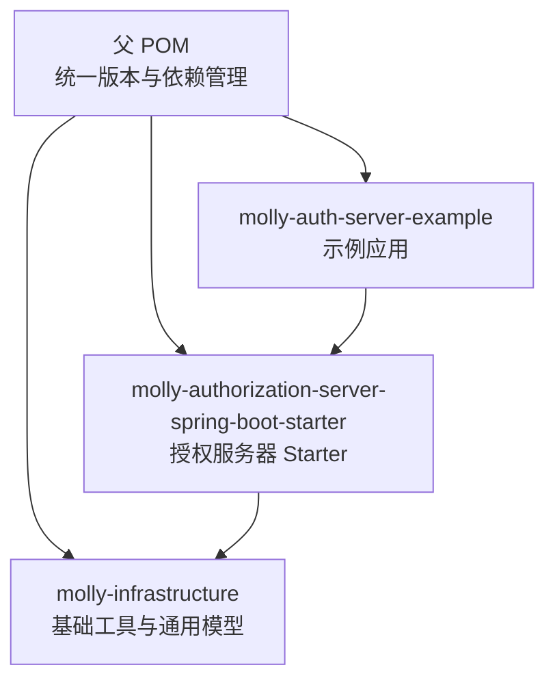
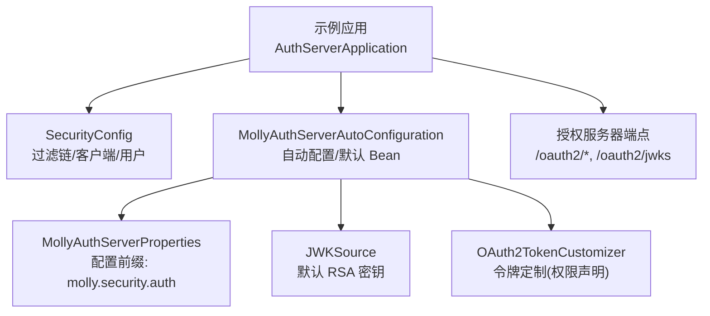
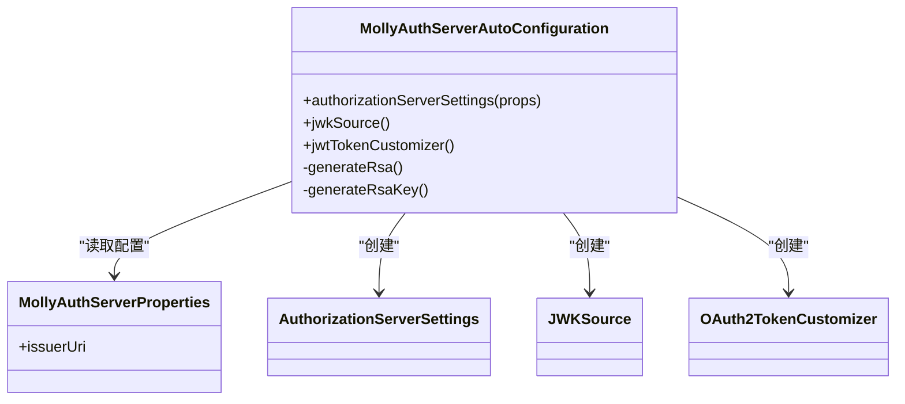
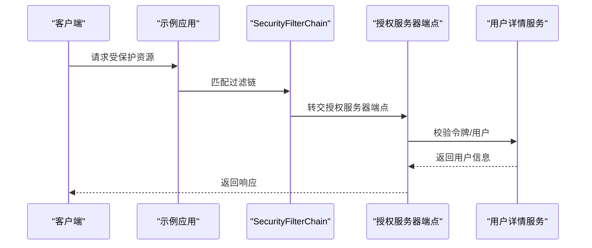
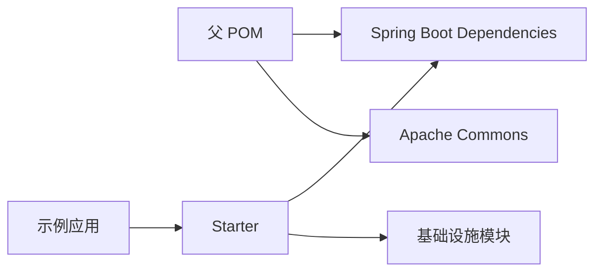

# 部署和运维

<cite>
**本文引用的文件**
- [根 POM](file://pom.xml)
- [基础设施模块 POM](file://molly-infrastructure/pom.xml)
- [认证授权 Starter POM](file://molly-authorization-server-spring-boot-starter/pom.xml)
- [认证授权 Starter 自动配置类](file://molly-authorization-server-spring-boot-starter/src/main/java/cn/molly/security/auth/config/MollyAuthServerAutoConfiguration.java)
- [认证授权 Starter 配置属性类](file://molly-authorization-server-spring-boot-starter/src/main/java/cn/molly/security/auth/properties/MollyAuthServerProperties.java)
- [认证授权 Starter 用户账户服务接口](file://molly-authorization-server-spring-boot-starter/src/main/java/cn/molly/security/auth/service/MollyUserAccountService.java)
- [示例应用入口类](file://molly-auth-server-example/src/main/java/cn/molly/example/auth/AuthServerApplication.java)
- [示例应用配置文件](file://molly-auth-server-example/src/main/resources/application.yml)
- [示例应用安全配置类](file://molly-auth-server-example/src/main/java/cn/molly/example/auth/config/SecurityConfig.java)
- [示例应用 Starter POM](file://molly-auth-server-example/pom.xml)
- [项目总览与构建说明](file://AGENTS.md)
</cite>

## 目录
1. [简介](#简介)
2. [项目结构](#项目结构)
3. [核心组件](#核心组件)
4. [架构总览](#架构总览)
5. [详细组件分析](#详细组件分析)
6. [依赖分析](#依赖分析)
7. [性能考虑](#性能考虑)
8. [日志与审计](#日志与审计)
9. [健康检查与监控](#健康检查与监控)
10. [部署与打包](#部署与打包)
11. [容器化与编排](#容器化与编排)
12. [故障排除指南](#故障排除指南)
13. [版本升级与迁移](#版本升级与迁移)
14. [结论](#结论)

## 简介
本指南面向 DevOps 工程师与运维人员，围绕 Molly 框架的部署与运维实践展开，涵盖构建与打包、多环境部署（Docker/Kubernetes）、生产环境优化（JVM/内存/监控）、日志与审计、健康检查与指标、故障排除、版本升级与迁移等主题。Molly 基于 Spring Boot 3.3.2 与 Spring Authorization Server，提供 OAuth2/OIDC 授权服务器的自动配置与示例应用，适合快速搭建分布式 Web 系统的安全基础设施。

## 项目结构
Molly 采用 Maven 多模块结构，父 POM 统一版本与依赖管理，子模块分别提供基础设施、认证授权 Starter 与示例应用。示例应用通过 Starter 快速装配授权服务器能力，并提供最小可用的安全配置与示例数据。

图表来源
- [根 POM:1-81](file://pom.xml#L1-L81)
- [基础设施模块 POM:1-27](file://molly-infrastructure/pom.xml#L1-L27)
- [认证授权 Starter POM:1-51](file://molly-authorization-server-spring-boot-starter/pom.xml#L1-L51)
- [示例应用 Starter POM:1-41](file://molly-auth-server-example/pom.xml#L1-L41)

章节来源
- [根 POM:1-81](file://pom.xml#L1-L81)
- [项目总览与构建说明:15-33](file://AGENTS.md#L15-L33)

## 核心组件
- 基础设施模块：提供通用工具与集合类依赖，作为 Starter 与业务模块的公共基础。
- 认证授权 Starter：提供授权服务器自动配置、默认 JWK 生成、令牌定制、配置属性绑定等能力；要求使用者提供客户端仓库与用户详情服务。
- 示例应用：演示如何启动授权服务器，包含最小化的安全配置与示例数据，便于本地调试与集成测试。

章节来源
- [基础设施模块 POM:1-27](file://molly-infrastructure/pom.xml#L1-L27)
- [认证授权 Starter POM:1-51](file://molly-authorization-server-spring-boot-starter/pom.xml#L1-L51)
- [认证授权 Starter 自动配置类:1-161](file://molly-authorization-server-spring-boot-starter/src/main/java/cn/molly/security/auth/config/MollyAuthServerAutoConfiguration.java#L1-L161)
- [认证授权 Starter 配置属性类:1-25](file://molly-authorization-server-spring-boot-starter/src/main/java/cn/molly/security/auth/properties/MollyAuthServerProperties.java#L1-L25)
- [认证授权 Starter 用户账户服务接口:1-22](file://molly-authorization-server-spring-boot-starter/src/main/java/cn/molly/security/auth/service/MollyUserAccountService.java#L1-L22)
- [示例应用入口类:1-22](file://molly-auth-server-example/src/main/java/cn/molly/example/auth/AuthServerApplication.java#L1-L22)
- [示例应用配置文件:1-12](file://molly-auth-server-example/src/main/resources/application.yml#L1-L12)
- [示例应用安全配置类:1-165](file://molly-auth-server-example/src/main/java/cn/molly/example/auth/config/SecurityConfig.java#L1-L165)

## 架构总览
Molly 的运行时由示例应用承载，其通过 Starter 注入授权服务器能力；Starter 依赖 Spring Authorization Server 与 Spring Security，使用 Nimbus JOSE JWT 生成 JWK，令牌中注入用户权限声明；示例应用提供内存版客户端与用户存储，生产环境需替换为持久化实现。

图表来源
- [示例应用入口类:1-22](file://molly-auth-server-example/src/main/java/cn/molly/example/auth/AuthServerApplication.java#L1-L22)
- [示例应用安全配置类:1-165](file://molly-auth-server-example/src/main/java/cn/molly/example/auth/config/SecurityConfig.java#L1-L165)
- [认证授权 Starter 自动配置类:1-161](file://molly-authorization-server-spring-boot-starter/src/main/java/cn/molly/security/auth/config/MollyAuthServerAutoConfiguration.java#L1-L161)
- [认证授权 Starter 配置属性类:1-25](file://molly-authorization-server-spring-boot-starter/src/main/java/cn/molly/security/auth/properties/MollyAuthServerProperties.java#L1-L25)

## 详细组件分析

### 自动配置与默认 Bean
- 授权服务器设置：从配置属性读取签发者 URI，构建授权服务器元数据。
- JWK 源：默认在内存中生成 RSA 密钥对（2048 位），用于签名 JWT；生产环境需提供自定义 JWK 源 Bean。
- 令牌定制：为访问令牌注入用户权限集合，便于下游资源服务器进行细粒度鉴权。
- 条件化 Bean：通过条件注解允许使用者覆盖默认实现。

图表来源
- [认证授权 Starter 自动配置类:1-161](file://molly-authorization-server-spring-boot-starter/src/main/java/cn/molly/security/auth/config/MollyAuthServerAutoConfiguration.java#L1-L161)
- [认证授权 Starter 配置属性类:1-25](file://molly-authorization-server-spring-boot-starter/src/main/java/cn/molly/security/auth/properties/MollyAuthServerProperties.java#L1-L25)

章节来源
- [认证授权 Starter 自动配置类:28-161](file://molly-authorization-server-spring-boot-starter/src/main/java/cn/molly/security/auth/config/MollyAuthServerAutoConfiguration.java#L28-L161)
- [认证授权 Starter 配置属性类:6-25](file://molly-authorization-server-spring-boot-starter/src/main/java/cn/molly/security/auth/properties/MollyAuthServerProperties.java#L6-L25)

### 示例应用安全配置
- 授权服务器过滤链：启用 OIDC 支持，默认安全配置，未认证请求重定向至登录页。
- 应用级过滤链：表单登录，所有请求需认证。
- 内存版客户端与用户：示例用途，生产需替换为持久化实现。
- 密码编码器：BCrypt 编码器。

图表来源
- [示例应用安全配置类:59-100](file://molly-auth-server-example/src/main/java/cn/molly/example/auth/config/SecurityConfig.java#L59-L100)
- [示例应用入口类:1-22](file://molly-auth-server-example/src/main/java/cn/molly/example/auth/AuthServerApplication.java#L1-L22)

章节来源
- [示例应用安全配置类:33-165](file://molly-auth-server-example/src/main/java/cn/molly/example/auth/config/SecurityConfig.java#L33-L165)

### 配置属性与示例
- 配置前缀：molly.security.auth
- 关键属性：issuer-uri（OIDC 签发者地址）
- 示例应用端口：9000

章节来源
- [认证授权 Starter 配置属性类:14-24](file://molly-authorization-server-spring-boot-starter/src/main/java/cn/molly/security/auth/properties/MollyAuthServerProperties.java#L14-L24)
- [示例应用配置文件:1-12](file://molly-auth-server-example/src/main/resources/application.yml#L1-L12)

## 依赖分析
- 版本与语言：Java 21，Spring Boot 3.3.2，Spring Security 6.x，Spring Authorization Server。
- 依赖管理：父 POM 通过 Spring Boot BOM 管理版本，统一依赖范围与可选依赖。
- 模块间耦合：示例应用依赖 Starter；Starter 依赖 Spring Authorization Server 与基础设施模块；基础设施模块依赖 Apache Commons。

图表来源
- [根 POM:26-41](file://pom.xml#L26-L41)
- [认证授权 Starter POM:16-49](file://molly-authorization-server-spring-boot-starter/pom.xml#L16-L49)
- [基础设施模块 POM:17-26](file://molly-infrastructure/pom.xml#L17-L26)
- [示例应用 Starter POM:16-30](file://molly-auth-server-example/pom.xml#L16-L30)

章节来源
- [根 POM:17-50](file://pom.xml#L17-L50)
- [认证授权 Starter POM:16-49](file://molly-authorization-server-spring-boot-starter/pom.xml#L16-L49)
- [基础设施模块 POM:17-26](file://molly-infrastructure/pom.xml#L17-L26)
- [示例应用 Starter POM:16-30](file://molly-auth-server-example/pom.xml#L16-L30)

## 性能考虑
- JVM 参数调优（建议方向）
  - 堆大小：根据并发与 GC 行为调整初始与最大堆，避免频繁 Full GC。
  - GC 策略：优先选择低延迟收集器（如 G1/Parallel），结合应用吞吐与延迟目标评估。
  - JIT 优化：启用内联与逃逸分析，关注热点方法的编译行为。
  - 元空间：确保足够容量以容纳 Spring 容器与反射缓存。
- 内存配置
  - 令牌与会话：合理设置访问令牌与刷新令牌 TTL，降低内存占用与持久化压力。
  - JWK 缓存：生产环境建议将 JWK 源与密钥轮换策略纳入缓存层，减少热路径上的密钥解析开销。
- 监控与可观测性
  - 指标：暴露授权服务器端点的请求数、错误率、响应时间、令牌签发/校验耗时等。
  - 日志：区分结构化日志与审计日志，避免敏感信息泄露。
- 线程与连接池
  - Web 容器线程数：结合 CPU 与 IO 特性调整，避免阻塞导致的排队。
  - 数据库/外部服务连接池：限制最大连接数，开启空闲回收与超时检测。

[本节为通用性能建议，不直接分析具体文件]

## 日志与审计
- 结构化日志
  - 使用 JSON 输出格式，包含时间戳、级别、服务名、实例 ID、请求 ID、模块、消息体等字段，便于集中采集与检索。
  - 敏感字段脱敏（如密码、令牌、密钥），仅在必要时输出摘要。
- 审计日志
  - 记录关键操作：用户登录、令牌签发/撤销、客户端注册变更、密钥轮换、管理员操作等。
  - 审计事件包含：操作人、主体、客体、结果、时间、IP、UA、关联 ID 等。
- 日志级别与路由
  - 开发：DEBUG；测试/预发：INFO；生产：WARN+，严格控制 ERROR 与 EXCEPTION 的输出频率。
  - 将授权服务器相关日志单独路由到独立文件或通道，便于隔离分析。
- 日志保留与归档
  - 设置滚动策略（按大小/时间），保留周期遵循合规要求，定期清理过期日志。

[本节为通用日志与审计建议，不直接分析具体文件]

## 健康检查与监控
- 健康检查
  - 内置健康端点：Spring Boot Actuator 提供 /actuator/health，返回应用状态（磁盘、数据库、外部服务等）。
  - 自定义健康指示器：如 JWK 可用性、令牌签发能力、客户端仓库连通性等。
- 监控指标
  - 指标导出：启用 Micrometer 与 Prometheus 导出端点，采集授权服务器关键指标。
  - 关键指标：令牌签发/校验次数、失败率、端点耗时分位、JWK 刷新次数、内存与 GC 指标。
- 告警策略
  - 基于阈值与趋势的告警，结合 SLI/SLO 设定，避免误报与漏报。

[本节为通用监控建议，不直接分析具体文件]

## 部署与打包
- 构建工具与命令
  - 全量构建：使用 Maven Wrapper 执行安装，包含编译、测试与打包。
  - 跳过测试：在 CI 或快速迭代场景下可跳过测试。
  - 指定模块：仅构建 Starter 或示例应用，加速迭代。
  - 运行示例：通过 Spring Boot Maven 插件直接运行示例应用。
- 产物与运行
  - 示例应用打包为可执行 JAR，包含嵌入式 Web 容器；运行时指定端口与配置文件即可启动。
  - 生产环境建议使用容器镜像方式交付，配合配置中心与密钥管理。
- 版本管理
  - 父 POM 使用 ${revision} 与 flatten 插件统一版本，避免子模块版本漂移。

章节来源
- [项目总览与构建说明:35-49](file://AGENTS.md#L35-L49)
- [示例应用入口类:18-20](file://molly-auth-server-example/src/main/java/cn/molly/example/auth/AuthServerApplication.java#L18-L20)
- [示例应用配置文件:1-12](file://molly-auth-server-example/src/main/resources/application.yml#L1-L12)
- [根 POM:52-80](file://pom.xml#L52-L80)

## 容器化与编排
- Docker 镜像
  - 基础镜像：使用官方 OpenJDK 21 运行时镜像，精简体积与攻击面。
  - 镜像构建：将示例应用 JAR 复制到镜像中，设置 JAVA_OPTS 与应用参数，暴露端口。
  - 安全：非 root 用户运行，禁用不必要的系统工具，启用只读根文件系统。
- Kubernetes 部署
  - Deployment：副本数、滚动更新策略、就绪/存活探针。
  - Service：ClusterIP/NodePort/LoadBalancer，按环境选择。
  - ConfigMap/Secret：挂载配置文件与密钥（如 JWK 密钥材料），避免硬编码。
  - HPA：基于 CPU/内存或自定义指标进行弹性伸缩。
  - 网络策略：限制入站流量，仅开放授权服务器端点与健康检查端口。
- CI/CD 流水线
  - 构建：拉取代码 → Maven 构建 → 生成镜像 → 推送 Registry。
  - 发布：K8s 应用发布 → 健康检查 → 回滚策略。
  - 安全扫描：镜像漏洞扫描与依赖审计。

[本节为通用容器化与编排建议，不直接分析具体文件]

## 故障排除指南
- 启动失败
  - 端口冲突：确认端口占用，修改 server.port 或释放端口。
  - 配置缺失：检查 molly.security.auth.issuer-uri 是否正确设置。
  - 依赖冲突：核对 Spring Boot 与 Spring Security 版本兼容性。
- 认证失败
  - 客户端配置：确认客户端 ID/密钥、授权类型、回调地址与作用域。
  - 用户详情：确认 UserDetailsService 实现可用且用户存在。
  - 令牌校验：检查 JWK 源是否可访问，密钥是否匹配。
- 性能问题
  - GC 抖动：检查堆大小与 GC 策略，定位慢查询与大对象。
  - 并发瓶颈：排查阻塞操作与线程池配置。
- 健康检查异常
  - Actuator 端点不可达：确认端口与网络策略，检查安全过滤链。
  - 自定义健康指示器：逐项检查外部依赖可用性。

章节来源
- [示例应用配置文件:1-12](file://molly-auth-server-example/src/main/resources/application.yml#L1-L12)
- [示例应用安全配置类:115-163](file://molly-auth-server-example/src/main/java/cn/molly/example/auth/config/SecurityConfig.java#L115-L163)
- [认证授权 Starter 自动配置类:86-120](file://molly-authorization-server-spring-boot-starter/src/main/java/cn/molly/security/auth/config/MollyAuthServerAutoConfiguration.java#L86-L120)

## 版本升级与迁移
- Spring Boot 与 Spring Security
  - 升级前先在测试环境验证兼容性，关注自动配置变更与废弃 API。
  - 使用父 POM 的 BOM 管理版本，确保依赖一致性。
- Starter 与示例应用
  - Starter 的默认行为可能调整，升级后需检查是否覆盖了默认 Bean。
  - 示例应用仅作演示，生产环境需自行实现客户端与用户存储。
- 配置迁移
  - 配置前缀保持稳定，但新增字段需按需补充。
  - JWK 与令牌定制策略需同步迁移，避免兼容性问题。
- 回滚策略
  - 保留上一版本镜像与配置，出现问题快速回滚。
  - 逐步灰度发布，结合健康检查与指标观察。

章节来源
- [根 POM:17-24](file://pom.xml#L17-L24)
- [认证授权 Starter 自动配置类:51-73](file://molly-authorization-server-spring-boot-starter/src/main/java/cn/molly/security/auth/config/MollyAuthServerAutoConfiguration.java#L51-L73)

## 结论
Molly 提供了开箱即用的授权服务器自动配置与示例应用，结合 Spring Boot 3.3.2 与 Spring Authorization Server，能够快速搭建 OAuth2/OIDC 基础设施。生产部署建议在容器与 Kubernetes 环境中实施，配合完善的 JVM/内存调优、日志与审计、健康检查与监控体系，确保高可用与可维护性。升级与迁移应遵循渐进式策略，结合自动化测试与回滚预案，保障业务连续性。