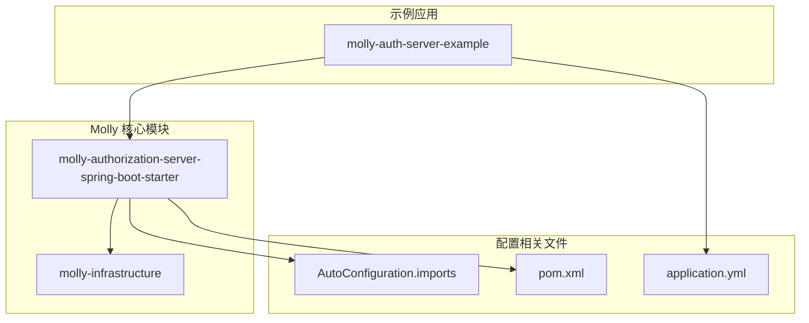
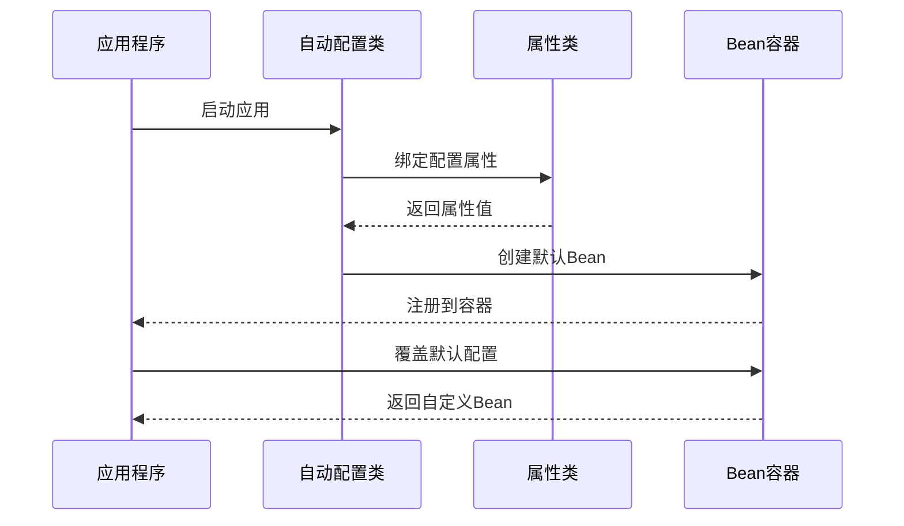
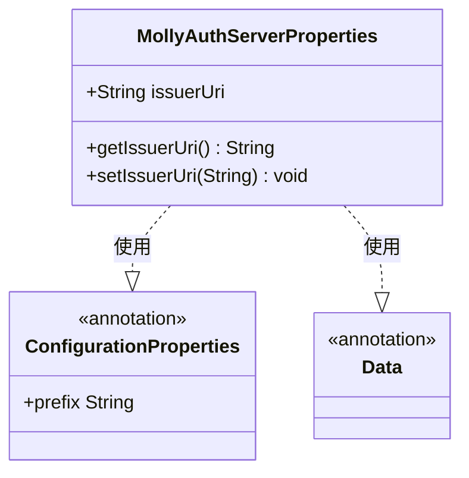
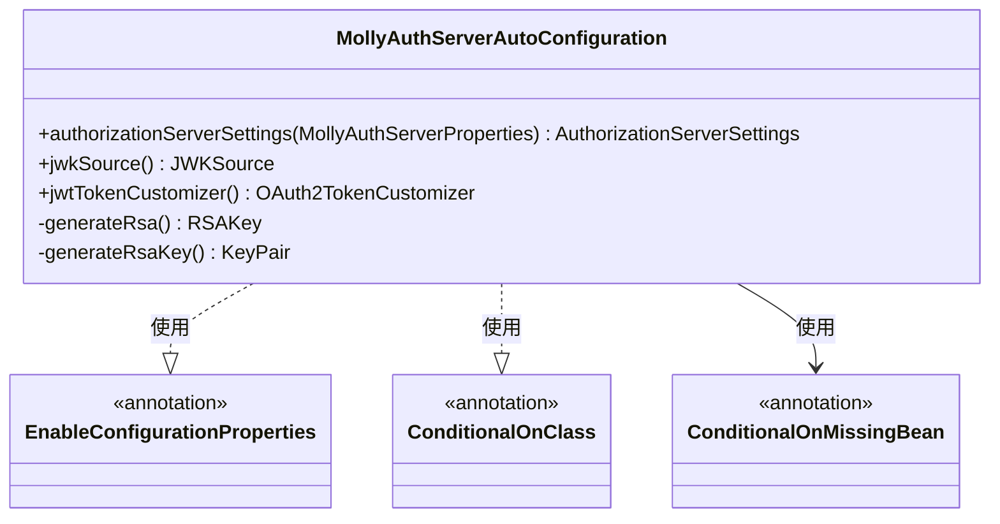
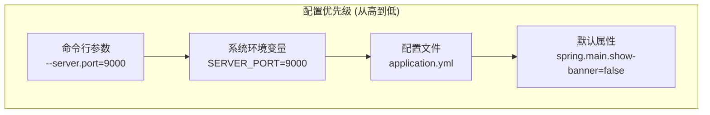
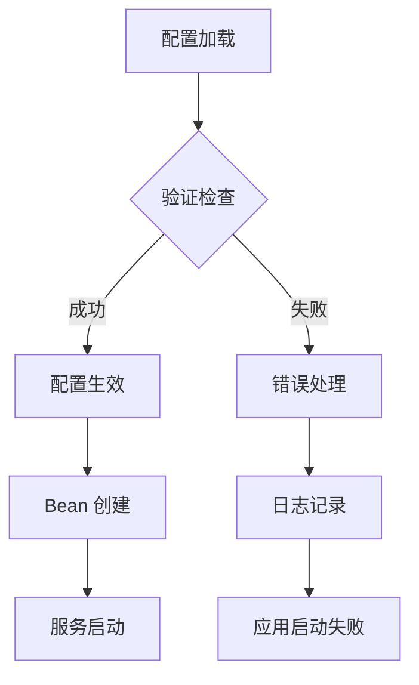

# 配置管理

<cite>
**本文档引用的文件**
- [MollyAuthServerProperties.java](file://molly-authorization-server-spring-boot-starter/src/main/java/cn/molly/security/auth/properties/MollyAuthServerProperties.java)
- [MollyAuthServerAutoConfiguration.java](file://molly-authorization-server-spring-boot-starter/src/main/java/cn/molly/security/auth/config/MollyAuthServerAutoConfiguration.java)
- [application.yml](file://molly-auth-server-example/src/main/resources/application.yml)
- [AuthServerApplication.java](file://molly-auth-server-example/src/main/java/cn/molly/example/auth/AuthServerApplication.java)
- [SecurityConfig.java](file://molly-auth-server-example/src/main/java/cn/molly/example/auth/config/SecurityConfig.java)
- [pom.xml](file://molly-authorization-server-spring-boot-starter/pom.xml)
- [AutoConfiguration.imports](file://molly-authorization-server-spring-boot-starter/src/main/resources/META-INF/spring/org.springframework.boot.autoconfigure.AutoConfiguration.imports)
- [pom.xml](file://pom.xml)
- [molly-infrastructure/pom.xml](file://molly-infrastructure/pom.xml)
</cite>

## 目录
1. [简介](#简介)
2. [项目结构](#项目结构)
3. [核心组件](#核心组件)
4. [架构概览](#架构概览)
5. [详细组件分析](#详细组件分析)
6. [配置属性系统](#配置属性系统)
7. [配置优先级与覆盖机制](#配置优先级与覆盖机制)
8. [环境配置示例](#环境配置示例)
9. [配置验证与错误处理](#配置验证与错误处理)
10. [性能考虑](#性能考虑)
11. [故障排除指南](#故障排除指南)
12. [结论](#结论)

## 简介

Molly 框架的配置管理系统基于 Spring Boot 的 `@ConfigurationProperties` 注解机制，为 OAuth2 授权服务器提供了类型安全的配置管理方案。该系统通过自动配置类和属性类的协作，实现了开箱即用的配置体验，同时保持了高度的可扩展性和灵活性。

系统的核心设计目标包括：
- 类型安全的配置属性绑定
- 基于注解的自动配置
- 可覆盖的默认配置
- 多环境适配能力
- 开发友好的配置验证

## 项目结构

Molly 框架采用多模块架构，配置管理相关的代码分布在以下模块中：



**图表来源**
- [pom.xml:11-14](file://pom.xml#L11-L14)
- [AutoConfiguration.imports:1-1](file://molly-authorization-server-spring-boot-starter/src/main/resources/META-INF/spring/org.springframework.boot.autoconfigure.AutoConfiguration.imports#L1-L1)

**章节来源**
- [pom.xml:11-14](file://pom.xml#L11-L14)
- [pom.xml:1-51](file://molly-authorization-server-spring-boot-starter/pom.xml#L1-L51)

## 核心组件

Molly 框架的配置管理由三个核心组件构成：

### 1. 属性类 (MollyAuthServerProperties)
负责定义和承载配置属性，提供类型安全的数据访问接口。

### 2. 自动配置类 (MollyAuthServerAutoConfiguration)
实现 Spring Boot 的自动配置机制，负责根据属性值创建和配置相应的 Bean。

### 3. 示例应用配置
展示如何在实际应用中使用和覆盖这些配置。

**章节来源**
- [MollyAuthServerProperties.java:14-24](file://molly-authorization-server-spring-boot-starter/src/main/java/cn/molly/security/auth/properties/MollyAuthServerProperties.java#L14-L24)
- [MollyAuthServerAutoConfiguration.java:51-54](file://molly-authorization-server-spring-boot-starter/src/main/java/cn/molly/security/auth/config/MollyAuthServerAutoConfiguration.java#L51-L54)

## 架构概览

Molly 框架的配置管理架构遵循 Spring Boot 的自动配置模式：



**图表来源**
- [MollyAuthServerAutoConfiguration.java:51-54](file://molly-authorization-server-spring-boot-starter/src/main/java/cn/molly/security/auth/config/MollyAuthServerAutoConfiguration.java#L51-L54)
- [MollyAuthServerProperties.java:14-24](file://molly-authorization-server-spring-boot-starter/src/main/java/cn/molly/security/auth/properties/MollyAuthServerProperties.java#L14-L24)

## 详细组件分析

### MollyAuthServerProperties 分析

该属性类是配置系统的核心，负责定义授权服务器的所有配置选项：



**图表来源**
- [MollyAuthServerProperties.java:14-24](file://molly-authorization-server-spring-boot-starter/src/main/java/cn/molly/security/auth/properties/MollyAuthServerProperties.java#L14-L24)

#### 配置属性详解

**issuerUri 字段**
- **类型**: String
- **作用**: 定义授权服务器的颁发者 URI
- **OIDC 合规性**: 必填字段，必须与服务实际地址匹配
- **示例**: `http://localhost:9000`
- **验证**: 非空验证，格式验证

**章节来源**
- [MollyAuthServerProperties.java:18-23](file://molly-authorization-server-spring-boot-starter/src/main/java/cn/molly/security/auth/properties/MollyAuthServerProperties.java#L18-L23)

### MollyAuthServerAutoConfiguration 分析

自动配置类实现了 Spring Boot 的条件化配置机制：



**图表来源**
- [MollyAuthServerAutoConfiguration.java:51-54](file://molly-authorization-server-spring-boot-starter/src/main/java/cn/molly/security/auth/config/MollyAuthServerAutoConfiguration.java#L51-L54)

#### 关键 Bean 分析

**authorizationServerSettings Bean**
- **作用**: 创建 AuthorizationServerSettings 实例
- **配置来源**: 从 MollyAuthServerProperties 读取 issuerUri
- **覆盖机制**: 使用 @ConditionalOnMissingBean 允许用户自定义

**jwkSource Bean**
- **作用**: 提供 JWT 签名密钥源
- **默认实现**: 内存中生成 2048 位 RSA 密钥对
- **生产建议**: 使用 @ConditionalOnMissingBean 覆盖为安全的密钥存储

**jwtTokenCustomizer Bean**
- **作用**: 自定义 JWT 令牌内容
- **默认行为**: 添加用户权限到 authorities 声明
- **扩展性**: 支持自定义令牌声明

**章节来源**
- [MollyAuthServerAutoConfiguration.java:67-120](file://molly-authorization-server-spring-boot-starter/src/main/java/cn/molly/security/auth/config/MollyAuthServerAutoConfiguration.java#L67-L120)

## 配置属性系统

### @ConfigurationProperties 注解机制

Molly 框架使用 Spring Boot 的配置属性绑定机制：

```mermaid
flowchart TD
A[application.yml] --> B[配置属性绑定]
B --> C[MollyAuthServerProperties]
C --> D[类型安全访问]
D --> E[自动配置使用]
F[@EnableConfigurationProperties] --> G[属性注册]
G --> H[Bean 容器]
I[用户自定义] --> J[覆盖默认配置]
J --> K[最终生效]
```

**图表来源**
- [MollyAuthServerAutoConfiguration.java:52-52](file://molly-authorization-server-spring-boot-starter/src/main/java/cn/molly/security/auth/config/MollyAuthServerAutoConfiguration.java#L52-L52)
- [MollyAuthServerProperties.java:15-15](file://molly-authorization-server-spring-boot-starter/src/main/java/cn/molly/security/auth/properties/MollyAuthServerProperties.java#L15-L15)

### 类型安全配置的优势

1. **编译时验证**: 编译器检查属性名称和类型
2. **IDE 支持**: 完整的智能提示和代码补全
3. **重构安全**: 属性名称变更时自动更新引用
4. **文档化**: Javadoc 提供清晰的配置说明

**章节来源**
- [MollyAuthServerProperties.java:14-24](file://molly-authorization-server-spring-boot-starter/src/main/java/cn/molly/security/auth/properties/MollyAuthServerProperties.java#L14-L24)
- [MollyAuthServerAutoConfiguration.java:52-52](file://molly-authorization-server-spring-boot-starter/src/main/java/cn/molly/security/auth/config/MollyAuthServerAutoConfiguration.java#L52-L52)

## 配置优先级与覆盖机制

### Spring Boot 配置优先级

Spring Boot 遵循特定的配置优先级顺序：



### 配置覆盖机制

1. **Bean 级别覆盖**: 用户通过提供同名 Bean 覆盖默认实现
2. **属性级别覆盖**: 用户通过配置文件覆盖默认属性值
3. **条件化配置**: 使用 @ConditionalOnMissingBean 控制配置选择

**章节来源**
- [MollyAuthServerAutoConfiguration.java:68-68](file://molly-authorization-server-spring-boot-starter/src/main/java/cn/molly/security/auth/config/MollyAuthServerAutoConfiguration.java#L68-L68)
- [MollyAuthServerAutoConfiguration.java:86-88](file://molly-authorization-server-spring-boot-starter/src/main/java/cn/molly/security/auth/config/MollyAuthServerAutoConfiguration.java#L86-L88)

## 环境配置示例

### 开发环境配置

```yaml
# application-dev.yml
server:
  port: 9000

molly:
  security:
    auth:
      issuer-uri: http://localhost:9000
```

### 测试环境配置

```yaml
# application-test.yml
server:
  port: 9001

molly:
  security:
    auth:
      issuer-uri: http://test-auth-server:9001
```

### 生产环境配置

```yaml
# application-prod.yml
server:
  port: 9002

molly:
  security:
    auth:
      issuer-uri: https://auth-server.company.com

# 环境变量覆盖
# export MOLLY_SECURITY_AUTH_ISSUER_URI=https://auth-server.company.com
```

**章节来源**
- [application.yml:1-12](file://molly-auth-server-example/src/main/resources/application.yml#L1-L12)

## 配置验证与错误处理

### 配置验证机制

Molly 框架采用多层次的配置验证策略：



### 错误处理策略

1. **编译时验证**: 利用 Lombok 的 @Data 注解进行基本的 getter/setter 验证
2. **运行时验证**: 在 Bean 创建时进行必要的配置检查
3. **异常处理**: 使用 IllegalStateException 处理密钥生成异常

**章节来源**
- [MollyAuthServerAutoConfiguration.java:148-157](file://molly-authorization-server-spring-boot-starter/src/main/java/cn/molly/security/auth/config/MollyAuthServerAutoConfiguration.java#L148-L157)

## 性能考虑

### 配置加载性能

1. **延迟初始化**: 自动配置仅在需要时创建 Bean
2. **条件化加载**: 使用 @ConditionalOnClass 确保依赖存在时才加载
3. **缓存机制**: 配置属性值在应用启动时一次性绑定

### 生产环境优化建议

1. **密钥管理**: 使用安全的密钥存储替代内存生成
2. **连接池配置**: 为数据库和外部服务配置合适的连接池参数
3. **监控集成**: 添加配置变更的监控和告警

## 故障排除指南

### 常见配置问题

#### 1. issuer-uri 配置错误

**问题症状**:
- OIDC 客户端验证失败
- 令牌签名校验错误

**解决方案**:
- 确保 issuer-uri 与实际服务地址完全一致
- 验证协议前缀 (http vs https)
- 检查端口号是否正确

#### 2. 密钥生成异常

**问题症状**:
- 应用启动时抛出 IllegalStateException
- 密钥生成失败

**解决方案**:
- 检查 JVM 密钥生成器可用性
- 验证系统时间和时区设置
- 在生产环境提供自定义密钥源

#### 3. Bean 覆盖冲突

**问题症状**:
- Bean 定义冲突异常
- 配置不生效

**解决方案**:
- 检查 @ConditionalOnMissingBean 注解的使用
- 确保自定义 Bean 的命名与默认 Bean 一致
- 验证 Bean 的作用域和生命周期

### 调试技巧

1. **启用调试日志**: 设置 `logging.level.cn.molly=DEBUG`
2. **查看配置绑定**: 使用 Actuator 端点 `/actuator/configprops`
3. **Bean 状态检查**: 使用 `/actuator/beans` 查看 Bean 注册状态

**章节来源**
- [MollyAuthServerAutoConfiguration.java:148-157](file://molly-authorization-server-spring-boot-starter/src/main/java/cn/molly/security/auth/config/MollyAuthServerAutoConfiguration.java#L148-L157)

## 结论

Molly 框架的配置管理系统通过精心设计的架构，为 OAuth2 授权服务器提供了强大而灵活的配置能力。其核心优势包括：

1. **类型安全**: 利用 @ConfigurationProperties 提供编译时类型检查
2. **自动配置**: 基于 Spring Boot 的条件化配置机制
3. **可扩展性**: 支持多种覆盖机制和自定义扩展
4. **开发友好**: 完善的 IDE 支持和错误处理

通过合理使用配置优先级和覆盖机制，开发者可以在不同环境中快速部署和调整授权服务器配置，同时确保系统的安全性和稳定性。

建议在生产环境中：
- 使用环境变量和配置文件分离敏感信息
- 实现自定义的密钥管理和令牌定制
- 建立完善的监控和告警机制
- 制定标准化的配置管理流程