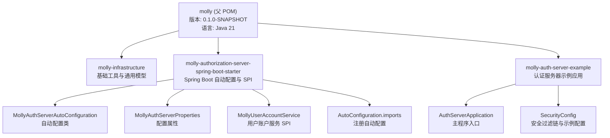
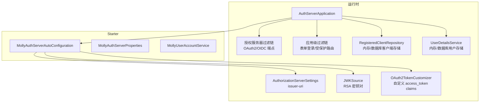
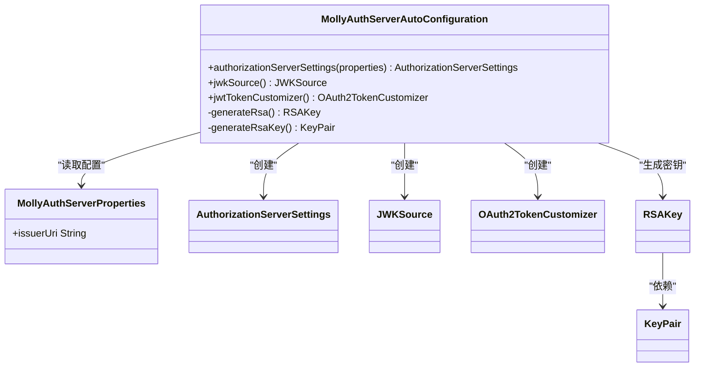
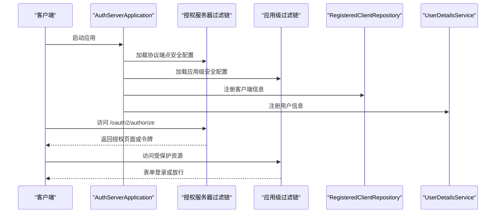
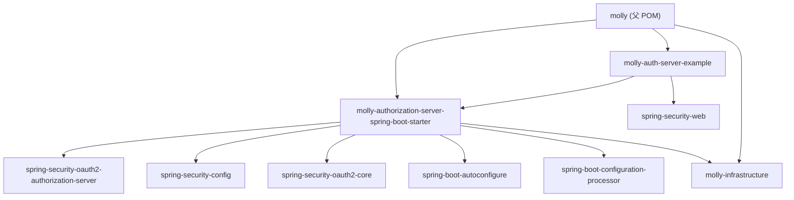

# 项目概述

<cite>
**本文引用的文件**
- [README.md](file://README.md)
- [AGENTS.md](file://AGENTS.md)
- [pom.xml](file://pom.xml)
- [.flattened-pom.xml](file://.flattened-pom.xml)
- [molly-infrastructure/pom.xml](file://molly-infrastructure/pom.xml)
- [molly-authorization-server-spring-boot-starter/pom.xml](file://molly-authorization-server-spring-boot-starter/pom.xml)
- [molly-authorization-server-spring-boot-starter/src/main/java/cn/molly/security/auth/config/MollyAuthServerAutoConfiguration.java](file://molly-authorization-server-spring-boot-starter/src/main/java/cn/molly/security/auth/config/MollyAuthServerAutoConfiguration.java)
- [molly-authorization-server-spring-boot-starter/src/main/java/cn/molly/security/auth/properties/MollyAuthServerProperties.java](file://molly-authorization-server-spring-boot-starter/src/main/java/cn/molly/security/auth/properties/MollyAuthServerProperties.java)
- [molly-authorization-server-spring-boot-starter/src/main/java/cn/molly/security/auth/service/MollyUserAccountService.java](file://molly-authorization-server-spring-boot-starter/src/main/java/cn/molly/security/auth/service/MollyUserAccountService.java)
- [molly-authorization-server-spring-boot-starter/src/main/resources/META-INF/spring/org.springframework.boot.autoconfigure.AutoConfiguration.imports](file://molly-authorization-server-spring-boot-starter/src/main/resources/META-INF/spring/org.springframework.boot.autoconfigure.AutoConfiguration.imports)
- [molly-auth-server-example/src/main/java/cn/molly/example/auth/AuthServerApplication.java](file://molly-auth-server-example/src/main/java/cn/molly/example/auth/AuthServerApplication.java)
- [molly-auth-server-example/src/main/java/cn/molly/example/auth/config/SecurityConfig.java](file://molly-auth-server-example/src/main/java/cn/molly/example/auth/config/SecurityConfig.java)
- [molly-auth-server-example/src/main/resources/application.yml](file://molly-auth-server-example/src/main/resources/application.yml)
</cite>

## 目录
1. [引言](#引言)
2. [项目结构](#项目结构)
3. [核心组件](#核心组件)
4. [架构总览](#架构总览)
5. [详细组件分析](#详细组件分析)
6. [依赖分析](#依赖分析)
7. [性能考虑](#性能考虑)
8. [故障排查指南](#故障排查指南)
9. [结论](#结论)
10. [附录](#附录)

## 引言
Molly 是一个面向分布式 Web 系统的通用脚手架项目，专注于认证与授权领域，基于 Spring Boot 构建，提供开箱即用的安全基础设施。项目以 Spring Authorization Server 为核心，结合 OAuth 2.1 与 OpenID Connect 1.0 协议，为微服务架构下的统一认证授权提供标准化实现路径。其设计理念是“低耦合、高内聚、可扩展”，通过模块化设计与自动配置机制，帮助开发者快速搭建安全可靠的认证中心。

- 项目定位：分布式 Web 系统的认证授权脚手架
- 核心价值：提供标准化、可复用、可扩展的认证授权基础设施
- 目标受众：微服务架构下的后端开发者、平台工程团队

**章节来源**
- [README.md:1-3](file://README.md#L1-L3)
- [AGENTS.md:3-6](file://AGENTS.md#L3-L6)

## 项目结构
Molly 采用 Maven 多模块结构，包含基础设施模块、认证服务器 Starter 与示例应用三部分，形成“基础能力 + 开箱即用 + 快速上手”的完整闭环。

**图表来源**
- [pom.xml:11-15](file://pom.xml#L11-L15)
- [molly-infrastructure/pom.xml:14-16](file://molly-infrastructure/pom.xml#L14-L16)
- [molly-authorization-server-spring-boot-starter/pom.xml:14-16](file://molly-authorization-server-spring-boot-starter/pom.xml#L14-L16)
- [molly-auth-server-example/pom.xml:14-16](file://molly-auth-server-example/pom.xml#L14-L16)

**章节来源**
- [pom.xml:11-15](file://pom.xml#L11-L15)
- [AGENTS.md:15-33](file://AGENTS.md#L15-L33)

## 核心组件
- 基础设施模块（molly-infrastructure）：提供通用工具与基础依赖，支撑上层模块使用。
- 认证服务器 Starter（molly-authorization-server-spring-boot-starter）：封装 Spring Authorization Server 的自动配置与 SPI，提供默认的授权服务器设置、JWK 源与令牌定制能力。
- 示例应用（molly-auth-server-example）：演示如何在 Spring Boot 应用中启用认证服务器，包含内存级的客户端与用户配置，便于快速验证流程。

**章节来源**
- [molly-infrastructure/pom.xml:17-26](file://molly-infrastructure/pom.xml#L17-L26)
- [molly-authorization-server-spring-boot-starter/pom.xml:16-49](file://molly-authorization-server-spring-boot-starter/pom.xml#L16-L49)
- [molly-auth-server-example/pom.xml:16-20](file://molly-auth-server-example/pom.xml#L16-L20)

## 架构总览
Molly 的整体架构围绕“自动配置 + SPI 扩展 + 示例验证”展开，既满足初学者快速上手，又为进阶用户提供灵活的定制空间。

**图表来源**
- [molly-auth-server-example/src/main/java/cn/molly/example/auth/AuthServerApplication.java:15-21](file://molly-auth-server-example/src/main/java/cn/molly/example/auth/AuthServerApplication.java#L15-L21)
- [molly-auth-server-example/src/main/java/cn/molly/example/auth/config/SecurityConfig.java:59-100](file://molly-auth-server-example/src/main/java/cn/molly/example/auth/config/SecurityConfig.java#L59-L100)
- [molly-authorization-server-spring-boot-starter/src/main/java/cn/molly/security/auth/config/MollyAuthServerAutoConfiguration.java:67-120](file://molly-authorization-server-spring-boot-starter/src/main/java/cn/molly/security/auth/config/MollyAuthServerAutoConfiguration.java#L67-L120)
- [molly-authorization-server-spring-boot-starter/src/main/java/cn/molly/security/auth/properties/MollyAuthServerProperties.java:16-24](file://molly-authorization-server-spring-boot-starter/src/main/java/cn/molly/security/auth/properties/MollyAuthServerProperties.java#L16-L24)

## 详细组件分析

### 自动配置组件（MollyAuthServerAutoConfiguration）
该组件是 Starter 的核心，负责在 Spring Boot 应用启动时自动装配认证服务器所需的关键 Bean，并提供可覆盖的默认实现，确保在不修改业务代码的情况下即可启用授权服务器。

**图表来源**
- [molly-authorization-server-spring-boot-starter/src/main/java/cn/molly/security/auth/config/MollyAuthServerAutoConfiguration.java:67-120](file://molly-authorization-server-spring-boot-starter/src/main/java/cn/molly/security/auth/config/MollyAuthServerAutoConfiguration.java#L67-L120)
- [molly-authorization-server-spring-boot-starter/src/main/java/cn/molly/security/auth/properties/MollyAuthServerProperties.java:16-24](file://molly-authorization-server-spring-boot-starter/src/main/java/cn/molly/security/auth/properties/MollyAuthServerProperties.java#L16-L24)

**章节来源**
- [molly-authorization-server-spring-boot-starter/src/main/java/cn/molly/security/auth/config/MollyAuthServerAutoConfiguration.java:28-120](file://molly-authorization-server-spring-boot-starter/src/main/java/cn/molly/security/auth/config/MollyAuthServerAutoConfiguration.java#L28-L120)

### 配置属性组件（MollyAuthServerProperties）
该组件提供授权服务器的配置入口，目前包含签发者 URI（issuer-uri），这是 OIDC 规范中的关键字段，用于标识授权服务器的身份。

**章节来源**
- [molly-authorization-server-spring-boot-starter/src/main/java/cn/molly/security/auth/properties/MollyAuthServerProperties.java:16-24](file://molly-authorization-server-spring-boot-starter/src/main/java/cn/molly/security/auth/properties/MollyAuthServerProperties.java#L16-L24)

### 用户账户服务 SPI（MollyUserAccountService）
该接口继承 Spring Security 的 UserDetailsService，作为 Molly 安全框架的用户账户服务统一入口，未来可扩展多种认证方式（如手机号、社交账号等），并由具体实现从底层数据源加载用户信息。

**章节来源**
- [molly-authorization-server-spring-boot-starter/src/main/java/cn/molly/security/auth/service/MollyUserAccountService.java:20-21](file://molly-authorization-server-spring-boot-starter/src/main/java/cn/molly/security/auth/service/MollyUserAccountService.java#L20-L21)

### 示例应用（AuthServerApplication + SecurityConfig）
示例应用展示了如何在 Spring Boot 中启用认证服务器，包含两个安全过滤链：
- 授权服务器过滤链：处理 OAuth2/OIDC 协议端点，启用 OIDC 支持，未认证请求重定向至登录页，并配置 JWT 资源服务器。
- 应用级过滤链：处理非协议端点的请求，提供表单登录与统一认证。

**图表来源**
- [molly-auth-server-example/src/main/java/cn/molly/example/auth/AuthServerApplication.java:15-21](file://molly-auth-server-example/src/main/java/cn/molly/example/auth/AuthServerApplication.java#L15-L21)
- [molly-auth-server-example/src/main/java/cn/molly/example/auth/config/SecurityConfig.java:59-100](file://molly-auth-server-example/src/main/java/cn/molly/example/auth/config/SecurityConfig.java#L59-L100)

**章节来源**
- [molly-auth-server-example/src/main/java/cn/molly/example/auth/AuthServerApplication.java:15-21](file://molly-auth-server-example/src/main/java/cn/molly/example/auth/AuthServerApplication.java#L15-L21)
- [molly-auth-server-example/src/main/java/cn/molly/example/auth/config/SecurityConfig.java:33-100](file://molly-auth-server-example/src/main/java/cn/molly/example/auth/config/SecurityConfig.java#L33-L100)

## 依赖分析
- 技术栈与版本
  - Spring Boot 3.3.2（通过 spring-boot-dependencies BOM 管理）
  - Spring Security 6.x（OAuth 2.1 与 OIDC 1.0 支持）
  - Spring Authorization Server（OAuth2 授权服务器实现）
  - Lombok（简化实体与配置类）
  - Apache Commons Lang3/Collections4（通用工具库）

- 模块间依赖
  - molly-authorization-server-spring-boot-starter 依赖 Spring Authorization Server、Spring Security OAuth2 核心与配置处理器，并引入 molly-infrastructure 作为内部基础模块。
  - molly-auth-server-example 依赖 Starter 与 Spring Security Web，提供示例配置与运行入口。
  - molly-infrastructure 仅依赖 Apache Commons 工具库，保持轻量与稳定。

**图表来源**
- [molly-authorization-server-spring-boot-starter/pom.xml:16-49](file://molly-authorization-server-spring-boot-starter/pom.xml#L16-L49)
- [molly-auth-server-example/pom.xml:16-20](file://molly-auth-server-example/pom.xml#L16-L20)
- [molly-infrastructure/pom.xml:17-26](file://molly-infrastructure/pom.xml#L17-L26)

**章节来源**
- [pom.xml:26-41](file://pom.xml#L26-L41)
- [molly-authorization-server-spring-boot-starter/pom.xml:16-49](file://molly-authorization-server-spring-boot-starter/pom.xml#L16-L49)
- [molly-auth-server-example/pom.xml:16-20](file://molly-auth-server-example/pom.xml#L16-L20)
- [molly-infrastructure/pom.xml:17-26](file://molly-infrastructure/pom.xml#L17-L26)

## 性能考虑
- 密钥生成策略
  - 默认在内存中动态生成 RSA 密钥对，适合开发环境；生产环境建议提供自定义 JWKSource，从安全存储（如密钥库、HSM）加载密钥，避免频繁生成带来的性能与安全风险。
- 令牌定制
  - 默认将用户权限注入 access_token 的 claims 中，便于下游资源服务器快速鉴权；可根据实际需求裁剪或扩展 claims，减少令牌体积与解析成本。
- 客户端与用户存储
  - 示例使用内存存储，生产环境应迁移到数据库实现（如 JdbcRegisteredClientRepository），并配合缓存与分片策略提升查询性能。
- 过滤链顺序
  - 授权服务器过滤链优先级高于应用级过滤链，确保协议端点正确拦截与处理，避免不必要的认证开销。

[本节为通用指导，不直接分析特定文件]

## 故障排查指南
- 无法访问授权端点
  - 检查授权服务器过滤链是否正确加载，确认协议端点已启用且未被其他过滤链覆盖。
  - 参考路径：[molly-auth-server-example/src/main/java/cn/molly/example/auth/config/SecurityConfig.java:59-77](file://molly-auth-server-example/src/main/java/cn/molly/example/auth/config/SecurityConfig.java#L59-L77)
- 令牌签发失败
  - 确认 AuthorizationServerSettings 的 issuer-uri 配置与服务地址一致，OIDC 校验依赖该字段。
  - 参考路径：[molly-auth-server-example/src/main/resources/application.yml:9-11](file://molly-auth-server-example/src/main/resources/application.yml#L9-L11)、[molly-authorization-server-spring-boot-starter/src/main/java/cn/molly/security/auth/properties/MollyAuthServerProperties.java:16-24](file://molly-authorization-server-spring-boot-starter/src/main/java/cn/molly/security/auth/properties/MollyAuthServerProperties.java#L16-L24)
- 令牌缺少权限信息
  - 确认 OAuth2TokenCustomizer 是否生效，检查当前认证主体的权限集合是否正确注入。
  - 参考路径：[molly-authorization-server-spring-boot-starter/src/main/java/cn/molly/security/auth/config/MollyAuthServerAutoConfiguration.java:105-120](file://molly-authorization-server-spring-boot-starter/src/main/java/cn/molly/security/auth/config/MollyAuthServerAutoConfiguration.java#L105-L120)
- 生产环境密钥安全
  - 替换默认 JWKSource，提供安全的密钥加载实现，避免内存生成密钥带来的安全隐患。
  - 参考路径：[molly-authorization-server-spring-boot-starter/src/main/java/cn/molly/security/auth/config/MollyAuthServerAutoConfiguration.java:86-92](file://molly-authorization-server-spring-boot-starter/src/main/java/cn/molly/security/auth/config/MollyAuthServerAutoConfiguration.java#L86-L92)

**章节来源**
- [molly-auth-server-example/src/main/java/cn/molly/example/auth/config/SecurityConfig.java:59-77](file://molly-auth-server-example/src/main/java/cn/molly/example/auth/config/SecurityConfig.java#L59-L77)
- [molly-auth-server-example/src/main/resources/application.yml:9-11](file://molly-auth-server-example/src/main/resources/application.yml#L9-L11)
- [molly-authorization-server-spring-boot-starter/src/main/java/cn/molly/security/auth/config/MollyAuthServerAutoConfiguration.java:86-120](file://molly-authorization-server-spring-boot-starter/src/main/java/cn/molly/security/auth/config/MollyAuthServerAutoConfiguration.java#L86-L120)

## 结论
Molly 通过模块化设计与自动配置机制，将 Spring Authorization Server 的复杂性封装起来，使开发者能够以最小成本在微服务架构中落地统一认证授权体系。其核心优势在于：
- 明确的模块边界与职责划分，便于维护与扩展
- 开箱即用的默认配置与可覆盖的 SPI，兼顾易用性与灵活性
- 面向生产的可替换实现（密钥、客户端与用户存储），满足不同场景需求

[本节为总结性内容，不直接分析特定文件]

## 附录

### 适用场景
- 微服务架构下的统一认证中心
- 需要 OAuth 2.1 与 OIDC 1.0 的第三方集成
- 需要细粒度权限控制的资源服务器
- 快速搭建认证授权原型与 PoC

### 核心特性
- 自动配置与默认实现：一键启用授权服务器核心能力
- 可插拔的用户账户服务：支持多种认证方式扩展
- 令牌定制：将权限信息注入 access_token，便于下游鉴权
- 生产就绪：提供密钥、客户端与用户存储的可替换实现

### 与其他方案对比
- 相比传统自研方案：Molly 提供标准化实现与最佳实践，降低维护成本
- 相比直接使用 Spring Authorization Server：Molly 通过 Starter 与 SPI 封装复杂度，加速落地
- 相比第三方 IAM 解决方案：Molly 更贴近 Spring 技术栈，便于与现有系统融合

**章节来源**
- [AGENTS.md:7-13](file://AGENTS.md#L7-L13)